# Machine learning for Java developers
# Java 开发者的机器学习入门

### Set up a machine learning algorithm and develop your first prediction function in Java
### 搭建机器学习算法，用 Java 开发你的第一个预测函数


Self-driving cars, face detection software, and voice controlled speakers all are built on machine learning technologies and frameworks--and these are just the first wave. Over the next decade, a new generation of products will transform our world, initiating new approaches to software development and the applications and products that we create and use.

自动驾驶汽车、人脸识别软件、声控音箱，这些都建立在机器学习技术和框架之上——而这还只是第一波浪潮。在未来十年里，新一代产品将改变我们的世界，为我们创造和使用软件应用与产品的方式带来全新思路。

As a Java developer, you want to get ahead of this curve *now*--when tech companies are beginning to seriously invest in machine learning. What you learn today, you can build on over the next five years, but you have to start somewhere.

作为一名 Java 开发者，你现在就该抢占先机——正当科技公司开始认真投入机器学习之际。今天学到的东西，可以让你在接下来的五年里持续受益，但你总得从某个地方起步。

This article will get you started. You will begin with a first impression of how machine learning works, followed by a short guide to implementing and training a machine learning algorithm. After studying the internals of the learning algorithm and features that you can use to train, score, and select the best-fitting prediction function, you'll get an overview of using a JVM framework, Weka, to build machine learning solutions. This article focuses on supervised machine learning, which is the most common approach to developing intelligent applications.

本文将带你入门。我们先对机器学习的工作原理做一个初步介绍，然后简短演示如何实现并训练一个机器学习算法。在学习了学习算法的内部机制，以及可用于训练、评分和挑选最佳拟合预测函数的特性之后，你还会了解到如何使用 JVM 框架 Weka 来构建机器学习解决方案。本文聚焦于监督式机器学习(supervised machine learning)，这是开发智能应用最常见的方法。

## Machine learning and artificial intelligence
## 机器学习与人工智能

Machine learning has evolved from the field of artificial intelligence, which seeks to produce machines capable of mimicking human intelligence. Although machine learning is an emerging trend in computer science, artificial intelligence is not a new scientific field. The Turing test, developed by Alan Turing in the early 1950s, was one of the first tests created to determine whether a computer could have real intelligence. According to the Turing test, a computer could prove human intelligence by tricking a human into believing it was also human.

机器学习源于人工智能领域，后者的目标是造出能够模仿人类智能的机器。虽然机器学习是计算机科学中的新兴趋势，但人工智能并不是一个新学科。图灵测试由 Alan Turing 在 20 世纪 50 年代初提出，是最早用来判断计算机是否具有真正智能的测试之一。按照图灵测试的说法，如果一台计算机能骗过人类、让人相信它也是人，就可以证明它具有人类级别的智能。

Many state-of-the-art machine learning approaches are based on decades-old concepts. What has changed over the past decade is that computers (and distributed computing platforms) now have the processing power required for machine learning algorithms. Most machine learning algorithms demand a huge number of matrix multiplications and other mathematical operations to process. The computational technology to manage these calculations didn't exist even two decades ago, but it does today.

许多最先进的机器学习方法，背后都是几十年前就有的概念。过去十年真正变化的，是计算机(以及分布式计算平台)如今已经具备了运行机器学习算法所需的处理能力。大多数机器学习算法需要处理海量的矩阵乘法和其他数学运算。承载这些计算的技术在二十年前还不存在，但今天已经有了。

Machine learning enables programs to execute quality improvement processes and extend their capabilities without human involvement. A program built with machine learning is capable of updating or extending its own code.

机器学习让程序能够在没有人工参与的情况下执行质量改进过程、扩展自身能力。用机器学习构建的程序可以更新或扩展自己的代码。

## Supervised learning vs. unsupervised learning
## 监督学习与无监督学习

Supervised learning and unsupervised learning are the most popular approaches to machine learning. Both require feeding the machine a massive number of data records to correlate and learn from. Such collected data records are commonly known as a *feature vectors.* In the case of an individual house, a feature vector might consist of features such as overall house size, number of rooms, and the age of the house.

监督学习和无监督学习是最流行的两种机器学习方法。两者都需要向机器输入大量数据记录，供其关联和学习。这类收集起来的数据记录通常被称为特征向量(feature vector)。以一套房子为例，特征向量可能包含房屋总面积、房间数量、房龄等特征。

**[ Learn Java from beginning concepts to advanced design patterns in this comprehensive 12-part course! ]**

**[ 本课程共 12 部分，内容全面，带你从 Java 基础概念一路学到高级设计模式！ ]**

In *supervised learning*, a machine learning algorithm is trained to correctly respond to questions related to feature vectors. To train an algorithm, the machine is fed a set of feature vectors and an associated label. Labels are typically provided by a human annotator, and represent the right "answer" to a given question. The learning algorithm analyzes feature vectors and their correct labels to find internal structures and relationships between them. Thus, the machine learns to correctly respond to queries.

在监督学习中，机器学习算法经过训练后，能够正确回答与特征向量相关的问题。训练时，需要向机器输入一组特征向量及其对应的标签(label)。标签通常由人工标注者提供，代表某个给定问题的正确"答案"。学习算法分析特征向量及其正确标签，从中找出内部结构和相互关系，从而学会正确响应查询。

As an example, an intelligent real estate application might be trained with feature vectors including the size, number of rooms, and respective age for a range of houses. A human labeler would label each house with the correct house price based on these factors. By analyzing that data, the real estate application would be trained to answer the question: "*How much money could I get for this house?*"

举例来说，一个智能房产应用可以用一批房屋的特征向量来训练，包括面积、房间数和各自对应的房龄。人工标注者会根据这些因素，为每套房子标注正确的房价。通过分析这些数据，这个房产应用就会被训练得能够回答这样一个问题："这套房子能卖多少钱？"

After the training process is over, new input data will not be labeled. The machine will be able to correctly respond to queries, even for unseen, unlabeled feature vectors.

训练过程结束后，新的输入数据将不再需要标注。即便面对从未见过的、没有标签的特征向量，机器也能够正确响应查询。

In *unsupervised learning*, the algorithm is programmed to predict answers without human labeling, or even questions. Rather than predetermine labels or what the results should be, unsupervised learning harnesses massive data sets and processing power to discover previously unknown correlations. In consumer product marketing, for instance, unsupervised learning could be used to identify hidden relationships or consumer grouping, eventually leading to new or improved marketing strategies.

在无监督学习中，算法被设计成在没有人工标注、甚至没有明确问题的情况下预测答案。无监督学习并不预先设定标签或结果应该是什么，而是利用海量数据集和强大的处理能力，去发现此前未知的关联。例如在消费产品营销中，无监督学习可以用来挖掘隐藏的关联或消费者分组，进而催生新的或改进的营销策略。

This article focuses on supervised machine learning, which is the most common approach to machine learning today.

本文聚焦于监督式机器学习，这是当今最常见的机器学习方式。

### Supervised machine learning
### 监督式机器学习

All machine learning is based on data. For a supervised machine learning project, you will need to label the data in a meaningful way for the outcome you are seeking. In Table 1, note that each row of the house record includes a label for "house price." By correlating row data to the house price label, the algorithm will eventually be able to predict market price for a house not in its data set (note that house-size is based on square meters, and house price is based on euros).

所有机器学习都以数据为基础。对于一个监督式机器学习项目，你需要以有意义的方式为数据打上标签，使之服务于你追求的结果。在表 1 中可以看到，每一行房屋记录都带有"房价"标签。通过将行数据与房价标签相关联，算法最终将能够预测出不在其数据集中的房屋的市场价格(注意，房屋面积以平方米为单位，房价以欧元为单位)。

## Table 1. House records
## 表 1. 房屋记录

| FEATURE           | FEATURE         | FEATURE      | LABEL                   |
| ----------------- | --------------- | ------------ | ----------------------- |
| Size of house     | Number of rooms | Age of house | Estimated cost of house |
| 90 m2 / 295 ft    | 2 rooms         | 23 years     | 249,000 €               |
| 101 m2 / 331 ft   | 3 rooms         | n/a          | 338,000 €               |
| 1330 m2 / 4363 ft | 11 rooms        | 12 years     | 6,500,000 €             |

At early stages, you will likely label data records by hand, but you could eventually train your program to automate this process. You've probably seen this with email applications, where moving email into your spam folder results in the query "Is this spam?" When you respond, you are training the program to recognize mail that you don't want to see. The application's spam filter learns to label future mail from the same source, or bearing similar content, and dispose of it.

在早期阶段，你很可能需要手工为数据记录打标签，但最终你可以训练程序来自动化这一过程。你在邮件应用中可能已经见过这种场景：当你把一封邮件移入垃圾邮件文件夹时，应用会询问"这是垃圾邮件吗？"当你做出回答，就是在训练程序识别你不想看到的邮件。应用的垃圾邮件过滤器会学会给今后来自同一来源、或内容相似的邮件打上标签并处理掉。

Labeled data sets are required for training and testing purposes only. After this phase is over, the machine learning algorithm works on unlabeled data instances. For instance, you could feed the prediction algorithm a new, unlabeled house record and it would automatically predict the expected house price based on training data.

带标签的数据集只在训练和测试阶段需要。这个阶段结束后，机器学习算法处理的就是没有标签的数据实例。例如，你可以向预测算法输入一条新的、没有标签的房屋记录，它会根据训练数据自动预测出预期的房价。

## How machines learn to predict
## 机器如何学会预测

The challenge of supervised machine learning is to find the proper prediction function for a specific question. Mathematically, the challenge is to find the input-output function that takes the input variables *x* and returns the prediction value *y*. This *hypothesis function* (hθ) is the output of the training process. Often the hypothesis function is also called *target* or *prediction* function.

监督式机器学习的挑战在于，为特定问题找到合适的预测函数。从数学上讲，就是要找到那个接收输入变量 *x* 并返回预测值 *y* 的输入-输出函数。这个假设函数(hypothesis function, hθ)就是训练过程的输出。假设函数也常被称为目标函数(target function)或预测函数(prediction function)。

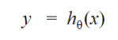

In most cases, *x* represents a multiple-data point. In our example, this could be a two-dimensional data point of an individual house defined by the *house-size* value and the *number-of-rooms* value. The array of these values is referred to as the *feature vector*. Given a concrete target function, the function can be used to make a prediction for each feature vector *x*. To predict the price of an individual house, you could call the target function by using the feature vector { 101.0, 3.0 } containing the house size and the number of rooms:

在大多数情况下，*x* 代表一个多维数据点。在我们的例子中，它可以是由房屋面积值和房间数量值定义的、描述某套房屋的二维数据点。这些值组成的数组被称为特征向量(feature vector)。给定一个具体的目标函数，就可以用它对每个特征向量 *x* 做出预测。要预测某套房屋的价格，可以用包含房屋面积和房间数的特征向量 { 101.0, 3.0 } 来调用目标函数：

```
// target function h (which is the output of the learn process)
Function<Double[], Double> h = ...;

// set the feature vector with house size=101 and number-of-rooms=3
Double[] x = new Double[] { 101.0, 3.0 };

// and predicted the house price (label)
double y = h.apply(x);


```

In Listing 1, the array variable *x *value represents the feature vector of the house. The *y* value returned by the target function is the predicted house price.

在清单 1 中，数组变量 *x* 的值代表这套房子的特征向量，目标函数返回的 *y* 值就是预测出的房价。

The challenge of machine learning is to define a target function that will work as accurately as possible for unknown, unseen data instances. In machine learning, the target function (hθ) is sometimes called a *model*. This model is the result of the learning process.

机器学习的挑战在于定义一个目标函数，使其对未知的、从未见过的数据实例也能尽可能准确地工作。在机器学习中，目标函数(hθ)有时也被称为模型(model)。这个模型就是学习过程的结果。

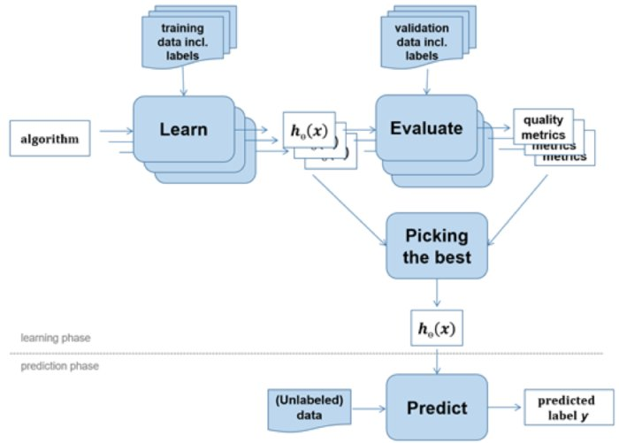

Based on labeled training examples, the learning algorithm looks for structures or patterns in the training data. From these, it produces a model that generalize well from that data.

学习算法基于带标签的训练样本，在训练数据中寻找结构或模式，并据此产出一个能够很好地泛化到这些数据之外的模型。

Typically, the learning process is *explorative*. In most cases, the process will be performed multiple times by using different variations of learning algorithms and configurations.

通常，学习过程是探索性的。在大多数情况下，这个过程会使用学习算法和配置的不同变体反复执行多次。

Eventually, all the models will be evaluated based on performance metrics, and the best one will be selected. That model will then be used to compute predictions for future unlabeled data instances.

最终，所有模型都会依据性能指标进行评估，并从中选出最好的一个。选出的模型随后将用于为未来没有标签的数据实例计算预测值。

### Linear regression
### 线性回归

To train a machine to think, the first step is to choose the learning algorithm you'll use. *Linear regression *is one of the simplest and most popular supervised learning algorithms. This algorithm assumes that the relationship between input features and the outputted label is [linear](https://en.wikipedia.org/wiki/Linear_function). The generic linear regression function below returns the predicted value by summarizing each element of the *feature vector* multiplied by a *theta parameter (θ)*. The theta parameters are used within the training process to adapt or "tune" the regression function based on the training data.

要训练机器进行思考，第一步是选择要使用的学习算法。线性回归是最简单、最流行的监督学习算法之一。该算法假设输入特征与输出的标签之间是[线性](https://en.wikipedia.org/wiki/Linear_function)关系。下面这个通用的线性回归函数，把特征向量的每个元素与相应的 θ 参数(theta parameter, θ)相乘再求和，从而得到预测值。θ 参数在训练过程中用于根据训练数据来调整或"调优"回归函数。

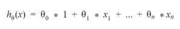

In the linear regression function, theta parameters and feature parameters are enumerated by a subscription number. The subscription number indicates the position of theta parameters (θ) and feature parameters (x) within the vector. Note that feature x0 is a constant offset term set with the value *1* for computational purposes. As a result, the index of a domain-specific feature such as house-size will start with x1. As an example, if x1 is set for the first value of the House feature vector, house size, then x2 will be set for the next value, number-of-rooms, and so forth.

在线性回归函数中，θ 参数和特征参数用下标编号来枚举。下标编号表示 θ 参数(θ)和特征参数(x)在向量中的位置。注意，特征 x0 是一个常量偏移项，为了计算方便取值固定为 *1*。因此，像房屋面积这样的业务特征，下标将从 x1 开始。举例来说，如果 x1 对应房屋特征向量的第一个值(房屋面积)，那么 x2 就对应下一个值(房间数量)，依此类推。

Listing 2 shows a Java implementation of this linear regression function, shown mathematically as hθ(x) . For simplicity, the calculation is done using the data type `double`. Within the `apply()` method, it is expected that the first element of the array has been set with a value of 1.0 outside of this function.

清单 2 展示了这个线性回归函数的 Java 实现，数学上记作 hθ(x)。为简单起见，计算使用 `double` 数据类型。在 `apply()` 方法中，约定数组第一个元素已在该函数之外被置为 1.0。

#### Listing 2. Linear regression in Java
#### 清单 2. 用 Java 实现的线性回归

```
public class LinearRegressionFunction implements Function<Double[], Double> {
   private final double[] thetaVector;

   LinearRegressionFunction(double[] thetaVector) {
      this.thetaVector = Arrays.copyOf(thetaVector, thetaVector.length);
   }

   public Double apply(Double[] featureVector) {
      // for computational reasons the first element has to be 1.0
      assert featureVector[0] == 1.0;

      // simple, sequential implementation
      double prediction = 0;
      for (int j = 0; j < thetaVector.length; j++) {
         prediction += thetaVector[j] * featureVector[j];
      }
      return prediction;
   }

   public double[] getThetas() {
      return Arrays.copyOf(thetaVector, thetaVector.length);
   }
}


```

In order to create a new instance of the `LinearRegressionFunction`, you must set the theta parameter. The theta parameter, or vector, is used to adapt the generic regression function to the underlying training data. The program's theta parameters will be tuned during the learning process, based on training examples. The quality of the trained target function can only be as good as the quality of the given training data.

要创建 `LinearRegressionFunction` 的新实例，必须设置 θ 参数。θ 参数(或 θ 向量)用于让通用的回归函数适配底层训练数据。程序的 θ 参数会在学习过程中基于训练样本进行调优。训练出来的目标函数的质量，最多只能达到给定训练数据的质量上限。

In the example below the `LinearRegressionFunction` will be instantiated to predict the house price based on house size. Considering that x0 has to be a constant value of 1.0, the target function is instantiated using two theta parameters. The theta parameters are the output of a learning process. After creating the new instance, the price of a house with size of 1330 square meters will be predicted as follows:

在下面的例子中，`LinearRegressionFunction` 将被实例化，用来基于房屋面积预测房价。考虑到 x0 必须是常量 1.0，实例化目标函数时使用了两个 θ 参数。θ 参数是学习过程的输出。创建新实例之后，就可以这样预测一套 1330 平方米房屋的价格：

```
// the theta vector used here was output of a train process
double[] thetaVector = new double[] { 1.004579, 5.286822 };
LinearRegressionFunction targetFunction = new LinearRegressionFunction(thetaVector);

// create the feature vector function with x0=1 (for computational reasons) and x1=house-size
Double[] featureVector = new Double[] { 1.0, 1330.0 };

// make the prediction
double predictedPrice = targetFunction.apply(featureVector);


```

The target function's prediction line is shown as a blue line in the chart below. The line has been computed by executing the target function for all the house-size values. The chart also includes the price-size pairs used for training.

目标函数的预测线在下图中显示为蓝色直线。这条线是对所有房屋面积取值逐一执行目标函数计算得到的。图中还包含了用于训练的价格-面积数据对。

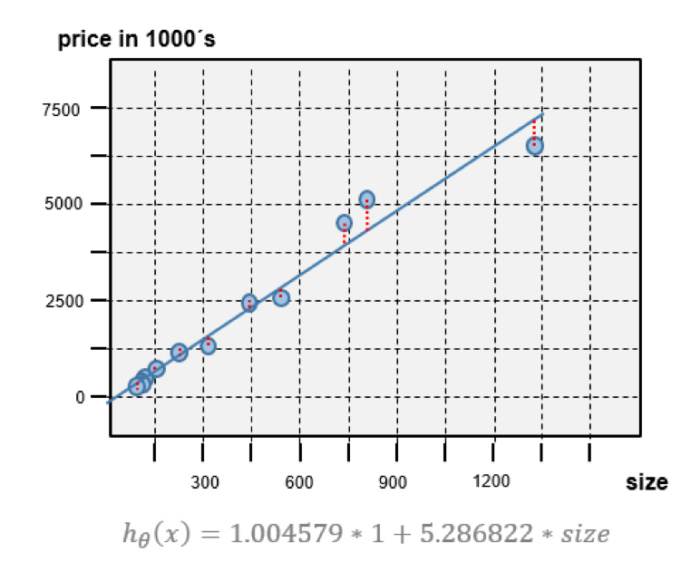

So far the prediction graph seems to fit well enough. The graph coordinates (the intercept and slope) are defined by the theta vector `{ 1.004579, 5.286822 }`. But how do you know that this theta vector is the best fit for your application? Would the function fit better if you changed the first or second theta parameter? To identify the best-fitting theta parameter vector, you need a *utility function*, which will evaluate how well the target function performs.

到目前为止，这条预测曲线看起来拟合得还不错。曲线的坐标(截距和斜率)由 θ 向量 `{ 1.004579, 5.286822 }` 决定。但你如何知道这个 θ 向量就是最适合你的应用的呢？如果改变第一个或第二个 θ 参数，函数会不会拟合得更好？要找出最优的 θ 参数向量，你需要一个效用函数(utility function)，用来评估目标函数的表现好坏。

## Scoring the target function
## 为目标函数评分

In machine learning, a *cost function* (J(θ)) is used to compute the mean error, or "cost" of a given target function.

在机器学习中，代价函数(cost function, J(θ))用来计算给定目标函数的平均误差，即"代价"。

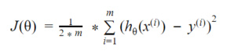

The cost function indicates how well the model fits with the training data. To determine the cost of the trained target function above, you would compute the *squared error* of each house example (*i*). The *error* is the distance between the calculated *y* value and the real *y* value of a house example *i*.

代价函数表明模型与训练数据的拟合程度。要确定上面训练好的目标函数的代价，需要计算每套房屋样本(*i*)的平方误差(squared error)。误差(error)是指计算出的 *y* 值与房屋样本 *i* 真实 *y* 值之间的距离。

For instance, the real price of the house with size of 1330 is 6,500,000 €. In contrast, the predicted house price of the trained target function is 7,032,478 €: a gap (or error) of 532,478 €. You can also find this gap in the chart above. The gap (or error) is shown as a vertical dotted red line for each training price-size pair.

例如，面积为 1330 的房屋实际价格是 6,500,000 €，而训练出的目标函数预测的房价是 7,032,478 €，相差(即误差)532,478 €。在上图中你也能找到这个差距。对每一组训练用价格-面积数据对，差距(误差)都用一条竖直的红色虚线表示。

To compute the *cost* of the trained target function, you must summarize the squared error for each house in the example and calculate the mean value. The smaller the cost value of J(θ), the more precise the target function's predictions will be.

要计算训练出的目标函数的代价(cost)，需要对样本中每套房屋的平方误差求和，并计算平均值。J(θ) 的代价越小，目标函数的预测就越精确。

In Listing 3, the simple Java implementation of the cost function takes as input the target function, the list of training records, and their associated labels. The predicted value will be computed in a loop, and the error will be calculated by subtracting the real label value.

在清单 3 中，代价函数的简单 Java 实现以目标函数、训练记录列表及其对应标签作为输入。预测值会在循环中计算，误差则通过减去真实标签值得到。

Afterward, the squared error will be summarized and the mean error will be calculated. The cost will be returned as a double value:

随后对平方误差求和并计算平均误差，最终以 double 值的形式返回代价：

```
public static double cost(Function<Double[], Double> targetFunction,
                          List<Double[]> dataset,
                          List<Double> labels) {
   int m = dataset.size();
   double sumSquaredErrors = 0;

   // calculate the squared error ("gap") for each training example and add it to the total sum
   for (int i = 0; i < m; i++) {
      // get the feature vector of the current example
      Double[] featureVector = dataset.get(i);
      // predict the value and compute the error based on the real value (label)
      double predicted = targetFunction.apply(featureVector);
      double label = labels.get(i);
      double gap = predicted - label;
      sumSquaredErrors += Math.pow(gap, 2);
   }

   // calculate and return the mean value of the errors (the smaller the better)
   return (1.0 / (2 * m)) * sumSquaredErrors;
}


```

## Training the target function
## 训练目标函数

Although the cost function helps to evaluate the quality of the target function and theta parameters, respectively, you still need to compute the best-fitting theta parameters. You can use the *gradient descent *algorithm for this calculation.

虽然代价函数可以帮助评估目标函数和 θ 参数各自的好坏，但你仍需要计算出最合适的 θ 参数。这项计算可以使用梯度下降(gradient descent)算法。

### Gradient descent
### 梯度下降

Gradient descent minimizes the cost function, meaning that it's used to find the theta combinations that produces the *lowest cost* (J(θ)) based on the training data.

梯度下降用于最小化代价函数，也就是说，它用来找到基于训练数据能产生最低代价(J(θ))的 θ 组合。

Here is a simplified algorithm to compute new, better fitting thetas:

下面是一个简化后的算法，用于计算新的、拟合更好的 θ 值：

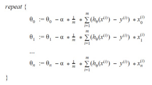

Within each iteration a new, better value will be computed for each individual θ parameter of the theta vector. The learning rate α controls the size of the computing step within each iteration. This computation will be repeated until you reach a theta values combination that fits well. As an example, the linear regression function below has three theta parameters:

在每次迭代中，都会为 θ 向量中的每个 θ 参数计算出一个新的、更好的值。学习率 α 控制每次迭代中计算步长的大小。这一计算会不断重复，直到得到一组拟合良好的 θ 值组合。例如，下面的线性回归函数有三个 θ 参数：

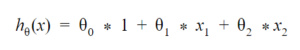

Within each iteration a new value will be computed for each theta parameter: θ0, θ1, and θ2 in parallel. After each iteration, you will be able to create a new, better-fitting instance of the `LinearRegressionFunction` by using the new theta vector of `{θ0, θ1, θ2}`.

在每次迭代中，会并行地为每个 θ 参数(θ0、θ1 和 θ2)计算新值。每次迭代之后，你都可以用新的 θ 向量 `{θ0, θ1, θ2}` 创建一个拟合更好的 `LinearRegressionFunction` 新实例。

Listing 4 shows Java code for the gradient descent algorithm. The thetas of the regression function will be trained using the training data, data labels, and the learning rate (α). The output of the function is an improved target function using the new theta parameters. The `train()` method will be called again and again, and fed the new target function and the new thetas from the previous calculation. These calls will be repeated until the tuned target function's cost reaches a minimal plateau:

清单 4 展示了梯度下降算法的 Java 代码。回归函数的 θ 值将使用训练数据、数据标签和学习率(α)进行训练。函数的输出是一个使用新 θ 参数的、改进后的目标函数。`train()` 方法会被反复调用，每次都传入新的目标函数和上一轮计算得到的新 θ 值。这些调用会一直重复，直到调优后的目标函数的代价到达一个极小的平台期：

```
public static LinearRegressionFunction train(LinearRegressionFunction targetFunction,
                                             List<Double[]> dataset,
                                             List<Double> labels,
                                             double alpha) {
   int m = dataset.size();
   double[] thetaVector = targetFunction.getThetas();
   double[] newThetaVector = new double[thetaVector.length];

   // compute the new theta of each element of the theta array
   for (int j = 0; j < thetaVector.length; j++) {
      // summarize the error gap * feature
      double sumErrors = 0;
      for (int i = 0; i < m; i++) {
         Double[] featureVector = dataset.get(i);
         double error = targetFunction.apply(featureVector) - labels.get(i);
         sumErrors += error * featureVector[j];
      }

      // compute the new theta value
      double gradient = (1.0 / m) * sumErrors;
      newThetaVector[j] = thetaVector[j] - alpha * gradient;
   }

   return new LinearRegressionFunction(newThetaVector);
}


```

To validate that the cost decreases continuously, you can execute the cost function J(θ) after each training step. With each iteration, the cost must decrease. If it doesn't, then the value of the learning rate parameter is too large, and the algorithm will shoot past the minimum value. In this case the gradient descent algorithm fails.

要验证代价是否持续下降，可以在每次训练步骤之后执行代价函数 J(θ)。每迭代一次，代价都必须下降。如果不降，说明学习率参数的值设置得过大，算法会一步跨过最小值，这种情况下梯度下降算法就失败了。

The diagram below shows the target function using the computed, new theta parameter, starting with an initial theta vector of `{ 1.0, 1.0 }`. The left-side column shows the prediction graph after 50 iterations; the middle column after 200 iterations; and the right column after 1,000 iterations. As you see, the cost decreases after each iteration, as the new target function fits better and better. After 500 to 600 iterations the theta parameters no longer change significantly and the cost reaches a stable plateau. The accuracy of the target function will no longer significantly improve from this point.

下图展示了使用计算出的新 θ 参数的目标函数，初始 θ 向量为 `{ 1.0, 1.0 }`。左列是迭代 50 次后的预测曲线；中列是 200 次；右列是 1,000 次。可以看到，每迭代一次代价都有所下降，新的目标函数也拟合得越来越好。迭代 500 到 600 次之后，θ 参数不再有明显变化，代价到达一个稳定的平台期。从这一点开始，目标函数的精度将不会再有显著提升。

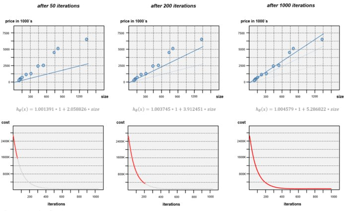

In this case, although the cost will no longer decrease significantly after 500 to 600 iterations, the target function is still not optimal; it seems to *underfit*. In machine learning, the term *underfitting* is used to indicate that the learning algorithm does not capture the underlying trend of the data.

在这个例子里，虽然代价在迭代 500 到 600 次后不再明显下降，但目标函数仍然不是最优的；它看起来存在欠拟合(underfit)。在机器学习中，欠拟合(underfitting)这个术语用来表示学习算法没有捕捉到数据的内在趋势。

Based on real-world experience, it is expected that the the price per square metre will *decrease* for larger properties. From this we conclude that the model used for the training process, the target function, does not fit the data well enough. Underfitting is often due to an excessively simple model. In this case, it's the result of our simple target function using a single house-size feature only. That data alone is not enough to accurately predict the cost of a house.

根据现实经验，面积越大的房子，每平方米单价应该越低。由此我们得出结论：训练过程所用的模型(即目标函数)对数据的拟合不够好。欠拟合往往源于模型过于简单。在本例中，就是因为我们的目标函数只使用了房屋面积这一个特征。仅凭这一项数据，不足以准确预测房价。

## Adding features and feature scaling
## 增加特征与特征缩放

If you discover that your target function doesn't fit the problem you are trying to solve, you can adjust it. A common way to correct underfitting is to add more features into the feature vector.

如果你发现目标函数与你想要解决的问题不匹配，可以对它进行调整。纠正欠拟合的一个常用方法，是向特征向量中添加更多特征。

In the housing-price example, you could add other house characteristics such as the number of rooms or age of the house. Rather than using the single domain-specific feature vector of `{ size }` to describe a house instance, you could usea multi-valued feature vector such as `{ size, number-of-rooms, age }`.

在房价预测的例子里，你可以加入房屋的其他属性，比如房间数量或房龄。不再使用 `{ size }` 这种单一业务特征向量来描述房屋实例，而是使用 `{ size, number-of-rooms, age }` 这样的多值特征向量。

In some cases, there aren't enough features in the available training data set. In this case, you can try adding polynomial features, which are computed by existing features. For instance, you could extend the house-price target function to include a computed squared-size feature (x2):

有些情况下，现有的训练数据集中特征不够用。这时可以尝试添加多项式特征，即由已有特征计算出来的特征。例如，可以扩展房价目标函数，加入一个由面积平方计算得到的特征(x2):

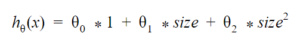

Using multiple features requires *feature scaling*, which is used to standardize the range of different features. For instance, the value range of `size2` feature is a magnitude larger than the range of the size feature. Without feature scaling, the `size2` feature will dominate the cost function. The error value produced by the `size2` feature will be much higher than the error value produced by the size feature. A simple algorithm for feature scaling is:

使用多个特征需要进行特征缩放(feature scaling)，用于把不同特征的取值范围标准化。例如，`size2` 特征的取值范围比 size 特征大一个数量级。如果不做特征缩放，`size2` 特征会在代价函数中占主导地位，由它产生的误差值会远高于 size 特征产生的误差值。下面是一个简单的特征缩放算法：

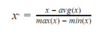

This algorithm is implemented by the `FeaturesScaling`class in the example code below. The `FeaturesScaling`class provides a factory method to create a scaling function adjusted on the training data. Internally, instances of the training data are used to compute the average, minimum, and maximum constants. The resulting function consumes a feature vector and produces a new one with scaled features. The feature scaling is required for the training process, as well as for the prediction call, as shown below:

下面的示例代码中，该算法由 `FeaturesScaling` 类实现。`FeaturesScaling` 类提供了一个工厂方法，用于创建基于训练数据调整过的缩放函数。其内部使用训练数据实例来计算平均值、最小值和最大值等常量。所得的缩放函数接收一个特征向量，输出一个缩放后的新特征向量。训练过程和预测调用都需要特征缩放，如下所示：

```
// create the dataset
List<Double[]> dataset = new ArrayList<>();
dataset.add(new Double[] { 1.0,  90.0,  8100.0 });   // feature vector of house#1
dataset.add(new Double[] { 1.0, 101.0, 10201.0 });   // feature vector of house#2
dataset.add(new Double[] { 1.0, 103.0, 10609.0 });   // ...
//...

// create the labels
List<Double> labels = new ArrayList<>();
labels.add(249.0);        // price label of house#1
labels.add(338.0);        // price label of house#2
labels.add(304.0);        // ...
//...

// scale the extended feature list
Function<Double[], Double[]> scalingFunc = FeaturesScaling.createFunction(dataset);
List<Double[]>  scaledDataset  = dataset.stream().map(scalingFunc).collect(Collectors.toList());

// create hypothesis function with initial thetas and train it with learning rate 0.1
LinearRegressionFunction targetFunction =  new LinearRegressionFunction(new double[] { 1.0, 1.0, 1.0 });
for (int i = 0; i < 10000; i++) {
   targetFunction = Learner.train(targetFunction, scaledDataset, labels, 0.1);
}


// make a prediction of a house with size if 600 m2
Double[] scaledFeatureVector = scalingFunc.apply(new Double[] { 1.0, 600.0, 360000.0 });
double predictedPrice = targetFunction.apply(scaledFeatureVector);


```

As you add more and more features, you may find that the target function fits better and better--but beware! If you go too far, and add too many features, you could end up with a target function that is *overfitting*.

随着你添加的特征越来越多，你可能会发现目标函数拟合得越来越好——但要当心！如果走得太远、添加了太多特征，最终可能得到一个过拟合(overfitting)的目标函数。

### Overfitting and cross-validation
### 过拟合与交叉验证

Overfitting occurs when the target function or model fits the training data *too well*, by capturing noise or random fluctuations in the training data. A pattern of overfitting behavior is shown in the graph on the far-right side below:

当目标函数或模型把训练数据拟合得过头、连训练数据中的噪声和随机波动也一并捕捉进去时，就会发生过拟合。下图中最右侧的图展示了过拟合的典型形态：

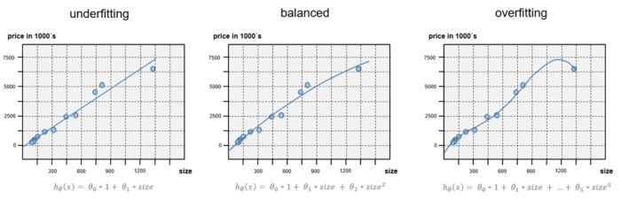

Although an overfitting model matches very well on the training data, it will perform badly when asked to solve for unknown, unseen data. There are a few ways to avoid overfitting.

过拟合的模型虽然在训练数据上匹配得非常好，但在处理未知的、从未见过的数据时表现会很差。有几种方法可以避免过拟合：

- Use a larger set of training data.
- Use an improved machine learning algorithm by considering regularization.
- Use fewer features, as shown in the middle diagram above.

- 使用更大的训练数据集。
- 考虑正则化，选用改进的机器学习算法。
- 减少特征数量，如上图中间的图所示。

If your predictive model overfits, you should remove any features that do not contribute to its accuracy. The challenge here is to find the features that contribute most meaningfully to your prediction output.

如果你的预测模型过拟合了，就应该去掉那些对精度没有贡献的特征。这里的难点在于，找出对预测输出最有意义的那些特征。

As shown in the diagrams, overfitting can be identified by visualizing graphs. Even though this works well using two dimensional or three dimensional graphs, it will become difficult if you use more than two domain-specific features. This is why cross-validation is often used to detect overfitting.

如上图所示，过拟合可以通过可视化图形来识别。这种方法在二维或三维图形上效果不错，但一旦使用的业务特征超过两个，就会变得困难。这就是交叉验证(cross-validation)常被用来检测过拟合的原因。

In a cross-validation, you evaluate the trained models using an unseen validation data set after the learning process has completed. The available, labeled data set will be split into three parts:

在交叉验证中，学习过程完成后，你会使用一个未参与训练的验证数据集来评估训练出的模型。可用的带标签数据集将被划分为三个部分：

- The* training data set*.
- The *validation data set.*
- The* test data set.*

- 训练数据集(training data set)。
- 验证数据集(validation data set)。
- 测试数据集(test data set)。

In this case, 60 percent of the house example records may be used to train different variants of the target algorithm. After the learning process, half of the remaining, untouched example records will be used to validate that the trained target algorithms work well for unseen data.

在本例中，房屋样本记录的 60% 可以用来训练目标算法的不同变体。学习过程结束后，剩余未动用样本记录中的一半，将用来验证训练出的目标算法在未见过的数据上是否表现良好。

Typically, the best-fitting target algorithms will then be selected. The other half of untouched example data will be used to calculate error metrics for the final, selected model. While I won't introduce them here, there are other variations of this technique, such as* k fold cross-validation.*

通常接下来会选出拟合最好的目标算法。剩下另一半未动用的样本数据，则用来为最终选定的模型计算误差指标。这项技术还有其他变体，比如 k 折交叉验证(k fold cross-validation)，这里就不展开介绍了。

## Machine learning tools and frameworks: Weka
## 机器学习工具与框架：Weka

As you've seen, developing and testing a target function requires well-tuned configuration parameters, such as the proper learning rate or iteration count. The example code I've shown reflects a very small set of the possible configuration parameters, and the examples have been simplified to keep the code readable. In practice, you will likely rely on machine learning frameworks, libraries, and tools.

前面已经看到，开发和测试目标函数需要调好各种配置参数，比如合适的学习率或迭代次数。我给出的示例代码只反映了全部可配置参数中很小的一部分，而且为了保持代码可读，示例都做了简化。在实践中，你多半要依靠机器学习框架、库和工具。

Most frameworks or libraries implement an extensive collection of machine learning algorithms. Additionally, they provide convenient high-level APIs to train, validate, and process data models. Weka is one of the most popular frameworks for the JVM.

大多数框架或库都实现了丰富的机器学习算法集合，还提供了便捷的高级 API 来训练、验证和处理数据模型。Weka 是 JVM 上最流行的框架之一。

Weka provides a Java library for programmatic usage, as well as a graphical workbench to train and validate data models. In the code below, the Weka library is used to create a training data set, which includes features and a label. The `setClassIndex()` method is used to mark the label column. In Weka, the label is defined as a *class*:

Weka 既提供了可供编程调用的 Java 库，也提供了用于训练和验证数据模型的图形化工作台。在下面的代码中，我们用 Weka 库创建了一个训练数据集，其中包含特征和标签。`setClassIndex()` 方法用于标记标签列。在 Weka 中，标签被定义为类(class)：

```
// define the feature and label attributes
ArrayList<Attribute> attributes = new ArrayList<>();
Attribute sizeAttribute = new Attribute("sizeFeature");
attributes.add(sizeAttribute);
Attribute squaredSizeAttribute = new Attribute("squaredSizeFeature");
attributes.add(squaredSizeAttribute);
Attribute priceAttribute = new Attribute("priceLabel");
attributes.add(priceAttribute);


// create and fill the features list with 5000 examples
Instances trainingDataset = new Instances("trainData", attributes, 5000);
trainingDataset.setClassIndex(trainingSet.numAttributes() - 1);
Instance instance = new DenseInstance(3);

instance.setValue(sizeAttribute, 90.0);
instance.setValue(squaredSizeAttribute, Math.pow(90.0, 2));
instance.setValue(priceAttribute, 249.0);
trainingDataset.add(instance);
Instance instance = new DenseInstance(3);
instance.setValue(sizeAttribute, 101.0);
...


```

The data set or Instance object can also be stored and loaded as a file. Weka uses an ARFF (Attribute Relation File Format), which is supported by the graphical Weka workbench. This data set is used to train the target function, known as a *classifier* in Weka.

数据集或 Instance 对象也可以保存为文件、从文件加载。Weka 使用 ARFF(Attribute Relation File Format)格式，图形化的 Weka 工作台支持这种格式。这个数据集将用于训练目标函数，它在 Weka 中被称为分类器(classifier)。

Recall that in order to train a target function, you have to first choose the machine learning algorithm. In the code below, an instance of the `LinearRegression` classifier will be created. This classifier will be train by calling the `buildClassifier()`. The `buildClassifier()` method tunes the theta parameters based on the training data to find the best-fitting model. Using Weka, you do not have to worry about setting a learning rate or iteration count. Weka also does the feature scaling internally.

别忘了，训练目标函数之前，首先要选择机器学习算法。下面的代码创建了一个 `LinearRegression` 分类器实例，然后调用 `buildClassifier()` 来训练这个分类器。`buildClassifier()` 方法基于训练数据调优 θ 参数，以找到拟合最好的模型。使用 Weka，你不必操心学习率或迭代次数的设置，特征缩放也由 Weka 在内部完成。

```
Classifier targetFunction = new LinearRegression();
targetFunction.buildClassifier(trainingDataset);


```

Once it's established, the target function can be used to predict the price of a house, as shown below:

建立好之后，目标函数就可以用来预测房价了，如下所示：

```
Instances unlabeledInstances = new Instances("predictionset", attributes, 1);
unlabeledInstances.setClassIndex(trainingSet.numAttributes() - 1);
Instance unlabeled = new DenseInstance(3);
unlabeled.setValue(sizeAttribute, 1330.0);
unlabeled.setValue(squaredSizeAttribute, Math.pow(1330.0, 2));
unlabeledInstances.add(unlabeled);

double prediction  = targetFunction.classifyInstance(unlabeledInstances.get(0));


```

Weka provides an `Evaluation` class to validate the trained classifier or model. In the code below, a dedicated validation data set is used to avoid biased results. Measures such as the cost or error rate will be printed to the console. Typically, evaluation results are used to compare models that have been trained using different machine-learning algorithms, or a variant of these:

Weka 提供了 `Evaluation` 类来验证训练好的分类器或模型。在下面的代码中，使用了一个专门的验证数据集，以避免有偏差的结果。代价或错误率等指标会被打印到控制台。通常，评估结果用于比较使用不同机器学习算法(或其变体)训练出来的模型：

```
Evaluation evaluation = new Evaluation(trainingDataset);
evaluation.evaluateModel(targetFunction, validationDataset);
System.out.println(evaluation.toSummaryString("Results", false));


```

The examples above uses linear regression, which predicts a numeric-valued output such as a house price based on input values. Linear regression supports the prediction of continuous, numeric values. To predict binary Yes/No values or classifiers, you could use a machine learning algorithm such as decision tree, neural network, or logistic regression:

上面的例子使用的是线性回归，它根据输入值预测数值型的输出，比如房价。线性回归支持预测连续的数值。要预测二元的"是/否"值或类别，可以使用决策树(decision tree)、神经网络(neural network)或逻辑回归(logistic regression)等机器学习算法：

```
// using logistic regression
Classifier targetFunction = new Logistic();
targetFunction.buildClassifier(trainingSet);


```

You might use one of these learning algorithms to predict whether an email was spam or ham, or to predict whether a house for sale could be a top-seller or not. If you wanted to train your algorithm to predict whether a house is likely to sell quickly, you would need to label your example records with a new classifying label such as `topseller`:

你可以用这类学习算法来预测一封邮件是垃圾邮件还是正常邮件，或者预测一套待售的房子会不会成为热销盘。如果你想训练算法预测一套房子是否可能很快卖出去，就需要给样本记录打上一个新的分类标签，比如 `topseller`：

```
// using topseller label attribute instead price label attribute
ArrayList<String> classVal = new ArrayList<>();
classVal.add("true");
classVal.add("false");

Attribute topsellerAttribute = new Attribute("topsellerLabel", classVal);
attributes.add(topsellerAttribute);


```

This training set could be used to train a new prediction classifier: `topseller`. Once trained, the prediction call will return the class label index, which can be used to get the predicted value:

这个训练集可以用来训练一个新的预测分类器：`topseller`。训练完成后，预测调用将返回类别标签的索引，再用它取出预测出的值：

```
int idx = (int) targetFunction.classifyInstance(unlabeledInstances.get(0));
String prediction = classVal.get(idx);
 
 
```

## Conclusion
## 结语

Although machine learning is closely related to statistics and uses many mathematical concepts, machine learning tools make it possible to start integrating machine learning into your programs without knowing a great deal about mathematics. That said, the better you understand the inner working of machine learning algorithms such as linear regression, which we explored in this article, the more you will be able to choose the right algorithm and configure it for optimal performance.

虽然机器学习与统计学关系密切、用到许多数学概念，但借助机器学习工具，你无需精通数学也可以开始把机器学习集成到自己的程序中。话虽如此，你对线性回归这类机器学习算法的内部原理理解得越深入(正如本文所探讨的)，就越有能力选择合适的算法并把它配置到最佳性能。

### Related links
### 相关链接

A good way to get deeper into machine learning is to take an online course such as Andrew Ng's [Machine Learning](https://www.coursera.org/learn/machine-learning/) course or Udacity's [Intro to Machine Learning](https://www.udacity.com/course/intro-to-machine-learning--ud120).

想深入学习机器学习，一个不错的途径是选修在线课程，比如 Andrew Ng 的《Machine Learning》课程，或者 Udacity 的《Intro to Machine Learning》课程。


- 原文链接: <https://www.javaworld.com/article/3224505/application-development/e-developers.html>

