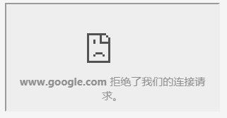

# 禁止iframe引用


打开Google的首页: <https://www.google.com/ncr>

通过Network控制台, 可以看到响应头中有这么一串:

```
x-frame-options: SAMEORIGIN
```

当然, 根据Http规范, Header中的KEY是不区分大小写的, `x-frame-options` 和 `X-FRAME-OPTIONS` 等价。

`x-frame-options: SAMEORIGIN` 的意思, 是告诉浏览器, 该网页不允许其他域名通过 `<frame src=XXX` 或者 `<iframe src=XXX` 引用。

你可以试试在HTML中加上一下内容:

```
<iframe src="https://www.google.com/ncr"></iframe>
```

通过监控, 可以看到 Console 控制台输出的错误信息:

```
Refused to display 'https://www.google.com/' in a frame 
  because it set 'X-Frame-Options' to 'sameorigin'.
```

如下图所示:



这样能有效防止别人换皮，在网页中嵌入你的服务。

只允许自家域名的网页引用。

当然, 这需要浏览器的支持。

> X-Frame-Options HTTP 响应头是用来给浏览器指示允许一个页面可否在 <frame>, <iframe> 或者 <object> 中展现的标记。网站可以使用此功能，来确保自己网站的内容没有被嵌到别人的网站中去，也从而避免了点击劫持 (clickjacking) 的攻击。

X-Frame-Options 有三个值:

- `DENY` 表示该页面不允许在 frame 中展示，即便是在相同域名的页面中嵌套也不允许。
- `SAMEORIGIN` 表示该页面可以在相同域名页面的 frame 中展示。
- `ALLOW-FROM uri` 表示该页面可以在指定来源的 frame 中展示。`

详细介绍请参考MDN网站: <https://developer.mozilla.org/zh-CN/docs/Web/HTTP/X-Frame-Options>


