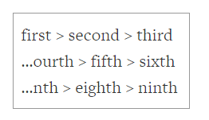

# CSS Ellipsis Beginning of String

# CSS高级技巧:自动省略左侧文本

I was incredibly happy when CSS `text-overflow: ellipsis` (married with fixed `width` and `overflow: hidden` was introduced to the CSS spec and browsers; the feature allowed us to stop trying to marry JavaScript width calculation with string width calculation and truncation.  CSS ellipsis was also very friendly to accessibility.

难以置信! 浏览器和CSS规范居然支持自动省略左侧的文本了。 通过 `text-overflow: ellipsis`, 搭配固定的 `width` 属性, 以及`overflow: hidden` 样式, 就可以实现这样的功能; 能用CSS实现，就不需要编写复杂的 JavaScript 代码来计算字符串宽度, 或者进行截断了. CSS的自动省略特性, 对无障碍环境也非常友好。

The CSS `text-overflow: ellipsis` feature is great but is essentially meant to ellipsize strings only at the end; what if we want to ellipsize the beginning of a screen?  The use case is fairly reasonable: think displaying a file path -- many times the directory for a set of files is the same, in which case you'd want to display the end of the string, not the beginning.

`text-overflow: ellipsis` 特性是很强大, 但其本身只能省略右侧文本;

如果想省略左边的文本怎么办呢? 

这种需求还是很常见的: 比如, 有很多个文件路径, 其中有许多文件的目录是一模一样的, 这时候只显示最右侧的文本, 明显会比较合理。

Let me show you a trick for ellipsis at the begging of the string!

下面介绍一个小技巧, 让自动省略出现在左边!

###The CSS

### CSS样式

Showing an ellipsis at the front of a string is mostly the same as ellipsis at the end, only with one simple trick:

自动省略左侧文本, 和自动省略右侧文本的样式基本一致, 只是多了一点小技巧:

```
.ellipsize-left {
    /* 常规的CSS省略 */
    white-space: nowrap;
    overflow: hidden;
    text-overflow: ellipsis;
    width: 200px;

    /* 让省略符显示在文本左侧 */
    direction: rtl;
    text-align: left;
}
```


To add an ellipsis at the beginning of a string, use RTL and and `text-align` to clip the beginning of the string!

我们需要指定`text-align` 样式, 并指定方向为RTL, 来自动裁剪左侧文本!

> RTL, right to left, 从右到左;
>
> LTR, left to right, 从左到右;
>
> 参考: <https://developer.mozilla.org/en-US/docs/Web/CSS/direction>

Playing RTL off of `text-align` is a genius way to get the desired effect of CSS ellipsis at the beginning of an element or string.  It would be great for the CSS spec to implement a more robust ellipsis system but, for now, I worship amazing CSS tricks like this!

使用`text-align`和RTL来实现自动省略左侧文本的CSS特效, 是一个非常精巧的设计; 也许未来会很普及, 但现在这个技巧还很高端, 会的人不多!


### 在线Demo

在线Demo页面的地址为: <https://davidwalsh.name/demo/css-left-ellipsis.php>

从中可以看到,

相关的CSS代码如下:

```
<style type="text/css">
    .ellipsize-me {
        white-space: nowrap;
	/* 很显然,overflow的值不能是: visible */
        overflow: hidden;
        text-overflow: ellipsis;
        direction: rtl;
        text-align: left;
        width: 200px;
        border: 1px solid #999;
        padding: 10px;
    }
</style>
```


HTML代码如下:

```
<p class="ellipsize-me">
    first &gt; second &gt; third<br>
    second &gt; third &gt; fourth &gt; fifth &gt; sixth<br>
    fifth &gt; sixth &gt; seventh &gt; eighth &gt; ninth
</p>
```

显示效果类似这样:


```
first > second > third
...ourth > fifth > sixth
...nth > eighth > ninth
```

其中的省略符(`...`)是不可选择的。

效果截图:




原文链接: <https://davidwalsh.name/css-ellipsis-left>

Demo地址: <https://davidwalsh.name/demo/css-left-ellipsis.php>


翻译人员: 铁锚 - <https://blog.csdn.net/renfufei>

翻译日期: 2018年12月21日

