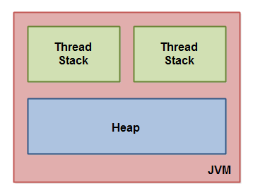
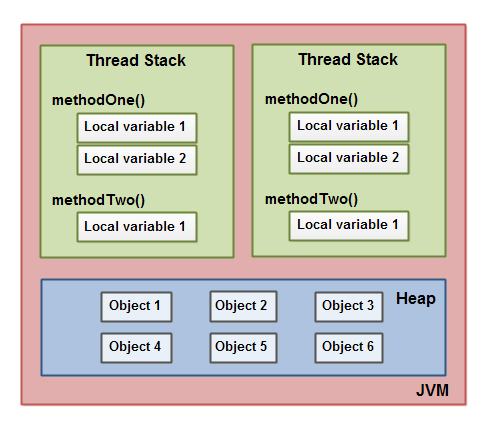
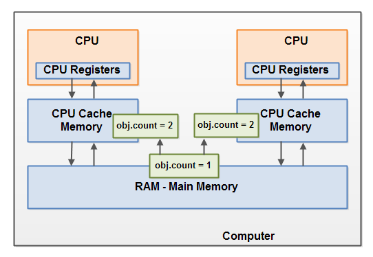

# 11. Java Memory Model

# 11. Java内存模型

The Java memory model specifies how the Java virtual machine works with the computer's memory (RAM). The Java virtual machine is a model of a whole computer so this model naturally includes a memory model - AKA the Java memory model.

Java内存模型(Java Memory Model)规定了Java虚拟机如何使用计算机内存（RAM）。 Java虚拟机是一个整体的计算机模型，所以JVM模型自然需要有对应的内存模型 —— 称为Java内存模型。

It is very important to understand the Java memory model if you want to design correctly behaving concurrent programs. The Java memory model specifies how and when different threads can see values written to shared variables by other threads, and how to synchronize access to shared variables when necessary.

如果要掌握真正的并发程序设计，了解Java内存模型是非常必要的。 Java内存模型指定了不同线程之间， 什么时候，以什么方式,可以看见其他线程写入到内存中的共享变量的值，以及在必要时, 如何对共享变量的访问进行同步。

The original Java memory model was insufficient, so the Java memory model was revised in Java 1.5. This version of the Java memory model is still in use in Java 8.


最初的Java内存模型有些坑，所以在Java 1.5版本中重新设计了Java内存模型，一直用到了Java 8及以后的版本。

## The Internal Java Memory Model

## 内部Java内存模型

The Java memory model used internally in the JVM divides memory between thread stacks and the heap. This diagram illustrates the Java memory model from a logic perspective:

JVM内部使用的Java内存模型， 在逻辑上将内存划分为： 线程栈（thread stacks）和堆内存（heap）。 如下图所示：



Each thread running in the Java virtual machine has its own thread stack. The thread stack contains information about what methods the thread has called to reach the current point of execution. I will refer to this as the "call stack". As the thread executes its code, the call stack changes.

JVM中，每个正在运行的线程，都有自己的线程栈。线程栈包含了执行到当前方法/节点时所经历的所有方法的状态信息。我将其称为“调用栈”（call stack）。 当线程执行代码时，调用栈会发生变化。


The thread stack also contains all local variables for each method being executed (all methods on the call stack). A thread can only access it's own thread stack. Local variables created by a thread are invisible to all other threads than the thread who created it. Even if two threads are executing the exact same code, the two threads will still create the local variables of that code in each their own thread stack. Thus, each thread has its own version of each local variable.

线程栈还包含（调用栈上）正在执行的所有方法对应的局部变量。线程只能访问自己的线程栈。 每个线程都不能访问(看不见)其他线程创建的局部变量。 即使两个线程正在执行完全相同的代码，但每个线程都会在自己的线程栈内，创建代码中声明的局部变量。因此，每个线程都有一份自己的局部变量（集）。


All local variables of primitive types ( `boolean`, `byte`, `short`, `char`, `int`, `long`, `float`, `double`) are fully stored on the thread stack and are thus not visible to other threads. One thread may pass a copy of a pritimive variable to another thread, but it cannot share the primitive local variable itself.

所有原生类型的局部变量（`boolean`，`byte`，`short`，`char`，`int`，`long`，`float`，`double`）,其数据/数值完全存储在线程栈中，因此对其他线程是不可见的。一个线程可以将一个原生变量的值(copy)传给另一个线程，但不能共享原生局部变量本身。

The heap contains all objects created in your Java application, regardless of what thread created the object. This includes the object versions of the primitive types (e.g. `Byte`, `Integer`, `Long` etc.). It does not matter if an object was created and assigned to a local variable, or created as a member variable of another object, the object is still stored on the heap.

堆内存包含了所有在Java代码中创建的对象，不管是哪个线程创建的。其中包括了原生数据类型的包装类型（例如`Byte`，`Integer`，`Long`等）。无论是创建对象并将其分配给局部变量，还是创建为另一个对象的成员变量，对象都会存储在堆上。

Here is a diagram illustrating the call stack and local variables stored on the thread stacks, and objects stored on the heap:

下图演示了调用栈、线程栈上的局部变量，以及存储在堆内存中的对象：



A local variable may be of a primitive type, in which case it is totally kept on the thread stack.

局部变量可以是基本类型，在这种情况下，它完全保留在线程堆栈上。

A local variable may also be a reference to an object. In that case the reference (the local variable) is stored on the thread stack, but the object itself if stored on the heap.

局部变量也可以是对象的引用。在这种情况下，引用（局部变量）存储在线程堆栈中，但是对象本身存储在堆上。


An object may contain methods and these methods may contain local variables. These local variables are also stored on the thread stack, even if the object the method belongs to is stored on the heap.

对象可能包含方法，这些方法可能包含局部变量。即使方法所属的对象存储在堆上，这些局部变量也存储在线程堆栈中。

An object's member variables are stored on the heap along with the object itself. That is true both when the member variable is of a primitive type, and if it is a reference to an object.

对象的成员变量与对象本身一起存储在堆上。当成员变量是基本类型时，以及它是对象的引用时都是如此。

Static class variables are also stored on the heap along with the class definition.

静态类变量也与类定义一起存储在堆上。

Objects on the heap can be accessed by all threads that have a reference to the object. When a thread has access to an object, it can also get access to that object's member variables. If two threads call a method on the same object at the same time, they will both have access to the object's member variables, but each thread will have its own copy of the local variables.

所有具有对象引用的线程都可以访问堆上的对象。当一个线程有权访问一个对象时，它也可以访问该对象的成员变量。如果两个线程同时在同一个对象上调用一个方法，它们都可以访问该对象的成员变量，但每个线程都有自己的局部变量副本。

Here is a diagram illustrating the points above:


这是一个说明上述要点的图表：


Two threads have a set of local variables. One of the local variables (`Local Variable 2`) point to a shared object on the heap (Object 3). The two threads each have a different reference to the same object. Their references are local variables and are thus stored in each thread's thread stack (on each). The two different references point to the same object on the heap, though.

Notice how the shared object (Object 3) has a reference to Object 2 and Object 4 as member variables (illustrated by the arrows from Object 3 to Object 2 and Object 4). Via these member variable references in Object 3 the two threads can access Object 2 and Object 4.

The diagram also shows a local variable which point to two different objects on the heap. In this case the references point to two different objects (Object 1 and Object 5), not the same object. In theory both threads could access both Object 1 and Object 5, if both threads had references to both objects. But in the diagram above each thread only has a reference to one of the two objects.

So, what kind of Java code could lead to the above memory graph? Well, code as simple as the code below:

> MyRunnable.java

```
public class MyRunnable implements Runnable() {

    public void run() {
        methodOne();
    }

    public void methodOne() {
        int localVariable1 = 45;

        MySharedObject localVariable2 =
            MySharedObject.sharedInstance;

        //... do more with local variables.

        methodTwo();
    }

    public void methodTwo() {
        Integer localVariable1 = new Integer(99);

        //... do more with local variable.
    }
}

```

> MySharedObject.java


```

public class MySharedObject {

    //static variable pointing to instance of MySharedObject

    public static final MySharedObject sharedInstance =
        new MySharedObject();


    //member variables pointing to two objects on the heap

    public Integer object2 = new Integer(22);
    public Integer object4 = new Integer(44);

    public long member1 = 12345;
    public long member1 = 67890;
}
```

If two threads were executing the `run()` method then the diagram shown earlier would be the outcome. The `run()` method calls `methodOne()` and `methodOne()` calls `methodTwo()`.

`methodOne()` declares a primitive local variable (`localVariable1` of type `int`) and an local variable which is an object reference (`localVariable2`).

Each thread executing `methodOne()` will create its own copy of `localVariable1` and `localVariable2` on their respective thread stacks. The `localVariable1` variables will be completely separated from each other, only living on each thread's thread stack. One thread cannot see what changes another thread makes to its copy of `localVariable1`.

Each thread executing `methodOne()` will also create their own copy of `localVariable2`. However, the two different copies of `localVariable2` both end up pointing to the same object on the heap. The code sets `localVariable2` to point to an object referenced by a static variable. There is only one copy of a static variable and this copy is stored on the heap. Thus, both of the two copies of `localVariable2` end up pointing to the same instance of `MySharedObject` which the static variable points to. The `MySharedObject`instance is also stored on the heap. It corresponds to Object 3 in the diagram above.

Notice how the `MySharedObject` class contains two member variables too. The member variables themselves are stored on the heap along with the object. The two member variables point to two other `Integer` objects. These `Integer` objects correspond to Object 2 and Object 4 in the diagram above.

Notice also how `methodTwo()` creates a local variable named `localVariable1`. This local variable is an object reference to an `Integer` object. The method sets the `localVariable1` reference to point to a new `Integer` instance. The `localVariable1` reference will be stored in one copy per thread executing `methodTwo()`. The two `Integer` objects instantiated will be stored on the heap, but since the method creates a new `Integer` object every time the method is executed, two threads executing this method will create separate `Integer` instances. The `Integer` objects created inside `methodTwo()` correspond to Object 1 and Object 5 in the diagram above.

Notice also the two member variables in the class `MySharedObject` of type `long` which is a primitive type. Since these variables are member variables, they are still stored on the heap along with the object. Only local variables are stored on the thread stack.


## Hardware Memory Architecture

Modern hardware memory architecture is somewhat different from the internal Java memory model. It is important to understand the hardware memory architecture too, to understand how the Java memory model works with it. This section describes the common hardware memory architecture, and a later section will describe how the Java memory model works with it.

Here is a simplified diagram of modern computer hardware architecture:


A modern computer often has 2 or more CPUs in it. Some of these CPUs may have multiple cores too. The point is, that on a modern computer with 2 or more CPUs it is possible to have more than one thread running simultaneously. Each CPU is capable of running one thread at any given time. That means that if your Java application is multithreaded, one thread per CPU may be running simultaneously (concurrently) inside your Java application.

Each CPU contains a set of registers which are essentially in-CPU memory. The CPU can perform operations much faster on these registers than it can perform on variables in main memory. That is because the CPU can access these registers much faster than it can access main memory.

Each CPU may also have a CPU cache memory layer. In fact, most modern CPUs have a cache memory layer of some size. The CPU can access its cache memory much faster than main memory, but typically not as fast as it can access its internal registers. So, the CPU cache memory is somewhere in between the speed of the internal registers and main memory. Some CPUs may have multiple cache layers (Level 1 and Level 2), but this is not so important to know to understand how the Java memory model interacts with memory. What matters is to know that CPUs can have a cache memory layer of some sort.

A computer also contains a main memory area (RAM). All CPUs can access the main memory. The main memory area is typically much bigger than the cache memories of the CPUs.

Typically, when a CPU needs to access main memory it will read part of main memory into its CPU cache. It may even read part of the cache into its internal registers and then perform operations on it. When the CPU needs to write the result back to main memory it will flush the value from its internal register to the cache memory, and at some point flush the value back to main memory.

The values stored in the cache memory is typically flushed back to main memory when the CPU needs to store something else in the cache memory. The CPU cache can have data written to part of its memory at a time, and flush part of its memory at a time. It does not have to read / write the full cache each time it is updated. Typically the cache is updated in smaller memory blocks called "cache lines". One or more cache lines may be read into the cache memory, and one or mor cache lines may be flushed back to main memory again.


## Bridging The Gap Between The Java Memory Model And The Hardware Memory Architecture

As already mentioned, the Java memory model and the hardware memory architecture are different. The hardware memory architecture does not distinguish between thread stacks and heap. On the hardware, both the thread stack and the heap are located in main memory. Parts of the thread stacks and heap may sometimes be present in CPU caches and in internal CPU registers. This is illustrated in this diagram:


When objects and variables can be stored in various different memory areas in the computer, certain problems may occur. The two main problems are:

- Visibility of thread updates (writes) to shared variables.
- Race conditions when reading, checking and writing shared variables.

Both of these problems will be explained in the following sections.


### Visibility of Shared Objects

If two or more threads are sharing an object, without the proper use of either `volatile` declarations or synchronization, updates to the shared object made by one thread may not be visible to other threads.

Imagine that the shared object is initially stored in main memory. A thread running on CPU one then reads the shared object into its CPU cache. There it makes a change to the shared object. As long as the CPU cache has not been flushed back to main memory, the changed version of the shared object is not visible to threads running on other CPUs. This way each thread may end up with its own copy of the shared object, each copy sitting in a different CPU cache.

The following diagram illustrates the sketched situation. One thread running on the left CPU copies the shared object into its CPU cache, and changes its `count` variable to 2. This change is not visible to other threads running on the right CPU, because the update to `count` has not been flushed back to main memory yet.


To solve this problem you can use [Java's volatile keyword](http://tutorials.jenkov.com/java-concurrency/volatile.html). The `volatile` keyword can make sure that a given variable is read directly from main memory, and always written back to main memory when updated.


### Race Conditions

If two or more threads share an object, and more than one thread updates variables in that shared object,[race conditions](http://tutorials.jenkov.com/java-concurrency/race-conditions-and-critical-sections.html) may occur.

Imagine if thread A reads the variable `count` of a shared object into its CPU cache. Imagine too, that thread B does the same, but into a different CPU cache. Now thread A adds one to `count`, and thread B does the same. Now `var1` has been incremented two times, once in each CPU cache.

If these increments had been carried out sequentially, the variable `count` would be been incremented twice and had the original value + 2 written back to main memory.

However, the two increments have been carried out concurrently without proper synchronization. Regardless of which of thread A and B that writes its updated version of `count` back to main memory, the updated value will only be 1 higher than the original value, despite the two increments.

This diagram illustrates an occurrence of the problem with race conditions as described above:



To solve this problem you can use a [Java synchronized block](http://tutorials.jenkov.com/java-concurrency/synchronized.html). A synchronized block guarantees that only one thread can enter a given critical section of the code at any given time. Synchronized blocks also guarantee that all variables accessed inside the synchronized block will be read in from main memory, and when the thread exits the synchronized block, all updated variables will be flushed back to main memory again, regardless of whether the variable is declared volatile or not.

<<http://tutorials.jenkov.com/java-concurrency/java-memory-model.html>>

