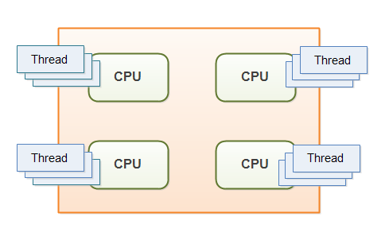

# Java Concurrency and Multithreading Tutorial

# Java多线程与并发教程

Java Concurrency is a term that covers multithreading, concurrency and parallelism on the Java platform. That includes the Java concurrency tools, problems and solutions. This Java concurrency tutorial covers the core concepts of multithreading, concurrency constructs, concurrency problems, costs, benefits related to multithreading in Java.

Java Concurrency这个术语, 主要是指Java平台上的多线程（multithreading）、并发（concurrency）和并行（parallelism）。其中涉及并发相关的工具,问题与解决方案。本教程的内容包括： Java中多线程的概念, 怎样构造并发, 使用多线程的优势和代价、以及可能引发的问题。

### Brief History of Concurrency

### 并发简史

Back in the old days a computer had a single CPU, and was only capable of executing a single program at a time. Later came multitasking which meant that computers could execute multiple programs (AKA tasks or processes) at the same time. It wasn't really "at the same time" though. The single CPU was shared between the programs. The operating system would switch between the programs running, executing each of them for a little while before switching.

几十年前、每台计算机中只有一个CPU, 同一时间只能执行一个程序。

后来出了一种叫做“多任务”的技术，让计算机可以同时执行多个程序(或者叫任务/进程)。但这并不是真正的“同一时刻”, 而是让多个程序共享单个CPU的时间片。 操作系统负责调度，让每个程序执行一小段时间、然后根据调度算法进行切换。

Along with multitasking came new challenges for software developers. Programs can no longer assume to have all the CPU time available, nor all memory or any other computer resources. A "good citizen" program should release all resources it is no longer using, so other programs can use them.

多任务技术对程序员带来了新的挑战。一个程序不能再独占所有的CPU时间, 所有的内存、以及其他的计算资源。“五好青年”程序，不再使用之后应该释放所有的资源，让给其他程序。

Later yet came multithreading which mean that you could have multiple threads of execution inside the same program. A thread of execution can be thought of as a CPU executing the program. When you have multiple threads executing the same program, it is like having multiple CPUs execute within the same program.

接着又出现了“多线程”技术。在同一个程序中，可以执行多个线程。 一个线程就可以看成有一个CPU在执行。 如果程序中有多个线程, 看起来就像是有多个CPU在执行这个程序。

> 线程和进程在CPU看来没什么本质区别，只是程序内在逻辑上的区分。

Multithreading can be a great way to increase the performance of some types of programs. However, mulithreading is even more challenging than multitasking. The threads are executing within the same program and are hence reading and writing the same memory simultanously. This can result in errors not seen in a singlethreaded program. Some of these errors may not be seen on single CPU machines, because two threads never really execute "simultanously". Modern computers, though, come with multi core CPUs, and even with multiple CPUs too. This means that separate threads can be executed by separate cores or CPUs simultanously.

对某些程序来说， 使用多线程会有巨大的性能提升。当然, 多线程变成比多任务编程的复杂度要高一些。 同一个程序（进程）中的线程, 他们的内存地址是同一套，这些线程可以同时读写进程中的内存。 编写的不好的话，可能会出现一些在单线程情况下不会发生的错误。其中的某些错误、在单CPU的机器上不会出现,因为不会真正地同时执行。 但是呢, 现在的计算机都具备多核心CPU, 甚至是多个物理CPU。 那就会有多个CPU核心在同一时刻执行多个线程。

If a thread reads a memory location while another thread writes to it, what value will the first thread end up reading? The old value? The value written by the second thread? Or a value that is a mix between the two? Or, if two threads are writing to the same memory location simultanously, what value will be left when they are done? The value written by the first thread? The value written by the second thread? Or a mix of the two values written?

如果一个线程在读取某个地址的内存, 而另一个线程要将数据写入这个地址, 那么第一个线程读取到的数据会是什么呢? 旧的值?还是刚刚写入的新的值? 或者是写入一半的脏数据?

又或者, 当两个线程同时写数据到相同的内存地址，结果会是什么呢? 是第一个线程写的值? 还是第二个线程写入的值? 或者是每个线程写了一部分的脏数据?

Without proper precautions any of these outcomes are possible. The behaviour would not even be predictable. The outcome could change from time to time. Therefore it is important as a developer to know how to take the right precautions - meaning learning to control how threads access shared resources like memory, files, databases etc. That is one of the topics this Java concurrency tutorial addresses.

毫无疑问，这些结果都可能出现。 甚至是不可预测的。情境随时会变。 因此, 开发者必须要了解如何采取正确的预防措施 —— 也就是学习如何去控制多个线程来访问这些共享资源, 比如内存、文件、数据库等等. 这也是本教程将要介绍的一个主题。

### Multithreading and Concurrency in Java

### Java中的多线程和并发

Java was one of the first languages to make multithreading easily available to developers. Java had multithreading capabilities from the very beginning. Therefore, Java developers often face the problems described above. That is the reason I am writing this trail on Java concurrency. As notes to myself, and any fellow Java developer whom may benefit from it.

Java语言是第一个多线程容易给开发商。Java多线程功能从一开始.因此,Java开发人员经常面临上述问题。这是我写这小道的原因在Java并发性.对自己笔记,和任何其他Java开发人员可能从中受益。

The trail will primarily be concerned with multithreading in Java, but some of the problems occurring in multithreading are similar to problems occurring in multitasking and in distributed systems. References to multitasking and distributed systems may therefore occur in this trail too. Hence the word "concurrency" rather than "multithreading".

跟踪主要会涉及多线程在Java中,但有些问题发生在多线程类似问题发生在多任务处理和分布式系统.引用多任务和分布式系统也可能因此发生在这小道。因此这个词“并发”而不是“多线程”。

### Java Concurrency in 2015 and Forward

### 2015年之前的Java并发技术

A lot has happened in the world of concurrent architecture and design since the first Java concurrency books were written, and even since the Java 5 concurrency utilities were released.

世界上发生了很多并发架构和设计以来第一个Java并发写书,甚至自Java 5并发实用程序被释放。

New, asynchronous "shared-nothing" platforms and APIs like Vert.x and Play / Akka and Qbit have emerged. These platforms use a different concurrency model than the standard Java / JEE concurrency model of threading, shared memory and locking. New non-blocking concurrency algorithms have been published, and new non-blocking tools like the LMax Disrupter have been added to our toolkits. New functional programming parallelism has been introduced with the Fork and Join framework in Java 7, and the collection streams API in Java 8.

新、异步“无共享”平台和api喜欢绿色。x和播放/ Akka Qbit已经出现.这些平台上使用不同的并发模型比标准Java / JEE线程的并发模型,共享内存和锁定.新的非阻塞并发算法已经出版,和非阻塞工具像LMax破坏者已经增加了我们的工具包.新函数式编程并行性与Fork和Join框架引入了在Java 7中,和收集流API在Java 8。

With all these new developments it is about time that I updated this Java Concurrency tutorial. Therefore, this tutorial is once again work in progress. New tutorials will be published whenever time is available to write them.

所有这些新发展的时候了,我这个Java并发更新教程。因此,本教程是再一次工作进展.新教程时将发表时间可以写他们。

### Java Concurrency Study Guide

### Java并发学习指南

If you are new to Java concurrency, I would recommend that you follow the study plan below. You can find links to all the topics in the menu in the left side of this page too.

如果您是Java并发,我建议你遵循下面的学习计划。你可以找到所有的主题的链接在页面的左边菜单。

General concurrency and multithreading theory:

一般和多线程并发性理论:

- Multithreading Benefits
- Multithreading Costs
- Concurrency Models
- Same-threading
- Concurrency vs. Parallelism

- 多线程的好处
- 多线程的成本
- 并发模型
- Same-threading
- 并发和并行性

The basics of Java concurrency:

基本的Java并发性:

- Creating and Starting Java Threads
- Race Conditions and Critical Sections
- Thread Safety and Shared Resources
- Thread Safety and Immutability
- Java Memory Model
- Java Synchronized Blocks
- Java Volatile Keyword
- Java ThreadLocal
- Java Thread Signaling

- 创建和启动Java线程
- 竞争条件和关键部分
- 线程安全,共享资源
- 线程安全性和不变性
- Java内存模型
- Java Synchronized块
- Java不稳定的关键字
- Java ThreadLocal
- Java线程的信号

Typical problems in Java concurrency:

典型的Java并发性问题:

- Deadlock
- Deadlock Prevention
- Starvation and Fairness
- Nested Monitor Lockout
- Slipped Conditions

- 死锁
- 死锁预防
- 饥饿和公平
- 嵌套管程闭锁(Monitor Lockout)
- 了条件

Java concurrency constructs that help against the issues above:

Java并发结构帮助对上面的问题:

- Locks in Java
- Read / Write Locks in Java
- Reentrance Lockout
- Semaphores
- Blocking Queues
- Thread Pools
- Compare and Swap

- 锁在Java中
- 读/写锁在Java中
- 再进入停摆
- 信号量
- 阻塞队列
- 线程池
- 比较和交换

Further topics:

进一步的主题:

- Anatomy of a Synchronizer
- Non-blocking Algorithms
- Amdahl's Law
- References

- 分析同步器
- 非阻塞算法
- Amdahl法则
- 参考文献

<http://tutorials.jenkov.com/java-concurrency/index.html>

