# The Pauseless GC Algorithm

# Pauseless GC 算法论文 - 中文翻译

> ##### 译者注: 
> Pauseless GC Algorithm, 无停顿的垃圾收集算法; 算法本身是无STW停顿的，但兼容 HotSpot JVM 的实现还有少量的STW停顿。
> mutator, 业务线程，对内存进行读写的线程, 可理解为业务线程, 与GC线程做区分。

```
作者: 
Cliff Click ;  Gil Tene ; Michael Wolf ; {cliffc,gil,wolf}@azulsystems.com

Azul Systems, Inc.
1600 Plymouth Street
Mountain View, CA 94043
```

> Permission to make digital or hard copies of all or part of this work for personal or classroom use is granted without fee provided that copies are not made or distributed for profit or commercial advantage and that copies bear this notice and the full citation on the first page. To copy otherwise, or republish, to post on servers or to redistribute to lists, requires prior specific permission and/or a fee.

> 以个人学习或教学研究为目的, 可以免费使用本论文，但不得用于谋取利益或商业利益。 需要在第一页中展示本声明。以其他方式拷贝、发布、传播本文档，则需要获得许可/付费。

> VEE’05, June 11�C12, 2005, Chicago, Illinois, USA.

> Copyright 2005 ACM 1-59593-047-7/05/0006...$5.00.


## ABSTRACT

## 摘要

Modern transactional response-time sensitive applications have run into practical limits on the size of garbage collected heaps. The heap can only grow until GC pauses exceed the response-time limits. Sustainable, scalable concurrent collection has become a feature worth paying for.

如今有很多系统对业务的响应时间非常敏感, 却在GC这块受到堆内存大小的限制。 他们的堆内存不能设置得非常大，必须限制大小，让GC暂停时间满足业务允许的最大响应时间。 业界迫切需要一款可以长期稳定运行的、兼容各种内存规模的并发垃圾收集器。

Azul Systems has built a custom system (CPU, chip, board, and OS) specifically to run garbage collected virtual machines. The custom CPU includes a read barrier instruction. The read barrier enables a highly concurrent (no stop-the-world phases), parallel and compacting GC algorithm. The Pauseless algorithm is designed for uninterrupted application execution and consistent mutator throughput in every GC phase.

Azul Systems 公司专门定制了一套系统(包括CPU、芯片组、主板及操作系统)，用来支持虚拟机运行垃圾收集算法。 定制的CPU支持【读屏障指令】。读屏障(read barrier)能支持高并发(无停顿)、并行执行的、具有内存碎片整理功能的GC算法。 Pauseless GC 算法经过专门设计， 支持不间断的应用执行, 在各个GC阶段都能保持稳定的业务吞吐量。

Beyond the basic requirement of collecting faster than the allocation rate, the Pauseless collector is never in a “rush” to complete any GC phase. No phase places an undue burden on the mutators nor do phases race to complete before the mutators produce more work. Portions of the Pauseless algorithm also feature a “self-healing” behavior which limits mutator overhead and reduces mutator sensitivity to the current GC state.

除了满足基本要求( 垃圾收集的速度要超过业务内存分配的速度）， Pauseless 收集器从不急于完成某个GC阶段。任何阶段都不会给业务带来额外的负担，也不需要争抢CPU来迅速完成某个阶段。 Pauseless垃圾收集算法中的某些部分还具有“自修复”功能，这种行为限制了业务线程的开销，并降低了业务线程对当前GC状态的敏感度。

We present the Pauseless GC algorithm, the supporting hardware features that enable it, and data on the overhead, efficiency, and pause times when running a sustained workload.

本文主要介绍Pauseless GC算法、包括需要硬件支持的特性, 以及在业务饱和场景下的GC开销、性能情况、和暂停时间等数据。


## Categories and Subject Descriptors

## 所属分类与主题

D.3.4 [Processors] �C Memory management, 

D.3.3 [Language Constructs and Features] �C Dynamic storage management,

## General Terms

## 一般条款

Languages, Performance, Design, Algorithms.

## Keywords

## 关键字

Read barriers, memory management, garbage collection, concurrent GC, Java, custom hardware

读屏障、内存管理、垃圾收集、并发GC、Java、硬件定制

## 1. INTRODUCTION

## 1. 简介

Many of today's enterprise applications are based on garbage collected virtual machine environments such as Java and .NET.

现如今，有很多企业应用基于虚拟机环境而开发, 例如Java和.net应用, 当然也依赖虚拟机提供的自动垃圾回收机制。

Most have response time sensitive components �C for example, a person may be waiting for a web page to load, or a credit-card swipe needs to complete. Stopping for an inopportune GC pause can lead to unacceptable response times. For these applications it is unacceptable for collectors to drive high average throughput numbers at the expense of occasional poor response times.

有一部分系统对响应时间非常敏感 ―― 例如, 正在等待网页加载的用户, 或者在等待信用卡刷卡完成的消费者.一次不合时宜的GC暂停可能导致不可接受的响应时间. 对这部分系统来说, 仅仅是提高平均吞吐量、却影响到响应时间，这是完全不能接受的。

These enterprise applications need a low-pause time collector (pauses on the order of human reflexes, 10-100ms) that can handle very large Java programs (heap sizes from 100MB to 100GB) and highly concurrent workloads (100s of concurrent mutator threads). Such a collector needs to perform consistently and predictably over long periods of time, rather than simply excel at short time-bursts of workload.

这类企业应用程序需要非常低的GC暂停时间(相对于人类的反应, 需要控制在10-100ms以内), 同时能应对非常庞大的Java程序(堆内存大小为 100MB到100GB这个范围), 以及高并发环境(上百个并发修改线程).

Many modern garbage collectors rely on write barriers imposed on mutator heap writes, to keep track of references between different heap regions. This enables an efficient generational or region-based GC and is widely used in many garbage-collected languages including most production Java implementations. Read barriers, on the other hand, are rarely used in production systems despite a wealth of academic research because of the high mutator cost they usually incur.

当前许多先进的垃圾收集器, 都依赖于对业务线程强制增加写屏障(write barrier),控制堆内存写入, 来跟踪跨域不同堆区之间的引用. 基于分代/分区的GC算法具有非常优越的性能, 广泛应用于各种产品级虚拟机实现, 包括JVM. 换句话说，在生产环境中很少使用读屏障, 尽管有很多的学术研究, 主要还是因为业务线程的成本太高。

Azul Systems has built a custom system (CPU, chip, board, and OS) specifically to run garbage collected virtual machines. The custom CPU includes a read barrier instruction. The read barrier enables a highly concurrent, parallel and compacting GC algorithm. The Pauseless GC algorithm is simple, efficient (low mutator overhead), and has no Stop-The-World pauses.

Azul Systems 公司构建了一套专门定制的系统(包括CPU、芯片组、主板以及操作系统)，用来运行支持垃圾收集的虚拟机。定制的CPU支持[读屏障指令]。读屏障(read barrier)用于支持高并发、并行化、具有内存碎片整理功能的GC算法。无停顿的GC算法非常简洁、高效(突变开销很小), 没有STW停顿(Stop-The-World pauses)。


## 2. RELATED WORK

## 2. 相关文献

The idea of garbage collection has been around for a long time [22][13][16][11]. We do not attempt to summarize all relevant GC work and instead we refer the reader to several GC surveys [30][31], and highlight a few papers.

垃圾收集这种想法已经存很长的时间了(见[22][13][16][11]). 本文并不是汇总所有的GC理论, 只是参考其中的部分GC研究(见[30][31]),并着重强调一部分重要的内容。

GC pauses and their unpredictable impact on mutators was the driving force behind the early work on concurrent collectors [26][5]. The expectation of the time was that special GC hardware would shortly be feasible and commonplace. This early work required such extensive fine-grained synchronization that it would only be feasible on dedicated hardware. GC hardware continues to be proposed to this day [23][29][24][18][20].

GC暂停及其对业务性能的影响具有不可预测性, 推动了并发GC的早期发展(见[26][5]). 通过特殊的硬件设备来支撑可预期的短暂的GC时间, 被证明是可行的、是很普遍的解决方案.  这些早期产品使用了很多细粒度的同步, 所以要有专门的硬件支持。这时候GC专用的硬件持续被讨论(见[23][29][24][18][20])。

The idea of using common page-protection hardware to support GC has also been around awhile [2]. Both Appel [2][3] and Ossia [25] protect pages that may contain objects with non-forwarded pointers (initially all pages). Accessing a protected page causes an OS trap which the GC handles by forwarding all pointers on that page, then clearing the page protection. Appel does the forwarding in kernel-mode, Ossia maps the physical memory with a second unprotected virtual address for use by GC. Our Pauseless collector protects pages that contain objects being moved, instead of protecting pages that contain pointers to moved objects. This is a much smaller page set, and the pages can be incrementally protected. Our read-barrier allows us to intercept and correct individual stale references, and avoids blocking the mutator to fix up entire pages. We also support a special GC protection mode to allow fast, non-kernel-mode trap handlers that can access protected pages.

使用通用页保护设备来支持GC的想法也在这时候提出(见[2]). Appel公司(见[2][3])和Ossia公司(见[25])使用非前向指针(non-forwarded pointers)来保护可能包含对象的内存页(初始化所有页面). 如果访问一个受保护的页面, 则会让操作系统使用陷阱来处理GC指针, 将该页面上的所有指针进行转发, 然后再去除页面保护.  Appel公司在内核模式执行指针转发, Ossia公司则是将物理内存映射到一个供GC使用的不受保护的虚拟地址.  而我们公司实现的Pauseless垃圾收集器会保护正在移动对象的页面,而不是去保护指向被移动对象的那些页面. 这种处理方式下 page set 会小得多，而且各个页面可以增量地受到保护. 使用读屏障可以让我们拦截并纠正极个别的过期引用, 避免修复整个页面，进而阻塞业务线程. 我们也支持一个特殊的GC保护模式, 在业务线程访问受保护的页面时, 以非内核模式调用快速陷阱处理程序。

-----------

The idea of an incremental collector (via reference counting) is not new either [15]. Incremental collection seeks to reduce pause time by spreading the collection work out in time, finely interleaving GC work with mutator work. Because reference counting is expensive, and indeed all barriers (reference counting typically involves a write barrier) impose some mutator cost there is considerable research in reducing barrier costs [6][21][8] [9]. Having the read-barrier implemented in hardware greatly reduces costs. In our case the typical cost is roughly that of a single cycle ALU instruction.

增量收集器(通过引用计数)的想法也不是新提出的(见[15]). 增量收集的目的是为了减少停顿时间, 通过实时的GC工作, 精细交错GC任务与业务线程的执行. 因为引用计数的代价很高, 事实上所有的屏障(引用计数通常涉及写障碍)都会强加一些修改成本, 有很多研究致力于降低屏障开销(见[6][21][8][9]). 在硬件内实现的读屏障大大降低了开销。在我们的实现中, 一般只需要单个ALU指令的时钟周期。

Incremental and low-pause-time collectors are becoming very popular again �C partly because embedded devices have grown in compute power to the point where it's feasible to run a garbage collected language on them [19]. Metronome is an example of a modern low-pause time collector for a uniprocessor embedded system, and the pause times reported for Metronome are indeed smaller than those reported here [4]. However, Metronome as currently described is single-threaded and large business-class applications have enough mutators to overwhelm any singlethreaded collector. Pauseless is fully parallel and can add GC worker threads at any time. Metronome requires an oracle to predict the future GC needs of running applications; this oracle is easily supplied in embedded systems with a fixed application set (the engineer runs the finite application set and measures GC consumption). Servers typically do not have a fixed application set and GC requirements are highly unpredictable. Metronome mutator utilization is around 50%. In contrast our mutator utilization is closer to 98%, we use extra CPUs to do the collection work. In exchange, Metronome provides hard real-time guarantees while we provide only soft real-time guarantees.

增量和低停顿时间的垃圾收集器再次变得流行起来 ―― 部分原因是嵌入式设备的运算能力迅速增长, 已经可以在上面运行垃圾收集语言了(见[19]).Metronome是一款运行在单处理器嵌入式设备中的GC, 他的暂停时间据报道确实比其他的GC要好(见[4]). 但是呢, Metronome 目前还是一款单线程的垃圾收集器, 而大型的商业应用会有非常多的业务线程, 很轻易就能压垮所有单线程的GC. 无停顿GC是完全并行的,可以在任何时候增加GC工作线程. Metronome需要一个传谕者(oracle)来预测未来GC运行的需求; 在嵌入式系统中这个传谕者很容易提供，因为需要运行的程序基本上就那些(工程师编写的应用程序是有限的,而且可以采取一些GC消耗的措施)。而服务器环境要执行的程序海了去了, 而且GC的需求基本上是不可预测的。Metronome的业务线程利用率大约是50%. 相比之下我们的mutator利用率接近98%, 我们使用额外的cpu来完成垃圾收集工作. 简单对比, Metronome提供了硬实时保证, 而我们只提供软实时保证。

Our read-barrier is used for Baker-style relocation [5][23], where the loaded value is corrected before the mutator is allowed to use it. We focus collection efforts on regions which are known to be mostly dead, similar to Garbage-First [14]. Our mark phase uses an incremental update style instead of Snapshot-At-The-Beginning (SATB) style [30]. SATB requires a modestly expensive write-barrier which first does a read (and generally a series of dependent tests). The Pauseless collector does not require a write barrier.

我们将读屏障用于 Baker-style 的重定位[5][23], 在业务线程使用之前, 加载值会被纠正. 我们将收集的目标集中于那些大部分对象已死亡的区域, 这一点类似于G1(见[14]), 在标记阶段使用增量更新的方式, 而不是快照方式(Snapshot-At-The-Beginning,SATB),见[30]. SATB需要使用一些昂贵的写屏障, 首先要读取(通常伴随一系列的相关测试)。Pauseless 收集器不需要使用写屏障。

Concurrent GCs are available in most modern production JVMs; BEA's JRockit [7], SUN's HotSpot [28] and IBM's production JVM [27] all have concurrent collectors and we tested with the latest available versions of Java 1.4 from each vendor. However, in all cases these collectors are not the defaults. They appear to not be as stable as the parallel collectors and they sometimes put high overheads on mutator threads. For some of these collectors, worse-case transaction times were no better than the default collectors.

并发GC在如今的大部分生产级JVM中都可以使用; BEA的JRockit(见[7]), SUN公司的HotSpot(见[28])，以及IBM的 production JVM([27]) 都自带了concurrent收集器, 我们测试了各家公司提供的 Java 1.4版本的最新收集器. 然而,这些收集器都不是默认收集器。他们似乎没有并行垃圾收集器稳定, 有时候会导致mutator线程非常高的开销. 这些收集器, 在最坏情况下, 事务的响应并不比默认的收集器好。


## 3. HARDWARE SUPPORT

## 3. 硬件支持

### 3.1 Background

### 3.1 背景

Azul Systems has built a custom system (CPU, chip, board, and OS) specifically to run garbage collected virtual machines such as Java; the JVM is based on SUN's HotSpot [28]. We describe actual production hardware, which had real costs to design, develop and debug. Thus we were strongly motivated to design simple and cost-effective hardware. In the end, the custom GC hardware we built was quite minor.

Azul Systems 公司专门构建了一套定制系统（CPU，芯片组，电路板和操作系统），用于运行像Java这样支持垃圾收集的虚拟机; 其中JVM基于SUN公司的HotSpot([28])。我们描述了实际的生产级硬件，在设计，开发和调试过程中都会产生很多实际的成本。因此，我们非常需要设计出一种既简单又要有性价比的硬件设备。最终的结果是，我们构建并定制出来一款非常精巧的GC硬件。

The basic CPU core is a 64-bit RISC optimized to run modern managed languages like Java. It makes an excellent JIT target but does not directly execute Java bytecodes. Each chip contains 24 CPUs, and up to 16 such chips can be made cache-coherent; the maximum sized system has 384 CPU cores and 256G of memory in a flat, symmetric memory space. The box runs a custom OS and can run as many JVMs as memory allows. A single JVM can dynamically scale to use all CPUs and all available memory.

使用经过优化的64位RISC架构CPU核心，可在上面运行像Java这样的现代托管语言。可以编译出一套卓越的JIT目标代码，并不直接执行Java字节码。每个芯片组包含24个CPU，实现缓存一致的前提下, 最多可升级到16个这样的芯片组级联; 所以系统的最大容量为384个CPU内核, 256G内存的对称内存空间。这套系统运行定制的操作系统，只要内存允许，可以同时运行很多个JVM。单个JVM可以根据需要、使用所有的CPU和可用内存。

The hardware supports a number of fast user-mode trap handlers. These trap handlers can be entered and left in a handful of clock cycles (4-10, depending) and are frequently used by the GC algorithm; fast traps are key. The hardware also supports a fast cooperative preemption mechanism via interrupts that are taken only on user-selected instructions.

硬件支持多个快速用户模式的陷阱处理器。这些陷阱处理器可以在进入后保留一定的时钟周期（4-10个），并且会经常被GC算法使用; 快速陷阱是其中的关键。通过仅在用户选择的指令中断, 这套硬件还支持快速协作抢占机制。

### 3.2 OS-level Support

### 3.2 操作系统调整与支持

The hardware TLB supports an additional privilege level, the GC-mode, between the usual user- and kernel-modes. Usage of this GC-mode is explained in the GC algorithm section. Several of the fast user-mode traps start the trap handler in GC-mode instead of user-mode. The TLB also supports 1 megabyte pages; the 1M page thus becomes the standard unit of work for the Pauseless GC algorithm and appears frequently below.

硬件TLB支持额外的权限级别, 即用户模式和内核模式之间多了一个GC模式(GC-mode)。在这里GC模式用于GC算法部分。有一些快速用户模式陷阱将会在GC模式下启动陷阱处理程序,而不是用户模式。TLB还支持1MB的内存页; 并且1MB的内存页是Pauseless GC算法的标准工作单元，下文会经常提到。


The TLB is managed by the OS in the usual ways, with normal kernel-level TLB trap handlers being invoked when normal loads and stores fail an address translation. Setting the GC privilege mode bit is done by the JVM via calls into the OS. TLB violations on GC-protected pages generate fast user-level traps instead of OS level exceptions.

TLB由操作系统以常规方式管理，当正常的加载和存储失败导致需要进行地址转换时，调用正常的内核级TLB陷阱处理程序。GC权限模式标志位的设置由JVM调用操作系统API来完成。受GC保护的内存页上的违规TLB访问, 会生成快速用户级陷阱，而不是操作系统级异常。

HotSpot supports a notion of GC safepoints, code locations where we have precise knowledge about register and stack locations [1]. The hardware supports a fast cooperative preemption mechanism via interrupts that are taken only on user-selected instructions, allowing us to rapidly stop individual threads only at safepoints. Variants of some common instructions (e.g., backwards branches, function entries) are flagged as safepoints and will check for a pending per-CPU safepoint interrupt. If a safepoint interrupt is pending the CPU will take an exception and the OS will call into a user-mode safepoint-trap handler. The running thread, being at a known safepoint, will then save its state in some convenient format and call the OS to yield. When the OS wants to preempt a normal Java thread, it sets this bit and briefly waits for the thread to yield. If the thread doesn't report back in a timely fashion it gets preempted as normal.

HotSpot支持GC安全点(safepoint)的概念，也就是对寄存器和堆栈位置有明确了解的代码位置(见[1])。硬件支持快速协作抢占机制, 只需要在用户选择的指令上执行中断，允许我们只在安全点位置快速停止某个线程。一些常见的指令（例如，向后分支，函数入口）被标记为安全点，并将检查每个CPU的待处理的安全点中断。如果安全点中断挂起，CPU将发生异常，操作系统就会调用用户模式的安全点陷阱处理程序。正在运行的, 处于已知安全点的线程, 将以某种方便的格式保存其状态, 并调用操作系统以yield。当操作系统想要取代正常的Java线程时，它会设置此标志位, 并暂时等待线程 yield。如果线程没有及时报告，它将被正常抢占。

The result of this behavior is that nearly all stopped threads are at GC safepoints already. Achieving a global safepoint, a Stop- The-World (STW) pause, is much faster than patch-and-roll-forward schemes [1] and is without the runtime cost normally associated with software polling schemes. While the algorithm we present has no STW pauses, our current implementation does. Hence it's still useful to have a fast stopping mechanism.

这种行为的结果, 是几乎所有已停止的线程都已处于GC安全点。实现全局的安全点，Stop-The-World（STW）暂停，比补丁和前滚方案要快得多(见[1])，而且通常没有软件轮询方案方面的运行时开销。虽然我们提出的算法理论上没有STW暂停，但当前的实现却会存在。因此，拥有快速停止机制仍然非常有用。

We also make use of Checkpoints, points where we cannot proceed until all mutator threads have performed some action. In a Checkpoint each mutator reaches a GC safepoint, does a small amount of GC-related work and then carries on. Blocked threads are already at GC safepoints; GC threads perform the action on their behalf. In a STW pause, all mutators must reach a GC safepoint before any of them can proceed; the pause time is governed by the slowest thread. In a Checkpoint, running threads are never idled and the GC work is spread out in time. The same hardware and OS support is used for both STW pauses and Checkpoints.

我们还使用了检查点(Checkpoint)，碰到检查点时,程序无法继续执行, 需要等待所有的mutator线程执行完某些操作才能继续。在检查点中，每个mutator都会到达GC安全点，执行少量GC相关的工作，然后接着执行。被阻塞的线程都已经处于GC安全点; GC线程代替这些线程执行操作。在STW暂停中，必须等所有的mutator都到达GC安全点才能继续执行;暂停时间由最慢的线程决定。在检查点中，运行的线程永远不会空闲，并且GC操作会及时分散。STW暂停和检查点使用相同的硬件和操作系统。

### 3.3 Hardware Read Barrier

### 3.3 硬件实现读屏障

In addition to the standard RISC load/store instruction set, the CPUs have a few custom instructions to aid in object allocation and collection. In this paper we focus on the hardware read barrier. It is instructive to note that this barrier strongly resemble those from 20 years ago [23].

除了标准RISC的 load/store指令集之外，CPU还支持一些自定义指令, 以辅助对象分配和收集。在本文中，我们将重点介绍硬件读屏障。值得一提的是，这种读屏障和20年前的极为相似(见[23])。

The read barrier performs a number of checks and is used in different ways during different GC phases. Its behavior is described briefly here, and then again in greater depth in the context of the GC algorithm in the next section. The read barrier is issued after a load instruction and executes in 1 clock. There is a standard load-use penalty which the compiler attempts to schedule around.

读屏障执行一系列的检查，在不同的GC阶段都以不同的方式使用。本节简要介绍它的行为，下一节会继续在GC算法的上下文中深入地解释它的行为。读屏障在load指令之后发出，并在1个时钟周期内执行。编译器在尝试安排时会存在标准的 load-use 惩罚。

The read barrier “looks like” a standard load instruction, in that it has a base register, an offset and a value register. The base and offset are not used by the barrier checks but are presented to the trap handler and are used in “self healing”. The value in the value register is assumed to be a freshly loaded ref, a heap pointer, and is cycled through the TLB just like a base address would be. If the ref refers to a GC-protected page a fast usermode trap handler is invoked, hereafter called the GC-trap. The read barrier ignores null refs. Unlike a Brooks-style [10] indirection barrier there is no null check, no memory access, no loaduse penalty, no extra word in the object header and no cache footprint. This behavior is used during the concurrent Relocate phase.

读屏障“看起来像”一个标准的load指令，因为它具有基址寄存器(base register)，偏移量(offset)和值寄存器(value register)。基址寄存器和偏移量并不是障碍检查使用，而是提供给陷阱处理程序，以及用于“自我修复”。值寄存器中的值假定为新加载的引用，也就是堆内存指针，并且像基地址一样循环通过TLB。如果引用指向了受GC保护的页面，则调用快速用户模式陷阱处理程序，下文称为GC陷阱。读屏障忽略null引用。与Brooks风格的间接屏障不同(见[10])，读屏障没有null检查，没有内存访问，没有loaduse惩罚，对象头中也没有额外的字，也没有缓存占用空间。此行为在并发重定位阶段（concurrent Relocate phase）使用。

We also steal 1 address bit from the 64-bit address space; the hardware ignores this bit (masks it off). This bit is called the Not-Marked-Through (NMT) bit and is used during the concurrent Marking phase. The hardware maintains a desired value for this bit and will trap to the NMT-trap if the ref has the wrong flavor. Null refs are ignored here as well.

我们还从64位地址空间中截取了1个bit; 硬件会忽略这个bit（将其屏蔽掉）。该位称为未标记通过位（NMT, Not-Marked-Through），在并发标记阶段使用。硬件维护此bit的值, 如果引用可能有问题，则将陷阱链接到NMT陷阱。同样会忽略 null 引用。

Note that the read barrier behavior can be emulated on standard hardware at some cost. The GC protection check can be emulated with standard page protection and the read barrier emulated with a dead load instruction. The NMT check can be emulated by double-mapping memory and changing page protections to reflect the expected NMT bit value. However, using the TLB to check ref privileges means that a failure will trigger a kernellevel TLB trap instead of a fast user-mode trap. Turning this into a user-mode trap will generally have some substantial cost and may require altering the OS. Our read barrier instruction will not trap on a null ref, and null refs are quite common. Emulating this on standard hardware will require a conditional test in the barrier code or mapping page 0. This in turn precludes using normal memory operations from doubling as null-pointer checks, a common optimization in modern JVMs.

请注意，在标准的硬件平台上，也可以模拟读屏障行为，但会有一定的开销。GC保护检查可以使用标准的页保护技术来模拟，读屏障则使用静态加载指令(dead load instruction)来模拟。NMT检查的模拟，可以通过双映射内存，加上更改页保护以反映预期的NMT位来实现。但是，使用TLB检查引用权限，失败则会触发内核级的TLB陷阱，而不是快速用户模式陷阱。将其转换为用户模式陷阱通常会产生一些实质性的开销，可能还需要修改操作系统代码。我们的读屏障指令不会陷入空引用，而空引用却很常见；在标准硬件上模拟这一点, 需要在屏障代码或者0号映射页面上进行条件测试。这反过来阻止了双倍的空指针检查, 这是现代JVM中常见的优化。

## 4. THE PAUSELESS GC ALGORITHM

## 4. Pauseless GC 算法

The Pauseless GC Algorithm is divided into three main phases: Mark, Relocate and Remap. Each phase is fully parallel and concurrent. Mark bits go stale; objects die over time and the mark bits do not reflect the changes. The Mark phase is responsible for periodically refreshing the mark bits. The Relocate phase uses the most recently available mark bits to find pages with little live data, to relocate and compact those pages and to free the backing physical memory. The Remap phase updates every relocated pointer in the heap.

Pauseless GC算法分为三个主要阶段：Mark（标记），Relocate(重定位)和Remap(重映射)。每个阶段都是完全并行和并发的。标记位变得陈旧;对象随时间死亡，标记位不反映变更。标记阶段负责定期刷新标记位。重定位阶段使用最近可用的标记位来查找具有少量存活对象的页面，以重定位和压缩这些页面, 释放物理内存。重映射阶段更新堆中的每个重定位指针。

**There is no “rush” to finish any given phase.** No phase places a substantial burden on the mutators that needs to be relieved by ending the phase quickly. There is no “race” to finish some phase before collection can begin again �C Relocation runs continuously and can immediately free memory at any point. Since all phases are parallel, GC can keep up with any number of mutator threads simply by adding more GC threads. Unlike other incremental update algorithms, there is no re-Mark or final- Mark phase; the concurrent Mark phase will complete in a single pass despite the mutators busily modifying the heap. GC threads do compete with mutator threads for CPU time. On Azul's hardware there are generally spare CPUs available to do GC work. However, “at the limit” some fraction of CPUs will be doing GC and will not be available to the mutators.

**任何特定阶段都不需要“匆忙”完成**。没有哪个阶段需要快速完成，缓解了给业务线程带来的沉重负担。在垃圾收集再次开始之前没有“抢着”完成某个阶段 - 重定位会连续运行，可以在任何时刻立即释放内存。由于所有阶段都是并行的，因此只需添加更多GC线程，GC就可以跟上任意数量的mutator线程。与其他增量更新算法不同，这里没有重新标记或最终标记阶段; 尽管mutator忙于修改堆内存，但并发标记阶段将在一次传递中完成。GC线程确实与mutator线程争枪CPU时间。在Azul的硬件上，通常有备用CPU来进行GC工作。而且，“在极限情况下”某些CPU只执行GC操作, 不会让业务线程使用。

**Each of the phases involves a “self-healing” aspect,** where the mutators immediately correct the cause of each read barrier trap by updating the ref in memory. This assures the same ref will not trigger another trap. The work involved varies by trap type and is detailed below. Once the mutators' working sets have been handled they can execute at full speed with no more traps. During certain phase shifts mutators suffer through a “trap storm”, a high volume of traps that amount to a pause smeared out in time. We measured the trap storms using Minimum Mutator Utilization, and they cost around 20ms spread out over a few hundred milliseconds.

**每个阶段都涉及“自我修复”**，mutator 线程通过更新内存中的引用, 来立即纠正每个读屏障陷阱。这确保了同一个引用不会触发另一个陷阱。所涉及的工作因陷阱类型而异，具体情况是: 一旦处理了mutator的工作集，它们就可以全速执行而不再有陷阱。在某些阶段，业务线程遭受了“陷阱风暴”，大量的陷阱相当于实际上的暂停。我们使用 Minimum Mutator Utilization 来测量陷阱风暴，在几百ms内的开销大约是20ms。

The algorithm we present has no Stop-The-World (STW) pauses, no places where all threads must be simultaneously stopped. However, for ease of engineering into the existing HotSpot JVM our implementation includes some STWs. We feel these STWs can be readily engineered to have pause times below standard OS context- switch times, where a GC pause will be indistinguishable from being context switched by the OS. We will mention where the implementation differs from theory as the phases are described.

我们提出的算法没有Stop-The-World（STW）暂停，没有必须同时停止所有线程的地方。但是，为了与现有的HotSpot JVM兼容，我们的实现包括了一些STW。我们认为这些STW可以很容易地设计为低于标准OS上下文切换消耗的暂停时间，其中GC暂停的时间将与OS的上下文切换时间差别不大。我们将在描述时提及理论与实现的不同之处。

### 4.1 Mark Phase

### 4.1 Mark Phase(标记阶段)

The Mark phase is a parallel and concurrent incremental update (not SATB) marking algorithm [17], augmented with the read barrier. The Mark phase is responsible for marking all live objects, tagging live objects in some fashion to distinguish them from dead objects. In addition, each ref has it's NMT bit set to the expected value. The Mark phase also gathers per-1M-page liveness totals. These totals give a conservative estimate of live data on a page (hence a guaranteed amount of reclaimable space) and are used in the Relocate phase.

标记阶段是并行的，而且使用的是并发增量更新标记算法（而不是SATB）(见[17])，增加了读屏障。标记阶段负责标记所有存活的对象，以某种方式打上标签，将存活对象与死亡对象区分开来。此外，将每个引用都设置对应的NMT位预期值。标记阶段还收集每个1M页的存活对象总数。这些总数对页面上的存活数据进行保守估计（以保证可回收空间量），并在重定位阶段使用。

The basic idea is straightforward: the Marker starts from some root set (generally static global variables and mutator stack contents) and begins marking reachable objects. After marking an object (and setting the NMT bit), the Marker then marksthrough the object �C recursively marking all refs it finds inside the marked object. Extensions to make this algorithm parallel have been previously published [17]. Making marking fully concurrent is a little harder and the issues are described further below.

基本思想很简单：标记程序从GC根（通常是静态全局变量和mutator线程的栈空间）开始，标记可达的对象。标记某个对象（并设置NMT位）之后，标记程序会遍历该对象 - 递归地标记该对象中的所有引用。使该算法并行执行的扩展已经发表(见[17])。使标记完全并发有点困难，下面将进一步描述这些问题。

### 4.2 Relocate Phase

### 4.2 Relocate Phase(重定位阶段)

The Relocate phase is where objects are relocated and pages are reclaimed. A page with mostly dead objects is made wholly unused by relocating the remaining live objects to other pages. The Relocate phase starts by selecting a set of pages that are above a given threshold of sparseness. Each page in this set is protected from mutator access, and then live objects are copied out. Forwarding information tracking the location of relocated objects is maintained outside the page.

重定位阶段进行对象重新定位并回收内存页。如果某个页面中大部分是死亡对象，则可以将剩下的存活对象重新定位到其他页面，此页面则完全不使用。重定位阶段首先选择一组稀疏值(sparseness)高于给定阈值的页面。被选中的每个页面都受到保护，阻止业务线程访问，然后将存活对象拷贝出去。跟踪重定位对象的位置转发信息在页面外部维护。

If a mutator loads a reference to a protected page, the read-barrier instruction will trigger a GC-trap. The mutator is never allowed to use the protected-page reference in a language-visible way. The GC-trap handler is responsible for changing the stale protected-page reference to the correctly forwarded reference.

如果 mutator 需要加载受保护页面中的引用，则读屏障指令将会触发一次GC陷阱。在语言可见的层面永远不允许mutator使用受保护页面的引用。GC陷阱处理程序负责将受保护页面中过时引用更改为正确的转发引用。

After the page contents have been relocated, the Relocate phase frees the **physical** memory; it's contents are never needed again. The physical memory is recycled by the OS and can immediately be used for new allocations. **Virtual** memory cannot be freed until no more stale references to that page remain in the heap, and that is the job of the Remap phase.

页面中的内容全部重新定位后，重定位阶段释放 **物理内存**; 也就是其中的内容永远不再需要了。物理内存由操作系统回收，可立即用于新的内存分配。**虚拟内存** 地址不会立即释放，直到堆内存中不再有对该页面的过时引用，那就是Remap阶段的工作了。

As hinted at in Figure 1, a Relocate phase runs constantly freeing memory to keep pace with the mutators' allocations. Sometimes it runs alone and sometimes concurrent with the next Mark phase.

如图1所示，重定位阶段不断释放内存以跟上mutator的分配。有时候单独运行，有时也会和下一次标记阶段并发运行。


### 4.3 Remap Phase

### 4.3 Remap Phase(重映射阶段)

During the Remap phase, GC threads traverse the object graph executing a read barrier against every ref in the heap. If the ref refers to a protected page it is stale and needs to be forwarded, just as if a mutator trapped on the ref. Once the Remap phase completes no live heap ref can refer to pages protected by the previous Relocate phase. At this point the virtual memory for those pages is freed.

在Remap阶段，GC线程遍历对象图，对堆内存中的每个引用执行读屏障。如果引用指向了受保护的页面，那么它的指针是陈旧的,需要转发，就像是业务线程掉进了这个引用上的陷阱。Remap阶段完成后，不再有存活的堆内存引用指向受先前重定位阶段保护的页面。此时，这些页面的虚拟内存也被释放了。

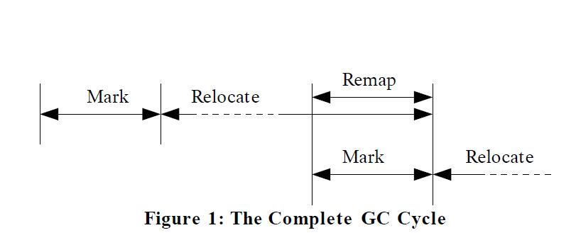

> Figure 1: The Complete GC Cycle

> 图片1: 完整的GC周期

Since both the Remap and Mark phases need to touch all live objects, we fold them together. The Remap phase for the current GC cycle is run concurrently with the Mark phase for the next GC cycle, as shown in Figure 1.

由于Remap和标记阶段都需要接触所有存活的对象，因此将它们放在一起。当前GC周期的Remap阶段, 与下一个GC周期的标记阶段并发运行，如图1所示。

The Remap phase is also running concurrently with the 2nd half of the Relocate phase. The Relocate phase is creating new stale pointers that can only be fixed by a complete run of the Remap phase, so stale pointers created during the 2nd half of this Relocate phase are only cleaned out at the end of the next Remap phase. The next few sections will discuss each phase in more depth.

Remap阶段也和重定位阶段的后半部分并发运行。重定位阶段会创建新的过时指针，只会在完整运行的Remap阶段来修复，因此在重定位阶段的下半部分创建的过时指针仅在下一个Remap阶段结束时清除。接下来的几节将深入地讨论每个阶段。

## 5. MARK PHASE

## 5. Mark 阶段详解

The Mark phase begins by initializing any internal data structures (e.g., marking worklists) and clearing this phase's mark-bits. Each object has two mark-bits, one indicating whether the ref is reachable (hence live) in this GC cycle, and one for it's state in the prior cycle. <sup>1</sup>

首先, Mark 阶段初始化所有的内部数据结构（例如，标记工作列表），并清除此阶段的标记位。 每个对象都有两个标记位， 一个标志位指示在此GC循环中该对象是否可达（可达即存活），一个标志位用于上次GC循环中的状态。<sup>{注1}</sup>

> <sup>1</sup> We use bitmaps for the marks, they're cheap to clear and scan.

> <sup>{注1}</sup> 使用bitmap来进行标记，便于清除和扫描。

The Mark phase then marks all global refs, scans each threads' root-set, and flips the per-thread expected NMT value. The root-set generally includes all refs in CPU registers and on the threads' stacks. Running threads cooperate by marking their own root-set. Blocked (or stalled) threads get marked in parallel by Mark-phase threads. This is a Checkpoint; each thread can immediately proceed after it's root set has been marked (and expected- NMT flipped) but the Mark phase cannot proceed until all threads have crossed the Checkpoint.

然后, 标记阶段标记所有的全局引用，扫描每个线程的 root-set(GCroot-set合)，并翻转各个线程预期的NMT值。 root-set 通常包括: CPU寄存器和线程栈中的所有引用。运行中的线程通过标记自身的root-set合来参与协作；阻塞（或停滞）状态的线程由Mark-phase线程并行地标记。这是一个检查点; 每个业务线程在标记了root-set（以及预期NMT翻转）之后就可以立即继续，但是标记阶段的GC线程必须等所有业务线程达到检查点后，才能继续运行。

After the root-sets are all marked we proceed with a parallel and concurrent marking phase [17]. Live refs are pulled from the worklists, their target objects marked live and their internal refs are recursively worked on. Note that the markers ignore the NMT bit, it is only used by the mutators. When an object is marked live, its size is added to the amount of live data in it's 1M page (only large objects are allowed to span a page boundary and they are handled separately, so the live data calculation is exact). This phase continues until the worklists run dry and all live objects have been marked.

在root-set全部被标记后，继续进行并行的并发标记阶段(见[17])。从工作列表中提取存活的引用，将其引用的目标对象标记为存活状态，递归处理对象内部的引用。 请注意，标记线程会忽略NMT位， 仅由mutator线程使用。 当某个对象被标记为存活时， 它的大小将会加到所在1M页面的存活数据量上（只允许大对象跨越页面边界存在，并且单独处理，因此存活数据计算是精确的）。此阶段一直持续，直到工作清单处理完，所有存活对象都标记完成为止。

New objects created by concurrent mutators are allocated in pages which will not be relocated in this GC cycle, hence the state of their live bits is not consulted by the Relocate phase. All refs being stored into new objects (or any object for that matter) have either already been marked or are queued in the Mark phase's worklists. Hence the initial state of the live bit for new objects doesn't matter for the Mark phase.

并发的业务线程创建的新对象只能在其他页面中分配，这些页面不会在此GC周期中被重定位，因此 重定位阶段不会涉及到这些新对象的存活状态标志位。新对象（或任何对象）中的所有引用，要么已经被标记，要么还在标记阶段的工作列表中等着处理。因此，对于标记阶段来说，新对象的存活标志位的初始值是无关紧要的。

### 5.1 The NMT Bit

### 5.1 NMT标志位

One of the difficulties in making an incremental update marker is that mutators can “hide” live objects from the marking threads. A mutator can read an unmarked ref into a register, then clear it from memory. The object remains live (because its ref is in a register) but not visible to the marking threads (because they are past the mutator stack-scan step). The unmarked ref can also be stored down into an already marked region of the heap. This problem is typically solved by requiring another STW pause at the end of marking. During this second STW the marking threads revisit the root-set and modified portions of the heap and must mark any new refs discovered. Some GC algorithms have used a SATB invariant to avoid the extra STW pause. The cost of SATB is a somewhat more expensive writebarrier; the barrier needs to read and test the overwritten value.

增量更新标记的一个难点是，标记线程可能看不见业务线程藏起来的存活对象。 mutator可以将未标记的引用读进寄存器，然后在内存中清除这个引用。该对象依然是存活状态（因为它还有引用在寄存器中）,但标记线程就是看不见（因为在mutator栈扫描过程中被跳过了）。 未标记的引用也可能被存放到已标记区域中。通常是在标记结束时，请求另一次STW暂停来解决该问题。 在第二次STW期间， 标记线程重新访问GCroot-set合、以及堆内存中发生修改的部分，并且必须标记所有新发现的引用。一些GC算法使用SATB不变量来避免额外的STW暂停。 SATB的开销是一个更昂贵的写屏障; 这个写屏障需要读取并检测被覆盖的值。

Instead of a STW pause or write-barrier we use a read barrier and require the mutators do a little GC work when they load a potentially unmarked ref by taking an NMT-trap. We get the trapping behavior by relying on the read-barrier and the Not- Marked-Through bit: a bit we steal from each ref. Refs are 64- bit entities in our system representing a vast address space. The hardware implements a smaller virtual address space; the unused bits are ignored for addressing purposes. The read-barrier logic maintains the notion of a desired value for the NMT bit and will trap if it is set wrong. Correctly set NMT bits cost no more than the read-barrier cost itself. The invariant is that refs with a correct NMT have definitely been communicated to the Marking threads (even if they haven't yet been marked through). Refs with incorrect NMT bits may have been marked through, but the mutator has no way to tell. It informs the marking threads in any case.

我们既不使用STW暂停，也不使用写屏障，而是使用读屏障，并且在加载可能未标记的引用时，要求业务线程执行一点儿GC相关的工作，通过采用NMT陷阱的方式。依靠read-barrier和Not-Marked-Through位(从每个指针地址中截取的一个bit)来触发陷阱的行为。 在我们的系统中指针引用是64位的，可以表示的地址空间多到用不完；硬件只使用了其中很少的一部分虚拟地址空间; 在寻址时会忽略未使用的bit。读屏障的逻辑是维护NMT位的期望值这个概念，如果设置错误则会触发陷阱。正确设置NMT位的开销不会超过读屏障本身。不变量引用具有正确的NMT标志位、肯定已传给标记线程（即使它们尚未被标记）。 NMT位错误的引用可能被标记过，但是mutator线程不知道。所以在任何情况下都会通知标记线程。

If a mutator thread loads and read-barriers a ref with the NMT bit set wrong, it has found a potentially unvisited ref. The mutator jumps to the NMT-trap handler. In the NMT-trap handler the loaded value has it's NMT bit set correctly. The ref is recorded with the Mark phase logic. <sup>2</sup>  Then the corrected ref is stored back into memory. Since the ref is changed in memory, that particular ref will not cause a trap in the future. 

如果一个mutator线程加载一个NMT位错误的引用，有读屏障存在的话，就会找到一个不可访问的引用。 mutator跳转到NMT陷阱处理程序。在NMT陷阱处理程序中，加载的值正确设置了NMT位。引用是在标记阶段逻辑中记录的。 <sup>{注2}</sup> 然后将更正的引用存回内存。由于在内存中引用发生了变更， 因此之后这个引用就不会再触发陷阱。

> <sup>2</sup> Actually, they are batched for efficiency.

> <sup>{注2}</sup> 实际上，为了提高效率,这些操作是批量处理的。

This “self-healing” idea is key: without it a phase-change would cause all the mutators to take continuous NMT traps until the Marker threads can get around to flipping the NMT bits in the mutators' working sets. Instead, each mutator flips its own working set as it runs. After a short period of high-intensity trapping (a “trap storm”) the working set is converted and the mutator proceeds at its normal pace. During the steady-state portion of the Mark phase, mutators take only rare traps as their working set slowly migrates.

关键点在于这种“自我修复”的构想： 如果没有自修复，在各个阶段中发生的改变，会导致所有业务线程连续触发NMT陷阱，直到标记线程翻转业务线程工作集中的NMT位为止。而使用自修复之后，每个mutator在运行时都会翻转自己的工作集。经历短时间的高强度捕捉（“陷阱风暴”）之后，工作集被转换、业务线程则以正常速度执行。在标记阶段的稳态期间，mutators只碰到极少量的陷阱，因为它们的工作集迁移缓慢。

Changing the ref in memory amounts to a store, even if the stored value is Java-language-equivalent to the original value. The store is transparent to the Java semantics of the running thread, but the store is visible to other threads: without some care it might stomp over another thread's store effectively reversing it. Instead of unconditionally storing, the trap handler uses a compare-and-swap (CAS) instruction to only update the memory if it hasn't changed since the trap. If the CAS fails the handler returns the value currently in memory (not the value originally loaded) and the read barrier is repeated.

更改内存中的引用相当于保存(store)操作，即使要保存的值在Java语言层面等于原始值。 在Java语义层面, 这个store操作对正在运行的线程来说是透明的，但对其他线程是可见的： 不需要关心另一个线程会不会去反转它。 陷阱处理程序使用的是CAS指令，而不是无条件直接写入，只在没有被陷阱处理程序更改的情况下才去更新内存。如果CAS失败，则处理程序返回内存中的当前值（这已经不是最初加载的那个值了），并重复读屏障。


### 5.2 The NMT Bit and The Initial Stack-Scan

### 5.2 NMT标志位与初始栈扫描(Initial Stack-Scan)

Refs in mutators' root-set have already passed any chance for running a read-barrier. Hence the initial root-set stack-scan also flips the NMT bits in the root-set. Since the flipping is done with a Checkpoint instead of a STW pause, for a brief time different threads will have different settings for the NMT desired value. It is possible for two threads to throb, to constantly compete over a single ref's desired value NMT value via trapping and updating in memory. This situation can only last a short period of time, until the unflipped thread passes the next GC safepoint where it will trap, flip its stack, and cross the Checkpoint.

业务线程 root-set 中的引用已经放过任何执行读屏障的机会。 因此，初始 root-set 栈扫描也会翻转其中引用的NMT位。由于翻转是通过检查点而不是STW暂停完成的，因此在短时间内，不同的线程对NMT期望值并不相同。 两个线程可能会不断地通过陷阱来更新单个引用的NMT值。 这种情况只会持续很短的时间，只要未翻转的线程也通过下一个GC安全点，就会触发陷阱，翻转其栈内的引用，并越过检查点。

Note that it is not possible for a single thread to hold the same ref twice in its root-set with different NMT settings. Hence we do not suffer from the pointer-equality problem; if two refs compare as bitwise not-equal, then they are truly unequal.

请注意，单个线程 root-set 中不可能存在两个引用的地址相等，NMT值却不同的情况。 因此，我们不会遇到指针相等问题(pointer-equality problem); 如果两个引用按位比较不相等，那么它们就不是等同的。

### 5.3 Finishing Marking

### 5.3 Finishing Marking(完成标记)

When the marking threads run out of work, Marking is nearly done. The marking threads need to close the narrow race where a mutator may have loaded an unmarked ref (hence has the wrong NMT bit) but not yet executed the read-barrier. Read-barriers never span a GC safepoint, so it suffices to require the mutators cross a GC safepoint without trapping. The Marking pass requests a Checkpoint, but requires no other mutator work. Any refs discovered before the Checkpoint ends will be concurrently marked as normal. When all mutators complete the Checkpoint with none of them reporting any new refs, the Mark phase is complete. If new refs are reported the Marker threads will exhaust them and the Checkpoint will repeat. Since no refs can be created with the “wrong” NMT-bit value the process will eventually complete.

当标记线程停止工作时，标记阶段即将完成。 标记线程需要快速处理一些事情，比如业务线程可能加载了未标记的引用（因此NMT位是错误的）但尚未执行读屏障。 读障碍永远不会跨越GC安全点，因此只需要业务线程通过GC安全点而不需陷进陷阱就够了。 标记传递需要一个检查点，但不需要其他业务线程参与处理。 在Checkpoint结束之前发现的任何引用都被并发标记为正常。 当所有mutators都完成Checkpoint，却没有报告任何新的引用，那么标记阶段就完成了。 如果报告了新的引用，那么Marker线程将其处理掉并且重复执行Checkpoint。 因为创建的引用不再有“错误的”NMT位值，所以标记过程最终就完成了。


## 6. RELOCATE AND REMAP PHASES

## 6. 重定位阶段 与 Remap 阶段详解

The Relocate phase is where objects get relocated and compacted, and unused pages get freed. Recall that the Mark phase computed the amount of live data per 1M page. A page with zero live data can obviously be reclaimed. A page with only a little live data can be made wholly unused by relocating the live objects out to other pages.

重定位阶段进行对象重定位和内存整理，并释放不使用的页面。 回想一下，标记阶段计算每个1M页面中的存活数据量。很明显存活数据为0的页面是可以被回收的。 仅有少量存活数据的页面，可以通过将存活对象重定位到其他页面，使得此页面整个不再被使用。

As hinted at in Figure 1, a Relocate phase is constantly running, continuously freeing memory at a pace to stay ahead of the mutators. Relocation uses the current GC-cycle's mark bits. A cycle's Relocate phase will overlap with the next cycle's mark phase. When the next cycle's Mark phase starts it uses a new set of marking bits, leaving the current cycle's mark bits untouched. The Relocate phase starts by finding unused or mostly unused pages. In theory full or mostly full pages can be relocated as well but there's little to be gained. Figure 2 shows a series of 1M heap pages; live object space is shown textured. There is a ref coming from a fully live page into a nearly empty page. We want to relocate the few remaining objects in the “Mostly Dead” page and compact them into a “New, Free” page, then reclaim the “Mostly Dead” page.

从图1中可以看到，重定位阶段不断运行，不断释放内存，以保持领先于业务线程。重定位时会使用当前GC周期的标记位。
每次GC循环的重定位阶段和下一周期的标记阶段有部分重叠。当下一周期的标记阶段开始时，会使用一组新的标记位，保持前一周期的标记位不变。
重定位阶段首先排查未使用或者大部分空间未使用的页面。理论上，用满或者基本用满的页面也能进行重定位，但没多少意义。
图2显示了一些1M堆内存页面; 存活对象占用的部分使用条纹表示。在图2中，全是存活对象的页面中有个引用，指向了一个几乎是空的页面。我们想要将“Mostly Dead”页面中的少量存活对象重定位，将它们整理到“New，Free”页面，然后回收“Mostly Dead”页面。

Next the Relocate phase builds side arrays to hold forwarding pointers. The forwarding pointers cannot be kept in the old copy of the objects because we will reclaim the physical storage immediately after copying and long before all refs are remapped.

接下来，重定位阶段构建 side arrays 来保存转发指针。转发指针不能保存在对象的旧副本中，因为在复制后会立即回收物理内存，而且在所有引用重新映射之前还有很长一段时间。

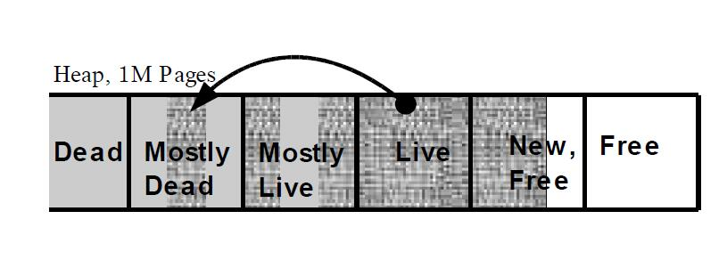

> Figure 2: Finding sparsely populated pages

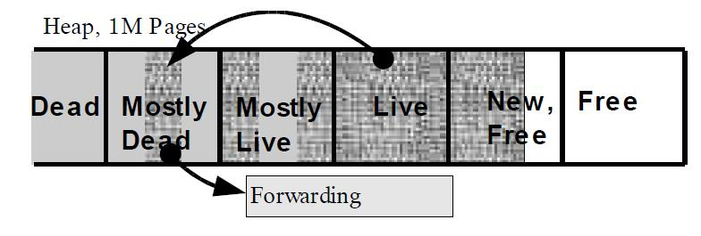 

> Figure 3: Side Arrays and TLB Protection

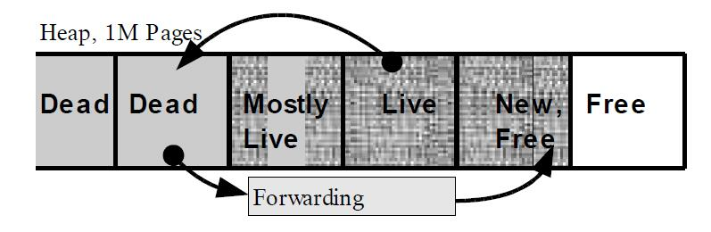 

> Figure 4: Copying live data out

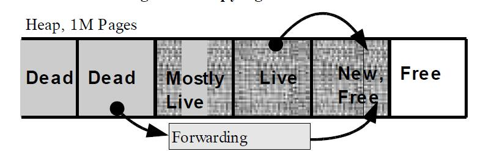

> Figure 5: Updating stale refs


The side array data isn't large because we relocate sparse pages. We implement it as a straightforward hash table. Figure 3 shows the side array.

side array 的数据量并不大，因为重定位的是稀疏页面。我们使用一个简单的哈希表来实现这种映射。side array 如图3所示。


The Relocate phase then GC-protects the “Mostly Dead” page, shown in gray, from the mutators. Objects in this page are now considered stale; no more modifications of these objects are allowed. If a mutator loads a ref into the protected page, it's readbarrier will now take a GC-trap.

然后 重定位阶段 保护 “Mostly Dead”页面，阻止业务线程修改,图中以灰色显示。 现在将此页面中的对象当做是陈旧的; 不允许对这些对象进行修改。 如果mutator将引用加载到受保护的页面，则对应的读屏障就会陷入到GC陷阱中。


Next the live objects are copied out and the forwarding table is modified to reflect the objects' new locations as shown in Figure 4. Copying is done concurrently with the mutators; the readbarrier keeps the mutators from seeing a stale object before it has finished moving. Live objects are found using the most recent mark-bits available and sweeping the page.

接下来，把存活对象拷贝出去, 并修改转发表，以反映对象的新位置，如图4所示。 拷贝操作和业务线程并发进行; 移动完成之前，读屏障使得业务线程不会看到陈旧的对象。使用最新的标记位和扫描页面可以找到存活对象。

Once copying has completed, the **physical** memory behind the page is freed. Virtual memory cannot be reclaimed until there are no more stale refs pointing into the freed page. Stale refs are left in the heap to be lazily discovered by running mutators using the read-barrier, and will be completely updated in the next Remap phase. Freed physical memory is immediately recycled by the OS and may be handed out to this or another process. After freeing memory, the GC threads are idled until the next need to relocate and free memory, or until the next Mark and Remap phase begins.

复制完成后，底层的 **物理内存** 将被释放。 直到没有过时引用指向已释放的页面，虚拟内存地址才会被回收。 堆内存中的过时引用，使用懒发现策略，依靠的是业务线程的读屏障，且在下一次Remap阶段会完全更新。 释放的物理内存可以立即被操作系统回收，并分配给某个进程。释放内存后，GC线程将处于空闲状态，直到下一次需要重定位和释放内存，或者直到下一次 Mark 和 Remap 阶段开始。

### 6.1 Read-Barrier Trap Handling

### 6.1 读屏障陷阱处理

If a mutator's read-barrier GC-traps, then the mutator has loaded a stale ref. The GC-trap handler looks up the forwarding pointer from the side arrays and places the correct value both in the register and in memory, as shown in Figure 5. Similarly to the NMT trap handler's “self-healing” behavior, updating the ref in memory is crucial to performance: it keeps the same stale ref from trapping again. As before, the memory update is done with a CAS to avoid stomping a racing store from another thread.

如果某个线程的读屏障进入GC陷阱，那么就是因为这个线程加载到了一个过时引用。 GC-trap处理器从side arrays中查找转发指针，并将正确的值放到寄存器和内存中，如图5所示。与NMT陷阱处理程序的“自我修复”行为类似，更新内存中的引用对性能至关重要：它会阻止相同的过时引用再次陷入陷阱。和前面一样，使用CAS来完成内存更新，以避免另一个线程来争抢store操作。

It is also possible that the needed object has not yet been copied. In this case the mutator will do the copy on behalf of the GC thread �C since the mutator is otherwise blocked from forward progress. The mutator can read the GC-protected page because the trap handler runs in the elevated GC-protection mode. If the mutator must copy a large object, it may be stalled for a long time. This normally isn't an issue: pages with a lot of live data are not relocated and a `1/2`-page sized object (512K) can be copied in about 1ms.

还有可能所需的对象尚未复制完成。在这种情况下，业务线程将代表GC线程执行复制 - 反正业务线程已经被阻塞了是吧。 mutator这时候可以读取受GC保护的页面，因为陷阱处理程序被提升到GC保护模式下运行。如果mutator必须复制一个大对象，可能会长时间停滞。这通常不是什么大问题：具有大量存活数据的页面不会重定位，并且复制 `1/2` 页面大小的对象（512K）只需要不到1ms的时间。

### 6.2 Other Relocate Phase Actions

### 6.2 重定位阶段的其他操作

At the time we protected pages, running mutators might have stale refs in their root-set. These are already past their read-barrier and thus won't get directly caught. The mutators scrub any existing stale refs from their root-set with a Checkpoint. Relocation can start when the Checkpoint completes.

在保护页面时，运行中的mutators在其root-set中可能有过时的引用。 因为root-set中的引用直接跳过了读屏障，所以不会被直接获取到。 mutators使用一个Checkpoint来将root-set中的陈旧引用擦除。检查点完成后，可以继续重定位。

The cost to modify the TLB protections (a kernel call and a system- wide TLB shoot-down) and scrubbing the mutators' stacks is the same for one page as it is for many. We batch up these operations to lower costs, and typically protect (and relocate and free) a few gigabytes at a time.

修改TLB保护的成本（系统内核调用 + 系统范围的TLB击落）和擦除mutator栈是相同的，一个或多个页面的消耗也相同。因为这些操作是批量处理以降低成本，每次也就保护（+重定位+释放）几个GB的内存。

Notice that there is no “rush” to finish the Relocation phase; we need only relocate and free pages at a pace to keep ahead of the mutators. Also notice it is unlikely that a mutator stalls on an unmoved stale object. Relocated pages contain only a few older objects, most likely they have moved out of the mutator's working set. Virtual memory is not freed immediately, but we have lots of that. The final step of scrubbing all stale refs and reclaiming virtual memory is the job of the Remap phase.

请注意，GC并不需要“急于”完成重定位阶段; 只需要重定位和释放的速度超过mutators分配的速度就行了。还要注意，mutator不太可能在未移动的过时对象上停顿。被重定位的页面只包含极少的过时对象，大概率它们已经移出了mutator的工作集。虚拟内存不会立即释放，但64位系统的虚拟地址空间多到用不完。擦除所有陈旧引用并回收虚拟内存空间是Remap这个最终阶段的任务。

### 6.3 The Remap Phase

### 6.3 Remap阶段详解

The Remap phase updates all stale refs with their proper forwarded pointers. It must visit every ref in the heap to find all the stale ones. As mentioned before it runs in lockstep with the next GC cycle's Mark phase; the one piece of visitor logic does both the stale ref check and NMT check.

Remap阶段更新所有过时的引用，使用正确的转发指针。 必须遍历堆内存，才能找到所有过时的引用。 如前所述，它与后续GC循环的标记阶段同步运行; 遍历器的一个逻辑是执行过时引用的检查以及NMT检查。

At the end of the Remap phase, all pages that were protected before the start of the Remap phase have now been completely scrubbed. No more stale refs to those pages remain so those virtual memory pages can now be reclaimed. We also free the side arrays at this time, and a GC cycle is complete.

在Remap阶段结束时，在Remap阶段开始前受到GC保护的页面都被清除了。 不再有过时的引用指向这些页面，所以可以回收这些虚拟内存页面。 此时也会释放了side arrays，至此、一次GC循环完成。

## 7. REALITY CHECK

## 7. 当前的实现

Our implementation is a rapidly moving work-in-progress. As of this writing it suffers from a few STW pauses not required by the Pauseless GC algorithm. Over time we hope to remove these STWs or engineer their maximum time below an OS time-slice quanta. We have proposed solutions for each one, and report pauses experienced by the current implementation on the 8- warehouse 20-minute pseudo-JBB run described in Section 8.

我们的具体实现属于边做边改。 在撰写本文时，还需要一些STW暂停来支持、当然 Pauseless GC 算法本身是没有STW的。 随着时间的推移，我们希望能去除所有的STW，或者让最大暂停时间小于操作系统的最小时间片。 我们为每种方式都提供了解决方案，在第8节中，通过20分钟的8仓伪JBB运行，来测试当前实现，并统计所遇到的暂停情况。

### 7.1 At the Mark Phase Start

### 7.1 标记阶段的开头

At the start of the Mark phase we stop all threads to flip the desired NMT state. We could flip the NMT bits via a Checkpoint; the cost would be some amount of NMT-bit throbbing (repeated NMT traps) on shared objects until all threads flip. Also, global shared resources (e.g., the SystemDictionary, JNI handles, locked objects) are marked in this STW. Engineering these to use a Checkpoint is straightforward.

在标记阶段的开始，会停止所有线程以翻转NMT状态位。可以通过检查点来翻转NMT位; 代价是在共享对象上会有一定量的NMT位跳动(重复进入NMT陷阱)，直到所有线程都翻转为止。此外，全局共享资源(例如，SystemDictionary、JNI句柄、锁对象)走在这次STW中标记。使用检查点在工程中是直接又简单的。

The worse pause reported was 21ms and the average was 16ms.

在测试中，最坏情况下消耗的时间是 21ms，平均时间为 16ms。

### 7.2 At the Mark Phase End

### 7.2 标记阶段的结束

At the end of the Mark phase we stop all threads and do (in parallel but not concurrent) soft ref processing, weak ref processing, and finalization. Java's soft and weak refs present a race between the collector nullifying a ref and the mutator “strengthening” the ref. We could process the refs concurrently by having the collector CAS down a null only when the ref remains notmarked- through. The NMT-trap handler already has the proper CAS'ing behavior �C both the collector and the mutator race to CAS down a new value. If the mutator wins the ref is strengthened (and the collector knows it), and if the collector wins the ref is nullified (and the mutator only sees the null).

在标记阶段结束时，会停止所有线程，(并行但不并发)执行软引用处理(soft ref)、弱引用处理（weak ref）和终结(finalization)。Java中的软引用和弱引用，在GC释放引用、与业务线程将其变回强引用之间存在竞争。 我们可以并发地处理引用，通过让收集器只在引用未标记时通过CAS将其设置为null值。对应的 NMT-trap 处理程序已经具有正确的CAS行为 ―― 收集器和mutator都争着让CAS变为一个新值。如果mutator成功，ref就会增强(收集器能感知到)，如果收集器成功，引用就会置空(而mutator会看到null)。

There are a number of other items handled at this STW that could be engineered to be concurrent, including class unloading and code-cache unloading. Again engineering these will be straightforward but tedious.

在STW中的很多处理项是可以设计为并发的，比如类卸载和代码缓存卸载。同样，设计这些程序虽然简单但也消耗时间。

The worse pause reported was 16ms and the average was 7ms.

在测试中，最坏情况下消耗的时间是 16ms，平均时间为 7ms。

### 7.3 At the Relocation Phase Start

### 7.3 重定位阶段开始时

The mutators' root-sets need scrubbing when GC-protecting a page. There are two problems here: the TLB shoot-down isn't atomic and there are stale refs in the root-set. Since the TLB shoot-down is not atomic, for a brief period some mutators can be protected and not others. Unprotected mutators would continue to read and write the object directly, so protected mutators need to as well. However, reading and writing the protected object forces a GC-protection trap. Our current implementation stops all threads and performs a bulk TLB shoot-down and mutator root-set scrubbing under STW. This can be engineered to be concurrent and incremental in a straightforward manner.

当GC保护某个页面时，业务线程的root-sets需要清理。 存在两个问题: TLB卸载不是原子操作，在root-sets中还有陈旧的引用。由于TLB卸载不是原子性的，在极短的时间内，可能有一部分业务线程受到保护，而另一部分不受保护。不受保护的业务线程将继续直接读写对象，因此受保护的业务线程也需要这样做。然而，读取和写入受保护对象会强制进入GC保护陷阱。我们当前的实现是停止所有线程，并在STW下执行批量TLB删除和线程的root-set清理。也可以直接将其设计为并发的，支持增量的方式。

We could use a Checkpoint to update the TLBs and scrub the root-sets. To maintain concurrency until all threads have passed the relocation Checkpoint, the read barrier's TLB trap handler is modified to wait for the Checkpoint to complete before proceeding with relocation or remapping and propagating a corrected ref in the mutator. Mutator threads that actually access refs in protected pages will then “bunch up” at the Checkpoint with other threads continuing concurrent execution past the Checkpoint. This effect is mitigated by the fact that we preferentially relocate sparse pages.

我们可以使用Checkpoint来更新TLB并擦除root-sets。 为了保持并发, 在所有线程都通过重定位检查点之前，读屏障的TLB陷阱处理程序需要等待检查点完成，然后继续重定位或重映射，并在mutator中传播更正后的引用。 实际访问受保护页面中的引用的Mutator线程将在检查点“聚集”，其他线程则通过检查点继续并发执行。 我们优先重定位稀疏页面，也就减轻了这种影响。

The worse pause reported was 19ms and the average was 5ms.

在测试中，最坏情况下消耗的时间是 19ms，平均时间为 5ms。

### 7.4 Relocate doesn't run during Mark/Remap

### 7.4 在 Mark/Remap 期间还不能执行重定位

Right now we have not implemented a second set of mark bits to allow the Relocate phase to run concurrently with the next Mark/Remap phase [14]. This means we cannot free memory during the Mark/Remap phase. We have heuristics which predict how many pages the mutator will need during marking and we free that many (plus some pad) before marking begins. If we predict low, as can happen if the mutators suddenly “accelerate”, the mutators will block until marking is complete. Engineering the overlapped Relocate/Mark phases will be straightforward. Additionally, we currently do not add threads dynamically in response to mutator acceleration. Each phase completes with a number of threads decided on at the phase start.

截止论文发表时，还未使用第二组标记位来实现，以允许重定位阶段与下一次GC周期的Mark/Remap阶段(见[14])并发执行。 也就是说在具体实现中暂时还不能在Mark/Remap阶段释放内存。 我们使用启发式算法，来预测业务线程在标记期间需要多少页面，并在标记开始前释放足够的页面（加上一些填充）。 如果预测低了，碰到业务线程突然“加速”，则业务线程会阻塞、直到标记完成。 将 重定位/Mark 阶段设计为并发执行非常简单。 此外，目前也不能在业务突然增加时动态添加GC线程。 每个阶段的线程数在该阶段开始时就确定了。

## 8. EXPERIMENTS

## 8. 实验验证

### 8.1 Methodology

### 8.1 方法论

The Pauseless algorithm is intended to lower pause times in large transaction-oriented programs running business logic. There are a limited number of representative Java benchmarks for this class of program. The most realistic and widely accepted is SpecJApp-Server '02 and '04. This benchmark is extremely difficult to setup, tune, or get reliable numbers out of. It is also very hard to normalize across different hardware. The much more simplistic SpecJBB benchmark has very well-structured (and unrealistic!) object lifetimes and is ideally suited for a generational collector.

Pauseless算法旨在降低面向事务的大型业务系统的暂停时间。这一类系统可以使用的Java基准工具很少。最真实和使用最广泛的是 SpecJApp-Server '02 和 '04。 但这个基准测试非常难以设置，调整或获得可靠的数字。 跨平台也非常困难。还有个更简单的 SpecJBB 基准测试，具有结构良好的对象生命周期（但并不符合实际应用场景），非常适合分代垃圾收集器。

In an effort to have both a reliable, understandable benchmark and one that is more representative of transactional programs, we added a large object cache to the standard SpecJBB benchmark. This cache represents, e.g., a Java bean cache, or an HTML request cache. For each transaction, 400 bytes were added to the cache and the oldest cached object was freed. This level of extra objects is enough to easily defeat targeted tuning of generational collectors to JBB.

为了获得可靠，可理解的基准测试，还要能代表实际的业务处理程序， 我们在标准的SpecJBB基准测试中添加了一个大对象缓存。该缓存可以表示，Java bean 缓存、或者HTML请求缓存。对于每个事务，将400字节添加到缓存中，并释放最老的缓存对象。 这种额外的对象足以轻易地阻止针对JBB的分代垃圾收集器的有针对性的调整。

We also removed the forced System.gc() between runs and increased the JBB run times from 2 minutes to 20 minutes. <sup>3</sup>
In the standard benchmark it's common to never need a full collection during the timed portion of the run. In practice, these large business applications must run in a steady-state mode without an untimed window every 2 minutes for a System.gc().

我们还移除了各个run之间的 `System.gc()`，并将JBB的运行时间从2分钟增加到20分钟。<sup>3</sup>
在标准基准测试中，通常在运行的特定期间并不需要完整的垃圾收集。但在生产环境中，这些大型业务系统必须平稳运行，不可能每隔2分钟就有一次GC窗口。

> <sup>3</sup> Except for IBM's concurrent collector which was unable to run the full 20 minutes; we used a 10 minute run for it.

> <sup>3</sup> 但IBM的并发收集器除外，它无法运行整整的20分钟; 我们只能将其运行时间缩短为10分钟。


All runs were done with 8 warehouses, i.e. 8 concurrent threads doing benchmark work. We added “-Xmx1536m”, allowing a maximum heap size of 1.5G, which is about twice the average size of the live data. We added “-server” to the SUN JVMs. For the concurrent GC timing runs, we added whatever flag was appropriate to trigger using the concurrent collector for that JVM. For the IBM JVM, it was “-Xgcpolicy:optavgpause”. For the BEA JVM, it was “-Xgcprio:pausetime”. For the SUN JVM, it was “-XX:+UseConcMarkSweepGC -XX:+UseParNewGC”. For the Azul JVM, concurrent collection is the default and no flags are needed. For the non-concurrent GC timing runs we used the best parallel (throughput-oriented) collector available. This is the default for the IBM and BEA JVMs, for the SUN JVM we added “-XX:+UseParallelGC”. We used no other flags.

所有的run都由8个仓库完成，即8个并发线程进行基准测试。我们添加了 “-Xmx1536m”，设置最大堆内存为1.5G，大约是平均存活数据量的两倍。我们在SUN JVM中添加了“-server”参数。对于并发GC的run，我们添加了适合该JVM的并发收集器触发标志。对于IBM JVM来说是“-Xgcpolicy:optavgpause”。对于BEA JVM，是“-Xgcprio:pausetime”。对于SUN JVM，是“-XX:+UseConcMarkSweepGC -XX:+UseParNewGC”。对于Azul JVM，并发收集是默认设置，不需要指定。对于非并发GC的run，我们使用（面向吞吐量的）最好的并行收集器。这是IBM和BEA JVM的默认设置，对于SUN JVM我们添加了“-XX:+UseParallelGC”。其他参数我们并没有指定。

We ran the IBM and SUN JVMs on a 2-way 3.2Ghz hyperthreaded Xeon with 2G of physical memory, running a Red Hat Linux 2.6 kernel. Unfortunately, the BEA JVM didn't run on this version of Linux so it was run on a 1-way 2.4Ghz hyperthreaded P4 with 512M of physical memory running Windows 2000. The BEA JVM heap was limited to 425M to avoid paging. The simulated object cache added about 40M of long-lived live data per warehouse; 425M isn't a large enough heap to run with 8 warehouses. We limited the BEA JVM to 3 warehouses, keeping the proportion of heap devoted to long-lived data about the same. We also ran the SUN JVM in 64-bit mode on a 2-way 1.2Ghz US3 with 4G of physical memory running Solaris 9. We attempted to run on an older 24-CPU Sparc (450Mhz US2). Here we hoped the Sparc would use the spare CPUs to good effect. However, the single-threaded concurrent collector could not keep up with the mutators and the benchmark suffered numerous 12-second full-GC pauses. On the 2-CPU Sparc, a single concurrent collector thread could use up to half the total CPU resources in order to keep up. We report the superior 2-CPU Sparc scores, although we would like to have reported scores from another high-CPU count machine. The Azul JVM is a 64- bit JVM running on a 16-chip (384-CPU) Azul appliance with 128G of physical memory. As before, we limited heap size to 1.5G. Only 8 CPUs are used to run the actual benchmark, with a handful more running the Pauseless collection and doing background JIT compiles.

我们在2路3.2Ghz超线程Xeon处理器上运行IBM和SUN的JVM，内存为2GB, 操作系统是Red Hat Linux 2.6内核。杯具的是，BEA JVM 不支持这个版本的Linux，因此它只能运行在单路2.4Ghz超线程P4处理器上，物理内存512M，系统为Windows 2000. BEA JVM的堆内存限制为425M以避免使用交换内存。 为每个仓库模拟的对象缓存大约是40M的长寿存活数据; 425M的堆内存并不足以运行8个仓库。我们将BEA JVM限制为3个仓库，保持用于长期数据的堆的比例大致相同。我们还在2路1.2Ghz US3的机器上运行64位模式的SUN JVM，其中物理内存为4G，系统是Solaris 9. 我们尝试在较旧的24-CPU Sparc（450Mhz US2）平台上运行。在这里，我们希望Sparc能够使用备用CPU来达到良好的效果。但是，单线程并发收集器无法跟上mutator的需求，并且基准测试时碰到了大量的12秒 FullGC 暂停。在2-CPU Sparc上，单个并发GC线程需要消耗总CPU资源的一半才能跟上业务线程的需要。我们报告了优秀的2-CPU Sparc分数，尽管我们希望报告另一台高CPU数量机器的分数。 Azul JVM是一款64位JVM, 运行在16主板（384-CPU）的Azul设备上的，具有128G的物理内存。和以前一样，我们将堆大小限制为1.5G。只有8个CPU用于运行实际基准测试，少数运行Pauseless GC 并进行后台JIT编译。

We decided to NOT report SpecJBB score, which is reported in units of transactions/second, both because our run is not Speccompliant and because of the wide variation in hardware and JIT quality. Even on the same hardware, the JITs from different vendors produce code of substantially different quality. For the same 20 minute run, we saw JVMs execute between 15 million and 30 million transactions. While transaction throughput is an important metric, this paper is focused on removing the biggest reason for transaction time variability. We report transaction times instead.

我们决定不报告SpecJBB得分，他的单位是 TPS（transactions/second），因为我们的运行不是Speccompliant，而且因为硬件和JIT的差异很大。即使在相同的硬件上，来自不同供应商的JIT也会生成质量差异很大的代码。 在相同的20分钟运行中，我们看到JVM执行了1500万到3000万次业务。虽然吞吐量是一个重要的指标，但本文的重点是消除各次请求之间的时间变化。所以报告了业务响应时间。

### 8.2 Transaction Times

### 8.2 业务响应时间

We measured both transaction times and GC pause times reported with “-verbose:gc”. We feel that transaction times represent a more realistic measure than direct GC pauses as they more closely correspond to “user wait time”.

使用 “-verbose:gc” 选项来测量业务响应时间和GC暂停时间。 我们认为业务响应时间比直接的GC暂停更符合实际情况，因为更接近于“用户等待时间”。

Transaction times were gathered into buckets by duration, building a histogram. Duration was measured with Java's current- TimeMillis() and so is limited to millisecond resolution. Most transactions take 0 or 1 milliseconds, so we did not gather accurate times for these fast transactions. However, we are more interested in the slow transactions. All the collectors except Pauseless had a significant fraction of transactions take 100- 300ms (100 times slower than the fast transactions), with spikes to 1-4 seconds. We kept per-millisecond buckets from 0ms to 31ms. After that we grew the buckets by powers-of-2 with halves: 32-47ms, 48-63ms, 64-95ms, 96-127ms, and so on up to 16sec. This allowed us to compute the bucket index with a few shifts. Buckets were replicated per thread to avoid coherency costs then totaled together at the end of the run.

业务响应时间按持续时间收集到桶中，构建直方图。使用Java的 `currentTimeMillis()` 方法测量持续时间，因此精度也就限制为毫秒级。大多数业务只需要0-1毫秒，因此我们没有收集这些快速事务的准确时间。但是，我们对慢响应的业务更感兴趣。除Pauseless之外的所有垃圾收集器都有相当一部分的业务需要耗费100-300ms（比快速的业务要慢100倍以上），峰值为1-4秒。我们将每毫秒的桶保持在0ms-31ms之间。在那之后，我们用2的2次幂增加了桶：32-47ms，48-63ms，64-95ms，96-127ms，依此类推，最长16秒。这允许我们用几个班次来计算桶索引。每个线程复制存储桶以避免一致性开销，然后在运行结束时汇总。

A transaction that reports as taking 0ms clearly takes some finite time. The 0ms bucket's average transaction time is assumed to be 0.33ms, and the 1ms bucket's average transaction time is assumed to be 1.33ms. This is the largest source of measurement error we have. Almost no transactions landed in the 3ms to 30ms buckets, so a measurement error of up to 1ms in those buckets will not alter the data in any substantial way.

报告为0ms的业务显然也是需要一定处理时间的。假设0ms桶的平均事务时间为0.33ms，假设1ms桶的平均事务时间为1.33ms。这是我们测量误差的最大来源。几乎没有任何事务落在3ms-30ms的桶中，因此这些桶中的测量误差即便高达1ms也不会实质性地改变数据。

For all other buckets we simply totaled time for that bucket. We summed the total transaction times (time per bucket by transactions in the bucket), and report the percentage of total transaction time spent on transactions of each duration.

对于其他桶，我们简单地汇总了每个桶的时间总和。（桶中每个事务的总和），并报告了每个时间段的事务所花费的总响应时间的百分比。

Figure 6 shows how many transactions the various JVMs kept in the 0ms and 1ms range (0ms is the low bar, 1ms is the middle bar). The Pauseless algorithm keeps 87% (99.5%) of total transaction time spent in transactions of 1ms (2ms) or less; the other JVMs vary between 80% down to 50%. The concurrent version from each vendor faired slightly worse than the parallel collectors, showing a slightly higher percentage of total time spent in slow transactions.

图6显示了在0ms和1ms范围内各种JVM跑出的事务数量（0ms是下方的条，1ms是中间的条）。 Pauseless算法在1ms（2ms）或更短的时间内完成事务的比例高达87％（99.5％）;其他JVM在80％到50％之间变化。每个厂商的并发版本都比并行版本略差一些，显示在图中就是慢速事务所占的比例略高。

Figure 7 shows cumulative transaction times (not wall-clock time, which was 20 minutes) vs. transaction duration. Times are cumulative, reaching 1.00 (100% of total transaction time) at the top edge. Transaction duration runs across the bottom in a log scale. Lines that approach 1.00 quicker are better, representing a greater percentage of processing time spent in fast transactions.

图7显示了累计的业务处理时间（不是挂钟时间，即20分钟）与交易持续时间的关系。时间是累积的，在最高达到1.00（总业务响应时间的100％）。交易持续时间以对数比例跨越底部。越快接近1.00的越好，表示在快速交易中花费的时间比例更大。

We can see a couple of trends in this chart. Pauseless again does quite well, with essential 100% of time spent in fast transactions and a worst-case transaction time of 26 milliseconds. The other JVMs are roughly grouped into pairs with the parallel throughput collector line being slightly higher than the concurrent collector line for most of the chart. The lines cross as we near 100% of time and the slowest transactions; the concurrent collectors generally have smaller worst-cast times than the throughput collectors.

我们可以在此图表中看到几个趋势。 Pauseless 表现相当不错，其中100％的时间花在快速交易上，最坏情况下的业务响应时间为26毫秒。其他JVM大致成对分组，大多数图表中，并行收集器的吞吐量略高于并发收集器。当接近100％的时间和最慢的交易时，这些线发生交叉; 并发收集器在最坏情况下通常比吞吐量收集器的暂停时间要小一些。

Table 1 shows the worse-case transaction times. The Pauseless algorithm's worse-case transaction time of 26ms is over 45 times better than the next JVM, BEA's parallel collector. Average transaction times are remarkable similar given the wide variation in hardware used.

表1显示了最坏情况下的业务响应时间。 Pauseless算法在最差情况下消耗26ms，比下一款JVM（BEA的并行收集器）好了45倍。考虑到所用硬件并不一样，平均业务响应时间更能代表真实情况。

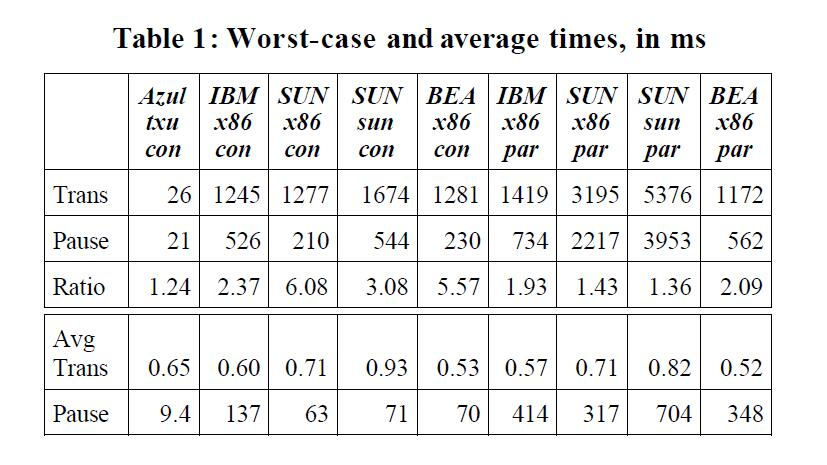

> Table 1: Worst-case and average times, in ms

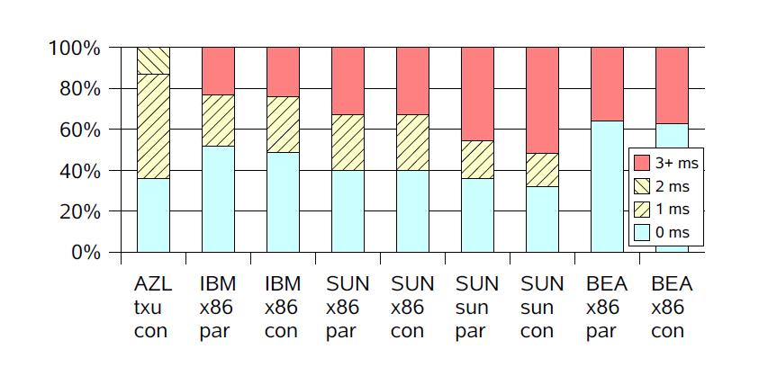

> Figure 6: Short transaction times (0,1,2 ms) as a % of total

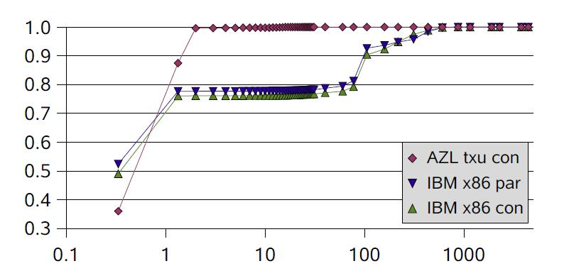

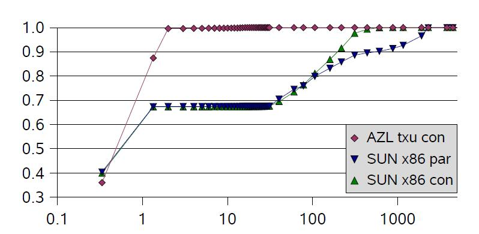

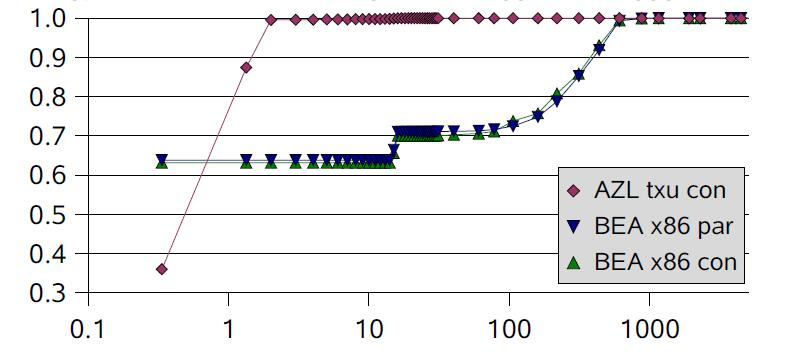

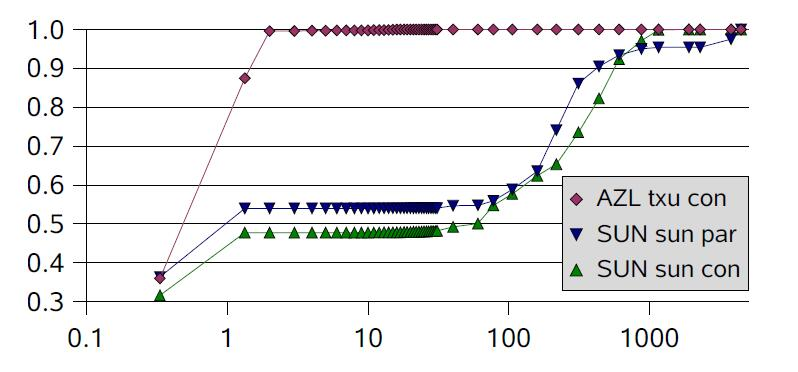

> Figure 7: Cumulative transaction times vs. duration (ms)


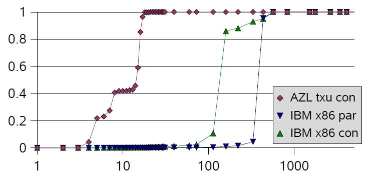

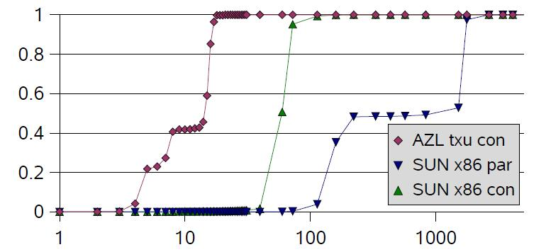

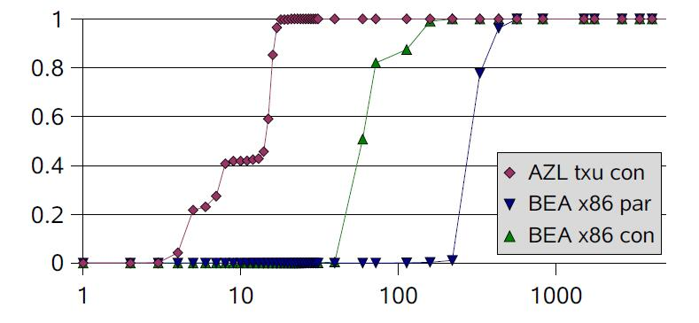

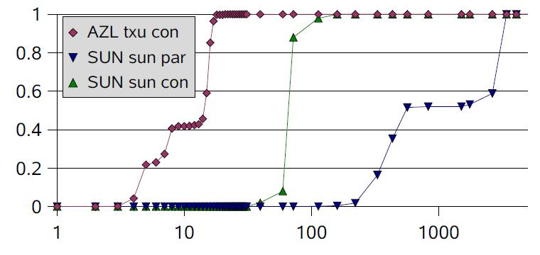

> Figure 8: Reported pause times vs. duration (ms)


### 8.3 Reported Pause Times

### 8.3 暂停时间报告

We collected GC pause times reported with “-verbose:gc”. We summed all reported times and present a histogram of cumulative pause times vs. pause duration. Figure 8 shows the reported pauses. Most of the concurrent collectors consistently report pause times in the 40-50ms range; IBM's concurrent collector has 150ms as it's common (mode) pause time. As expected, the parallel collectors all do worse with the bulk of time spent in pauses ranging from 150ms to several seconds.

我们使用“-verbose：gc”来收集GC暂停时间的报告。 将所有暂停时间相加，汇总为一张 累积暂停时间VS.暂停持续时间的直方图。 图8显示了暂停报告。 大多数并发收集器的暂停时间一直在40-50ms范围内; IBM的并发收集器因为常见（模式）暂停时间而达到150毫秒左右。 正如预期的那样，并行收集器在停顿时间方面表现很糟糕，从大于150ms直到几秒之间都有。

Table 1 also shows the ratio of worst-case transaction time and worst-case reported pause times. Note that JBB transactions are highly regular, doing a fixed amount of work per transaction. Changes in transaction time can be directly attributed to GC.<sup>4</sup> 
Several of the worse-case transactions are a full second longer than the worse-case pauses. We have some guesses as to why this is so:

表1还显示了最坏情况交易时间与最坏情况暂停时间的比率。 请注意，JBB事务是非常正规的，每个事务都执行固定数量的工作。 交易时间的变化可以直接归因于GC。<sup>4</sup>
某些较糟糕的交易比最坏情况的暂停时间长一整秒。 我们有一些猜测，为什么会这样：

> <sup>4</sup> We tested; all transactions are fast until the heap runs out. For the 64-bit JVMs we were able to test with a 64G heap.

> <sup>4</sup> 我们测试了; 在堆耗尽之前，所有事务都很快。 64位JVM支持使用64G的堆内存来进行测试。

It is possible that the concurrent collectors did not keep up with the allocation rate, stalling mutators until they caught up. Unfortunately, this information was not obvious from the “-verbose: gc” output. Also, during some phases of some concurrent GCs, the mutators pay a heavy cost while making forward progress. This amounts to an unreported pause smeared out in time. Sometimes the GC pauses come in rapid succession so that the same transaction will get paused several times. Perhaps the underlying OS timesliced the 8 mutator threads very poorly across the 4 hyper-threaded CPUs.

有可能是并发收集器的速度跟不上分配速度，拖慢了业务线程。不幸的是，这个信息在“-verbose: gc”的输出中并不明显。此外，在某些并发GC的部分阶段中，业务线程在并发执行时会付出沉重的代价。这相当于有一部分未报告的暂停时间被涂抹了。有时会快速连续地触发GC暂停，因此同一个事务可能会被暂停好几次。还有可能是底层只有4个超线程CPU内核，操作系统对8个业务线程分配了非常短的时间片。

In any case, **reported pause times can be highly misleading**. 
The concurrent collectors other than Pauseless under-report their effects by 2x to 6x! The parallel collectors also under- report, but only by 30% to 100%. Based on this data, we encourage the GC research community to test the end-to-end effects of GC algorithms carefully.

无论如何，**暂停时间报告可能会产生很大的误导**。
除了Pauseless之外的其他并发收集器可能会少报告2x到6x倍的影响！并行收集者也会少报告，但只有30％到100％。基于这些数据，我们鼓励GC研究团队仔细测试GC算法的端到端效果。

We also attempted to gather Minimum Mutator Utilization figures [12], especially to track the “trap storm” effects. MMU reports the smallest amount of time available to the mutators in a continuous rolling interval. Since our largest pause was over 20ms there exists a 20ms interval where the mutators make no progress, so MMU@20ms is 0. Preliminary figures are in Table 2, and represent MMU figures for the entire 20 minute run worst case across all threads. Looking at the MMU@50ms figure, we see about 40ms of pause out of 50ms. We know that about 20ms of that is reported as an STW pause, so we assume the remaining 20ms is due to the trap storm.

我们还尝试收集 Minimum Mutator Utilization 数据（见[12]），特别是追踪“陷阱风暴”效应。 MMU报告在连续滚动间隔中业务线程可用的最小时间量。由于我们的最大停顿超过20ms，因此存在20ms的间隔，其中业务线程没有进展，因此 MMU@20ms 值为0. 初步数字在表2中，并且MMU数值代表所有线程在整个20分钟运行中的最坏情况。 再看 MMU@50ms 数值，可以发现在50ms内大约有40ms的暂停。我们知道其中大约 20ms 被报告为STW暂停，所以我们假定剩下的20ms是由陷阱风暴引起的。

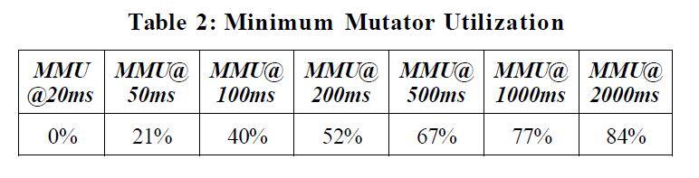

> Table 2: Minimum Mutator Utilization

## 9. Conclusions

## 9. 总结

Azul Systems has taken the rare opportunity to produce custom hardware for running a garbage collected language in a shipping product. This custom hardware enables a very potent garbage collection algorithm. Even though the individual Azul CPUs are slower than the high-clocking X86 P4's compared against, worse-case transaction times are over 45 times better and average transaction times are comparable.

Azul Systems 利用难得的机会, 定制化生产了硬件设备来运行垃圾收集语言, 并用在装运产品中(shipping product)。这种定制的硬件实现了非常高效的垃圾收集算法。尽管单个的 Azul CPU 主频比高频的 X86 P4 低一些，但最坏情况下的业务处理时间却比 P4 快了45倍，而平均业务处理时间两者相差不多。

Azul's Pauseless GC algorithm is a fully parallel and concurrent algorithm engineered for large multi-processor systems. It does not need any Stop-The-World pauses, no places where all mutator threads must be simultaneously stopped. Dead object space can be reclaimed at any point during a GC cycle; there are no phases where the GC algorithm has to “race” to finish some phase before the mutators run out of free space. Also there are no phases where the mutators pay a continuous high cost while running. There are brief “trap storms” at some phase shifts, but due to the “self-healing” property of the algorithm these storms appear to be low cost.

Azul的Pauseless GC算法，是为大型多处理器系统设计的，支持并发，完全并行的GC算法。它不需要任何的Stop-The-World暂停，没有什么地方需要停止所有的 mutator线程。在GC循环期间的任意时刻，都可以回收死亡对象占用的空间; 在业务线程耗尽所有可用空间之前, 也没有哪个阶段是GC算法必须“跑着”去完成的。当然也没有哪个阶段需要业务线程连续付出高昂的成本。在某些阶段变换时会存在短暂的“陷阱风暴”，但由于算法的“自我修复”特性，这些风暴的处理也是低成本的。

Azul's custom hardware includes a read-barrier, an instruction executed against every ref loaded from the heap. The read-barrier allows global GC invariants to be cheaply maintained. It checks for loading of potentially unmarked objects, preventing the spread of unmarked objects into previously marked regions of the heap. This allows the concurrent incremental update Mark phase to terminate cleanly without needing a final STW pause. The read-barrier also checks for loading stale refs to relocated objects and it does it cheaper than a Brooks' style indirection barrier.

Azul 定制的硬件包括一个读屏障，一个针对从堆内存加载引用时执行的指令。读屏障允许轻松维护全局的GC不变量。它检测可能是未标记对象的加载，防止未标记对象扩散到先前标记的区域中。这允许并发增量更新标记阶段干脆地停止，而不需要在最后来一下STW暂停。读屏障还会检查陈旧的指针，到重定位的对象，比起 Brooks 风格的间接屏障代价更低。

Section 7, Reality Check, includes ongoing and future work. Another obvious and desirable feature is a generational variation of Pauseless. As presented, Pauseless is a single-generation algorithm. The entire heap is scanned in each Mark/Remap cycle. Because the algorithm is parallel and concurrent, and we have plentiful CPUs the cost is fairly well hidden. On a fully loaded system the GC threads will steal cycles from mutator threads, so we'd like the GC to be as efficient as possible. A generational version will only need to scan the young generation most of the time. The necessary hardware barriers already exists.

在【第7节 现实状况】中，介绍了正在进行的和需要处理的工作。另一个明显令人憧憬的特征是分代化的Pauseless。根据前文我们知道 Pauseless 是一种不分代的GC算法。每次 Mark/Remap 循环都会扫描整个堆。因为算法是并行和并发的，而且我们拥有充足的CPU资源，所以开销相当不明显。但在满负载的系统上，GC线程会与mutator线程争抢CPU时钟，因此我们希望GC尽可能地高效。如果开发出分代版本，则大部分时间只需要扫描年轻代就行了。而相关的硬件屏障也已经有了。

On a final note, we were quite surprised at the difference between reported pause times and the “user experience” delays seen by the transactions. We strongly encourage GC researchers and the production JVM providers to pay close attention to full GC algorithm costs, not just those costs that can easily have a timerstart/ timer-stop wrapped around them.

最后，我们对报告的暂停时间, 与实际业务的“用户体验”延迟之间的差异感到非常惊讶。强烈呼吁GC研究人员和产品级JVM提供商紧密关注完整的GC算法成本，而不仅仅是用 timerstart/timer-stop 就可以轻松囊括起来的部分。


## 10. REFERENCES

## 10. 参考文献

- [1] Agesen, O. GC Points in a Threaded Environment. SMLI TR-98-70. Sun Microsystems, Palo Alto, CA. December 1998.

- [2] Appel, A., Ellis, J., Li, K., Real-time concurrent collection on stock multiprocessors. In 1988 Conference on Programming Language Design and Implementation (PLDI), June 1988.

- [3] Appel, A., Li, K., Virtual Memory Primitives for User Programs. In 1991 Conference on Architectural Support for Programming Languages and Operating System, April 1991.

- [4] Bacon, D., Cheng, P., Rajan, V. The Metronome: A simpler approach to garbage collection in real-time systems. In Proceedings of the OTM Workshops: Workshop on Java Technologies for Real-Time and Embedded Systems, Catania, Sicily, Nov. 2003.

- [5] Baker, H., List processing in real time on a serial computer, Communications of the ACM, Vol. 21, 4, (April 1978),.280-294

- [6] Barth, J. Shifting garbage collection overhead to compile time. Communications of the ACM, Vol. 20, 7 (July 1977), 513- 518

- [7] BEA Systems. 2003. BEA JRockit: Java for the Enterprise. White paper. BEA Systems, San Jose, CA.

- [8] Blackburn, S., McKinley, K., In or Out? Putting Write Barriers in Their Place. In Proceedings of the 2002 International Symposium on Memory Management, Berlin, Germany, 2002.

- [9] Blackburn, S., Hosking, A., Barriers: Friend or Foe? In Proceedings of the 2004 International Symposium on Memory Management, Vancouver, Canada, 2004.

- [10] Brooks, R. Trading data space for reduced time and code space in real-time garbage collection on stock hardware. In 1984 ACM Symposium on Lisp and Functional Programming. (Aug. 1984) 256-262

- [11] Cheney, C. A Nonrecursive List Compacting Algorithm. Communications of the ACM, Vol. 13, 11 (Nov. 1970), 677-678

- [12] Cheng, P., Blelloch, G., A parallel, real-Time garbage collection. In Conference on Programming Languages Design and Implementation (PLDI '01). Snowbird, Utah, June 2001

- [13] Collins, G., A method for overlapping and erasure of lists. Communications of the ACM, Vol. 3, 12 (Nov. 1960), 655-657

- [14] Detlefs, D., Flood, C., Heller, S., Printezis, T. Garbage-first garbage collection. In Proceedings of the 2004 International Symposium on Memory Management, Vancouver, Canada, 2004

- [15] Deutcsh, P., Bobrow, D. An Efficient, Incremental, Automatic Garbage Collector. Communications of the ACM, Vol. 19, 9 (Sept. 1976), 522-527

- [16] Fenichel, R., Yochelson, J. A LISP Garbage-Collector for Virtual Memory Systems. Communications of the ACM, Vol. 12, 11 (Nov. 1969), 611-612.

- [17] Flood, C., Detlefs, D., Shavit, N., Zhang, C. Parallel Garbage Collection for Shared Memory Multiprocessors. In 2001 USENIX Java Virtual Machine Research and Technology Symposium (JVM ’01). Monterey, CA, April 2001

- [18] Goa, H., Nilsen, K. The real-time behavior of dynamic memory management in C++. In Proceedings of the Real-Time Technology and Applications Symposium. Chicago, IL, 1995

- [19] Gosling, J., Bollela, G. The Real-Time Specification for Java. Addison-Wesley, Boston MA, 2000.

- [20] Heil, T., Smith, J. Concurrent garbage collection using hardware-assisted profiling. In Proceedings of the 2nd International Symposium on Memory Management, Minneapolis, MN, 2000

- [21] Hosking, A., Moss, E., Stefanovic, D., A comparative performance evaluation of write barrier implementations. In Conference on Object Oriented Programming Systems, Languages, and Applications (OOPSLA '92). Vancouver, Canada, Oct. 1992

- [22] McCarthy, J., Recursive functions of symbolic expressions and their computation by machine. Communications of the ACM, Vol. 3, 4 (April 1960), 184-195

- [23] Moon, D. Garbage Collection in a Large LISP System. 1984 ACM Symposium on LISP and Functional Programming. (Aug. 1984) 235-246

- [24] Nilsen, K., Schmidt, W. Cost-effective object space management for hardware-assisted real-time garbage collection. ACM Letters on Programming Languages and Systems (LOPLAS), Vol. 1, 4 (Dec. 1992)

- [25] Ossia, Y., Ben-Yitzhak, O., Segal, M., Mostly concurrent compaction for mark-sweep GC. In Proceedings of the 2004 International Symposium on Memory Management, Vancouver, Canada, 2004.

- [26] Steele, G. Multiprocessing compactifying garbage collection. Communications of the ACM, Vol. 18, 9 (Sept. 1975), 495- 508

- [27] Suganuma, T., Ogasawara, T., Takeuchi, M., Yasue, T., Kawahito, M., Ishizaki, K., Komatsd, H., and Nakatani, T. Overview of the IBM Java Just-in-Time Compiler, IBM Systems Journal, 39(1), 2000.

- [28] Sun Microsystems. 2001. The Java HotSpot virtual machine. White paper. Sun Microsystems, Santa Clara, CA.

- [29] Williams, I., Wolczko, M. An Object-Based Memory Architecture. In Implementing Persistent Object Bases: Proceedings of the Fourth International Workshop on Persistent Object Systems, pages 114-130. Morgan Kaufmann Publishers, Inc., 1991.

- [30] Wilson, P. Uniprocessor Garbage Collection Techniques. In 1992 Proceedings of the International Workshop on Memory Management (IWMM 92). Saint-Malo (France), 1992

- [31] Wilson, P., Johnstone, M., Neely, M., Boles, D., Dynamic Storage Allocation: A Survey and Critical Review. In Proceedings of the International Workshop on Memory Management (IWMM 95), 1995 

> 相关论文请搜索 [`Azul-The-Pauseless-GC-Algorithm`](http://yuledanao.com/dl/Azul-The-Pauseless-GC-Algorithm.pdf)

翻译时间: 2019年05月06日

翻译人员: 铁锚 <https://renfufei.blog.csdn.net/>
