# 标题

1.题目: JVM问题诊断快速入门

2.作者简介: 任富飞，资深Java工程师，具有8年软件设计和开发经验，3年调优经验。
翻译爱好者, 热爱各种开源技术，对JVM和Java体系有较深入的理解，熟悉互联网领域常用的各种调优套路。

3.内容介绍:

本次分享主要介绍如何进行JVM问题诊断，在排查过程中可以使用哪些工具, 通过示例对各种工具进行简单的讲解,
并引入相关的基础知识，在此过程中，结合作者的经验和学到的知识，提出一些观点和调优建议。
内容涉及：

1. 环境准备与相关设置

2. 常用性能指标介绍

3. JVM基础知识和启动参数

4. JDK内置工具介绍和使用示例

5. JDWP简介

6. JMX与相关工具

7. 各种GC日志解读与分析

8. 内存dump和内存分析工具介绍

9. 面临复杂问题时可选的高级工具

10. 应对容器时代面临的挑战

# 正文


JVM全称为 Java Virtual Machine, 翻译为中文 "Java虚拟机"。

文中的JVM主要指 Oracle 公司的 HotSpot VM, 版本是Java8(JDK8,JDK1.8是同样的版本)。

关于JVM的文章，书籍有很多。 有基础的，也有深入的。

本文主要介绍各种简单工具的使用，穿插一些基本的知识点。 目的是为了让初学者快速上手，先入个门。

入门的意思，按我的理解就是： 会描述问题，知道怎么去搜索，怎么去找路子深入学习。


## 1. 环境准备与相关设置


### 1.1 安装JDK，以及设置环境变量.

JDK通常是从 [Oracle官网](https://www.oracle.com/)下载， 打开页面翻到底部，找 `Java for Developers`, 下载对应的x64版本即可。

> 现在流行将下载链接放到页面底部，很多工具都这样。当前推荐下载 JDK8。 今后JDK11可能成为主流版本，因为Java11是LTS长期支持版本，但可能还需要一些年才会普及，而且两个版本的结构不太兼容。

有的操作系统提供了自动安装工具，直接使用也可以，比如 yum, brew, apt 等等。这部分比较基础，有问题直接搜索即可。

安装完成后，Java环境一般来说就可以使用了。 验证的脚本命令为:

```shell
javac -version
java -version
```

如果找不到命令，需要设置环境变量： `JAVA_HOME`  和  `PATH` 。

>  `JAVA_HOME`  环境变量表示JDK的安装目录，通过修改 `JAVA_HOME` ，可以快速切换JDK版本 。很多工具依赖此环境变量。
>
> 另外, 建议不要设置 `CLASS_PATH` 环境变量，新手没必要设置，容易造成一些困扰。

Windows系统,  系统属性 - 高级 - 设置系统环境变量。 如果没权限也可以设置用户环境变量。

Linux和MacOSX系统, 需要配置脚本。 例如:

```shell
cat ~/.bash_profile

# JAVA ENV
export JAVA_HOME=/Library/Java/JavaVirtualMachines/jdk1.8.0_162.jdk/Contents/Home
export PATH=$PATH:$JAVA_HOME/bin
```

让环境配置立即生效:

```shell
source ~/.bash_profile
```

查看环境变量:

```shell
export
echo $PATH
echo $JAVA_HOME
```

一般来说，`.bash_profile` 之类的脚本只用于设置环境变量。 不设置随机器自启动的程序。

如果不知道自动安装/别人安装的JDK在哪个目录怎么办?

> 最简单/最麻烦的查询方式是询问相关人员。

查找的方式很多，比如，可以使用 `which`， `whereis`， `ls -l` 跟踪软连接, 或者 `find` 命令全局查找(可能需要sudo权限), 例如:

```shell
jps -v
whereis javac
ls -l /usr/bin/javac
find / -name javac
```

找到满足  `$JAVA_HOME/bin/javac`  的路径即可。

WIndows系统，安装在哪就是哪，通过任务管理器也可以查看某个程序的路径，注意 `JAVA_HOME` 不可能是 `C:/Windows/System32` 目录。


### 1.2 其他准备工作

按照官方文档的说法，在诊断问题之前，可以做这些准备：

- 取消core文件限制

  `ulimit -c unlimited` , 这属于高级操作，可以使用 `kill -6 <pid>` 杀进程来生成core文件, 然后用 `gdb` 或者其他工具进行调试。 本文不介绍，只是列出这个知识点。

- 开启自动内存Dump选项

  增加启动参数 `-XX:+HeapDumpOnOutOfMemoryError`, 在内存溢出时自动转储，下文会进行介绍。

- 可以生成 JFR 记录

  这是JDK内置工具 jmc 提供的功能, Oracle 试图用jmc来取代 JVisualVM。而且在商业环境使用JFR需要付费授权，我认为这是个鸡肋功能，如果想学习也可以试试。

- 开启GC日志

  这是标配。比如设置 `-verbose:gc` 等选项，请参考下文。

- 确定JVM版本以及启动参数

  有多种手段获取, 最简单的是 `java -version`，但某些环境下有多个JDK版本，请参考下文。

- 允许 JMX 监控信息

  JMX支持远程监控，通过设置属性来启用，请参考下文。


## 2. 常用性能指标介绍


JVM诊断是要诊断些什么呢?

- 1. 程序BUG: 程序问题必须是优先解决的，要保证正确性。例如死锁等等, 当然，JVM层面的排查只是辅助手段，更多的还是分析业务代码和逻辑确定Java程序哪里有问题。
- 2. 系统性能问题: 比如借助监控和日志，判断资源层面有没有问题? JVM层面有没有问题?


进行JVM问题诊断的目的有：

- 排查程序运行中出现的问题
- 优化性能
- 学习研究和知识储备

计算机系统中,性能相关的资源主要分为这几类:

- CPU
- 内存
- IO: 存储+网络


性能优化中常见的套路：

一般先排查基础资源是否成为瓶颈。看资源够不够，只要成本允许，加配置可能是最快速的解决方案，还可能是最划算，最有效的解决方案。

与JVM有关的系统资源，主要是 `CPU` 和 `内存` 这两部分。 如果发生资源告警/不足, 就需要评估系统容量，分析原因。

> 至于 GPU 、主板、芯片组之类的资源则不太好衡量，通用计算系统很少涉及。


一般衡量系统性能的维度有3个:

- 延迟(Latency), 一般衡量的是响应时间(Response Time)，比如95线，99线，最大响应时间等。
- 吞吐量(Throughput), 一般的衡量每秒处理的事务数(TPS)。
- 系统容量(Capacity), 也叫做设计容量，可以理解为硬件配置，成本约束。

这3个维度互相关联，相互制约。只要系统架构允许，增加硬件配置一般都能提升性能指标。


性能指标还可分为两类:

- **业务需求指标**：如吞吐量(QPS、TPS)、响应时间(RT)、并发数、业务成功率等。
- **资源约束指标**：如CPU、内存、I/O等资源的消耗情况

> 详情可参考: [性能测试中服务器关键性能指标浅析](https://www.jianshu.com/p/62cf2690e6eb)


每类系统关注的重点还不一样。 批处理/流处理 系统更关注吞吐量, 延迟可以适当放宽。一般来说大部分系统的硬件资源不会太差，但也不是无限的。高可用Web系统，既关注高并发情况下的系统响应时间，也关注吞吐量。


> **例如**： "配置2核4GB的节点，每秒响应200个请求，95%线是20ms，最大响应时间40ms。"
> 从中可以解读出基本的性能信息: 响应时间(RS<40ms), 吞吐量(200TPS), 系统配置信息(2C4G)。
> 隐含的条件可能是 "并发请求数不超过200 "。


我们可采用的方式:

- 本地/远程调试, 下文将简单介绍JDWP与远程调试。
- 状态监控
- 性能分析: CPU使用情况/内存分配分析
- 内存分析: Dump分析/GC日志分析
- JVM启动参数调整


### 怎样才算入门?

- 掌握基本的JVM基础知识, 内存划分, 常用参数配置

- 会使用工具, 看懂日志，监控, 判断各种指标是否正常

- 会搜索问题，能大致确定是什么问题，搜索/咨询解决方案, 或者自己搞定


不入门就是门外汉，门外汉就是只知道这里有一个庞然大物，云里雾里，不了解里面有什么, 需要注意些什么。

只要工具用好了，获取到相关的状态信息，并能简单分析，那么JVM诊断这个技能就算是入门了，

本文从侧面切入，讲解如何对JVM进行问题诊断。 通过监控和分析，能够判断出发生的问题是不是JVM的锅。


## 3. JVM基础知识和启动参数


Java体系中有很多规范， 其中最基本的是 [`Java语言规范` 和 `Java虚拟机规范`](https://docs.oracle.com/javase/specs/index.html)

> 各个领域的神级人物，一般都通读和掌握相关规范。


### 3.1 JVM背景知识

JVM是Java程序的底层执行环境，主要用C++语言开发，如果想深入探索JVM，那么就需要掌握一定的C++语言知识，至少也应该看得懂C++代码。

JVM的操作对象是class文件，而不是java源码。

看起来很难的样子。 就像很多神书一样，讲JVM开篇就讲怎么编译JVM。讲JMM一来就引入CPU寄存器怎么同步。

当然，不需要很深的技术栈，也是可以排查JVM问题的。


> 题外话: 目前，最多的Java虚拟机实例位于Android设备中，绝大部分的Linux系统也运行在Android设备上。
>
> 在前些年，由于存储的限制，软件安装包的大小很受关注。Java安装包分为2种类型： JDK是完全版安装包， JRE是阉割版安装包。
>
> 如今Java语言的主要应用领域是企业环境，所以Oracle在JRE的基础上，增加一部分JDK内置的工具，组合成Server JRE 版，但实际上这增加了选择的复杂度，有点鸡肋。实际使用时直接安装JDK即可。


先来看看需要具备哪些基础知识，有相关基础的读者大致过一眼即可。


### 3.2 JVM内存结构

根据对JVM内存划分的理解，制作了几张逻辑概念图。大家可以参考一下。

先看看栈内存(Stack)的大体结构：

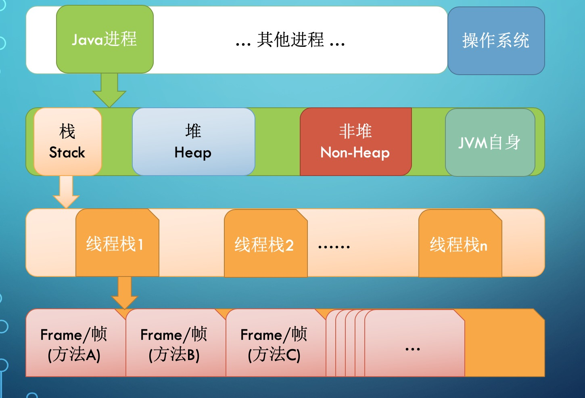

每启动一个线程，JVM就会在栈空间栈分配对应的 **线程栈**, 比如 1MB 的空间（`-Xss1m`）。

线程栈也叫做Java方法栈。 如果使用了JNI方法，则会分配一个单独的本地方法栈(Native Stack).


线程执行过程中，一般会有多个方法组成调用栈(Stack Trace), 比如A调用B，B调用C。。。每执行到一个方法，就会创建对应的 **栈帧**(Frame).


栈帧只是一个逻辑上的概念，具体的大小，在一个方法编写完成后基本上就能确定。

比如返回值需要有一个空间存放吧，每个局部变量都需要对应的地址空间，此外还有操作数栈，以及方法指针(标识这个栈帧对应的是哪个类的哪个方法,指向常量池中的字符串常量）。


Java程序除了栈内存之外，最主要内存区域就是堆内存了。

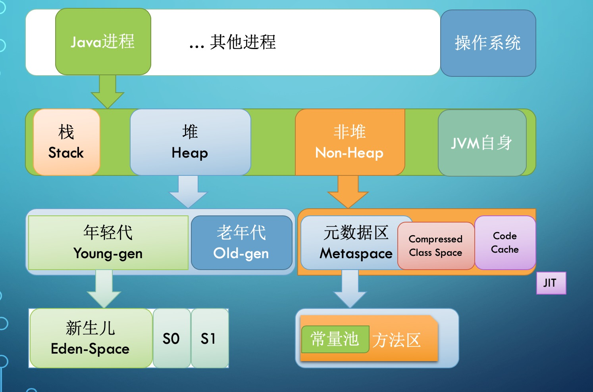

堆内存是所有线程共用的内存空间，理论上大家都可以访问里面的内容。

但JVM的具体实现一般会有各种优化。

比如将逻辑上的Java堆,划分为堆(Heap)和非堆(Non-Heap)两个部分.  这种划分的依据在于，我们编写的Java代码，基本上只能使用Heap这部分空间，发生内存分配和回收的主要区域也在这部分，所以有一种说法，这里的Heap也叫GC管理的堆(GC Heap)。

GC理论中有一个重要的思想，叫做分代。 经过研究发现，程序中分配的对象，要么用过就扔，要么就能存活很久很久。

JVM将Heap内存分为年轻代（Young generation）和老年代（Old generation, 也叫 Tenured）两部分。

年轻代还划分为3个内存池，新生代(Eden space)和存活区(Survivor space), 存活区在大部分GC算法中有2个(S0, S1)，S0和S1总有一个是空的,但一般较小，也不浪费多少空间。

具体实现对新生代还有优化，那就是TLAB(Thread Local Allocation Buffer), 给每个线程先划定一小片空间，你创建的对象先在这里分配，满了再换。这能极大降低并发资源锁定的开销。


Non-Heap本质上还是Heap，只是一般不归GC管理，里面划分为3个内存池。

- Metaspace, 以前叫持久代(永久代, Permanent generation), Java8换了个名字叫 Metaspace.
  Java8将方法区移动到了Meta区里面，而方法又是class的一部分。。。和CCS交叉了?
- CCS, Compressed Class Space, 存放class信息的，和 Metaspace 有交叉。
- Code Cache, 存放 JIT 编译器编译后的本地机器代码。


JVM的内存结构大致如此。

还可以参考 [Metaspace解密](http://lovestblog.cn/blog/2016/10/29/metaspace/)


### 3.3 JVM启动参数


启动Java程序的格式为:

```shell
java [options] classname [args]

java [options] -jar filename [args]
```

其中:

- `[options]` 部分称为 "JVM选项",对应IDE中的 VM options, 可用 `jps -v` 查看。
-  `[args]` 部分是指 "传给main函数的参数", 对应IDE中的 Program arguments, 可用 `jps -m` 查看。

Java和JDK内置的工具，指定参数时都是一个 `-`，不管是长参数还是短参数。


有时候，JVM启动参数和Java程序启动参数，并没必要严格区分，大致知道都是一个概念即可。

JVM的启动参数, 从形式上可以简单分为：

`-???` 标准选项, java中各种参数都是一个横线 `-` 开头, 很少有两个横线 `--`;
`-X`  非标准选项， 基本都是传给JVM的。
`-XX:` 高级扩展选项, 专门用于控制JVM的行为。
  * `-XX:+-Flags` 形式, `+-` 是对布尔值进行开关。
  * `-XX:key=value` 形式, 指定某个选项的值。


#### 3.3.1 设置系统属性

使用 `-Dproperty=value` 这种形式。

例如指定随机数熵源(Entropy Source), 示例:

```shell
JAVA_OPTS="-Djava.security.egd=file:/dev/./urandom"
```


#### 3.3.2 agent相关的选项:

agent是JVM中的一项黑科技, 可以通过无侵入方式来做很多事情，比如注入AOP代码，执行统计等等，权限非常大。

设置 agent 的语法如下:

- `-agentlib:libname[=options]`  启用native方式的agent, 参考 `LD_LIBRARY_PATH` 路径。
- `-agentpath:pathname[=options]` 启用native方式的agent
- `-javaagent:jarpath[=options]` 启用外部的agent库, 比如 `pinpoint.jar` 等等。
- `-Xnoagent` 则是禁用所有 agent。

示例, 开启CPU使用时间抽样分析:

```shell
JAVA_OPTS="-agentlib:hprof=cpu=samples,file=cpu.samples.log"
```

hprof是JDK内置的一个性能分析器。`cpu=samples` 会抽样在各个方法消耗的时间占比, Java进程退出后会输出到文件。


#### 3.3.3 JVM运行模式:

`-server` 指定服务器模式, 64位JDK只支持该选项，是否设置都是这个值。

JDK1.7 之前x86.32位的默认值是 `-client` 选项, 主要原因是以前JIT编译器占内存，可能还有点慢。

示例:

```shell
JAVA_OPTS="-server"
```


#### 3.3.4 设置堆内存

JVM总内存=堆+栈+非堆+堆外内存。。。

参数:

- `-Xmx`, 指定最大堆内存。 如 `-Xmx4g`. 这只是指定了 Heap 部分的最大值为4g。
- `-Xms`, 指定堆内存空间的起始值。 如 `-Xms4g`。 并不是操作系统实际分配的初始值，而是GC先规划好，用到才分配。
  专用服务器上让 `-Xms`和`-Xmx`一致, GC日志会比较好看，不然刚启动可能就有好几个FullGCC。
  据说不一致时，堆内存扩容会有性能抖动。
- `-Xmn`, 等价于 `-XX:NewSize`, 使用G1垃圾收集器 **不应该** 设置该选项，在某些业务场景下可以设置。官方建议设置为 `-Xmx` 的 `1/2 ~ 1/4`.
- `-XX:MaxPermSize=size`, 这是JDK1.7之前使用的。Java8默认允许的Meta空间无限大。
- `-XX:MaxMetaspaceSize=size`,  Java8默认不限制Meta空间, 一般不允许设置该选项。

示例:

```shell
JAVA_OPTS="-Xms28g -Xmx28g"
```


#### 3.3.5 设置栈内存

- `-Xss`, 设置每个线程栈的字节数。 例如 `-Xss1m` 指定线程栈为1MB。
- `-XX:ThreadStackSize=1m`, 和 `-Xss1m` 等价

示例:

```shell
JAVA_OPTS="-Xss1m"
```


#### 3.3.6 GC相关


- `-verbose:gc` 参数

和其他GC参数组合使用, 在GC日志中输出详细的GC信息。 包括每次GC前后各个内存池的大小，堆内存的大小，提升到老年代的大小，以及消耗的时间。

此参数支持在运行过程中动态开关。比如使用 jcmd, jinfo， 以及使用JMX技术的其他客户端。


- `-XX:+PrintGCDetails` 和 `-XX:+PrintGCTimeStamps`, 打印GC细节与发生时间。参考GC部分。


示例:

```shell
export JAVA_OPTS="-Xms28g -Xmx28g -Xss1m \
-verbosegc -XX:+UseG1GC -XX:MaxGCPauseMillis=200 \
-XX:+HeapDumpOnOutOfMemoryError -XX:HeapDumpPath=/usr/local/"

```


#### 3.3.7 指定垃圾收集器

指定具体的垃圾收集器。

- `-XX:+UseG1GC`
- `-XX:+UseConcMarkSweepGC`
- `-XX:+UseSerialGC`
- `-XX:+UseParallelGC`


#### 3.3.8 特殊情况执行脚本


- `-XX:+-HeapDumpOnOutOfMemoryError` 选项, 当 `OutOfMemoryError` 产生，即内存溢出(堆内存或持久代)时，自动Dump堆内存。
  因为在运行时并没有什么开销, 所以在生产机器上是可以使用的。
  示例用法: `java -XX:+HeapDumpOnOutOfMemoryError -Xmx256m ConsumeHeap`

```
java.lang.OutOfMemoryError: Java heap space
Dumping heap to java_pid2262.hprof ...
......
```

- `-XX:HeapDumpPath` 选项, 与`HeapDumpOnOutOfMemoryError`搭配使用, 指定内存溢出时Dump文件的目录。
  如果没有指定则默认为启动Java程序的工作目录。
  示例用法: `java -XX:+HeapDumpOnOutOfMemoryError -XX:HeapDumpPath=/usr/local/ ConsumeHeap`
  自动Dump的hprof文件会存储到 `/usr/local/` 目录下。

- `-XX:OnError` 选项, 发生致命错误时(fatal error)执行的脚本。
  例如, 写一个脚本来记录出错时间, 执行一些命令, 或者 curl 一下某个在线报警的url.
  示例用法: `java -XX:OnError="gdb - %p" MyApp`
  可以发现有一个 `%p` 的格式化字符串，表示进程PID。

- `-XX:OnOutOfMemoryError` 选项,  抛出 OutOfMemoryError 错误时执行的脚本。

- `-XX:ErrorFile=filename` 选项, 致命错误的日志文件名,绝对路径或者相对路径。


## 4. JDK内置工具介绍和使用示例

本节介绍JDK内置的各种工具, 包括

- 命令行工具
- GUI工具
- 服务端工具

很多情况下, JVM运行环境中并没有趁手的工具， 这时候可以先用命令行工具快速查看JVM实例的基本情况。

> MacOSX，Windows系统的某些账户权限不够，有些工具可能会报错/失败，假如出问题了请排除这个因素。

下面先介绍命令行工具。

### 4.1 `jps` 工具简介

我们知道，操作系统提供一个工具叫做 `ps`, 用于显示进程状态(process status)。

Java也提供了类似的命令行工具，叫做 `jps`,  用于展示java进程信息(列表)。

需要注意的是, jps展示的是当前用户可看见的Java进程，如果看不见可能需要 `sudo`， `su` 之类的命令辅助。

查看帮助信息:

```shell
jps -help

usage: jps [-help]
       jps [-q] [-mlvV] [<hostid>]

Definitions:
    <hostid>:      <hostname>[:<port>]
```

可以看到， 这些参数分为了多个组， `-help`，`-q`，`-mlvV`， 同一组可以共用一个 `-`。

常用的参数是小写的 `-v`,  显示传递给JVM的启动参数.

```
jps -v

15883 Jps -Dapplication.home=/usr/local/jdk1.8.0_74 -Xms8m
6446 Jstatd -Dapplication.home=/usr/local/jdk1.8.0_74 -Xms8m
        -Djava.security.policy=/etc/java/jstatd.all.policy
32383 Bootstrap -Xmx4096m -XX:+UseG1GC -verbose:gc
        -XX:+PrintGCDateStamps -XX:+PrintGCDetails -Xloggc:/xxx-tomcat/logs/gc.log
        -Dcatalina.base=/xxx-tomcat -Dcatalina.home=/data/tomcat
```

看看输出的内容，其中最重要的信息是前面的进程ID(PID),

其他参数不太常用:

- `-q`  只显示进程号。
- `-m`  显示传给 main 方法的参数信息
- `-l`  显示启动 class 的完整类名, 或者启动 jar 的完整路径
- `-V`  大写的V，这个参数有问题, 相当于没传一样。官方说的跟 `-q` 差不多。

- `<hostid>` 部分是远程主机的标识符，需要远程主机启动 `jstatd` 服务器, 一般不怎么使用。

  可以看到, 格式为 `<hostname>[:<port>]`, 不能用IP, 示例: `jps -v sample.com:1099`。

知道JVM进程的PID之后，就可以使用其他工具来进行诊断了。


### 4.2 `jstat` 工具简介

`jstat` 用来监控JVM内置的各种统计信息，主要是内存和GC相关的信息。

查看 `jstat` 的帮助信息, 大致如下:

```
jstat -help
Usage: jstat -help|-options
       jstat -<option> [-t] [-h<lines>] <vmid> [<interval> [<count>]]

Definitions:
  <option>      可用的选项, 查看详情请使用 -options
  <vmid>        虚拟机标识符. 格式: <lvmid>[@<hostname>[:<port>]]
  <lines>       标题行间隔的频率.
  <interval>    采样周期, <n>["ms"|"s"], 默认单位是毫秒 "ms".
  <count>       采用总次数.
  -J<flag>      传给jstat底层JVM的 <flag> 参数.
```

再来看看 `<option>` 部分支持哪些选项:

```
jstat -options

-class
-compiler
-gc
-gccapacity
-gccause
-gcmetacapacity
-gcnew
-gcnewcapacity
-gcold
-gcoldcapacity
-gcutil
-printcompilation
```

简单说明这些选项, 不感兴趣可以跳着读。


- `-class`  类加载(Class loader)信息统计.
- `-compiler`  JIT即时编译器相关的统计信息。
- `-gc`  GC相关的堆内存信息. 用法: `jstat -gc -h 10 -t 864 1s 20`
- `-gccapacity`  各个内存池分代空间的容量。
- `-gccause` 看上次GC, 本次GC（如果正在GC中）的原因, 其他输出和 `-gcutil` 选项一致。
- `-gcnew`  年轻代的统计信息. （New = Young = Eden + S0 + S1）
- `-gcnewcapacity`  年轻代空间大小统计.
- `-gcold`  老年代和元数据区的行为统计。
- `-gcoldcapacity`   old空间大小统计.
- `-gcmetacapacity`  meta区大小统计.
- `-gcutil`  GC相关区域的使用率(utilization)统计。
- `-printcompilation`  打印JVM编译统计信息。


实例:

```
jstat -gcutil -t 864
```

`-gcutil` 选项是统计GC相关区域的使用率(utilization), 结果如下:

|Timestamp |S0  |S1   |E    |O    |M    |CCS  |YGC   |YGCT   |FGC|FGCT |GCT    |
|----------|----|-----|-----|-----|-----|-----|------|-------|---|-----|-------|
|14251645.5|0.00|13.50|55.05|71.91|83.84|69.52|113767|206.036|4  |0.122|206.158|

`-t` 选项的位置是固定的，不能在前也不能在后。 可以看出是用于显示时间戳的, 即JVM启动到现在的秒数。

简单分析一下:

- `Timestamp` 列: JVM启动了1425万秒,大约164天。
- `S0` 就是0号存活区的百分比使用率。 0%很正常, 因为 S0和S1随时有一个是空的。
- `S1` 就是1号存活区的百分比使用率。
- `E`  就是Eden区，新生代的百分比使用率。
- `O`  就是Old区, 老年代。百分比使用率。
- `M`  就是Meta区, 元数据区百分比使用率。
- `CCS`, 压缩class空间(Compressed class space)的百分比使用率。
- `YGC`  (Young GC), 年轻代GC的次数。11万多次, 不算少。
- `YGCT` 年轻代GC消耗的总时间。206秒, 占总运行时间的万分之一不到，基本上可忽略。
- `FGC`  FullGC的次数,可以看到只发生了4次，问题应该不大。
- `FGCT` FullGC的总时间, 0.122秒，平均每次30ms左右,大部分系统应该能承受。
- `GCT`  所有GC加起来消耗的总时间, 即`YGCT`+`FGCT`。


可以看到, `-gcutil` 这个选项出来的信息不太好用, 统计的百分比数字怪怪的，不太直观。


再看看, `-gc` 选项, GC相关的堆内存信息.

```
jstat -gc -t 864 1s
jstat -gc -t 864 1s 3
jstat -gc -t -h 10 864 1s 15
```

其中的 `1s` 占了 `<interval>` 这个槽位, 表示每1秒输出一次信息。

` 1s 3` 的意思是每秒输出1次，最多3次。

如果只指定刷新周期, 不指定 `<count>` 部分, 则会一直持续输出。 退出输出按 `CTRL+C`即可。

`-h 10` 的意思是每10行输出一次表头。

结果大致如下:


|Timestamp |S0C   |S1C   |S0U  |S1U|EC    |EU    |OC     |OU    |MC     |MU     |YGC   |YGCT   |FGC|FGCT |
|----------|------|------|-----|---|------|------|-------|------|-------|-------|------|-------|---|-----|
|14254245.3|1152.0|1152.0|145.6|0.0|9600.0|2312.8|11848.0|8527.3|31616.0|26528.6|113788|206.082|4  |0.122|
|14254246.3|1152.0|1152.0|145.6|0.0|9600.0|2313.1|11848.0|8527.3|31616.0|26528.6|113788|206.082|4  |0.122|
|14254247.3|1152.0|1152.0|145.6|0.0|9600.0|2313.4|11848.0|8527.3|31616.0|26528.6|113788|206.082|4  |0.122|


上面的结果是精简过后的, 为了排版去掉了 `GCT`，`CCSC`，`CCSU` 这三列。 看到这些单词可以试着猜一下意思, 详细的解读如下:


- `Timestamp` 列: JVM启动了1425万秒,大约164天。
- `S0C`: 0号存活区的当前容量(capacity), 单位 kB.
- `S1C`: 1号存活区的当前容量, 单位 kB.
- `S0U`: 0号存活区的使用量(utilization), 单位 kB.
- `S1U`: 1号存活区的使用量, 单位 kB.
- `EC`: Eden区，新生代的当前容量, 单位 kB.
- `EU`: Eden区，新生代的使用量, 单位 kB.
- `OC`: Old区, 老年代的当前容量, 单位 kB.
- `OU`: Old区, 老年代的使用量, 单位 kB. （!需要关注）
- `MC`: 元数据区的容量, 单位 kB.
- `MU`: 元数据区的使用量, 单位 kB.
- `CCSC`: 压缩的class空间容量, 单位 kB.
- `CCSU`: 压缩的class空间使用量, 单位 kB.
- `YGC`: 年轻代GC的次数。
- `YGCT`: 年轻代GC消耗的总时间。 （!重点关注）
- `FGC`: Full GC 的次数
- `FGCT`: Full GC 消耗的时间. （!重点关注）
- `GCT`: 垃圾收集消耗的总时间。

最重要的信息是GC的次数和总消耗时间，其次是老年代的使用量。

在没有其他监控工具的情况下， jstat 可以简单查看各个内存池和GC的信息，可用于判别原因是否是GC或者内存溢出。


### 4.3 `jmap` 工具

面试最常问的就是 `jmap` 工具了。

`jmap` 主要用来dump堆内存。当然也支持输出统计信息。

> 官方推荐使用JDK8自带的 `jcmd` 工具来取代 `jmap`， 但是 jmap 深入人心，jcmd可能暂时取代不了。


查看 jmap 帮助信息:

```
jmap -help

Usage:
    jmap [option] <pid>
        (连接到本地进程)
    jmap [option] <executable <core>
        (连接到 core file)
    jmap [option] [server_id@]<remote-IP-hostname>
        (连接到远程 debug 服务)

where <option> is one of:
    <none>               等同于 Solaris 的 pmap 命令
    -heap                打印Java堆内存汇总信息
    -histo[:live]        打印Java堆内存对象的直方图统计信息;
                         如果指定了 "live" 选项则只统计存活对象,强制触发一次GC
    -clstats             打印class loader 统计信息
    -finalizerinfo       打印等待 finalization 的对象信息
    -dump:<dump-options> 将堆内存dump为 hprof 二进制格式
                         支持的 dump-options:
                           live         只dump存活对象; 不指定则导出全部.
                           format=b     二进制格式(binary format)
                           file=<file>  导出文件的路径
                         示例: jmap -dump:live,format=b,file=heap.bin <pid>
    -F                   强制导出. 若jmap被hang住不响应, 可断开后使用此选项。
                         其中 "live" 选项不支持强制导出.
    -h | -help           to print this help message
    -J<flag>             to pass <flag> directly to the runtime system
```

常用选项就3个:

- `-heap`  打印堆内存（/内存池）的配置和使用信息。
- `-histo` 看哪些类占用的空间最多, 直方图
- `-dump:format=b,file=xxxx.hprof` Dump堆内存。


示例:

看堆内存统计信息。

```
jmap -heap 4524
```

输出信息:

```
Attaching to process ID 4524, please wait...
Debugger attached successfully.
Server compiler detected.
JVM version is 25.65-b01

using thread-local object allocation.
Parallel GC with 4 thread(s)

Heap Configuration:
   MinHeapFreeRatio         = 0
   MaxHeapFreeRatio         = 100
   MaxHeapSize              = 2069889024 (1974.0MB)
   NewSize                  = 42991616 (41.0MB)
   MaxNewSize               = 689963008 (658.0MB)
   OldSize                  = 87031808 (83.0MB)
   NewRatio                 = 2
   SurvivorRatio            = 8
   MetaspaceSize            = 21807104 (20.796875MB)
   CompressedClassSpaceSize = 1073741824 (1024.0MB)
   MaxMetaspaceSize         = 17592186044415 MB
   G1HeapRegionSize         = 0 (0.0MB)

Heap Usage:
PS Young Generation
Eden Space:
   capacity = 24117248 (23.0MB)
   used     = 11005760 (10.49591064453125MB)
   free     = 13111488 (12.50408935546875MB)
   45.63439410665761% used
From Space:
   capacity = 1048576 (1.0MB)
   used     = 65536 (0.0625MB)
   free     = 983040 (0.9375MB)
   6.25% used
To Space:
   capacity = 1048576 (1.0MB)
   used     = 0 (0.0MB)
   free     = 1048576 (1.0MB)
   0.0% used
PS Old Generation
   capacity = 87031808 (83.0MB)
   used     = 22912000 (21.8505859375MB)
   free     = 64119808 (61.1494140625MB)
   26.32600715361446% used

12800 interned Strings occupying 1800664 bytes.
```

可以看到堆内存和内存池的相关信息。

当然，这些信息有多种方式可以得到，比如 JMX。


看看直方图

```
jmap -histo 4524
```

结果为:

```
 num     #instances         #bytes  class name
----------------------------------------------
   1:         52214       11236072  [C
   2:        126872        5074880  java.util.TreeMap$Entry
   3:          5102        5041568  [B
   4:         17354        2310576  [I
   5:         45258        1086192  java.lang.String
......
```

简单分析, 其中 `[C` 占用了11MB内存，没占用什么空间。

> `[C` 表示 `chat[]`, `[B` 表示 `byte[]`, `[I` 表示 `int[]`, 其他类似。这种基础数据类型很难分析出什么问题。
>
> Java中的大对象, 巨无霸对象，一般都是长度很大的数组。


Dump堆内存:

```
cd $CATALINA_BASE
jmap -dump:format=b,file=3826.hprof 3826
```

导出完成后, dump文件大约和堆内存一样大。 可以想办法压缩并传输。

分析 hprof 文件可以使用 jhat 或者 [mat](https://www.eclipse.org/mat/) 工具。


### 4.4 `jcmd`工具

>  诊断工具

jcmd 是JDK8推出的一款本地诊断工具，只支持连接本机上同一个用户空间下的JVM进程。

查看帮助:

```shell
jcmd -help
Usage: jcmd <pid | main class> <command ...|PerfCounter.print|-f file>
   or: jcmd -l                                                    
   or: jcmd -h                                                    

  command 必须是指定JVM可用的有效 jcmd 命令.      
  可以使用 "help" 命令查看该JVM支持哪些命令.   
  如果指定 pid 部分的值为 0, 则会将 commands 发送给所有可见的 Java 进程.   
  指定 main class 则用来匹配启动类。可以部分匹配。（适用同一个类启动多实例）.                         
  If no options are given, lists Java processes (same as -p).     

  PerfCounter.print 命令可以展示该进程暴露的各种计数器
  -f  从文件读取可执行命令                  
  -l  列出(list)本机上可见的 JVM 进程                     
  -h  this help                           
```

可以看到:


查看进程信息:

```shell
jcmd
jcmd -l
jps -lm

11155 org.jetbrains.idea.maven.server.RemoteMavenServer
```

这几个命令的结果差不多。可以看到其中有一个PID为 11155 的进程。

下面看看可以用这个PID做什么。

给这个进程发一个 help 指令:

```shell
jcmd 11155 help
jcmd RemoteMavenServer help
```

pid和main-class输出信息是一样的:

```shell
11155:
The following commands are available:
VM.native_memory
ManagementAgent.stop
ManagementAgent.start_local
ManagementAgent.start
GC.rotate_log
Thread.print
GC.class_stats
GC.class_histogram
GC.heap_dump
GC.run_finalization
GC.run
VM.uptime
VM.flags
VM.system_properties
VM.command_line
VM.version
help
```

可以试试这些命令:

查看VM相关的信息 :

```shell
# JVM实例运行时间
jcmd 11155 VM.uptime
9307.052 s

#JVM版本号
jcmd 11155 VM.version
OpenJDK 64-Bit Server VM version 25.76-b162
JDK 8.0_76

# JVM实际生效的配置参数
jcmd 11155 VM.flags
11155:
-XX:CICompilerCount=4 -XX:InitialHeapSize=268435456
-XX:MaxHeapSize=536870912 -XX:MaxNewSize=178782208
-XX:MinHeapDeltaBytes=524288 -XX:NewSize=89128960
-XX:OldSize=179306496 -XX:+UseCompressedClassPointers
-XX:+UseCompressedOops -XX:+UseParallelGC

# 查看命令行参数
jcmd 11155 VM.command_line
VM Arguments:
jvm_args: -Xmx512m -Dfile.encoding=UTF-8
java_command: org.jetbrains.idea.maven.server.RemoteMavenServer
java_class_path (initial): ...(xxx省略)...
Launcher Type: SUN_STANDARD

# 系统属性
jcmd 11155 VM.system_properties
...
java.runtime.name=OpenJDK Runtime Environment
java.vm.version=25.76-b162
java.vm.vendor=Oracle Corporation
user.country=CN

```


GC相关的命令,

统计每个类的实例占用字节数。

> $ `jcmd 11155 GC.class_histogram`

```shell
 num     #instances         #bytes  class name
----------------------------------------------
   1:         11613        1420944  [C
   2:          3224         356840  java.lang.Class
   3:           797         300360  [B
   4:         11555         277320  java.lang.String
   5:          1551         193872  [I
   6:          2252         149424  [Ljava.lang.Object;
```


Dump堆内存：

> $`jcmd 11155 help GC.heap_dump`

```shell
Syntax : GC.heap_dump [options] <filename>
Arguments: filename :  Name of the dump file (STRING, no default value)
Options:  -all=true 或者 -all=false (默认)

# 两者效果差不多; jcmd需要指定绝对路径； jmap不能指定绝对路径
jcmd 11155 GC.heap_dump -all=true ~/11155-by-jcmd.hprof
jmap -dump:file=./11155-by-jmap.hprof 11155
```

jcmd 坑的地方在于, 必须指定绝对路径, 否则导出的hprof文件就以JVM所在的目录计算。(： 因为是发命令交给jvm执行的。)

其他命令用法类似，必要时请参考官方文档。


### 4.5 `jstack` 工具

> 命令行工具、诊断工具

`jstack` 工具可以打印出Java线程的调用栈信息(stack trace)。

一般用来查看存在哪些线程，诊断是否存在死锁等。

这时候就看出来给线程(池)命名的必要性了，【开发不规范，整个项目都是坑】，具体可参考阿里巴巴的Java开发规范。

看看帮助信息:

> $`jstack -help`

```shell
Usage:
    jstack [-l] <pid>
        (to connect to running process)
    jstack -F [-m] [-l] <pid>
        (to connect to a hung process)
    jstack [-m] [-l] <executable> <core>
        (to connect to a core file)
    jstack [-m] [-l] [server_id@]<remote server IP or hostname>
        (to connect to a remote debug server)

Options:
    -F  to force a thread dump. Use when jstack <pid> does not respond (process is hung)
    -m  to print both java and native frames (mixed mode)
    -l  long listing. Prints additional information about locks
    -h or -help to print this help message
```


选项说明:

- `-F`  强制执行thread dump. 可在Java进程卡死(hung住)时使用, 此选项可能需要系统权限。
- `-m`  混合模式(mixed mode),将Java帧和native帧一起输出, 此选项可能需要系统权限。
- `-l`  长列表模式. 将线程相关的locks信息一起输出，比如持有的锁，等待的锁。

常用的选项是 `-l`, 示例用法。

```shell
jstack 4524
jstack -l 4524
```

死锁的原因一般是锁定多个资源的顺序出了问题【交叉依赖】， 网上示例代码很多，比如搜索 `Java 死锁 示例`。


### 4.6 `jinfo` 工具

> 诊断工具

`jinfo` 用来查看具体生效的配置信息，以及系统属性。 还支持动态增加一部分参数。


看看帮助信息:

> $ `jinfo -help`

```
Usage:
    jinfo [option] <pid>
        (to connect to running process)
    jinfo [option] <executable <core>
        (to connect to a core file)
    jinfo [option] [server_id@]<remote-IP-hostname>
        (to connect to remote debug server)

where <option> is one of:
    -flag <name>         to print the value of the named VM flag
    -flag [+|-]<name>    to enable or disable the named VM flag
    -flag <name>=<value> to set the named VM flag to the given value
    -flags               to print VM flags
    -sysprops            to print Java system properties
    <no option>          to print both of the above
    -h | -help           to print this help message
```

使用示例：

```
jinfo 4524
jinfo -flags 4524
```

不加参数过滤，则打印所有信息。

`jinfo`在Windows上比较稳定。

笔者在Mac和Linux系统上使用一直报错，在MacOSX系统上弹出安全警告而被拦截，在Linux上可能是jinfo 版本和目标JVM版本不一致的原因。

```
Error attaching to process:
  sun.jvm.hotspot.runtime.VMVersionMismatchException:
    Supported versions are 25.74-b02. Target VM is 25.66-b17
```

而这些性能诊断工具官方并不提供技术支持，所以如果碰到报错信息，请不要着急，可以试试其他工具。不行就换JDK版本。


### 4.7 `jvisualvm` 图形界面监控工具


GUI图形界面工具, 主要是3款: jconsole,  jvisualvm,  jmc。

其中, jconsole比较古老，在此不进行介绍。


JVisualVM启动后的界面大致如下:

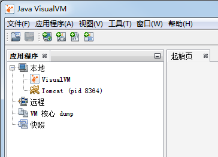

在其中可以看到本地的JVM实例。

通过 JVisualVM 连接到某个JVM以后, "概述"页签显示的基本信息如下图所示:

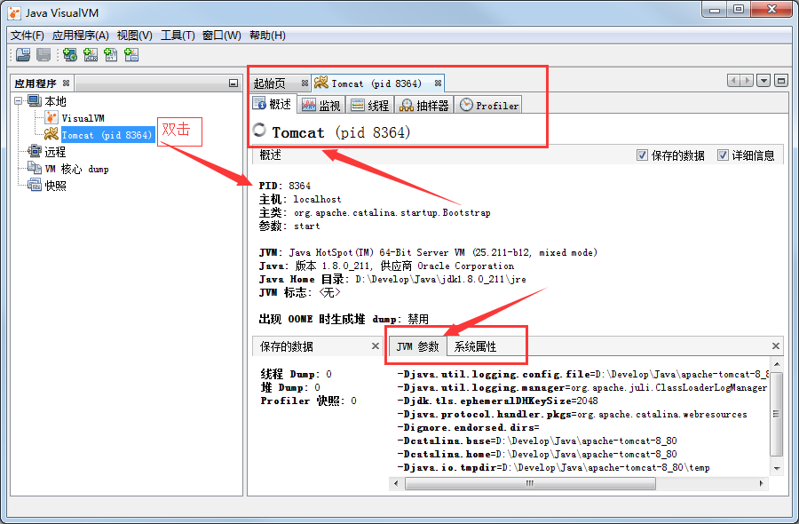

可以看到，其中有PID，启动参数，系统属性等信息。

切换到"监视"页签：

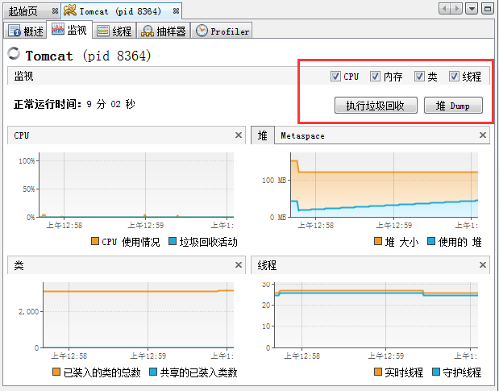

可以看到整体的运行情况。 比如 CPU，堆内存，类，线程等信息。还可以执行一些操作，比如“强制执行垃圾回收”，“堆Dump”等。

"线程"页签则展示了JVM中的线程列表。 再一次看出线程（池）命名的好处。

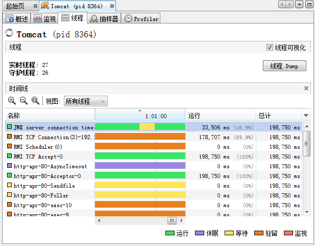


JVisualVM 强大的功能在于插件。

JDK8需要安装较高版本(如Java SE 8u211)，才能安装jvisualvm的插件。

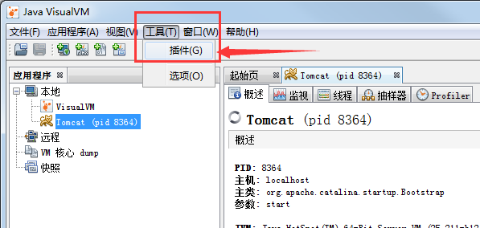

JVisualVM安装MBeans插件的步骤: 通过 工具(T) – 插件(G) – 可用插件 – 勾选具体的插件 – 安装 – 下一步 – 等待安装完成。

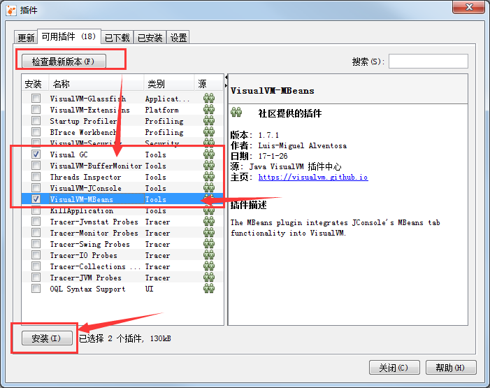

如果看不到可用插件，请安装最新版本，或者下载插件到本地安装。

请排除网络问题，或者检查更新，重新启动试试。

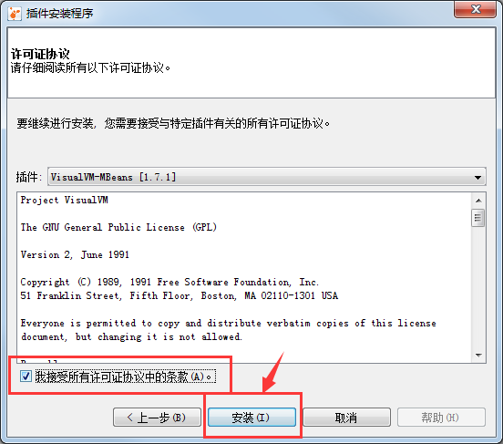

安装完成后, 重新连接某个JVM, 即可看到新安装的插件。

切换到VisualGC页签:

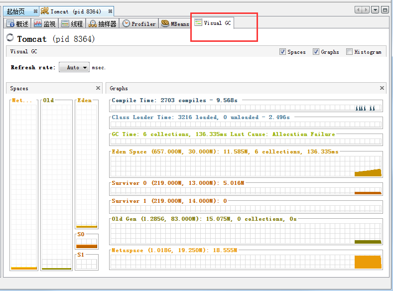

在其中可以看到各个内存池的使用情况，以及类加载时间，GC总次数，总消耗时间等信息。 比起命令行工具要简单得多。

切换到 MBeans 标签:

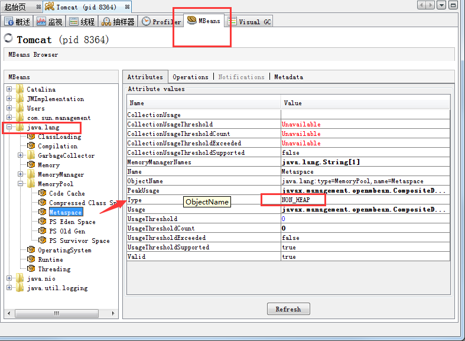

一般不怎么关注 MBean , 但 MBean  对于理解GC的原理倒是挺有用的。

主要看 `java.lang` 包下面的MBean。比如内存池, 或者垃圾收集器等。

从图中可以看到 Metaspace 的 Type 是 NON_HEAP。

当然，还可以看垃圾收集器(GarbageCollector)。

对所有的垃圾收集器, 通过 JMX API 获取的信息包括:

- **CollectionCount** :  垃圾收集器执行的GC总次数,
- **CollectionTime**: 收集器运行时间的累计。这个值等于所有GC事件持续时间的总和,
- **LastGcInfo**: 最近一次GC事件的详细信息。包括 GC事件的持续时间(duration),  开始时间(startTime) 和 结束时间(endTime), 以及各个内存池在最近一次GC之前和之后的使用情况,
- **MemoryPoolNames**:  各个内存池的名称,
- **Name**: 垃圾收集器的名称
- **ObjectName**: 由JMX规范定义的 MBean的名字,,
- **Valid**: 此收集器是否有效。本人只见过 "`true`"的情况 (^_^)


根据经验, 这些信息对GC的性能来说,不能得出什么结论.  只有编写程序,  获取GC相关的 JMX 信息来进行统计和分析。 


下面看怎么执行远程实时监控。

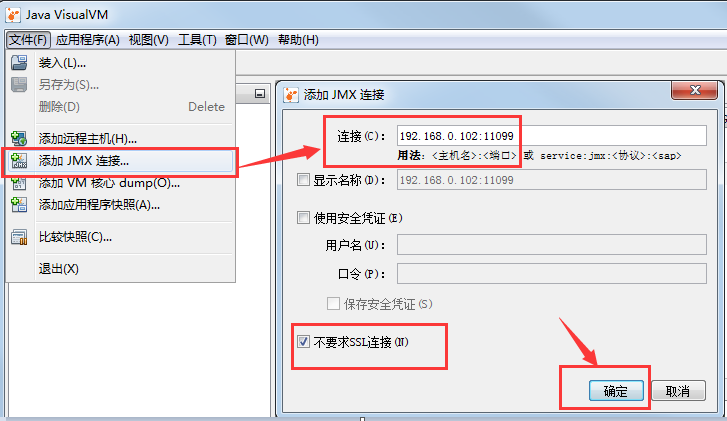

如上图所示，从文件菜单中, 我们可以选择“添加远程主机”，以及“添加JMX连接”。

比如 “添加JMX连接”， 填上IP和端口号之后，勾选“不要求SSL连接”，点击“确定”按钮即可。

关于目标JVM怎么启动JMX支持，请参考下面的 JMX 小节。

远程主机则需要 jstatd 的支持。请参考 jstatd 部分。


### 4.8 `jmc` 图形界面客户端

jmc 和 jvisualvm 功能类似。

Oracle 试图用jmc来取代 JVisualVM，但jmc和jinfo一样，都需要比较高的权限（去操纵其他JVM进程），可能会被Mac系统的安全限制拦截。在商业环境使用JFR需要付费获取授权。

启动后的界面如下:

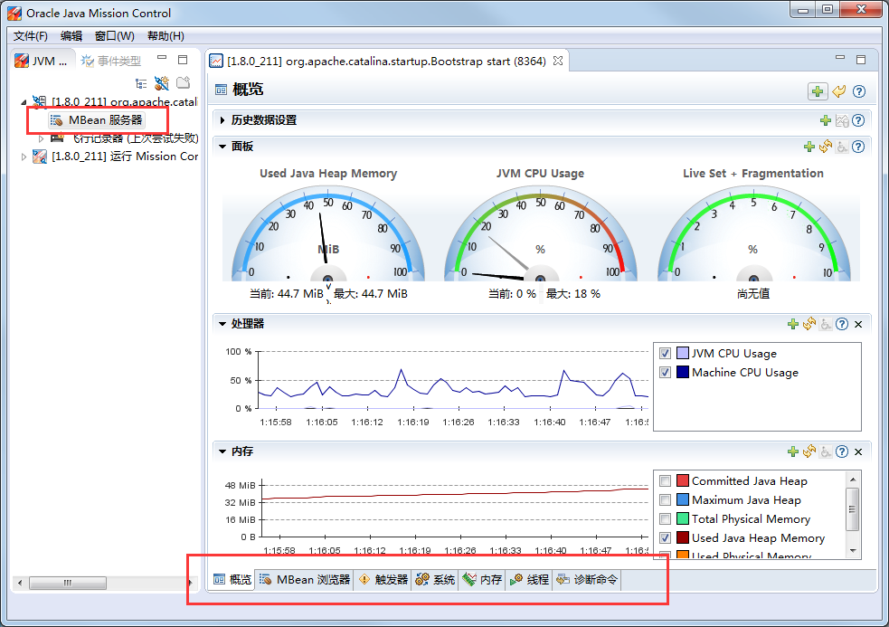

可以看到，漂亮了很多，有些客户肯定喜欢。

但jmc不只是一个监控工具，要求的权限很多，有些权限不够的管理员账户可能出一些问题。

大致使用和JVisualVM差不多。点击下方的页签切换即可。


### 4.9 jstatd服务端工具

jstatd 是个强大的服务端支持工具。

但因为涉及暴露一些服务器信息，所以需要配置策略文件。

> $ `cat /etc/java/jstatd.all.policy`

```
grant codebase "file:${java.home}/../lib/tools.jar" { 
   permission java.security.AllPermission; 
};
```

后台启动 jstatd

```
jstatd -J-Djava.security.policy=jstatd.all.policy
  -J-Djava.rmi.server.hostname=198.11.188.188 &
```

其中 198.11.188.188 是公网IP，如果没有公网，那么就是内网IP。


然后使用 jvisualvm, 或者 jconsole 连接远程服务器。 其中IP为 198.11.188.188, 端口号是默认的 `1099`. 当然,端口号可以通过参数自定义。

说明: 客户端与服务器的JVM大版本号必须一致或者兼容。


CPU图形没有显示 ,原因是 jstatd 不支持监控CPU。 可以启用对应JVM的 JMX监控, 具体请参考JMX一节。


### 4.10 更多工具

JDK还自带了其他工具， 比如 `jsadebugd` 可以在服务端主机上，开启RMI Server。 `jhat` 可用于解析hprof内存Dump文件等。

在此不进行介绍，有兴趣可以搜索看看。


## 5. JDWP简介

Java平台调试体系（Java Platform Debugger Architecture，JPDA），由三个相对独立的层次共同组成。这三个层次由低到高分别是 Java 虚拟机工具接口（JVMTI），Java 调试线协议（JDWP）以及 Java 调试接口（JDI）。

> 详细介绍请参考或搜索: [JPDA 体系概览](https://www.ibm.com/developerworks/cn/java/j-lo-jpda1/index.html)

JDWP 是 Java Debug Wire Protocol 的缩写，翻译为 "Java调试线协议"，它定义了调试器（debugger）和被调试的 Java 虚拟机（target vm）之间的通信协议。


### 5.1 服务端JVM配置

本节主要讲解如何在JVM中启用JDWP，以供远程调试。

假设主启动类是 `com.xxx.Test`。

在Windows机器上:

```
java -Xdebug -Xrunjdwp:transport=dt_shmem,address=debug,server=y,suspend=y com.xxx.Test
```

在Solaris 或 Linux操作系统上:


```
java -Xdebug -Xrunjdwp:transport=dt_socket,address=8888,server=y,suspend=y com.xxx.Test
```


其实, `-Xdebug` 这个选项什么用都没有，官方说是为了历史兼容性, 避免报错才没有删除。

通过这些启动参数, Test 类将运行在调试模式下, 并等待调试器连接到JVM的调试地址: 在Windows上是 debug, 在Oracle Solaris 或 Linux操作系统上是 8888端口。

> 如果细心观察的话, 会发现 Idea 中Debug模式启动的程序，自动设置了类似的启动选项。


### 5.2 jdb

启用了jdwp之后, 可以使用各种客户端来进行调试/远程调试。

比如 jdb 调试本地JVM:

```
jdb -attach 'debug'
jdb -attach 8888
```

当 jdb初始化并连接到 Test 之后, 就可以进行 Java代码级(Java-level)的调试。


### 5.3 idea中使用远程调试

下面介绍Idea中怎样使用远程调试。

和常规的Debug配置类似, 进入编辑:

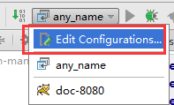

添加 Remote(不是Tomcat自带的那个Remote Server):

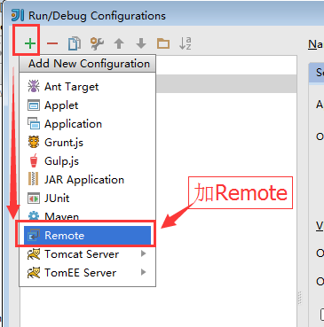

然后配置端口号, 比如8888。

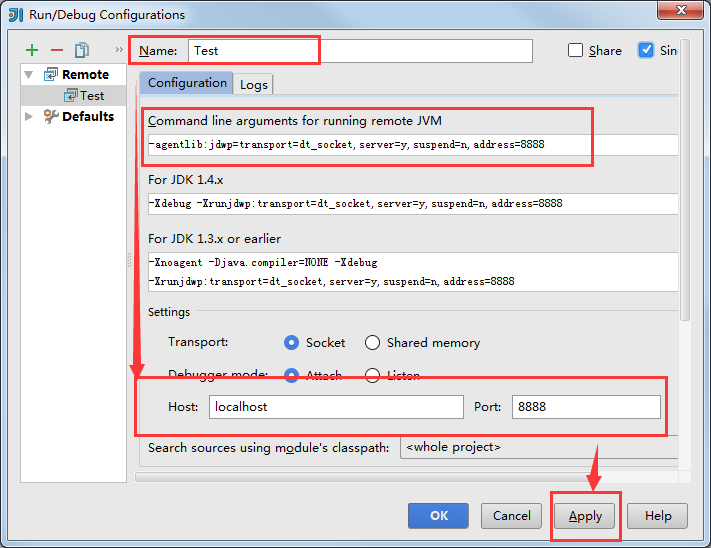

然后应用。 

点击debug的那个按钮即可启动远程调试，连上之后就和调试本地程序一样了。当然,记得加断点或者条件断点。

**注意**: 远程调试时, 需要保证服务端JVM中运行的代码和本地完全一致，否则可能会有莫名其妙的问题。 

细心的同学可能已经发现, Idea给出了远程JVM的启动参数, 建议使用 agentlib 的方式::

```
-agentlib:jdwp=transport=dt_socket,server=y,suspend=n,address=8888
```

如果知道这个技巧, 就不用了特殊记忆了。需要的时候找一找即可。

远程调试在测试环境追踪某些问题的时候特别有用。可以保持开启。


## 6. JMX与相关工具

在 Java SE 5 之前，虽然JVM提供了一些底层的API，比如 JVMPI 和 JVMTI ，但这些API是面向 C 语言的，需要通过 JNI 等方式才能调用，要监控JVM 和系统资源非常不方便。

 Java SE 5 版本中引入了JMX技术（Java Management Extensions， Java 管理扩展），用来暴露一些相关信息，甚至支持远程动态设置某些参数。

JMX 让 JDK 中开发自检测程序成为可能，也提供了大量轻量级的检测 JVM 和运行中对象 / 线程的方式，从而提高了 Java 语言自己的管理监测能力。

如果你是框架开发者，或者连接池的开发者，还可以注册MBean到JVM，随着其他JMX的Bean一起暴露出去，比如某些监控信息，此处不讲解，可以上网搜索。


客户端使用JMX大约支持两种方式：

- 程序代码手动获取MXBean。
- 通过网络远程获取MBean。

从 JVM 运行时获取GC行为数据, 最简单的办法是使用标准 JMX API 接口. JMX是获取 JVM内部运行时状态信息 的标准API. 可以编写程序代码, 通过 JMX API 来访问本程序所在的JVM，也可以通过JMX客户端执行(远程)访问。


### 6.1 程序中获取JMX信息


相关的MXBean类位于 `rt.jar` 文件的 `java.lang.management` 包中，JDK中默认就提供了。

代码获取JVM相关的MXBean信息：

```java
// import java.lang.management.*
// 1. 操作系统信息
OperatingSystemMXBean operatingSystemMXBean = ManagementFactory.getOperatingSystemMXBean();
// 2. 运行时
RuntimeMXBean runtimeMXBean = ManagementFactory.getRuntimeMXBean();
// 3.1 JVM内存信息
MemoryMXBean memoryMXBean = ManagementFactory.getMemoryMXBean();
// 3.2 JVM内存池-列表
List<MemoryPoolMXBean> memoryPoolMXBeans = ManagementFactory.getMemoryPoolMXBeans();
// 3.3 内存管理器-列表
List<MemoryManagerMXBean> memoryManagerMXBeans = ManagementFactory.getMemoryManagerMXBeans();
// 4. class加载统计信息
ClassLoadingMXBean classLoadingMXBean = ManagementFactory.getClassLoadingMXBean();
// 5. 编译统计信息
CompilationMXBean compilationMXBean = ManagementFactory.getCompilationMXBean();
// 6. 线程
ThreadMXBean threadMXBean = ManagementFactory.getThreadMXBean();
// 7.GC
List<GarbageCollectorMXBean> garbageCollectorMXBeans 
    = ManagementFactory.getGarbageCollectorMXBeans();
```

取得这些MXBean之后，就可以获取对应的Java运行时信息，可以定时上报给某个系统，那么一个简单的监控就创建了。

当然，这么简单的事情，肯定有现成的轮子啦。比如 Spring Boot Actuator, 以及后面介绍的Micrometer等。 各种监控服务提供的 Agent-lib.jar 中也会采集对应的数据。


### 6.2 JMX远程连接


最常见的 JMX客户端是 JConsole 和 JVisualVM (可以安装各种插件,十分强大)。两个工具都是标准JDK的一部分, 而且很容易使用. 如果使用的是 JDK7u40 及更高版本, 还可以使用另一个工具: Java Mission Control(jmc,大致翻译为 Java控制中心)。

监控本地的JVM并不需要额外配置，如果是远程监控，还可以在服务端部署 jstatd 工具暴露部分信息给JMX客户端。

所有 JMX客户端都是独立的程序,可以连接到目标JVM上。目标JVM可以在本机, 也可能是远端JVM。

想要支持JMX客户端连接服务端JVM实例，则Java启动脚本中需要加上相关的配置参数，示例如下：

```shell
-Dcom.sun.management.jmxremote
-Dcom.sun.management.jmxremote.port=10990
-Dcom.sun.management.jmxremote.ssl=false
-Dcom.sun.management.jmxremote.authenticate=false
```

如果服务器具有多张网卡(多个IP)，由于安全限制，必须明确指定 hostname， 一般是IP。

```shell
-Djava.rmi.server.hostname=47.57.227.67
```

这样启动之后，JMX客户端(如 JVisualVM)就可以通过 `<IP:端口>` 连接。(参考 JVisualVM 的示例)。

如这里对应的就类似于： `47.57.227.67:10990`

> 如果想要远程查看VisualGC，则服务端需要开启 jstatd 来支持, jvisualvm先连jstatd远程主机，接着在远程主机上点右键添加jmx连接。

关于 JVisualVM 的使用，请参考前面的小节。


## 7. GC日志解读与分析


> 关于GC基础与GC性能调优，以及OutOfMemoryError，可参考铁锚的CSDN专栏: [GC性能优化](https://blog.csdn.net/renfufei/column/info/14851)


因为GC日志模块内置于JVM中,  所以日志中包含了对GC活动最全面的描述。 这就是事实上的标准, 可作为GC性能评估和优化的最真实数据来源。


GC日志一般输出到文件之中, 是纯 text 格式的, 当然也可以打印到控制台。有多个可以控制GC日志的JVM参数。例如,可以打印每次GC的持续时间, 以及程序暂停时间(`-XX:+PrintGCApplicationStoppedTime`), 还有GC清理了多少引用类型(`-XX:+PrintReferenceGC`)。

通过日志内容也可以得到GC相关的信息。

要打印GC日志, 需要在启动脚本中指定类似的启动参数:

```
-verbose:gc
-XX:+PrintGCDetails
-XX:+PrintGCDateStamps
-XX:+PrintGCTimeStamps
-Xloggc:<filename>
```

各个垃圾收集器的日志可能有一些差异，但只要了解大致的套路之后，即使有差异也不会很大。


### 7.1 示例1

这样配置以后，发生GC时输出的日志就类似于下面这种格式(为了显示方便,已手工折行):

```
2019-07-15T14:45:37.987+0800: 151.126: 
  [GC (Allocation Failure) 151.126:
    [DefNew: 629119K->69888K(629120K), 0.0584157 secs]
    1619346K->1273247K(2027264K), 0.0585007 secs] 
  [Times: user=0.06 sys=0.00, real=0.06 secs]

2019-07-15T14:45:59.690+0800: 172.829: 
  [GC (Allocation Failure) 172.829: 
    [DefNew: 629120K->629120K(629120K), 0.0000372 secs]
    172.829: [Tenured: 1203359K->755802K(1398144K), 0.1855567 secs]
    1832479K->755802K(2027264K),
    [Metaspace: 6741K->6741K(1056768K)], 0.1856954 secs]
  [Times: user=0.18 sys=0.00, real=0.18 secs]
```


上面的GC日志暴露了JVM中的一些信息。事实上，这个日志片段中发生了 2 次垃圾收集事件(Garbage Collection events)。其中一次清理的是年轻代(Young generation), 而第二次处理的是整个堆内存。

下面我们来看，如何解读第一次GC事件，发生在年轻代中的小型GC(Minor GC):


1. `2019-07-15T14:45:37.987+0800` – GC事件(GC event)开始的时间点.
1. `151.126` – GC时间的开始时间,相对于JVM的启动时间,单位是秒(Measured in seconds).
1. `GC` – 用来区分(distinguish)是 Minor GC 还是 Full GC 的标志(Flag). 这里的 `GC` 表明本次发生的是 Minor GC.
1. `Allocation Failure` – 引起垃圾回收的原因. 本次GC是因为年轻代中没有任何合适的区域能够存放需要分配的数据结构而触发的.
1. `DefNew` – 使用的垃圾收集器的名字. `DefNew` 这个名字代表的是: 单线程(single-threaded), 采用标记复制(mark-copy)算法的, 使整个JVM暂停运行(stop-the-world)的年轻代(Young generation) 垃圾收集器(garbage collector).
1. `629119K->69888K` – 在本次垃圾收集之前和之后的年轻代内存使用情况(Usage).
1. `(629120K)` – 年轻代的总的大小(Total size).
1. `1619346K->1273247K` – 在本次垃圾收集之前和之后整个堆内存的使用情况(Total used heap).
1. `(2027264K)` – 总的可用的堆内存(Total available heap).
1. `0.0585007 secs` – GC事件的持续时间(Duration),单位是秒.
1. `[Times: user=0.06 sys=0.00, real=0.06 secs]` – GC事件的持续时间,通过多种分类来进行衡量:
 - **user** – 此次垃圾回收, 各个垃圾收集线程消耗的总CPU时间(Total CPU time).
 - **sys** – 操作系统调用(OS call) 以及等待系统事件的时间(waiting for system event)
 - **real** – 应用程序暂停的时间(Clock time). 由于串行垃圾收集器(Serial Garbage Collector)使用单个线程, 所以 real time 等于 user + sys 的和.


通过上面的分析, 就可以计算出在垃圾收集期间, JVM 中的内存使用情况。在垃圾收集之前, 堆内存总的使用了 **1.54G** (1,619,346K)。其中, 年轻代使用了 **614M**(629,119k)。也就可以推算出老年代使用的内存为: **967M**(990,227K)。

`->` 右边的数据中蕴含了更重要的信息, 年轻代的内存使用量，在垃圾回收后下降了 **546M**(559,231k), 但总的堆内存使用(total heap usage)只减少了 **337M**(346,099k). 通过这一点可以算出, 有 **208M**(213,132K) 的年轻代对象被提升到老年代(Old)中。

不知道各位同学有没有注意到一些套路。 GC日志中展示的内存数值，一般都是使用量和总大小。

第二次的GC日志，各位可以尝试自己分析一下。


### 7.2 示例2


再来看一个 ParallelGC 输出的日志示例:


```

2019-07-15T14:46:28.829+0800: 200.659: 
  [Full GC (Ergonomics) 
    [PSYoungGen: 64000K->63999K(74240K)] 
    [ParOldGen: 169318K->169318K(169472K)] 233318K->233317K(243712K), 
    [Metaspace: 20427K->20427K(1067008K)], 
  0.1538778 secs] 
  [Times: user=0.42 sys=0.00, real=0.16 secs]
```

分析以上日志内容, 可以得知:

- 这部分日志截取自JVM启动后200秒左右。
- 日志片段中显示, 发生了 Full GC。
- 这次暂停事件的总持续时间是 `160毫秒`。
- 在GC完成之后,  几乎所有的老年代空间依然被占用(`169318K->169318K(169472K)`)。

通过日志信息可以确定, 该应用的GC情况非常糟糕。而GC的结果是, 老年代空间仍然被占满.

从此示例可以看出, GC日志对监控GC行为和JVM是否处于健康状态非常有效。

一般情况下, 查看 GC 日志就可以快速确定以下症状:


- GC开销太大。如果GC暂停的总时间很长, 就会损害系统的吞吐量。不同的系统允许不同比例的GC开销, 但一般认为, 正常范围在  `10%` 以内。
- 极个别的GC事件暂停时间过长。当某次GC暂停时间太长, 就会影响系统的延迟指标.  如果延迟指标规定交易必须在 `1,000 ms`内完成, 那就不能容忍任何超过 `1000毫秒`的GC暂停。
- 老年代的使用量超过限制。如果老年代空间在 Full GC 之后仍然接近全满, 那么GC就成为了性能瓶颈, 可能是内存太小, 也可能是存在内存泄漏。这种症状会让GC的开销暴增。


#### GCViewer工具


可以看到,GC日志中的信息非常详细。但除了这些简单的小程序,  生产系统一般都会生成大量的GC日志, 纯靠人工是很难阅读和进行解析的。

我们可以自己编写解析器, 来将庞大的GC日志解析为直观易读的图形信息。 但很多时候自己写程序也不是个好办法, 因为各种GC算法的复杂性, 导致日志信息格式互相之间不太兼容。那么神器来了: [GCViewer](https://github.com/chewiebug/GCViewer)。

GCViewer是一款开源的GC日志分析工具。GitHub项目主页对各项指标进行了完整的描述. 下面我们介绍最常用的一些指标。

gcviewer本身是一个jar文件，使用的命令大致如下:

```
java -jar gcviewer_1.3.4.jar gc.log
```

大致会看到类似下面的图形界面:

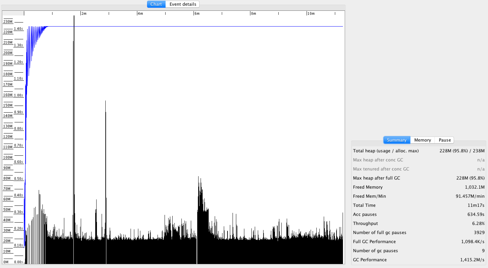


上图中, Chart 区域是对GC事件的图形化展示。包括各个内存池的大小和GC事件。上图中, 只有两个可视化指标: 蓝色线条表示堆内存的使用情况, 黑色的Bar则表示每次GC暂停时间的长短。


从图中可以看到, 内存使用量增长很快。一分钟左右就达到了堆内存的最大值.  堆内存几乎全部被消耗, 不能顺利分配新对象, 并引发频繁的 Full GC 事件. 这说明程序可能存在内存泄露, 或者启动时指定的内存空间不足。


从图中还可以看到 GC暂停的频率和持续时间。`30秒`之后, GC几乎不间断地运行,最长的暂停时间超过`1.4秒`。


在右边有三个选项卡。“**`Summary`**(摘要)” 中比较有用的是 “`Throughput`”(吞吐量百分比) 和 “`Number of GC pauses`”(GC暂停的次数), 以及“`Number of full GC pauses`”(Full GC 暂停的次数). 吞吐量显示了有效工作的时间比例, 剩下的部分就是GC的消耗。


以上示例中的吞吐量为 **`6.28%`**。这意味着有 **`93.72%`** 的CPU时间用在了GC上面. 很明显系统所面临的情况很糟糕 —— 宝贵的CPU时间没有用于执行实际工作, 而是在试图清理垃圾。


下一个有意思的地方是“**Pause**”(暂停)选项卡:

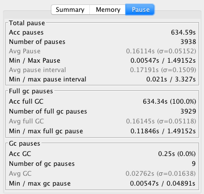


“`Pause`” 展示了GC暂停的总时间,平均值,最小值和最大值, 并且将 total 与minor/major 暂停分开统计。如果要优化程序的延迟指标, 这些统计可以很快判断出暂停时间是否过长。另外, 我们可以得出明确的信息: 累计暂停时间为 `634.59 秒`, GC暂停的总次数为 `3,938 次`, 这在`11分钟/660秒`的总运行时间里那不是一般的高。


更详细的GC暂停汇总信息, 请查看主界面中的 “**Event details**” 标签:


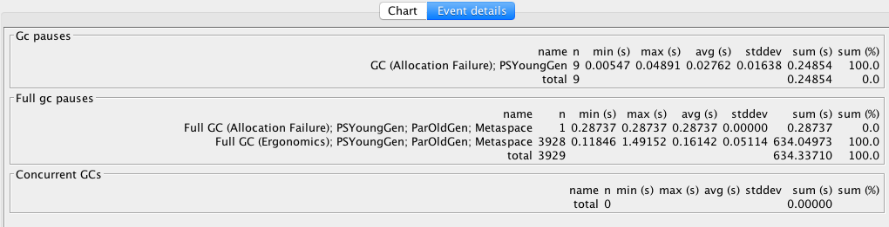


从“**Event details**” 标签中, 可以看到日志中所有重要的GC事件汇总: `普通GC停顿` 和 `Full GC 停顿次数`, 以及`并发执行数`, `非 stop-the-world 事件`等。此示例中, 可以看到一个明显的地方, Full GC 暂停严重影响了吞吐量和延迟, 依据是: `3,928 次 Full GC`, 暂停了`634秒`。


可以看到, GCViewer 能用图形界面快速展现异常的GC行为。一般来说, 图像化信息能迅速揭示以下症状:


- 低吞吐量。当应用的吞吐量下降到不能容忍的地步时, 有用工作的总时间就大量减少. 具体有多大的 “容忍度”(tolerable) 取决于具体场景。按照经验, 低于 90% 的有效时间就值得警惕了, 可能需要好好优化下GC。
- 单次GC的暂停时间过长。只要有一次GC停顿时间过长,就会影响程序的延迟指标. 例如, 延迟需求规定必须在 1000 ms以内完成交易, 那就不能容忍任何一次GC暂停超过1000毫秒。
- 堆内存使用率过高。如果老年代空间在 Full GC 之后仍然接近全满,  程序性能就会大幅降低,  可能是资源不足或者内存泄漏。这种症状会对吞吐量产生严重影响。


业界良心 —— 图形化展示的GC日志信息绝对是我们重磅推荐的。不用去阅读冗长而又复杂的GC日志,通过容易理解的图形, 也可以得到同样的信息。


## 8. 内存dump和内存分析工具介绍

内存Dump分为2种方式： 主动Dump和被动Dump。

主动Dump的工具包括: jcmd,  jmap, JVisualVM等等。具体使用请参考相关工具部分。

被动Dump主要是: hprof, 以及 `-XX:+HeapDumpOnOutOfMemoryError` 等参数。


常用的分析工具有:

- jhat 
  jhat用来支持分析dump文件, 是一个HTTP/HTML服务器，能将dump文件生成在线的HTML文件，通过浏览器查看，一般很少使用。

- MAT
  分析JVM的 Dump文件, 最好用的工具是 `mat`,  全称是 `Eclipse Memory Analyzer` Tools。  优势在于, 可以从 GC root 进行对象引用分析, 计算各个 root 所引用的对象有多少, 比较容易定位内存泄露。
  MAT是一款独立的产品, 100MB不到, 可以从官方下载。 下载地址: <https://www.eclipse.org/mat/>


### MAT使用示例

现象描述:  系统进行慢SQL优化调整之后上线。 在测试环境没有发现什么问题。但运行一段时间之后发现CPU跑满, 查看GC日志


查看本机的Java进程:

```
jps -v
```

假设jps查看到的pid为3826。

Dump内存:

```
jmap -dump:format=b,file=3826.hprof 3826
```

导出完成后, dump文件大约是3个G。所以需要修改MAT的配置参数，太小了不行，但也不一定要设置得非常大。

在MAT安装目录下。

> MemoryAnalyzer.ini

默认的内存配置是 1024MB, 分析3GB的dump文件可能会报错。

```
-vmargs
-Xmx1024m
```

根据Dump文件的大小, 适当增加最大堆内存设置, 要求是4MB的倍数, 例如:

```
-vmargs
-Xmx4g
```

双击打开 MemoryAnalyzer.exe 

选择菜单 File --> Open File...  选择对应的 dump 文件。

选择 Leak Suspects Report 并确定, 分析内存泄露方面的报告。


然后等待, 分析完成后, 汇总信息如下:


占用内存最大的问题根源1:


占用内存最大的问题根源2:

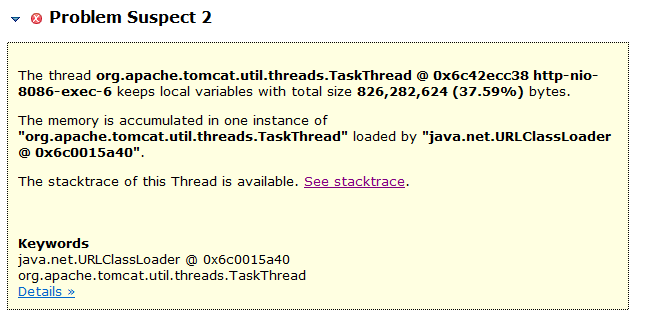


占用内存最大的问题根源3:

。


可以看到, 总的内存占用才2GB左右。问题根源1和根源2, 每个占用 800MB, 问题很可能就在他们身上。 当然, 根源3也有一定的参考价值, 表明这时候有很多JDBC操作。


查看问题根源1。 其说明信息如下:

```
The thread org.apache.tomcat.util.threads.TaskThread 
  @ 0x6c4276718 http-nio-8086-exec-8 
keeps local variables with total size 826,745,896 (37.61%) bytes.

The memory is accumulated in one instance of 
"org.apache.tomcat.util.threads.TaskThread" 
loaded by "java.net.URLClassLoader @ 0x6c0015a40".
The stacktrace of this Thread is available. See stacktrace.

Keywords
java.net.URLClassLoader @ 0x6c0015a40
org.apache.tomcat.util.threads.TaskThread

```

大致解读一下, 这是一个(运行中的)线程, 构造类是 `org.apache.tomcat.util.threads.TaskThread`, 持有了 大约 `826MB` 的对象, 占比为 `37.61%`。

> 所有运行中的线程(栈)都是GC-Root。


点开 `See stacktrace.` 链接, 查看导出时的线程调用栈。


节选如下:

```
Thread Stack

http-nio-8086-exec-8
  ...
  at org.mybatis.spring.SqlSessionTemplate.selectOne
  at com.sun.proxy.$Proxy195.countVOBy(Lcom/****/domain/vo/home/residents/ResidentsInfomationVO;)I (Unknown Source)
  at com.****.bi.home.service.residents.impl.ResidentsInfomationServiceImpl.countVOBy(....)Ljava/lang/Integer; (ResidentsInfomationServiceImpl.java:164)
  at com.****.bi.home.service.residents.impl.ResidentsInfomationServiceImpl.selectAllVOByPage(....)Ljava/util/Map; (ResidentsInfomationServiceImpl.java:267)
  at com.****.web.controller.personFocusGroups.DocPersonFocusGroupsController.loadPersonFocusGroups(....)Lcom/****/domain/vo/JSONMessage; (DocPersonFocusGroupsController.java:183)
  at org.apache.tomcat.util.threads.TaskThread$WrappingRunnable.run()V (TaskThread.java:61)
  at java.lang.Thread.run()V (Thread.java:745)

```

其中比较关键的信息, 就是找到我们自己的 package, 如: `com.****.....ResidentsInfomationServiceImpl.selectAllVOByPage` 。

并且其中给出了Java源文件所对应的行号。


分析问题根源2, 结果和根源1基本上是一样的。

当然, 还可以分析这个根源下持有的各个类的对象数量。

点击根源1说明信息下面的 `Details »` 链接, 进入详情页面。

查看其中的 “Accumulated Objects in Dominator Tree”

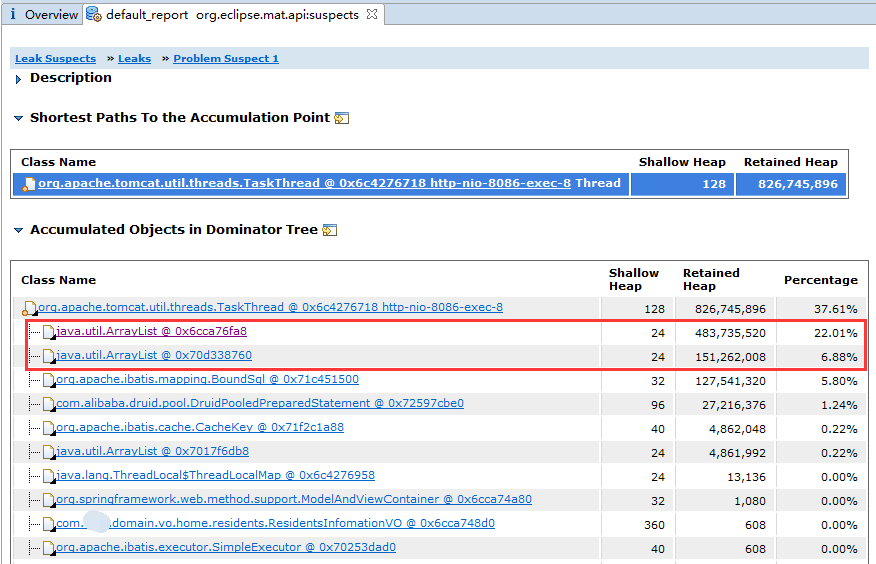

可以看到占用内存最多的是2个 ArrayList 对象。

鼠标左键点击第一个 ArrayList 对象, 在弹出的菜单中选择 "Show objects by class" --> "by outgoing references"。


打开 class_references 标签页。


展开后发现 PO 类对象有 113 万个。加载的确实有点多。直接占用170MB内存(每个对象约150字节。)

MAT还提供了其他信息, 都可以点开看看, 以增加了解。 碰到不懂的就上网搜索。


## 9. 面临复杂问题时可选的高级工具


### OOM Killer


内存溢出(Out of Memory,OOM), 是指计算机的所有可用内存(包括交换空间, swap space), 都被使用满了。 

这种情况下, 默认配置会导致系统报警, 并停止正常运行. 当然, 将 /proc/sys/vm/panic_on_oom 参数设置为 0, 则告诉系统内核, 如果系统发生内存溢出, 就可以调用 oom_killer(OOM终结者)功能, 来杀掉最胖的那头进程(rogue processes, 流氓进程), 这样系统又可以继续工作了。


假如物理内存不足, Linux 会找出一头比较壮的进程来杀掉。查看OOM终结者日志:

Linux系统的OOM终结者, Out of memory killer。

```
sudo cat /var/log/messages | grep killer -A 2 -B 2
```


### BTrace

BTrace是基于Java语言的一个安全的、可提供动态追踪服务的工具。

BTrace基于ASM、Java Attach Api、Instruments开发，为用户提供了很多注解。依靠这些注解，我们可以编写BTrace脚本（简单的Java代码）达到我们想要的效果(只读监控)，而不必深陷于ASM对字节码的操作中不可自拔。


细心的同学可能已经发现，在介绍 JVisualVM 的插件时, 截图中有相关的插件 “BTrace Workbench”。 安装插件之后，在对应的JVM实例上点右键，很容易就进入操作界面了。

BTrace 提供了很多示例，简单的监控照着改一改就行。


> 可参考: [Java动态追踪技术探究](https://tech.meituan.com/2019/02/28/java-dynamic-trace.html)


###  Arthas

Arthas（阿尔萨斯）是Alibaba开源的Java诊断工具，深受开发者喜爱。

当你遇到以下类似问题而束手无策时，`Arthas`可以帮助你解决：

1. 这个类从哪个 jar 包加载的？为什么会报各种类相关的 Exception？
2. 我改的代码为什么没有执行到？难道是我没 commit？分支搞错了？
3. 遇到问题无法在线上 debug，难道只能通过加日志再重新发布吗？
4. 线上遇到某个用户的数据处理有问题，但线上同样无法 debug，线下无法重现！
5. 是否有一个全局视角来查看系统的运行状况？
6. 有什么办法可以监控到JVM的实时运行状态？

`Arthas`支持JDK 6+，支持Linux/Mac/Winodws，采用命令行交互模式，同时提供丰富的 `Tab` 自动补全功能，进一步方便进行问题的定位和诊断。


## 10. 应对容器时代面临的挑战

在大规模集群环境中，容器使用的越来越普及。

在这种环境下，要直接进行调试并不容易【当然可能性还是有的】。这就需要架构师、开发人员、测试人员、运维人员的协作。

我们更多的是进行应用性能指标的采集和监控。 

监控领域的工具, 又多又杂, 而且一直在努力发展和迭代。

早期的监控工具, 只在系统发布时检查服务器参数，并将这些参数用作系统运行状况的指标。

服务器的健康状况保持，与用户体验之间存在相关性。杯具在于，这种方式下发生的问题比实际检测的要多。

如今，随着浏览器、通信协议和其他方面的发展，这种模式发生了变化。可以为浏览器设置代理(agent)来记录用户的体验。

这些年在日志管理、预警、遥测以及报告等领域投入了大量精力。其中一些是有效的, 记录安全事件, 有意义的警报, 资源使用量都是具备价值的跟踪数据, 但前提是有一个清晰的策略来伴随用户体验的整个链路. 有一些工具, 比如 Zabbix, Nagios, 以及 Prometheus 被广泛使用, 但都没能解决实际用户体验的监控。

只购买这些软件并不能缓解性能问题。 我们还需要采取各种措施，但这需要勇气、专注、和不懈的坚持。

Web系统性能调优是一件很严肃的事情, 需要付出很多努力, 还需要严格遵守纪律。当然, 这项工作对团队的回报也是巨大的!

请记住 —— 性能问题的关键点是人, 也就是我们的用户。

如今Java领域Spring是事实上的标准， SpringBoot提供了一款应用指标收集器: Micrometer。

- 直接支持数据上报给 Elasticsearch, Datadog, InfluxData等。
- 最大延迟，平均延迟，95%线， 吞吐量, 内存使用量 等信息。
- 详情请参考官方文档: <https://micrometer.io/docs>

此外，在小规模集群中，我们还可以使用 Pinpoint 等开源APM。


### 相关链接

官方troubleshoot指南: <https://docs.oracle.com/javase/8/docs/technotes/guides/troubleshoot/toc.html>

JDK辅助工具参考文档 : <https://docs.oracle.com/javase/8/docs/technotes/tools/unix/index.html>

HotSpot VM选项: <https://www.oracle.com/technetwork/java/javase/tech/vmoptions-jsp-140102.html>

JMX 配置指南: <https://docs.oracle.com/javase/8/docs/technotes/guides/management/agent.html>

GC性能优化系列: <https://renfufei.blog.csdn.net/column/info/14851/>

GC调优指南: <https://docs.oracle.com/javase/8/docs/technotes/guides/vm/gctuning/>

延迟(Latency): <https://bravenewgeek.com/everything-you-know-about-latency-is-wrong/>

CAPACITY TUNING: <https://access.redhat.com/documentation/en-us/red_hat_enterprise_linux/6/html/performance_tuning_guide/s-memory-captun>

JVMInternals : <http://blog.jamesdbloom.com/JVMInternals.html>

JDWP 协议及实现: <https://www.ibm.com/developerworks/cn/java/j-lo-jpda3/>
