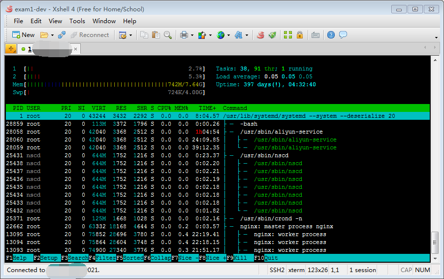

# check memory usage on Linux

# Linux系统命令 - 查看内存使用情况

## Memory Usage

On linux, there are commands for almost everything, because the gui might not be always available. When working on servers only shell access is available and everything has to be done from these commands. So today we shall be checking the commands that can be used to check memory usage on a linux system. Memory include RAM and swap.

It is often important to check memory usage and memory used per process on servers so that resources do not fall short and users are able to access the server. For example a website. If you are running a webserver, then the server must have enough memory to serve the visitors to the site. If not, the site would become very slow or even go down when there is a traffic spike, simply because memory would fall short. Its just like what happens on your desktop PC.


## 一、 查看内存使用情况

在Linux系统中，大部分操作都通过命令行来完成，因为大部分情况下不开启图形界面。
在服务器环境，则只能通过shell执行操作。
下面介绍查看内存使用情况的相关命令。 包括物理内存(RAM)和交换内存(swap)。

我们经常需要检查服务器的内存使用情况，以及每个进程占用的内存，避免发生资源短缺进而影响用户体验。
对于网站和Web服务，必须具有足够的内存才能处理客户端请求。 如果内存不足，在请求高峰时就会变得缓慢，拥堵，甚至服务崩溃。
当然桌面系统也是同样的道理。

### 1. `free` command

### 1. 使用 `free` 命令

The `free` command is the most simple and easy to use command to check memory usage on linux. Here is a quick example

`free` 命令是Linux系统中最简单和最常用的内存查看命令， 示例如下:

```

$ free -m
              total        used        free      shared  buff/cache   available
Mem:           7822         321         324         377        7175        6795
Swap:          4096           0        4095


$ free -h
              total        used        free      shared  buff/cache   available
Mem:           7.6G        322M        324M        377M        7.0G        6.6G
Swap:          4.0G        724K        4.0G

```


The `m` option displays all data in MBs. The `total` os 7976 MB is the total amount of RAM installed on the system, that is 8GB. The `used` column shows the amount of RAM that has been used by linux, in this case around 6.4 GB. The output is pretty self explanatory. The catch over here is the cached and buffers column. The second line tells that 4.6 GB is free. This is the free memory in first line added with the buffers and cached amount of memory.

Linux has the habit of caching lots of things for faster performance, so that memory can be freed and used if needed.
The last line is the swap memory, which in this case is lying entirely free.

其中， `-m` 选项是以MB为单位来展示内存使用信息; `-h` 选项则是以人类(human)可读的单位来展示。

上面的示例中, `Mem:` 这一行：

- `total` 表示总共有 `7822MB` 的物理内存(RAM)，即`7.6G`。
- `used` 表示物理内存的使用量，大约是 `322M`。
- `free` 表示空闲内存;
- `shared` 表示共享内存?;
- `buff/cache` 表示缓存和缓冲内存量;  Linux 系统会将很多东西缓存起来以提高性能，这部分内存可以在必要时进行释放，给其他程序使用。
- `available` 表示可用内存;

输出结果很容易理解。 `Swap` 这一行表示交换内存，从示例中的数字可以看到，基本上没使用到交换内存。


### 2. `/proc/meminfo`

### 2. 查看 `/proc/meminfo`

The next way to check memory usage is to read the `/proc/meminfo` file. Know that the `/proc` file system does not contain real files. They are rather virtual files that contain dynamic information about the kernel and the system.

另一种方法是读取 `/proc/meminfo` 文件。 我们知道, `/proc` 目录下都是虚拟文件，包含内核以及操作系统相关的动态信息。

```
$ cat /proc/meminfo
MemTotal:        8010408 kB
MemFree:          323424 kB
MemAvailable:    6956280 kB
Buffers:          719620 kB
Cached:          5817644 kB
SwapCached:          132 kB
Active:          5415824 kB
Inactive:        1369528 kB
Active(anon):     385660 kB
Inactive(anon):   249292 kB
Active(file):    5030164 kB
Inactive(file):  1120236 kB
Unevictable:           0 kB
Mlocked:               0 kB
SwapTotal:       4194304 kB
SwapFree:        4193580 kB
Dirty:                60 kB
Writeback:             0 kB
AnonPages:        247888 kB
Mapped:            61728 kB
Shmem:            386864 kB
Slab:             818320 kB
SReclaimable:     788436 kB
SUnreclaim:        29884 kB
KernelStack:        2848 kB
PageTables:         5780 kB
NFS_Unstable:          0 kB
Bounce:                0 kB
WritebackTmp:          0 kB
CommitLimit:     8199508 kB
Committed_AS:     942596 kB
VmallocTotal:   34359738367 kB
VmallocUsed:       22528 kB
VmallocChunk:   34359707388 kB
HardwareCorrupted:     0 kB
AnonHugePages:     88064 kB
HugePages_Total:       0
HugePages_Free:        0
HugePages_Rsvd:        0
HugePages_Surp:        0
Hugepagesize:       2048 kB
DirectMap4k:      176000 kB
DirectMap2M:     6115328 kB
DirectMap1G:     4194304 kB
```

Check the values of `MemTotal`, `MemFree`, `Buffers`, `Cached`, `SwapTotal`, `SwapFree`.

They indicate same values of memory usage as the free command.


重点关注这些数据:

- `MemTotal`, 总内存
- `MemFree`, 空闲内存
- `MemAvailable`, 可用内存
- `Buffers`, 缓冲
- `Cached`, 缓存
- `SwapTotal`, 交换内存
- `SwapFree`, 空闲交换内存

提供的信息和 `free` 命令看到的差不多。


### 3. `vmstat`

The `vmstat` command with the `s` option, lays out the memory usage statistics much like the proc command. Here is an example


### 3. 使用 `vmstat` 命令

使用 `vmstat -s` 命令和选项, 可以对内存使用情况进行统计， 类似于 `/proc/meminfo`。

示例如下:

```
$ vmstat -s
      8010408 K total memory
       344016 K used memory
      5444384 K active memory
      1380052 K inactive memory
       283468 K free memory
       719668 K buffer memory
      6663256 K swap cache
      4194304 K total swap
          724 K used swap
      4193580 K free swap
    132859985 non-nice user cpu ticks
        29816 nice user cpu ticks
     37600986 system cpu ticks
   6643195204 idle cpu ticks
      2721822 IO-wait cpu ticks
            0 IRQ cpu ticks
       592418 softirq cpu ticks
            0 stolen cpu ticks
     13092214 pages paged in
    293257816 pages paged out
            8 pages swapped in
         1365 pages swapped out
   3396492150 interrupts
   1327657196 CPU context switches
   1548248091 boot time
      8811556 forks

```

The top few lines indicate total memory, free memory etc and so on.

最前面的几行，显示了内存总量，使用量，以及空闲内存等信息。


### 4. top command

The `top` command is generally used to check memory and cpu usage per process. However it also reports total memory usage and can be used to monitor the total RAM usage. The header on output has the required information. Here is a sample output

### 4. 使用 `top` 命令

`top` 命令一般用于查看进程的CPU和内存使用情况；当然也会报告内存总量，以及内存使用情况，所以可用来监控物理内存的使用情况。
在输出信息的顶部展示了汇总信息。

示例输出:


```
top - 15:20:30 up  6:57,  5 users,  load average: 0.64, 0.44, 0.33
Tasks: 265 total,   1 running, 263 sleeping,   0 stopped,   1 zombie
%Cpu(s):  7.8 us,  2.4 sy,  0.0 ni, 88.9 id,  0.9 wa,  0.0 hi,  0.0 si,  0.0 st
KiB Mem:   8167848 total,  6642360 used,  1525488 free,  1026876 buffers
KiB Swap:  1998844 total,        0 used,  1998844 free,  2138148 cached

  PID USER      PR  NI  VIRT  RES  SHR S  %CPU %MEM    TIME+  COMMAND                                                                                 
 2986 enlighte  20   0  584m  42m  26m S  14.3  0.5   0:44.27 yakuake                                                                                 
 1305 root      20   0  448m  68m  39m S   5.0  0.9   3:33.98 Xorg                                                                                    
 7701 enlighte  20   0  424m  17m  10m S   4.0  0.2   0:00.12 kio_thumbnail
```

各种操作系统提供的参数略有不同，一般来说都可以根据CPU和内存来排序。

例如:

```
# CentOS
top -o %MEM
top -o %CPU

# mac
top -o mem
top -o cpu
```

Check the KiB Mem and KiB Swap lines on the header. They indicate total, used and free amounts of the memory. The buffer and cache information is present here too, like the free command.

碰到不清楚的，请使用 `top -h` 查看帮助信息。

重点关注顶部的 `KiB Mem` 和  `KiB Swap` 这两行。 表示内存的总量、使用量，以及可用量。
buffer 和 cache 部分，和 `free` 命令展示的差不多。

### 5. htop

Similar to the `top` command, the `htop` command also shows memory usage along with various other details.

htop memory ram usage

The header on top shows cpu usage along with RAM and swap usage with the corresponding figures.

### 5. `htop` 命令

与 `top` 命令类似， 但 `htop` 还展示了其他的各种信息, 而且支持彩色显示。



顶部的消息显示了CPU使用率, 以及RAM和交换内存的使用情况。


## RAM Information

## 二、 查看物理内存信息

To find out hardware information about the installed RAM, use the `demidecode` command. It reports lots of information about the installed RAM memory.

想要查看物理内存的硬件信息，可以使用 `demidecode` 命令。
这个命令会输出物理内存相关的信息。

```
$ dmidecode -t 17

# dmidecode 3.0
Getting SMBIOS data from sysfs.
SMBIOS 2.8 present.

Handle 0x1100, DMI type 17, 40 bytes
Memory Device
	Array Handle: 0x1000
	Error Information Handle: Not Provided
	Total Width: Unknown
	Data Width: Unknown
	Size: 8192 MB
	Form Factor: DIMM
	Set: None
	Locator: DIMM 0
	Bank Locator: Not Specified
	Type: RAM
	Type Detail: Other
	Speed: Unknown
	Manufacturer: Alibaba Cloud
	Serial Number: Not Specified
	Asset Tag: Not Specified
	Part Number: Not Specified
	Rank: Unknown
	Configured Clock Speed: Unknown
	Minimum Voltage: Unknown
	Maximum Voltage: Unknown
	Configured Voltage: Unknown
```

Provided information includes the size (2048MB), type (DDR2) , speed(667 Mhz) etc.

`dmidecode -t 17` 展示的信息包括 内存大小, 类型，带宽等信息。 当然，因为示例中使用的是虚拟机，所以有的信息是不可用的。

如果不加 `-t` 参数，则展示所有类型的硬件信息。 也可以指定其他 `-t` 参数来查看对应的硬件信息。

## Summary

All the above mentioned commands work from the terminal and do not have a gui. When working on a desktop with a gui, it is much easier to use a GUI tool with graphical output. The most common tools are gnome-system-monitor on gnome and
ksysguard on KDE. Both provide resource usage information about cpu, ram, swap and network bandwidth in a graphical and easy to understand visual output.

## 小结

本文介绍的命令都可以在shell终端上执行，不需要图形界面来展示。
如果使用带有图形界面的Linux桌面系统，则使用图形工具会更直观。 一般来说图形桌面都会提供对应的系统监控工具。 输出容易理解的 cpu, 物理内存, 交换内存, 网络带宽等资源的使用信息。


## 相关链接

- <https://www.binarytides.com/linux-command-check-memory-usage/>
- <http://virtualthreads.blogspot.com/2006/02/understanding-memory-usage-on-linux.html>

- [CSDN文章链接: Linux系统命令 - 查看内存使用情况](https://renfufei.blog.csdn.net/article/details/105851728)
- [GitHub中英双语版本: Linux系统命令 - 查看内存使用情况](https://github.com/cncounter/translation/blob/master/tiemao_2020/05_linux-memory-usage/README.md)
