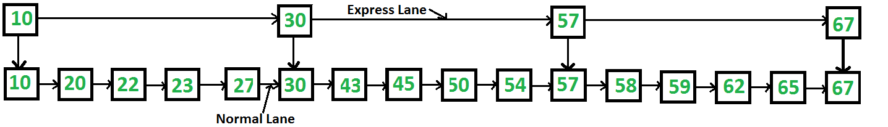
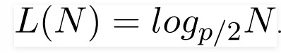
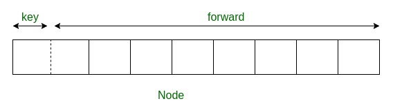
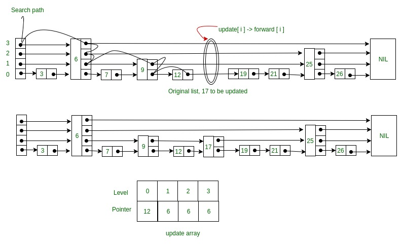
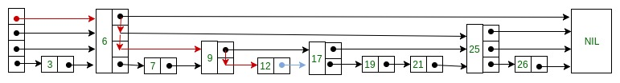
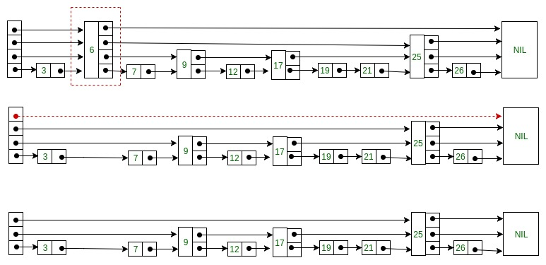

# Skip List

[TOC]

## Skip List | Set 1 (Introduction)

### Can we search in a sorted linked list in better than O(n) time?

The worst case search time for a sorted linked list is O(n) as we can only linearly traverse the list and cannot skip nodes while searching. For a Balanced Binary Search Tree, we skip almost half of the nodes after one comparison with root. For a sorted array, we have random access and we can apply Binary Search on arrays.

Can we augment sorted linked lists to make the search faster? The answer is Skip List. The idea is simple, we create multiple layers so that we can skip some nodes. See the following example list with 16 nodes and two layers. The upper layer works as an “express lane” which connects only main outer stations, and the lower layer works as a “normal lane” which connects every station. Suppose we want to search for 50, we start from first node of “express lane” and keep moving on “express lane” till we find a node whose next is greater than 50. Once we find such a node (30 is the node in following example) on “express lane”, we move to “normal lane” using pointer from this node, and linearly search for 50 on “normal lane”. In following example, we start from 30 on “normal lane” and with linear search, we find 50.





### What is the time complexity with two layers?

The worst case time complexity is number of nodes on “express lane” plus number of nodes in a segment (A segment is number of “normal lane” nodes between two “express lane” nodes) of “normal lane”. So if we have n nodes on “normal lane”, √n (square root of n) nodes on “express lane” and we equally divide the “normal lane”, then there will be √n nodes in every segment of “normal lane” . √n is actually optimal division with two layers. With this arrangement, the number of nodes traversed for a search will be O(√n). Therefore, with O(√n) extra space, we are able to reduce the time complexity to O(√n).

### Can we do better?

The time complexity of skip lists can be reduced further by adding more layers. In fact, the time complexity of search, insert and delete can become O(Logn) in average case with O(n) extra space. We will soon be publishing more posts on Skip Lists.

### References

- [MIT Video Lecture on Skip Lists](https://ocw.mit.edu/courses/electrical-engineering-and-computer-science/6-046j-introduction-to-algorithms-sma-5503-fall-2005/video-lectures/lecture-12-skip-lists/)
- <http://en.wikipedia.org/wiki/Skip_list>


##  Skip List | Set 2 (Insertion)

We have already discussed the idea of Skip list and how they work.
Next, we will be discussing how to insert an element in Skip list.

### Deciding nodes level

Each element in the list is represented by a node, the level of the node is chosen randomly while insertion in the list.

Level does not depend on the number of elements in the node. The level for node is decided by the following algorithm –


```c
randomLevel()
lvl := 1
//random() that returns a random value in [0...1)
while random() < p and lvl < MaxLevel do
lvl := lvl + 1
return lvl
```


> MaxLevel is the upper bound on number of levels in the skip list.

It can be determined as:



Above algorithm assure that random level will never be greater than MaxLevel. Here p is the fraction of the nodes with level i pointers also having level i+1 pointers and N is the number of nodes in the list.

### Node Structure

Each node carries a key and a forward array carrying pointers to nodes of a different level. A level i node carries i forward pointers indexed through 0 to i.




### Insertion in Skip List

We will start from highest level in the list and compare key of next node of the current node with the key to be inserted. Basic idea is If:


1. Key of next node is less than key to be inserted then we keep on moving forward on the same level
2. Key of next node is greater than the key to be inserted then we store the pointer to current node i at update[i] and move one level down and continue our search.

At the level 0, we will definitely find a position to insert given key. Following is the pseudo code for the insertion algorithm:

```c++
Insert(list, searchKey)
local update[0...MaxLevel+1]
x := list -> header
for i := list -> level downto 0 do
    while x -> forward[i] -> key  forward[i]
update[i] := x
x := x -> forward[0]
lvl := randomLevel()
if lvl > list -> level then
for i := list -> level + 1 to lvl do
    update[i] := list -> header
    list -> level := lvl
x := makeNode(lvl, searchKey, value)
for i := 0 to level do
    x -> forward[i] := update[i] -> forward[i]
    update[i] -> forward[i] := x
```

Here update[i] holds the pointer to node at level i from which we moved down to level i-1 and pointer of node left to insertion position at level 0. Consider this example where we want to insert key 17:




Following is the code for insertion of key in Skip list:

```
// C++ code for inserting element in skip list

#include <bits/stdc++.h>
using namespace std;

// Class to implement node
class Node
{
public:
	int key;

	// Array to hold pointers to node of different level
	Node **forward;
	Node(int, int);
};

Node::Node(int key, int level)
{
	this->key = key;

	// Allocate memory to forward
	forward = new Node*[level+1];

	// Fill forward array with 0(NULL)
	memset(forward, 0, sizeof(Node*)*(level+1));
};

// Class for Skip list
class SkipList
{
	// Maximum level for this skip list
	int MAXLVL;

	// P is the fraction of the nodes with level
	// i pointers also having level i+1 pointers
	float P;

	// current level of skip list
	int level;

	// pointer to header node
	Node *header;
public:
	SkipList(int, float);
	int randomLevel();
	Node* createNode(int, int);
	void insertElement(int);
	void displayList();
};

SkipList::SkipList(int MAXLVL, float P)
{
	this->MAXLVL = MAXLVL;
	this->P = P;
	level = 0;

	// create header node and initialize key to -1
	header = new Node(-1, MAXLVL);
};

// create random level for node
int SkipList::randomLevel()
{
	float r = (float)rand()/RAND_MAX;
	int lvl = 0;
	while (r < P && lvl < MAXLVL)
	{
		lvl++;
		r = (float)rand()/RAND_MAX;
	}
	return lvl;
};

// create new node
Node* SkipList::createNode(int key, int level)
{
	Node *n = new Node(key, level);
	return n;
};

// Insert given key in skip list
void SkipList::insertElement(int key)
{
	Node *current = header;

	// create update array and initialize it
	Node *update[MAXLVL+1];
	memset(update, 0, sizeof(Node*)*(MAXLVL+1));

	/* start from highest level of skip list
		move the current pointer forward while key
		is greater than key of node next to current
		Otherwise inserted current in update and
		move one level down and continue search
	*/
	for (int i = level; i >= 0; i--)
	{
		while (current->forward[i] != NULL &&
			current->forward[i]->key < key)
			current = current->forward[i];
		update[i] = current;
	}

	/* reached level 0 and forward pointer to
	right, which is desired position to
	insert key.
	*/
	current = current->forward[0];

	/* if current is NULL that means we have reached
	to end of the level or current's key is not equal
	to key to insert that means we have to insert
	node between update[0] and current node */
	if (current == NULL || current->key != key)
	{
		// Generate a random level for node
		int rlevel = randomLevel();

		// If random level is greater than list's current
		// level (node with highest level inserted in
		// list so far), initialize update value with pointer
		// to header for further use
		if (rlevel > level)
		{
			for (int i=level+1;i<rlevel+1;i++)
				update[i] = header;

			// Update the list current level
			level = rlevel;
		}

		// create new node with random level generated
		Node* n = createNode(key, rlevel);

		// insert node by rearranging pointers
		for (int i=0;i<=rlevel;i++)
		{
			n->forward[i] = update[i]->forward[i];
			update[i]->forward[i] = n;
		}
		cout << "Successfully Inserted key " << key << "\n";
	}
};

// Display skip list level wise
void SkipList::displayList()
{
	cout<<"\n*****Skip List*****"<<"\n";
	for (int i=0;i<=level;i++)
	{
		Node *node = header->forward[i];
		cout << "Level " << i << ": ";
		while (node != NULL)
		{
			cout << node->key<<" ";
			node = node->forward[i];
		}
		cout << "\n";
	}
};

// Driver to test above code
int main()
{
	// Seed random number generator
	srand((unsigned)time(0));

	// create SkipList object with MAXLVL and P
	SkipList lst(3, 0.5);

	lst.insertElement(3);
	lst.insertElement(6);
	lst.insertElement(7);
	lst.insertElement(9);
	lst.insertElement(12);
	lst.insertElement(19);
	lst.insertElement(17);
	lst.insertElement(26);
	lst.insertElement(21);
	lst.insertElement(25);
	lst.displayList();
}
```

Output:

```shells
Successfully Inserted key 3
Successfully Inserted key 6
Successfully Inserted key 7
Successfully Inserted key 9
Successfully Inserted key 12
Successfully Inserted key 19
Successfully Inserted key 17
Successfully Inserted key 26
Successfully Inserted key 21
Successfully Inserted key 25


*****Skip List*****
Level 0: 3 6 7 9 12 17 19 21 25 26
Level 1: 3 6 12 17 25
Level 2: 6 12 17 25
Level 3: 12 17 25
```

Python code : <https://www.geeksforgeeks.org/skip-list-set-2-insertion/>

Note: The level of nodes is decided randomly, so output may differ.

Time complexity (Average): `O(log n)`
Time complexity (Worst): `O(n)`

In next article we will discuss searching and deletion in Skip List.
References


## Skip List | Set 3 (Searching and Deletion)

we discussed the structure of skip nodes and how to insert an element in the skip list.

we will discuss how to search and delete an element from skip list.

### Searching an element in Skip list

Searching an element is very similar to approach for searching a spot for inserting an element in Skip list. The basic idea is if:

1. Key of next node is less than search key then we keep on moving forward on the same level.
2. Key of next node is greater than the key to be inserted then we store the pointer to current node i at update[i] and move one level down and continue our search.

At the lowest level (0), if the element next to the rightmost element (update[0]) has key equal to the search key, then we have found key otherwise failure.

Following is the pseudo code for searching element:

```c
Search(list, searchKey)
x := list -> header
-- loop invariant: x -> key  level downto 0 do
    while x -> forward[i] -> key  forward[i]
x := x -> forward[0]
if x -> key = searchKey then return x -> value
else return failure
```

Consider this example where we want to search for key 17:




### Deleting an element from the Skip list

Deletion of an element k is preceded by locating element in the Skip list using above mentioned search algorithm. Once the element is located, rearrangement of pointers is done to remove element form list just like we do in singly linked list. We start from lowest level and do rearrangement until element next to update[i] is not k.

After deletion of element there could be levels with no elements, so we will remove these levels as well by decrementing the level of Skip list. Following is the pseudo code for deletion:

```c
Delete(list, searchKey)
local update[0..MaxLevel+1]
x := list -> header
for i := list -> level downto 0 do
    while x -> forward[i] -> key  forward[i]
    update[i] := x
x := x -> forward[0]
if x -> key = searchKey then
    for i := 0 to list -> level do
        if update[i] -> forward[i] ≠ x then break
        update[i] -> forward[i] := x -> forward[i]
    free(x)
    while list -> level > 0 and list -> header -> forward[list -> level] = NIL do
        list -> level := list -> level – 1
```

Consider this example where we want to delete element 6:




Here at level 3, there is no element (arrow in red) after deleting element 6. So we will decrement level of skip list by 1.

Following is the code for searching and deleting element from Skip List:

```c++
// C++ code for searching and deleting element in skip list

#include <bits/stdc++.h>
using namespace std;

// Class to implement node
class Node
{
public:
	int key;

	// Array to hold pointers to node of different level
	Node **forward;
	Node(int, int);
};

Node::Node(int key, int level)
{
	this->key = key;

	// Allocate memory to forward
	forward = new Node*[level+1];

	// Fill forward array with 0(NULL)
	memset(forward, 0, sizeof(Node*)*(level+1));
};

// Class for Skip list
class SkipList
{
	// Maximum level for this skip list
	int MAXLVL;

	// P is the fraction of the nodes with level
	// i pointers also having level i+1 pointers
	float P;

	// current level of skip list
	int level;

	// pointer to header node
	Node *header;
public:
	SkipList(int, float);
	int randomLevel();
	Node* createNode(int, int);
	void insertElement(int);
	void deleteElement(int);
	void searchElement(int);
	void displayList();
};

SkipList::SkipList(int MAXLVL, float P)
{
	this->MAXLVL = MAXLVL;
	this->P = P;
	level = 0;

	// create header node and initialize key to -1
	header = new Node(-1, MAXLVL);
};

// create random level for node
int SkipList::randomLevel()
{
	float r = (float)rand()/RAND_MAX;
	int lvl = 0;
	while(r < P && lvl < MAXLVL)
	{
		lvl++;
		r = (float)rand()/RAND_MAX;
	}
	return lvl;
};

// create new node
Node* SkipList::createNode(int key, int level)
{
	Node *n = new Node(key, level);
	return n;
};

// Insert given key in skip list
void SkipList::insertElement(int key)
{
	Node *current = header;

	// create update array and initialize it
	Node *update[MAXLVL+1];
	memset(update, 0, sizeof(Node*)*(MAXLVL+1));

	/* start from highest level of skip list
		move the current pointer forward while key
		is greater than key of node next to current
		Otherwise inserted current in update and
		move one level down and continue search
	*/
	for(int i = level; i >= 0; i--)
	{
		while(current->forward[i] != NULL &&
			current->forward[i]->key < key)
			current = current->forward[i];
		update[i] = current;
	}

	/* reached level 0 and forward pointer to
	right, which is desired position to
	insert key.
	*/
	current = current->forward[0];

	/* if current is NULL that means we have reached
	to end of the level or current's key is not equal
	to key to insert that means we have to insert
	node between update[0] and current node */
	if (current == NULL || current->key != key)
	{
		// Generate a random level for node
		int rlevel = randomLevel();

		/* If random level is greater than list's current
		level (node with highest level inserted in
		list so far), initialize update value with pointer
		to header for further use */
		if(rlevel > level)
		{
			for(int i=level+1;i<rlevel+1;i++)
				update[i] = header;

			// Update the list current level
			level = rlevel;
		}

		// create new node with random level generated
		Node* n = createNode(key, rlevel);

		// insert node by rearranging pointers
		for(int i=0;i<=rlevel;i++)
		{
			n->forward[i] = update[i]->forward[i];
			update[i]->forward[i] = n;
		}
		cout<<"Successfully Inserted key "<<key<<"\n";
	}
};

// Delete element from skip list
void SkipList::deleteElement(int key)
{
	Node *current = header;

	// create update array and initialize it
	Node *update[MAXLVL+1];
	memset(update, 0, sizeof(Node*)*(MAXLVL+1));

	/* start from highest level of skip list
		move the current pointer forward while key
		is greater than key of node next to current
		Otherwise inserted current in update and
		move one level down and continue search
	*/
	for(int i = level; i >= 0; i--)
	{
		while(current->forward[i] != NULL &&
			current->forward[i]->key < key)
			current = current->forward[i];
		update[i] = current;
	}

	/* reached level 0 and forward pointer to
	right, which is possibly our desired node.*/
	current = current->forward[0];

	// If current node is target node
	if(current != NULL and current->key == key)
	{
		/* start from lowest level and rearrange
		pointers just like we do in singly linked list
		to remove target node */
		for(int i=0;i<=level;i++)
		{
			/* If at level i, next node is not target
			node, break the loop, no need to move
			further level */
			if(update[i]->forward[i] != current)
				break;

			update[i]->forward[i] = current->forward[i];
		}

		// Remove levels having no elements
		while(level>0 &&
			header->forward[level] == 0)
			level--;
		cout<<"Successfully deleted key "<<key<<"\n";
	}
};

// Search for element in skip list
void SkipList::searchElement(int key)
{
	Node *current = header;

	/* start from highest level of skip list
		move the current pointer forward while key
		is greater than key of node next to current
		Otherwise inserted current in update and
		move one level down and continue search
	*/
	for(int i = level; i >= 0; i--)
	{
		while(current->forward[i] &&
			current->forward[i]->key < key)
			current = current->forward[i];

	}

	/* reached level 0 and advance pointer to
	right, which is possibly our desired node*/
	current = current->forward[0];

	// If current node have key equal to
	// search key, we have found our target node
	if(current and current->key == key)
		cout<<"Found key: "<<key<<"\n";
};

// Display skip list level wise
void SkipList::displayList()
{
	cout<<"\n*****Skip List*****"<<"\n";
	for(int i=0;i<=level;i++)
	{
		Node *node = header->forward[i];
		cout<<"Level "<<i<<": ";
		while(node != NULL)
		{
			cout<<node->key<<" ";
			node = node->forward[i];
		}
		cout<<"\n";
	}
};

// Driver to test above code
int main()
{
	// Seed random number generator
	srand((unsigned)time(0));

	// create SkipList object with MAXLVL and P
	SkipList lst(3, 0.5);

	lst.insertElement(3);
	lst.insertElement(6);
	lst.insertElement(7);
	lst.insertElement(9);
	lst.insertElement(12);
	lst.insertElement(19);
	lst.insertElement(17);
	lst.insertElement(26);
	lst.insertElement(21);
	lst.insertElement(25);
	lst.displayList();

	//Search for node 19
	lst.searchElement(19);

	//Delete node 19
	lst.deleteElement(19);
	lst.displayList();
}

```

Output:

```shell
Successfully Inserted key 3
Successfully Inserted key 6
Successfully Inserted key 7
Successfully Inserted key 9
Successfully Inserted key 12
Successfully Inserted key 19
Successfully Inserted key 17
Successfully Inserted key 26
Successfully Inserted key 21
Successfully Inserted key 25

*****Skip List*****
Level 0: 3 6 7 9 12 17 19 21 25 26
Level 1: 3 17 19 21 26
Level 2: 17 19 21
Found key: 19
Successfully deleted key 19

*****Skip List*****
Level 0: 3 6 7 9 12 17 21 25 26
Level 1: 3 17 21 26
Level 2: 17 21
```

Python code: <https://www.geeksforgeeks.org/skip-list-set-3-searching-deletion/>


Time complexity of both searching and deletion is same:
Time complexity (Average): `O(log n)`
Time complexity (Worst): `O(n)`


## References


- PDF File: <ftp://ftp.cs.umd.edu/pub/skipLists/skiplists.pdf>

- Skip List Video: <https://youtu.be/ypod5jeYzAU>

- 原文链接: <https://www.geeksforgeeks.org/skip-list/>
