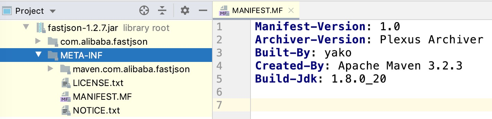

# JAR File Specification

# Java规范系列: JAR文件规范

[TOC]


## Introduction

JAR file is a file format based on the popular ZIP file format and is used for aggregating many files into one. A JAR file is essentially a zip file that contains an optional `META-INF` directory. A JAR file can be created by the command-line jar tool, or by using the [`java.util.jar`](https://docs.oracle.com/en/java/javase/14/docs/api/java.base/java/util/jar/package-summary.html) API in the Java platform. There is no restriction on the name of a JAR file, it can be any legal file name on a particular platform.

## 1. JAR文件格式

JAR文件基于ZIP文件格式, 用于将多个文件打包成一个压缩文件。
本质上JAR文件就是一个zip文件, 其中包含一个可选的 `META-INF` 目录。
可以通过命令行工具 `jar` 打包jar文件, 也可以在程序中使用[`java.util.jar`](https://docs.oracle.com/en/java/javase/14/docs/api/java.base/java/util/jar/package-summary.html)里面的工具类来创建jar文件。
JAR文件的名称没有限制, 只要符合所在平台上的文件命名规则即可。



## Modular JAR files

A modular JAR file is a JAR file that has a module descriptor, `module-info.class`, in the top-level directory (or root) directory. The module descriptor is the binary form of a module declaration. (Note the section on [multi-release JAR files](#multi-release-jar-files) further refines the definition of modular JAR files.)

A modular JAR file deployed on the module path, as opposed to the class path, is an *explicit* module. Dependences and service providers are declared in the module descriptor. If the modular JAR file is deployed on the class path then it behaves as if a non-modular JAR file.

A non-modular JAR file deployed on the module path is an *automatic module*. If the JAR file has a main attribute `Automatic-Module-Name` (see [Main Attributes](#main-attributes)) then the attribute's value is the module name, otherwise the module name is derived from the name of the JAR file as specified in [`ModuleFinder.of(Path...)`](https://docs.oracle.com/en/java/javase/14/docs/api/java.base/java/lang/module/ModuleFinder.html#automatic-modules).

## 2. 模块化JAR文件

模块化JAR文件也是JAR文件格式, 其内部的顶级路径(根路径)下有一个模块描述文件 `module-info.class`。
模块描述文件是模块声明的二进制形式。  更详细的模块化JAR文件定义请参考: [multi-release JAR files](#multi-release-jar-files)。

相对于类路径, 部署在模块路径下的模块化JAR文件是 **显式的** 模块。
依赖项和服务提供者都在模块描述符中声明。
如果将模块化JAR文件部署到类路径中, 则其行为就如同非模块化的JAR文件一样。

部署在模块路径下的非模块化JAR文件则是 **自动模块**。
如果JAR文件具有主属性 [`Automatic-Module-Name`](#main-attributes), 那么模块名称就是该属性的值, 否则模块名称根据 Jar 文件名推导得出, 具体推导规则请参考: [`ModuleFinder.of(Path...)`](https://docs.oracle.com/en/java/javase/14/docs/api/java.base/java/lang/module/ModuleFinder.html#automatic-modules).

## Multi-release JAR files

A multi-release JAR file allows for a single JAR file to support multiple major versions of Java platform releases. For example, a multi-release JAR file can depend on both the Java 8 and Java 9 major platform releases, where some class files depend on APIs in Java 8 and other class files depend on APIs in Java 9. This enables library and framework developers to decouple the use of APIs in a specific major version of a Java platform release from the requirement that all their users migrate to that major version. Library and framework developers can gradually migrate to and support new Java features while still supporting the old features.

A multi-release JAR file is identified by the main attribute:

## 3. 多版本JAR文件

多版本JAR文件, 允许单个JAR文件支持多个JDK版本。
例如, 一个多版本的JAR文件可以同时依赖Java 8和Java 9版本, 其中, 有一些类文件是兼容Java 8中的API, 另一些类文件则兼容Java 9的API。
这个特性主要是第三方库和框架的开发人员在使用, 以便兼容不同的JDK版本。
第三方库和框架的开发人员可以逐步迁移并支持新的Java特性, 同时也兼容旧的特性。

多版本JAR文件由main属性来标识:

```
Multi-Release: true
```

declared in the main section of the [JAR Manifest](#jar-manifest).

Classes and resource files dependent on a major version, 9 or greater, of a Java platform release may be located under a *versioned directory* instead of under the top-level (or root) directory. The versioned directory is located under the [the META-INF directory](#the-meta-inf-directory) and is of the form:

在 [JAR Manifest](#jar-manifest) 的main这一节中声明。

依赖于Java 9 或更高版本的类和资源文件可以放到 **特定版本目录** 下, 而不是顶级目录中。
版本目录位于 [META-INF](#the-meta-inf-directory) 下面, 其格式为:

```
META-INF/versions/N
```

where N is the string representation of the major version number of a Java platform release. Specifically `N` must conform to the specification:

其中 `N` 是Java平台大版本号的字符串表示形式。 具体来说, `N`的格式需要满足:

| N: | `{1-9}{0-9}*` |
| :--- | ------------------ |
|      |                    |


Any versioned directory whose value of `N` is less than `9` is ignored as is a string representation of `N` that does not conform to the above specification.

A class file under a versioned directory, of version `N` say, in a multi-release JAR must have a class file version less than or equal to the class file version associated with `N`th major version of a Java platform release. If the class of the class file is public or protected then that class must *preside over* a class of the same fully qualified name and access modifier whose class file is present under the top-level directory. By logical extension this applies to a class of a class file, if present, under a versioned directory whose version is less than `N`.

如果N的值小于9 将被忽略, 不符合上述规范的版本目录也会被忽略。

在多版本JAR中, 版本目录`N`下面的 class 文件, 其 class file version 必须小于等于Java平台第N个大版本对应的 major version。
如果类文件中的类是 public 或 protected 的, 那么根目录下也必须能够找到具有完全限定名和访问修饰符的class。
通过逻辑扩展, 这同样适用于版本小于`N`的类文件。

If a multi-release JAR file is deployed on the class path or module path (as an automatic module or an explicit [multi-release module](#modular-multi-release-jar-files)) of major version `N` of a Java platform release runtime, then a class loader loading classes from that JAR file will first search for class files under the `N`th versioned directory, then prior versioned directories in descending order (if present), down to a lower major version bound of `9`, and finally under the top-level directory.

The public API exported by the classes in a multi-release JAR file must be *exactly* the same across versions, hence at a minimum why versioned public or protected classes for class files under a versioned directory must preside over classes for class files under the top-level directory. It is difficult and costly to perform extensive API verification checks as such tooling, such as the `jar` tool, is not required to perform extensive verification and a Java runtime is not required to perform any verification. A future release of this specification may relax the exact same API constraint to support careful evolution.

如果将多版本JAR文件部署到 class path 或 module path 中, 假设JDK版本为 `N`,  那么class loader从该JAR文件加载class的时候, 将优先搜索版本目录`N`, 找不到则递减, 搜索 `N-1`, 直到下限9为止, 最后才会搜索顶级目录。

多版本JAR文件中, 各个版本暴露的 public API 必须 “完全一致`,  这就解释了为什么特定版本目录下的 public 和 protected 类文件, 都必须在根目录下存在相同限定名的类。
执行扩展API的校验非常困难而且开销很大, 所以并不要求 `jar` 之类的工具来验证,  也不要求Java运行时来执行这类验证。
本规范未来的版本可能会放宽完全一致的API约束, 以支持谨慎的演进。


Resources under the `META-INF` directory cannot be versioned (such as for service configuration).

A multi-release JAR file can be signed.

Multi-release JAR files are not supported by the boot class loader of a Java runtime. If a multi-release JAR file is appended to the boot class path (with the `-Xbootclasspath/a` option) then the JAR is treated as if it is an ordinary JAR file.


`META-INF` 目录下的资源无法进行版本控制(例如服务配置)。

多版本JAR文件也可以进行签名。

Java运行时的引导类加载器( boot class loader)不支持多版本JAR文件。
如果将多版本JAR文件放到引导类路径(使用 `-Xbootclasspath/a` 选项), 则该JAR将被当做一个普通的JAR文件。

### Modular multi-release JAR files

A modular multi-release JAR file is a multi-release JAR file that has a module descriptor, `module-info.class`, in the top-level directory (as for a [modular](#modular-jar-files) JAR file), or directly in a versioned directory.

A public or protected class in a non-exported package (that is not declared as exported in the module descriptor) need not preside over a class of the same fully qualified name and access modifier whose class file is present under the top-level directory.

A module descriptor is generally treated no differently to any other class or resource file. A module descriptor may be present under a versioned area but not present under the top-level directory. This ensures, for example, only Java 8 versioned classes can be present under the top-level directory while Java 9 versioned classes (including, or perhaps only, the module descriptor) can be present under the `9` versioned directory.

Any versioned module descriptor that presides over a lesser versioned module descriptor or that at the top-level, `M` say, must be identical to `M`, with two exceptions:

1. the presiding versioned descriptor can have different non-`transitive` `requires` clauses of `java.*` and `jdk.*` modules; and
2. the presiding versioned descriptor can have different `uses` clauses, even of service types defined outside of `java.*` and `jdk.*` modules.

Tooling, such as the `jar` tool, should perform such verification of versioned module descriptors but a Java runtime is not required to perform any verification.

### 模块化的多版本JAR文件

模块化的多版本JAR文件, 内部兼容多个JDK版本, 通过描述模块信息的 `module-info.class` 文件来描述, 这个描述文件位于模块化JAR文件的顶层目录, 或者位于版本目录中。

在模块描述符中未声明为导出的包称为非导出包, 其中的 public 或 protected 类, 不需要具有相同的完全限定名和访问修饰符的类, 其 class 文件直接放到顶级目录下。

模块描述符与其他的class文件或资源文件并不区别对待。 模块描述符可以存放在版本化区域下, 而不必存放在顶级目录下。 这样就确保了只有 Java 8 版本的类会出现在顶级目录下, 而Java 9版本的类(包括模块描述符)会出现在`9`版本目录下。

更小版本的模块描述符, 或者顶层的模块描述符, 都必须与`M`相同, 但有两个例外:

1. 主版本描述符可以和 `java.*` 和 `jdk.*` 模块具有不同的 non-`transitive` `requires` 子句；
2. 主导版本描述符可以具有不同的 `uses` 子句, 即使是在 `java.*` 和 `jdk.*` 模块之外定义的服务类型也是如此。

例如 `jar` 之类的工具, 应该执行版本化模块描述符的验证, 但 Java 运行时不需要执行任何验证。


## The META-INF directory

The following files/directories in the META-INF directory are recognized and interpreted by the Java Platform to configure applications, class loaders and services:

## 4. `META-INF` 目录

Java平台通过解析 `META-INF` 目录下的文件和目录, 自动配置应用程序, 类加载器以及服务:

- `MANIFEST.MF`

  The manifest file that is used to define package related data.

  清单文件, 用于定义与Jar包相关的数据。

- `INDEX.LIST`

  This file is generated by the new "`-i`" option of the jar tool, which contains location information for packages defined in an application. It is part of the JarIndex implementation and used by class loaders to speed up their class loading process.

  这个文件由 jar 工具的新选项 "`-i`" 生成, 包含应用程序中定义的 package 的位置信息。 它是 JarIndex 实现的一部分, 用来加快 class loader 的类加载过程。

- `xxx.SF`

  The signature file for the JAR file. 'xxx' stands for the base file name.

  JAR文件的签名文件。 'xxx' 代表基本文件名。

- `xxx.DSA`

  The signature block file associated with the signature file with the same base file name. This file stores the digital signature of the corresponding signature file.

  与具有相同文件名的 `xxx.SF` 文件关联, 表示其签名块。 该文件用来存储相应签名文件的数字签名。

- `services/`

  This directory stores all the service provider configuration files for JAR files deployed on the class path or JAR files deployed as automatic modules on the module path. See the specification of [service provider development](https://docs.oracle.com/en/java/javase/14/docs/api/java.base/java/util/ServiceLoader.html#developing-service-providers) for more details.

  这个目录用来保存 service provider 的配置文件, 包括 class path 上的JAR文件, 或者 module path 上的自动模块。  更多细节请参见 [service provider development](https://docs.oracle.com/en/java/javase/14/docs/api/java.base/java/util/ServiceLoader.html#developing-service-providers)。

- `versions/`

  This directory contains underneath it versioned class and resource files for a [multi-release](#multi-release-jar-files) JAR file.

  这个目录下保存的就是 [multi-release](#multi-release-jar-files) JAR文件中, 对应版本的类和资源文件。

## Name-Value pairs and Sections

Before we go to the details of the contents of the individual configuration files, some format convention needs to be defined. In most cases, information contained within the manifest file and signature files is represented as so-called "name: value" pairs inspired by the RFC822 standard. We also call these pairs headers or attributes.

Groups of name-value pairs are known as a "section". Sections are separated from other sections by empty lines.

Binary data of any form is represented as base64. Continuations are required for binary data which causes line length to exceed 72 bytes. Examples of binary data are digests and signatures.

Implementations shall support header values of up to 65535 bytes.

All the specifications in this document use the same grammar in which terminal symbols are shown in fixed width font and non-terminal symbols are shown in italic type face.

## 5. 名值对与Section

在介绍每个配置文件内容之前, 需要明确一些格式约定。 清单文件和签名文件中包含的信息格式, 受RFC822标准启发, 在大部分情况下, 表示为 "名:值" 对。 我们也将其称为报头(header)或属性(attribute)。

一组名/值对, 称为一“段(Section)`。 各段之间用空行分隔。

任何形式的二进制数据都使用 base64 表示。 二进制数据需要连续, 这会导致行长超过72个字节。 例如摘要(digest)和签名(signature)。

JVM实现需要支持最大65535字节的报头值。

本文档中的所有规范都使用相同的语法, 其中终结符以固定宽度的字体显示, 非终结符以斜体显示。

### Specification:

| *section:*          | **header +newline*                                |
| :------------------ | ------------------------------------------------- |
| *nonempty-section:* | *+header +newline*                                |
| *newline:*          | `CR LF | LF | CR` (*not followed by* `LF`)        |
| *header:*           | *name* `:` *value*                                |
| *name:*             | *alphanum \*headerchar*                           |
| *value:*            | SPACE **otherchar newline \*continuation*         |
| *continuation:*     | SPACE **otherchar newline*                        |
| *alphanum:*         | {`A-Z`} | {`a-z`} | {`0-9`}                       |
| *headerchar:*       | *alphanum* \| `-` | `_`                           |
| *otherchar:*        | *any UTF-8 character except* `NUL, CR` *and* `LF` |

> Note: To prevent mangling of files sent via straight e-mail, no header will start with the four letters "From".

Non-terminal symbols defined in the above specification will be referenced in the following specifications.

> 注意: 为防止直接通过电子邮件发送的文件损坏, 没有标题时则以四个字母 "From" 开头。

以上规范中定义的非终结符, 将在后面的规范中引用。

## JAR Manifest

### Overview

A JAR file manifest consists of a main section followed by a list of sections for individual JAR file entries, each separated by a newline. Both the main section and individual sections follow the section syntax specified above. They each have their own specific restrictions and rules.

- The main section contains security and configuration information about the JAR file itself, as well as the application. It also defines main attributes that apply to every individual manifest entry. No attribute in this section can have its name equal to "`Name`". This section is terminated by an empty line.
- The individual sections define various attributes for packages or files contained in this JAR file. Not all files in the JAR file need to be listed in the manifest as entries, but all files which are to be signed must be listed. The manifest file itself must not be listed. Each section must start with an attribute with the name as "`Name`", and the value must be a relative path to the file, or an absolute URL referencing data outside the archive.
- If there are multiple individual sections for the same file entry, the attributes in these sections are merged. If a certain attribute have different values in different sections, the last one is recognized.
- Attributes which are not understood are ignored. Such attributes may include implementation specific information used by applications.

## 6. JAR文件清单

### 概述

JAR文件的清单中,有一个 main section, 后面是各个条目的 section 列表, 各个部分之间用换行符分隔。 main section 和其他 section 都遵循上面指定的语法。 每个 section 都有自己特定的限制和规则。

- main section 主要是安全和配置信息, 包含JAR文件以及应用程序的。 还定义了适用于每个清单实体的主要属性。 这部分的任何属性名, 都不能为“`Name``。 以空行结束。
- 各个部分定义了JAR文件中包含的程序包或文件的各种属性。 JAR文件中的所有文件并不是都要在清单条目中列出,  但所有要签名的文件都必须列出。 清单文件自身不能列出。 每个部分都必须以名为 "`Name`" 的属性开头, 对应的值必须是文件的相对路径, 或者是引用外部数据的绝对URL。
- 如果同一文件条目有多个 section, 则这些section中的属性将被合并。 如果某个属性在不同section中具有不同的值, 则将取最后一个的值。
- 无法解析的属性将被忽略。这样的属性主要用于保存某些特定实现的信息。

### Manifest Specification:

### 清单格式

| *manifest-file:*      | *main-section newline \*individual-section*     |
| :-------------------- | ----------------------------------------------- |
| *main-section:*       | *version-info newline \*main-attribute*         |
| *version-info:*       | `Manifest-Version :` *version-number*           |
| *version-number:*     | *digit+{*`.`*digit+}**                          |
| *main-attribute:*     | *(any legitimate main attribute) newline*       |
| *individual-section:* | `Name :` *value* *newline \*perentry-attribute* |
| *perentry-attribute:* | *(any legitimate perentry attribute) newline*   |
| *newline:*            | `CR LF | LF | CR` (*not followed by* `LF`)      |
| *digit:*              | `{0-9}`                                         |

In the above specification, attributes that can appear in the main section are referred to as main attributes, whereas attributes that can appear in individual sections are referred to as per-entry attributes. Certain attributes can appear both in the main section and the individual sections, in which case the per-entry attribute value overrides the main attribute value for the specified entry. The two types of attributes are defined as follows.

在以上格式中，可以出现在 main section 中的属性被称为主属性(main attribute)， 而出现在各个部分中的属性被称为每个条目的属性。 某些属性可以同时出现在 main section 和 单个部分 中，在这种情况下，每个条目的属性值将覆盖指定条目的主属性值。 两种属性的定义如下。

### Main Attributes

Main attributes are the attributes that are present in the main section of the manifest. They fall into the following different groups:

### Main属性

Main 属性是清单文件中, main section 部分中存在的属性。 它们可分为下面这些不同的组:

- general main attributes

  - `Manifest-Version`: Defines the manifest file version. The value is a legitimate version number, as described in the above spec.
  - `Created-By`: Defines the version and the vendor of the java implementation on top of which this manifest file is generated. This attribute is generated by the `jar` tool.
  - `Signature-Version`: Defines the signature version of the jar file. The value should be a valid *version-number* string.
  - `Class-Path`: The value of this attribute specifies the relative URLs of the libraries that this application needs. URLs are separated by one or more spaces. The application class loader uses the value of this attribute to construct its internal search path. See [Class-Path Attribute](#class-path-attribute) section for details.
  - `Automatic-Module-Name`: Defines the module name if this JAR file is deployed as an automatic module on the module path. For further details see the specification of [`automatic modules`](https://docs.oracle.com/en/java/javase/14/docs/api/java.base/java/lang/module/ModuleFinder.html#automatic-modules).
  - `Multi-Release`: This attribute defines whether this JAR file is a [multi-release](#modular-multi-release-jar-files) JAR file. If the value is "true" , case is ignored, then the JAR file will be processed by the Java runtime and tooling as a multi-release JAR file. Otherwise, if the value is anything other than "true" then this attribute is ignored.

- 一般属性

  - `Manifest-Version`: 定义清单文件版本。 对应的值是合法的版本号，如以上规范中所述。
  - `Created-By`: 定义生成清单文件的Java实现的版本和供应商。该属性由 `jar` 工具生成。
  - `Signature-Version`: 签名版本, 定义jar文件的签名版本。对应的值应为有效的 *version-number* 字符串。
  - `Class-Path`: 类路径, 此属性的值指定程序需要的库的相对URL。 URL用一个或多个空格分隔。 应用 class loader 使用此属性的值来构造其内部搜索路径。 有关详细信息，请参见 [Class-Path Attribute](#class-path-attribute) 部分。
  - `Automatic-Module-Name`: 自动模块名称, 如果将此JAR文件作为自动模块部署在模块路径上，则用来定义模块名称。 有关更多详细信息，请参见 [`automatic modules`](https://docs.oracle.com/en/java/javase/14/docs/api/java.base/java/lang/module/ModuleFinder.html#automatic-modules)。
  - `Multi-Release`: 此属性定义此JAR文件是否为[multi-release](#modular-multi-release-jar-files) JAR文件。 忽略大小写，如果值为 "true"， 则Java运行时和工具会将JAR文件当做多版本JAR文件进行处理。 如果该值不是"true"，则该属性将被忽略。

- attribute defined for stand-alone applications: This attribute is used by stand-alone applications that are bundled into executable jar files which can be invoked by the java runtime directly by running "`java -jar x.jar`".

  - `Main-Class`: The value of this attribute is the class name of the main application class which the launcher will load at startup time. The value must *not* have the `.class` extension appended to the class name.
  - `Launcher-Agent-Class`: If this attribute is present then its value is the class name of a *java agent* that is started before the application main method is invoked. This attribute can be used for cases where a java agent is packaged in the same executable JAR file as the application. The agent class defines a public static method name `agentmain` in one of the two forms specified in the [`java.lang.instrument`](https://docs.oracle.com/en/java/javase/14/docs/api/java.instrument/java/lang/instrument/package-summary.html) package summary. Additional attributes (such as `Can-Retransform-Classes`) can be used to indicate capabilities needed by the agent.

- 为独立应用程序定义的属性: 这些属性由捆绑到可执行jar文件中的独立应用程序使用，该文件可以直接通过 "`java -jar xxx.jar`" 来调用和启动。

  - `Main-Class`:  这个属性的值用来指定启动时加载的 main class 的类名。 注意类名不包含 `.class` 后缀。
  - `Launcher-Agent-Class`: 如果存在此属性，则其值是 *java agent* 的类名, 会在调用应用程序 main 方法之前先启动。 此属性用于当Java agent 与应用程序打包在同一个可执行JAR文件中的情况。  agent class 定义了一个公共静态方法 `agentmain`, 有两种形式, 具体规范参见: [`java.lang.instrument`](https://docs.oracle.com/en/java/javase/14/docs/api/java.instrument/java/lang/instrument/package-summary.html) 包描述信息。 其他属性(例如 `Can-Retransform-Classes`)可用于指示 agent 所依赖的功能。


- attributes defined for [package versioning and sealing](https://docs.oracle.com/en/java/javase/14/docs/api/java.base/java/lang/Package.html) information: The value of these attributes apply to all the packages in the JAR file, but can be overridden by per-entry attributes.

  - `Implementation-Title`: The value is a string that defines the title of the extension implementation.
  - `Implementation-Version`: The value is a string that defines the version of the extension implementation.
  - `Implementation-Vendor`: The value is a string that defines the organization that maintains the extension implementation.
  - `Specification-Title`: The value is a string that defines the title of the extension specification.
  - `Specification-Version`: The value is a string that defines the version of the extension specification.
  - `Specification-Vendor`: The value is a string that defines the organization that maintains the extension specification.
  - `Sealed`: This attribute defines whether this JAR file is sealed or not. The value can be either "true" or "false", case is ignored. If it is set to "true", then all the packages in the JAR file are defaulted to be sealed, unless they are defined otherwise individually. See also the [Package Sealing](#package-sealing) section.

- 为 [package versioning and sealing](https://docs.oracle.com/en/java/javase/14/docs/api/java.base/java/lang/Package.html) 信息定义的属性: 这些属性适用于JAR文件中的所有软件包，但是可以由各个条目的属性覆盖。

  - `Implementation-Title`: 该值是一个字符串，用于定义扩展实现的标题。
  - `Implementation-Version`: 该值是一个字符串，用于定义扩展实现的版本。
  - `Implementation-Vendor`: 该值是一个字符串，用于定义维护扩展实现的组织。
  - `Specification-Title`: 该值是一个字符串，用于定义扩展规范的标题。
  - `Specification-Version`: 该值是一个字符串，用于定义扩展规范的版本。
  - `Specification-Vendor`: 该值是一个字符串，用于定义维护扩展规范的组织。
  - `Sealed`: 此属性定义此JAR文件是否密封。 值可以是  "true" or "false" ，忽略大小写。如果将其设置为"true"，则JAR文件中的所有程序包均默认为密封的，除非另行定义。 另请参见 [Package Sealing](#package-sealing) 一节。

### Per-Entry Attributes

Per-entry attributes apply only to the individual JAR file entry to which the manifest entry is associated with. If the same attribute also appeared in the main section, then the value of the per-entry attribute overwrites the main attribute's value. For example, if JAR file a.jar has the following manifest content:

### 具体条目的属性

具体条目的属性仅适用于清单条目与之关联的单个JAR文件条目。 如果相同的属性也出现在main部分中，则条目属性的值将覆盖 main 属性的值。 例如，如果JAR文件 `a.jar` 具有以下清单内容:

```
Manifest-Version: 1.0
Created-By: 1.8 (Oracle Inc.)
Sealed: true
Name: foo/bar/
Sealed: false
```

It means that all the packages archived in a.jar are sealed, except that package foo.bar is not.

The per-entry attributes fall into the following groups:

- attributes defined for file contents:
  - `Content-Type`: This attribute can be used to specify the MIME type and subtype of data for a specific file entry in the JAR file. The value should be a string in the form of *type/subtype.* For example "image/bmp" is an image type with a subtype of bmp (representing bitmap). This would indicate the file entry as an image with the data stored as a bitmap. RFC [1521](http://www.ietf.org/rfc/rfc1521.txt) and [1522](http://www.ietf.org/rfc/rfc1522.txt) discuss and define the MIME types definition.
- attributes defined for package versioning and sealing information: These are the same set of attributes defined above as main attributes that defines the extension package versioning and sealing information. When used as per-entry attributes, these attributes overwrites the main attributes but only apply to the individual file specified by the manifest entry.
- attribute defined for beans objects:
  - `Java-Bean`: Defines whether the specific jar file entry is a Java Beans object or not. The value should be either "true" or "false", case is ignored.
- attributes defined for signing: These attributes are used for signing and verifying purposes. More details here.
  - `x-Digest-y`: The name of this attribute specifies the name of the digest algorithm used to compute the digest value for the corresponding jar file entry. The value of this attribute stores the actual digest value. The prefix 'x' specifies the algorithm name and the optional suffix 'y' indicates to which language the digest value should be verified against.
  - `Magic`: This is an optional attribute that can be used by applications to indicate how verifier should compute the digest value contained in the manifest entry. The value of this attribute is a set of comma separated context specific strings. Detailed description is here.

这意味着 `a.jar` 中的所有软件包都是密封的，除了明确指定的 `foo/bar/` 目录不是。

按条目属性分为以下几类:

- 文件内容相关的属性:
  - `Content-Type`: 用于为特定文件条目指定 MIME类型和子数据类型。 字符串值的形式为 *type/subtype*。 例如， "image/bmp" 表示 bmp类型的图像。 这指示该文件为图像，数据存储为位图。 RFC [1521](http://www.ietf.org/rfc/rfc1521.txt) 和 [1522](http://www.ietf.org/rfc/rfc1522.txt) 定义和探讨了MIME类型定义。
- 软件包版本控制和密封信息相关的属性: 这些属性与上面定义的 main 属性相同， 定义了扩展软件包版本控制和密封信息。 当用作各项的属性时，这些属性将覆盖main属性，但仅用于清单条目指定的单个文件。
- 为bean对象定义的属性:
  - `Java-Bean`: 定义某个特定的文件条目是否为Java Bean对象。该值应为"true" or "false"，忽略大小写。
- 用于签名相关的属性: 这些属性用于签名和验证。
  - `x-Digest-y`: 属性名是用于计算相应文件条目的摘要值的摘要算法名称。 属性值则是实际的摘要值。 前缀 'x' 指定算法名称，可选后缀 'y' 表示摘要值应针对哪种语言进行验证。
  - `Magic`: 这是一个可选属性，应用程序可以用该属性来指示验证者应如何计算清单条目中包含的摘要值。此属性的值是一组用逗号分隔的上下文特定的字符串。

## Signed JAR File

### Overview

A JAR file can be signed by using the command line jarsigner tool or directly through the `java.security` API. Every file entry, including non-signature related files in the `META-INF` directory, will be signed if the JAR file is signed by the jarsigner tool. The signature related files are:

## 7. 签名JAR文件

### 简述

可以使用命令行工具 `jarsigner`, 或直接通过 `java.security` API对JAR文件进行签名。

如果JAR文件由jarsigner工具签名，则其中的每一个文件条目都将被签名(也包括 `META-INF` 目录中与签名无关的其余文件)。

签名相关的文件包括:

- `META-INF/MANIFEST.MF`
- `META-INF/*.SF`
- `META-INF/*.DSA`
- `META-INF/*.RSA`
- `META-INF/SIG-*`

Note that if such files are located in `META-INF` subdirectories, they are not considered signature-related. Case-insensitive versions of these filenames are reserved and will also not be signed.

Subsets of a JAR file can be signed by using the `java.security` API. A signed JAR file is exactly the same as the original JAR file, except that its manifest is updated and two additional files are added to the `META-INF` directory: a signature file and a signature block file. When jarsigner is not used, the signing program has to construct both the signature file and the signature block file.

For every file entry signed in the signed JAR file, an individual manifest entry is created for it as long as it does not already exist in the manifest. Each manifest entry lists one or more digest attributes and an optional [Magic attribute](#the-magic-attribute).

请注意，如果此类文件位于 `META-INF` 目录中，则它们不被视为与签名相关。 这些文件名不区分大小写, 也不会被签名。

可以使用 `java.security` 包中的 API 对JAR文件的子集进行签名。 已签名的JAR文件与原始JAR文件完全相同，不同之处在于其清单文件被更新，并将两个文件添加到  `META-INF` 目录中:

- 一个签名文件,
- 以及一个签名块文件。

不使用 jarsigner 时，签名程序必须构造签名文件和签名块文件。

对于签名JAR中的每个签名文件条目，只要清单中不存在该条目，就会为其创建一个单独的清单条目。 每个清单条目列出一个或多个摘要属性以及一个可选的 [Magic属性](#the-magic-attribute)。


### Signature File

Each signer is represented by a signature file with extension `.SF`. The major part of the file is similar to the manifest file. It consists of a main section which includes information supplied by the signer but not specific to any particular jar file entry. In addition to the `Signature-Version` and `Created-By` attributes (see [Main Attributes](#main-attributes)), the main section can also include the following security attributes:

- `x-Digest-Manifest-Main-Attributes` (where x is the standard name of a `java.security.MessageDigest` algorithm): The value of this attribute is the digest value of the main attributes of the manifest.
- `x-Digest-Manifest` (where x is the standard name of a `java.security.MessageDigest` algorithm): The value of this attribute is the digest value of the entire manifest.

The main section is followed by a list of individual entries whose names must also be present in the manifest file. Each individual entry must contain at least the digest of its corresponding entry in the manifest file.

Paths or URLs appearing in the manifest file but not in the signature file are not used in the calculation.

### 签名文件

每个签名者都由带有 `.SF` 后缀的签名文件表示。
该文件大部分类似于清单文件。包括一个 main section，其中包括签名者提供的信息，但并不特定于任何特定的jar文件条目。
加上`Signature-Version`和`Created-By` 属性，main section 还可以包含下面的安全属性:

- `x-Digest-Manifest-Main-Attributes`(其中`x`是 `java.security.MessageDigest` 算法的标准名称): 属性值是整个清单中的主要属性的摘要值。
- `x-Digest-Manifest`(其中`x`是`java.security.MessageDigest`算法的标准名称):  属性值是整个清单的摘要值。

main section 后面是各个条目的列表，其名称也必须出现在清单文件中。每个单独的条目必须至少包含清单文件中相应条目的摘要。

清单文件中的 Path 或者 URL, 如果计算中不使用, 则不出现在签名文件中。

### Signature Validation

A successful JAR file verification occurs if the signature(s) are valid, and none of the files that were in the JAR file when the signatures were generated have been changed since then. JAR file verification involves the following steps:

1. Verify the signature over the signature file when the manifest is first parsed. For efficiency, this verification can be remembered. Note that this verification only validates the signature directions themselves, not the actual archive files.

2. If an `x-Digest-Manifest` attribute exists in the signature file, verify the value against a digest calculated over the entire manifest. If more than one `x-Digest-Manifest` attribute exists in the signature file, verify that at least one of them matches the calculated digest value.

3. If an `x-Digest-Manifest` attribute does not exist in the signature file or none of the digest values calculated in the previous step match, then a less optimized verification is performed:

### 签名验证

如果签名有效，则JAR文件验证成功，并且生成签名JAR文件之后其中的文件均未发生篡改。

JAR文件验证涉及以下步骤:

1. 首次解析清单时，验证签名文件上的签名。 为了提高效率，可以记住验证信息。 请注意，这个验证仅验证签名本身，而不验证实际的存档文件。

2. 如果签名文件中存在 `x-Digest-Manifest` 属性，则根据在整个清单中计算出的摘要值来验证。 如果签名文件中存在多个 `x-Digest-Manifest` 属性，则至少验证一个与计算的摘要值相匹配。

3. 如果签名文件中不存在 `x-Digest-Manifest` 属性，或者在上一步中计算出的所有摘要值都不匹配，则执行优化程度较低的验证:

   - 3.1. If an `x-Digest-Manifest-Main-Attributes` entry exists in the signature file, verify the value against a digest calculated over the main attributes in the manifest file. If this calculation fails, then JAR file verification fails. This decision can be remembered for efficiency. If an `x-Digest-Manifest-Main-Attributes` entry does not exist in the signature file, its nonexistence does not affect JAR file verification and the manifest main attributes are not verified.
   - 3.2. Verify the digest value in each source file information section in the signature file against a digest value calculated against the corresponding entry in the manifest file. If any of the digest values don't match, then JAR file verification fails.

   One reason the digest value of the manifest file that is stored in the `x-Digest-Manifest` attribute may not equal the digest value of the current manifest file is that it might contain sections for newly added files after the file was signed. For example, suppose one or more files were added to the JAR file (using the jar tool) after the signature (and thus the signature file) was generated. If the JAR file is signed again by a different signer, then the manifest file is changed (sections are added to it for the new files by the jarsigner tool) and a new signature file is created, but the original signature file is unchanged. A verification on the original signature is still considered successful if none of the files that were in the JAR file when the signature was generated have been changed since then, which is the case if the digest values in the non-header sections of the signature file equal the digest values of the corresponding sections in the manifest file.

   - 3.1 如果签名文件中存在 `x-Digest-Manifest-Main-Attributes` 条目，则对照清单文件中的主要属性上计算摘要来验证该值。如果计算失败，那么JAR文件验证失败。 可以记住这一判断以提高效率。如果签名文件中不存在 `x-Digest-Manifest-Main-Attributes` 条目，则不会影响JAR文件验证，并且不会验证清单的主要属性。
   - 3.2 根据清单文件中对应条目计算的摘要值，验证签名文件中每个源文件信息部分中的摘要值。 如果有任何摘要值不匹配，则JAR文件验证将失败。

   存储在 `x-Digest-Manifest` 属性中的清单文件摘要值可能不等于当前清单文件的摘要值的一个原因是，文件签名之后，可能包含新添加文件的部分。 例如，假设在生成签名(并生成了签名文件)后, 使用jar工具将一个或多个文件添加到了JAR文件中。 如果JAR文件由其他签名者再次签名，则清单文件将更改(通过 jarsigner 工具将新文件添加到节中)并创建新的签名文件，但原始签名文件未更改。 如果自那时以来未更改生成签名时JAR文件中的所有文件，则原始签名的验证仍被认为是成功的，如果签名文件的非标头部分中的摘要值属于这种情况，则认为已成功等于清单文件中相应节的摘要值。

4. For each entry in the manifest, verify the digest value in the manifest file against a digest calculated over the actual data referenced in the "Name:" attribute, which specifies either a relative file path or URL. If any of the digest values don't match, then JAR file verification fails.

Example manifest file:

4. 对于清单中的每个条目，根据 "Name:" 属性值(指定的相对 file path 或URL)引用的实际数据计算出摘要，来验证清单文件中的摘要值。 如果任何摘要值不匹配，则JAR文件验证将失败。

清单文件示例:

```
Manifest-Version: 1.0
Created-By: 1.8.0 (Oracle Inc.)

Name: common/class1.class
SHA-256-Digest: (base64 representation of SHA-256 digest)

Name: common/class2.class
SHA1-Digest: (base64 representation of SHA1 digest)
SHA-256-Digest: (base64 representation of SHA-256 digest)
```

The corresponding signature file would be:

相应的签名文件为:

```
Signature-Version: 1.0
SHA-256-Digest-Manifest: (base64 representation of SHA-256 digest)
SHA-256-Digest-Manifest-Main-Attributes: (base64 representation of SHA-256 digest)

Name: common/class1.class
SHA-256-Digest: (base64 representation of SHA-256 digest)

Name: common/class2.class
SHA-256-Digest: (base64 representation of SHA-256 digest)
```

### The Magic Attribute

Another requirement to validate the signature on a given manifest entry is that the verifier understand the value or values of the Magic key-pair value in that entry's manifest entry.

The Magic attribute is optional but it is required that a parser understand the value of an entry's Magic key if it is verifying that entry's signature.

The value or values of the Magic attribute are a set of comma-separated context-specific strings. The spaces before and after the commas are ignored. Case is ignored. The exact meaning of the magic attributes is application specific. These values indicate how to compute the hash value contained in the manifest entry, and are therefore crucial to the proper verification of the signature. The keywords may be used for dynamic or embedded content, multiple hashes for multilingual documents, etc.

Here are two examples of the potential use of Magic attribute in the manifest file:

### Magic属性

另一个清单条目签名的验证要求是，验证者应理解该条目清单清单中的一个或多个 Magic key-pair 值。

Magic属性是可选的，但如果要验证条目的签名，则解析器需要了解该条目的Magic key 的值。

Magic属性的一个或多个值, 是一组用逗号分隔的特定于上下文的字符串，逗号前后的空格将被忽略，忽略大小写。 Magic属性的确切含义根据应用程序而确定。 这些值指示如何计算清单条目中包含的哈希值，因此对于正确验证签名至关重要。 关键字可用于动态或嵌入式内容，用于多语言文档的多个哈希等等。

下面是清单文件中潜在使用Magic属性的两个示例:

```
Name: http://www.example-scripts.com/index#script1
SHA-256-Digest: (base64 representation of SHA-256 hash)
Magic: JavaScript, Dynamic

Name: http://www.example-tourist.com/guide.html
SHA-256-Digest: (base64 representation of SHA-256 hash)
SHA-256-Digest-French: (base64 representation of SHA-256 hash)
SHA-256-Digest-German: (base64 representation of SHA-256 hash)
Magic: Multilingual
```

In the first example, these Magic values may indicate that the result of an http query is the script embedded in the document, as opposed to the document itself, and also that the script is generated dynamically. These two pieces of information indicate how to compute the hash value against which to compare the manifest's digest value, thus comparing a valid signature.

In the second example, the Magic value indicates that the document retrieved may have been content-negotiated for a specific language, and that the digest to verify against is dependent on which language the document retrieved is written in.

在前一个示例中，这些Magic值可以指明http查询的结果是嵌入在文档中的脚本(而不是document)，并且该脚本是动态生成的。 这两条信息指示如何计算与清单的摘要值进行比较的哈希值，从而比较签名的有效性。

在第二个示例中，Magic值指示所获取的文档可能已针对特定语言进行了内容协商，并且要进行验证的摘要取决于所写入的文档使用的语言。

## Digital Signatures

A digital signature is a signed version of the `.SF` signature file. These are binary files not intended to be interpreted by humans.

Digital signature files have the same filenames as the `.SF` files but different extensions. The extension varies depending on the type of digital signature.

## 8. 数字签名

数字签名(digital signature)是一个版本的 `.SF` 签名文件。 这是二进制文件，不需要被人工解读。

数字签名文件的基本文件名与`.SF`文件相同，但后缀不同。 后缀扩展名取决于数字签名的类型。

- `.RSA` (PKCS7 signature, SHA-256 + RSA)
- `.DSA` (PKCS7 signature, DSA)

Digital signature files for signature algorithms not listed above must reside in the `META-INF` directory and have the prefix "`SIG-`". The corresonding signature file (`.SF` file) must also have the same prefix.

For those formats that do not support external signed data, the file shall consist of a signed copy of the `.SF` file. Thus some data may be duplicated and a verifier should compare the two files.

Formats that support external data either reference the `.SF` file, or perform calculations on it with implicit reference.

Each `.SF` file may have multiple digital signatures, but those signatures should be generated by the same legal entity.

File name extensions may be 1 to 3 *alphanum* characters. Unrecognized extensions are ignored.

使用其他签名算法的数字签名文件, 必须位于 `META-INF` 目录中，并且前缀为 "`SIG-`"。 相应的签名文件(`.SF`文件)也必须具有相同的前缀。

对于不支持外部签名数据的格式，文件应包含`.SF`文件的签名副本。 因此，某些数据可能会重复，验证者应该比较这两个文件。

支持外部数据的格式要么引用`.SF`文件，要么使用隐式引用对该文件执行计算。

每个`.SF`文件都可以包含多个数字签名，但这些签名应该由同一法人实体生成。

文件名的后缀可以是1到3个字母和数字(*alphanum*)。 无法识别的扩展名将被忽略。

## Notes on Manifest and Signature Files

Following is a list of additional restrictions and rules that apply to manifest and signature files.

- Attributes:
  - In all cases for all sections, attributes which are not understood are ignored.
  - Attribute names are case insensitive. Programs which generate manifest and signature files should use the cases shown in this specification however.
  - Attribute names cannot be repeated within a section.
- Versions:
  - Manifest-Version and Signature-Version must be first, and in exactly that case (so that they can be recognized easily as magic strings). Other than that, the order of attributes within a main section is not significant.
- Ordering:
  - The order of individual manifest entries is not significant.
  - The order of individual signature entries is not significant, except that the digests that get signed are in that order.
- Line length:
  - No line may be longer than 72 bytes (not characters), in its UTF8-encoded form. If a value would make the initial line longer than this, it should be continued on extra lines (each starting with a single SPACE).
- Errors:
  - If a file cannot be parsed according to this spec, a warning should be output, and none of the signatures should be trusted.
- Limitations:
  - Because header names cannot be continued, the maximum length of a header name is 70 bytes (there must be a colon and a SPACE after the name).
  - NUL, CR, and LF can't be embedded in header values, and NUL, CR, LF and ":" can't be embedded in header names.
  - Implementations should support 65535-byte (not character) header values, and 65535 headers per file. They might run out of memory, but there should not be hard-coded limits below these values.
- Signers:
  - It is technically possible that different entities may use different signing algorithms to share a single signature file. This violates the standard, and the extra signature may be ignored.
- Algorithms:
  - No digest algorithm or signature algorithm is mandated by this standard. However, at least one of SHA-256 and SHA1 digest algorithm must be supported.

## 9. 清单和签名文件说明

下面是适用于清单文件和签名文件的其他限制和规则。

- 属性(Attributes):
  - 所有section中, 不识别的属性, 在所有情况下都会被忽略。
  - 属性名不区分大小写。 但是，生成清单和签名文件的程序, 应使用本规范中所示的案例。
  - 属性名称在同一节中不能重复。
- 版本(Versions):
  - 必须先列出 `Manifest-Version` 和 `Signature-Version`，并且在这种情况下(这样才能很容易地将它们识别为 magic 字符串)。除此之外，main section 中的属性顺序并不重要。
- 顺序(Ordering):
  - 单个清单条目的顺序不重要。
  - 各个签名条目的顺序并不重要，除了要签名的摘要按该顺序排列。
- 每行的长度(Line length):
  - 以UTF8编码的形式，每一行都不能超过72字节(注意不是字符)。如果某个值会使行的长度大于这个值，则应折到后续行(每行以单个英文空格开头)。
- 错误(Errors):
  - 如果文件无法根据此规范解析，则应输出警告，并且不信任任何签名。
- 限制(Limitations):
  - 因为 header names 不能续行，所以标头名称的最大长度为70个字节(名称后必须跟一个冒号和一个空格)。
  - NUL, CR, 和 LF 不能嵌入标头的值中(header value)，而 NUL, CR, LF 和 ":" 不能嵌入标头名中(header name)。
  - 实现应支持65535字节(注意不是字符)header value 值，以及每个文件支持65535个headers。 它们可能会耗尽内存，但是在这个值之下不应有硬编码限制。
- 签名者(Signers):
  - 从技术上讲，不同的实体可能会使用不同的签名算法来共享单个签名文件。 这违反了标准，多余的签名可能会被忽略。
- 算法(Algorithms):
  - 此标准不要求摘要算法或签名算法。但是，必须至少支持 SHA-256 和 SHA1 摘要算法之一。

## JAR Index

### Overview

## 10. JAR索引

### 10.1 JAR索引简介

Since 1.3, JarIndex is introduced to optimize the class searching process of class loaders for network applications, especially applets. Originally, an applet class loader uses a simple linear search algorithm to search each element on its internal search path, which is constructed from the "ARCHIVE" tag or the "Class-Path" main attribute. The class loader downloads and opens each element in its search path, until the class or resource is found. If the class loader tries to find a nonexistent resource, then all the jar files within the application or applet will have to be downloaded. For large network applications and applets this could result in slow startup, sluggish response and wasted network bandwidth. The JarIndex mechanism collects the contents of all the jar files defined in an applet and stores the information in an index file in the first jar file on the applet's class path. After the first jar file is downloaded, the applet class loader will use the collected content information for efficient downloading of jar files.

The existing `jar` tool is enhanced to be able to examine a list of jar files and generate directory information as to which classes and resources reside in which jar file. This directory information is stored in a simple text file named `INDEX.LIST` in the `META-INF` directory of the root jar file. When the classloader loads the root jar file, it reads the `INDEX.LIST` file and uses it to construct a hash table of mappings from file and package names to lists of jar file names. In order to find a class or a resource, the class loader queries the hashtable to find the proper jar file and then downloads it if necessary.

JDK1.3开始引入 JarIndex 来优化网络应用程序(尤其是applet)，加快 class loader 的类搜索过程。最初，applet类加载器使用简单的线性搜索算法,从内部搜索路径中的搜索每个元素， 内部搜索路径是由 "ARCHIVE" 标签或 "Class-Path" 主属性构造的。class loader会下载并打开其搜索路径中的每一个元素，直到找到该类或资源为止。 如果class loader尝试查找不存在的资源，则必须下载应用程序或applet中的所有jar文件。对于大型网络应用程序和applet，可能会导致启动缓慢，响应缓慢以及浪费网络带宽。 JarIndex机制, 会收集applet中定义的所有jar文件的内容，并将信息保存在applet类路径上的第一个jar包的 index 文件中。 在下载第一个jar文件之后，applet类加载器将使用收集的信息来高效下载jar文件。

现有的 `jar` 工具已得到增强，能够检查jar文件列表并生成哪些类和资源位于哪个jar文件的目录信息。 该目录信息存储在 root jar 文件的 `META-INF` 路径下的文本文件 `INDEX.LIST` 中。 当class loader加载根jar文件时，它将读取 `INDEX.LIST` 文件，并使用它来构建从资源文件和程序包, 到jar文件名称列表的哈希映射表。 要查找类或资源，class loader 先查询哈希表以找到正确的jar文件，然后在必要时下载它。

Once the class loader finds a `INDEX.LIST` file in a particular jar file, it always trusts the information listed in it. If a mapping is found for a particular class, but the class loader fails to find it by following the link, an unspecified Error or RuntimeException is thrown. When this occurs, the application developer should rerun the `jar` tool on the extension to get the right information into the index file.

To prevent adding too much space overhead to the application and to speed up the construction of the in-memory hash table, the INDEX.LIST file is kept as small as possible. For classes with non-null package names, mappings are recorded at the package level. Normally one package name is mapped to one jar file, but if a particular package spans more than one jar file, then the mapped value of this package will be a list of jar files. For resource files with non-empty directory prefixes, mappings are also recorded at the directory level. Only for classes with null package name, and resource files which reside in the root directory, will the mapping be recorded at the individual file level.

一旦class loader在特定的jar文件中找到一个 `INDEX.LIST` 文件，就会始终信任其中列出的信息。 如果找到特定类的映射，但class loader无法通过链接找到它，则抛出未指定的 Error 或 RuntimeException。 发生这种情况时，应用程序开发人员应在扩展名上重新运行 `jar` 工具，以将正确的信息放入索引文件中。

为了防止占用过多的内存空间, 并加快内存中哈希表的构建速度，INDEX.LIST 文件要尽可能地保持小巧。对于具有 package name 的类，映射记录到 package 级别。 通常，一个 package 名称映射到一个jar文件，但是如果某个特定的package分布在多个jar文件中，则此程序包的映射值将是jar文件列表。 对于具有目录前缀的资源文件，映射信息也只记录到目录级别。 仅对于包名称为空的类以及位于根目录中的资源文件，映射记录在单个文件级别。

### Index File Specification

The `INDEX.LIST` file contains one or more sections each separated by a single blank line. Each section defines the content of a particular jar file, with a header defining the jar file path name, followed by a list of package or file names, one per line. All the jar file paths are relative to the code base of the root jar file. These path names are resolved in the same way as the current extension mechanism does for bundled extensions.

The UTF-8 encoding is used to support non ASCII characters in file or package names in the index file.

### 10.2 索引文件规范

`INDEX.LIST` 文件包含1到多节，各节之间由一个空行分隔。 1个section定义一个jar文件的内容，其中的头定义了jar文件的路径名，后面跟着包或文件名的列表，每行一个元素。 所有的jar文件路径都相对于根jar文件的代码库。 这些路径名的解析方式与当前扩展机制对捆绑扩展名的解析方式相同。

UTF-8编码用于支持索引文件中, 文件名或包名中的非ASCII字符。

#### Specification

#### 规范(Specification)

| *index file:*     | *version-info blankline section**                         |
| :---------------- | --------------------------------------------------------- |
| *version-info:*   | `JarIndex-Version:` *version-number*                      |
| *version-number:* | *digit+{.digit+}**                                        |
| *section:*        | *body blankline*                                          |
| *body:*           | *header name**                                            |
| *header:*         | *char+*`.jar` *newline*                                   |
| *name:*           | *char+ newline*                                           |
| *char:*           | *any valid Unicode character except* `NULL, CR` *and*`LF` |
| *blankline:*      | *newline newline*                                         |
| *newline:*        | `CR LF | LF | CR` (*not followed by* `LF`)                |
| *digit:*          | {`0-9`}                                                   |

The `INDEX.LIST` file is generated by running `jar -i.` See the jar man page for more details.

`INDEX.LIST` 文件是通过运行 `jar -i` 生成的。 更多信息请参见jar工具的操作手册。

### Backward Compatibility

The new class loading scheme is totally backward compatible with applications developed on top of the current extension mechanism. When the class loader loads the first jar file and an `INDEX.LIST` file is found in the `META-INF` directory, it would construct the index hash table and use the new loading scheme for the extension. Otherwise, the class loader will simply use the original linear search algorithm.

### 向后兼容性

新的类加载方案与在当前扩展机制之上开发的应用程序完全向后兼容。 当class loader加载第一个jar文件并且在`META-INF`目录中找到一个`INDEX.LIST`文件时，它将构造索引哈希表，并对扩展使用新的加载方案。 否则，class loader将仅使用原始的线性搜索算法。

## Class-Path Attribute

The manifest for an application can specify one or more relative URLs referring to the JAR files and directories for other libraries that it needs. These relative URLs will be treated relative to the code base that the containing application was loaded from (the "*context JAR*").

An application (or, more generally, JAR file) specifies the relative URLs of the libraries that it needs via the manifest attribute `Class-Path`. This attribute lists the URLs to search for implementations of other libraries if they cannot be found on the host Java Virtual Machine. These relative URLs may include JAR files and directories for any libraries or resources needed by the application. Relative URLs not ending with '/' are assumed to refer to JAR files. For example,

## 11. Class-Path属性

应用程序的清单可以指定一个或多个相对URL，指向需要的其他库的JAR文件和目录。 这些相对URL以加载包含应用程序的代码库("context JAR")为基准进行处理。

一个应用程序(更普遍的说是JAR文件)通过清单属性 `Class-Path` 指定所需的库的相对URL。 如果JVM所在的宿主机上找不到其他库的实现，则使用此属性列出的URL，以搜索这些库的实现。 这些相对URL可能包括应用程序所需的任何库或资源的JAR文件和目录。 不以 '/' 结尾的相对URL都被视为JAR文件。 例如，

```
Class-Path: servlet.jar infobus.jar acme/beans.jar images/
```

At most one `Class-Path` header may be specified in a JAR file's manifest.

A `Class-Path` entry is valid if the following conditions are true:

- It can be used to create a [`URL`](https://docs.oracle.com/en/java/javase/14/docs/api/java.base/java/net/URL.html), by resolving it against the context JAR’s URL.
- It is relative, not [absolute](https://docs.oracle.com/en/java/javase/14/docs/api/java.base/java/net/URI.html#isAbsolute()), i.e. it does not contain a scheme component, except for the case when the context JAR is loaded from the file system, in which case the `file` scheme is permitted for compatibility reasons.
- The location of the JAR file or directory represented by this entry is contained within the containing directory of the context JAR. Use of "`../`" to navigate to the parent directory is not permitted, except for the case when the context JAR is loaded from the file system.

Invalid entries are ignored. Valid entries are resolved against the context JAR. If the resulting URL is invalid or refers to a resource that cannot be found, then it is ignored. Duplicate URLs are ignored.

The resulting URLs are inserted into the class path, immediately following the URL of the context JAR. For example, given the following class path:

JAR文件的清单中最多可以指定一个 `Class-Path` 标头。

如果满足以下条件，则 `Class-Path` 条目有效：

- 可用于创建[`URL`](https://docs.oracle.com/en/java/javase/14/docs/api/java.base/java/net/URL.html)， 根据上下文JAR的URL对其进行解析。
- 它是相对的，不是 [absolute](https://docs.oracle.com/en/java/javase/14/docs/api/java.base/java/net/URI.html#isAbsolute())，即除了从文件系统中加载JAR的情况外，URI不能包含 scheme(协议头) 部分，但出于兼容性原因，允许使用 `file` scheme。
- 此条目表示的JAR文件或目录的位置包含在上下文JAR的包含目录中。 除从文件系统加载上下文JAR的情况外，不允许使用 "`../`" 导航到父目录。

无效的条目将被忽略。有效条目将根据上下文JAR进行解析。 如果结果URL无效或引用了找不到的资源，则将其忽略。重复的URL将被忽略。

生成的URL紧随上下文JAR的URL插入到类路径中。例如，给出以下类路径：

```
a.jar b.jar
```

If `b.jar` contained the following `Class-Path` manifest attribute:

如果 `b.jar` 包含以下`Class-Path`清单属性：

```
Class-Path: lib/x.jar a.jar
```

Then the effective search path of such a `URLClassLoader` instance would be:

那么，`URLClassLoader` 实例的有效搜索路径将是：

```
a.jar b.jar lib/x.jar
```

Of course, if `x.jar` had dependencies of its own then these would be added according to the same rules and so on for each subsequent URL. In the actual implementation, JAR file dependencies are processed lazily so that the JAR files are not actually opened until needed.

当然，如果 `x.jar` 具有自己的依赖关系，则根据相同的规则添加这些依赖关系，依此类推，为每个后续URL添加依此类推。 在实际的实现中，对JAR文件的依赖关系将会延迟进行处理，因此，直到实际需要时才打开JAR文件。

## Package Sealing

JAR files and packages can be optionally *sealed*, so that an package can enforce consistency within a version.

A package sealed within a JAR specifies that all classes defined in that package must originate from the same JAR. Otherwise, a `SecurityException` is thrown.

A sealed JAR specifies that all packages defined by that JAR are sealed unless overridden specifically for a package.

A sealed package is specified via the manifest attribute, `Sealed`, whose value is `true` or `false` (case irrelevant). For example,

## 12. Package密封

可以选择“密封` JAR文件和软件包，以便软件包可以在版本中强制保持一致性。

密封在JAR中的程序包指定该程序包中定义的所有类都必须源自同一JAR。 否则，将抛出`SecurityException`。

密封的JAR指定密封该JAR定义的所有程序包，除非专门为程序包覆盖。

密封的包通过清单属性`Sealed`指定，其值为`true`或`false`(不区分大小写)。 例如，

```
Name: javax/servlet/internal/
Sealed: true
```

specifies that the `javax.servlet.internal` package is sealed, and that all classes in that package must be loaded from the same JAR file.

If this attribute is missing, the package sealing attribute is that of the containing JAR file.

A sealed JAR is specified via the same manifest header, `Sealed`, with the value again of either `true` or `false`. For example,

指定密封javax.servlet.internal包，并且必须从同一JAR文件加载该包中的所有类。

如果缺少此属性，则包密封属性为包含JAR文件的属性。

密封的JAR是通过相同的清单标头“密封`指定的，其值再次为`true`或`false`。 例如，

```
Sealed: true
```

specifies that all packages in this archive are sealed unless explicitly overridden for a particular package with the `Sealed` attribute in a manifest entry.

If this attribute is missing, the JAR file is assumed to *not* be sealed, for backwards compatibility. The system then defaults to examining package headers for sealing information.

Package sealing is also important for security, because it restricts access to package-protected members to only those classes defined in the package that originated from the same JAR file.

The unnamed package is not sealable, so classes that are to be sealed must be placed in their own packages.

指定除非在清单条目中使用`Sealed`属性的特定软件包明确覆盖了该存档中的所有软件包，否则将对其进行密封。

如果缺少此属性，则为了向后兼容，假定JAR文件不被密封。 然后，系统默认检查包装标头中的密封信息。

程序包密封对于安全性也很重要，因为它限制了对程序包受保护成员的访问，仅限于在程序包中定义的源自同一JAR文件的那些类。

未命名的程序包不可密封，因此必须将要密封的类放在自己的程序包中。

## API Details

## 13. API 详情

- Package [java.util.jar](https://docs.oracle.com/en/java/javase/14/docs/api/java.base/java/util/jar/package-summary.html)


## See Also

## 14. 相关链接

- Package [java.security](https://docs.oracle.com/en/java/javase/14/docs/api/java.base/java/security/package-summary.html)
- Package [java.util.zip](https://docs.oracle.com/en/java/javase/14/docs/api/java.base/java/util/zip/package-summary.html)


- [JAR File Specification](https://docs.oracle.com/en/java/javase/14/docs/specs/jar/jar.html)

- [JDK 14 Documentation](https://docs.oracle.com/en/java/javase/14/)
