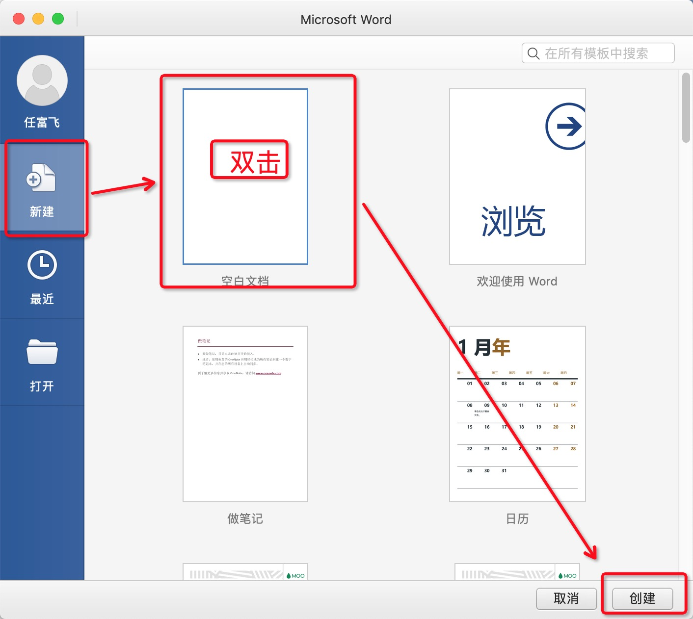
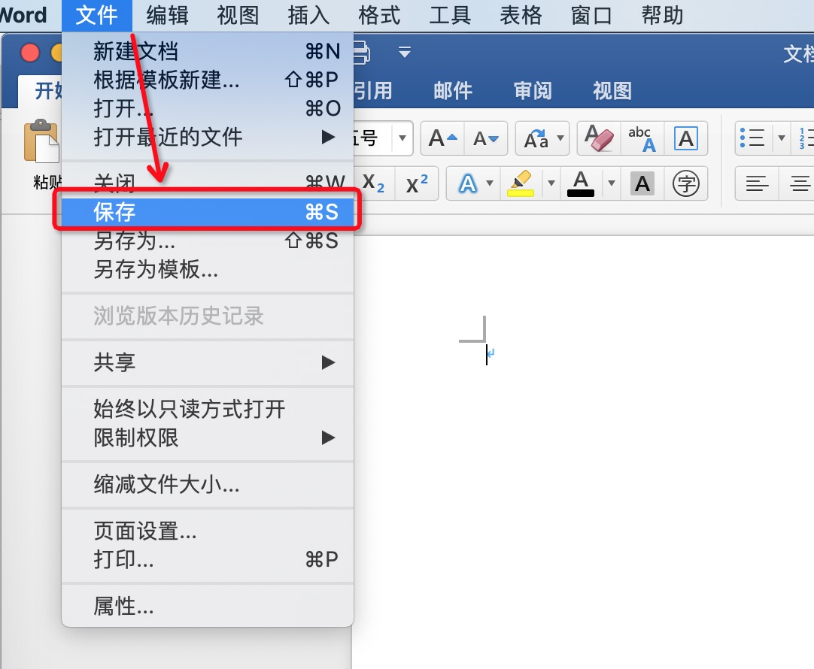
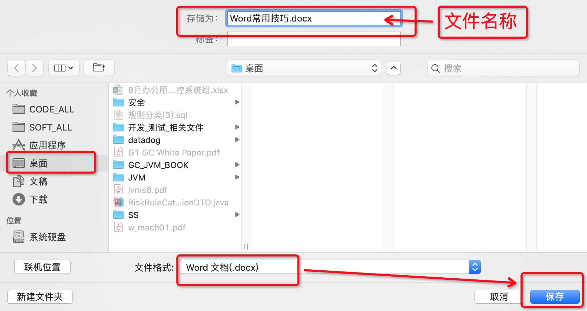
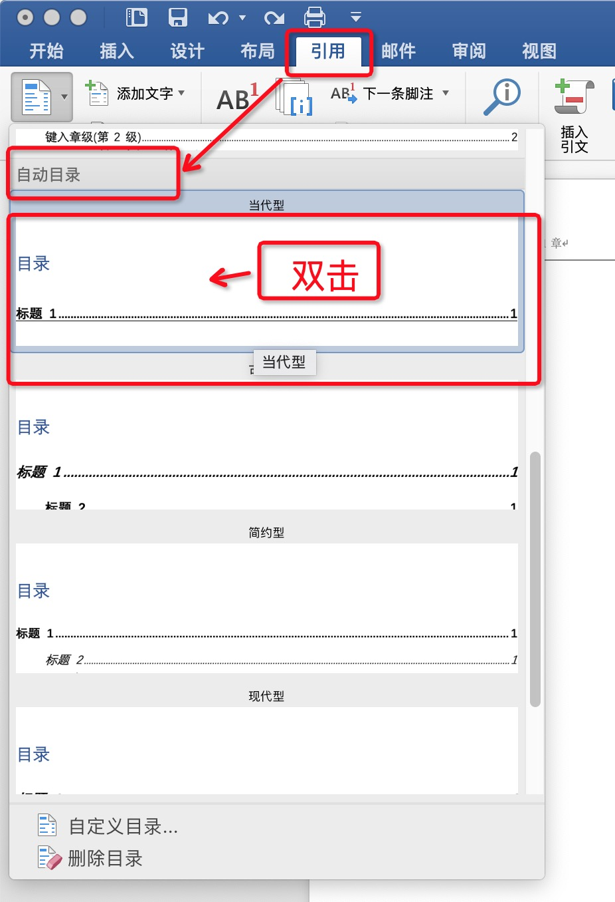
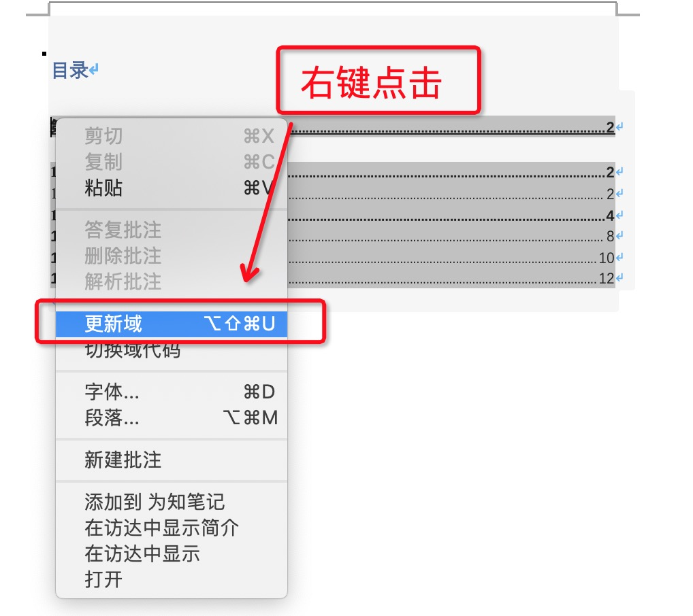
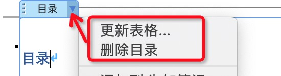
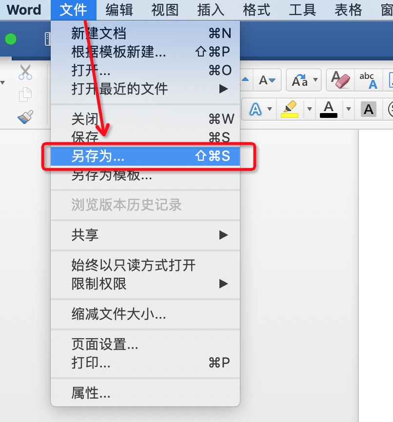
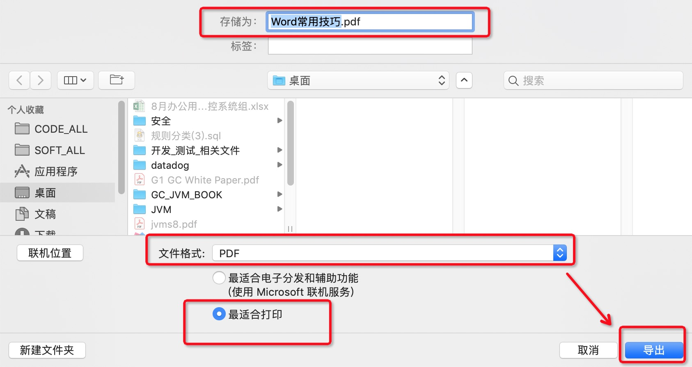

# Word常用技巧

> 本文内容基于 MAC 版，Windows版本大同小异。

## 创建Word文档

打开Word，在弹出的向导页面中，选择左边的 “新建” 页签。

然后选择需要的模板类型， 例如 “空白文档” ，然后双击对应的文档类型， 或者点击右下角的 “创建” 按钮。

## 保存Word文档

选择 “文件” 菜单， 点击 “保存” 或者 “另存为” 选项：

在弹出的保存文件对话框中，选择保存位置，输入文件名称，然后点击 “保存” 按钮即可

## 编辑内容

## 插入目录

1、 先移动光标，鼠标单击要插入目录的位置。
2、 选择 “引用” 选项卡，点击 “目录” 按钮。

3、在弹出的选择框中，往下拖动，找到 “自动目录” 部分。
4、鼠标单击想要的目录样式，如 “当代型”，

## 更新目录

鼠标右键点击目录区域，弹出右键菜单。

选择 “更新域” 选项。

然后在确认框中选择 “更新整个目录”，并点击 “确定” 按钮。

## 删除目录

当然，也可以鼠标点击具体的目录，然后再点击自动弹出的 “目录” 下拉工具按钮。

弹出的菜单按钮中，选择 “删除目录” 菜单即可。

## 导出为PDF

选择 “文件” 菜单， 点击 “另存为” 选项：

然后选择 “文件格式” 和 “保存位置”，一般使用默认的 “文件名称”， 最后点击 “导出” 按钮即可。

