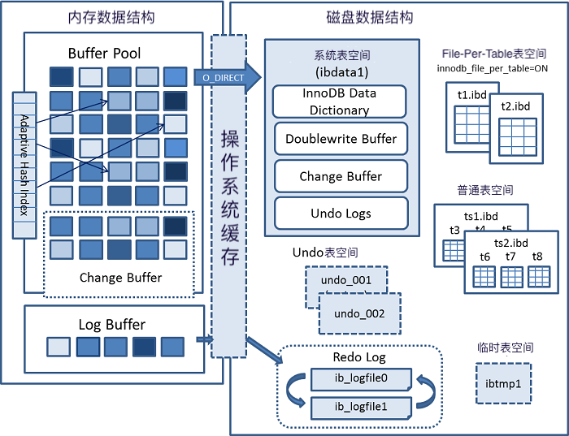

## 14.4 InnoDB Architecture

The following diagram shows in-memory and on-disk structures that comprise the InnoDB storage engine architecture.

For information about each structure, see [Section 14.5, “InnoDB In-Memory Structures”](./14.5_innodb-in-memory-structures.md), and [Section 14.6, “InnoDB On-Disk Structures”](./14.6_innodb-on-disk-structures.md).

## 14.4 InnoDB整体架构

下图展示了InnoDB存储引擎的整体架构, 包括内存模型和磁盘结构两个部分。

每种结构的详细信息，我们在接下来的章节进行描述。请参考:

- [Section 14.5, InnoDB内存结构模型](./14.5_innodb-in-memory-structures.md)
- [Section 14.6, InnoDB磁盘存储结构](./14.6_innodb-on-disk-structures.md)。

图 14.1 InnoDB架构图

### 原文链接

- <https://dev.mysql.com/doc/refman/5.7/en/innodb-architecture.html>
- [GitHub版本: 14.4 InnoDB存储结构](https://github.com/cncounter/translation/blob/master/tiemao_2020/44_innodb-storage-engine/14.4_innodb-architecture.md)
