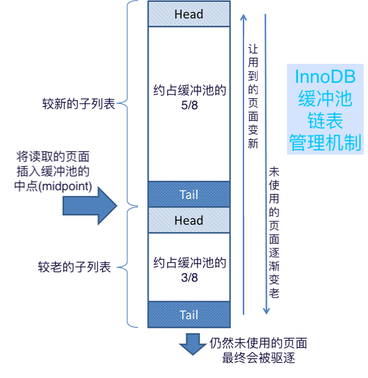

## 14.5 InnoDB In-Memory Structures

## 14.5 InnoDB内存存储结构

[TOC]

This section describes InnoDB in-memory structures and related topics.

本文详细介绍InnoDB在内存中的存储结构, 以及相关的模型。


### 14.5.1 Buffer Pool

The buffer pool is an area in main memory where `InnoDB` caches table and index data as it is accessed. The buffer pool permits frequently used data to be processed directly from memory, which speeds up processing. On dedicated servers, up to 80% of physical memory is often assigned to the buffer pool.

For efficiency of high-volume read operations, the buffer pool is divided into [pages](https://dev.mysql.com/doc/refman/5.7/en/glossary.html#glos_page) that can potentially hold multiple rows. For efficiency of cache management, the buffer pool is implemented as a linked list of pages; data that is rarely used is aged out of the cache using a variation of the [LRU](https://dev.mysql.com/doc/refman/5.7/en/glossary.html#glos_lru) algorithm.

Knowing how to take advantage of the buffer pool to keep frequently accessed data in memory is an important aspect of MySQL tuning.

<a name="14.5.1"></a>
### 14.5.1 Buffer Pool(缓冲池)

缓冲池是主内存中的一个存储区域, InnoDB用来缓存数据行以及索引。 通过缓冲池可以直接从内存中获取经常使用的数据, 从而加快处理速度。 在专用服务器上, 通常可以将高达80％的物理内存分配给缓冲池。

为了提高大量读操作的性能, 缓冲池分为多个 [内存页(page)](https://dev.mysql.com/doc/refman/5.7/en/glossary.html#glos_page), 每一页可以存储很多行。 为了提高效率, 缓冲池使用链表结构来管理内存页。 使用自定义的 [LRU](https://dev.mysql.com/doc/refman/5.7/en/glossary.html#glos_lru) 算法, 将长时间较少使用的数据从缓存中去除。

理解怎样利用缓冲池来将经常访问的数据保留在内存中, 是MySQL优化中的一个重要考点。

#### Buffer Pool LRU Algorithm

The buffer pool is managed as a list using a variation of the least recently used (LRU) algorithm. When room is needed to add a new page to the buffer pool, the least recently used page is evicted and a new page is added to the middle of the list. This midpoint insertion strategy treats the list as two sublists:

- At the head, a sublist of new (“young”) pages that were accessed recently
- At the tail, a sublist of old pages that were accessed less recently

#### 缓冲池LRU算法

缓冲池使用LRU算法(least recently used, 最近最少使用)的变体, 将页面作为列表进行管理。 需要将新页面添加到缓冲池时, 会先驱逐最近最少使用的页面, 然后再将新页面添加到列表的中间(middle)。 这种中点插入策略将整个列表当做两个子列表：

- 前面的子列表, 是最近访问过的新页面(new, young)
- 后面的子列表, 是最近较少访问的旧页面




**图 14.2 InnoDB缓冲池链表管理机制**


The algorithm keeps frequently used pages in the new sublist. The old sublist contains less frequently used pages; these pages are candidates for [eviction](https://dev.mysql.com/doc/refman/5.7/en/glossary.html#glos_eviction).

By default, the algorithm operates as follows:

- 3/8 of the buffer pool is devoted to the old sublist.
- The midpoint of the list is the boundary where the tail of the new sublist meets the head of the old sublist.
- When `InnoDB` reads a page into the buffer pool, it initially inserts it at the midpoint (the head of the old sublist). A page can be read because it is required for a user-initiated operation such as an SQL query, or as part of a [read-ahead](https://dev.mysql.com/doc/refman/5.7/en/glossary.html#glos_read_ahead) operation performed automatically by `InnoDB`.
- Accessing a page in the old sublist makes it “young”, moving it to the head of the new sublist. If the page was read because it was required by a user-initiated operation, the first access occurs immediately and the page is made young. If the page was read due to a read-ahead operation, the first access does not occur immediately and might not occur at all before the page is evicted.
- As the database operates, pages in the buffer pool that are not accessed “age” by moving toward the tail of the list. Pages in both the new and old sublists age as other pages are made new. Pages in the old sublist also age as pages are inserted at the midpoint. Eventually, a page that remains unused reaches the tail of the old sublist and is evicted.


LRU算法将常用的页面保留在新页面的子列表中。 旧页面的子列表包含不常用的页面； 这些旧页面是 [逐出(eviction)](https://dev.mysql.com/doc/refman/5.7/en/glossary.html#glos_eviction) 的候选页面。

默认情况下, 这种算法的运行方式如下：

- 大约3/8的缓冲池专门用来存储旧页面的子列表。
- 列表的中点是边界, 新页面子列表的尾部与旧页面子列表的头部在此相交。
- 当InnoDB将一个页面读入缓冲池时, 首先将其插入中点（旧页面子列表的头部）。一个页面会被读取, 肯定是因为需要用到它, 例如用户的SQL查询操作, 或者是InnoDB自动执行的 [预读取(read-ahead)](https://dev.mysql.com/doc/refman/5.7/en/glossary.html#glos_read_ahead) 操作。
- 访问旧页面子列表中的页面会使其变 “年轻”, 会将其移至新页面子列表的头部。 如果由于用户启动的操作而需要读取页面, 则首次访问将立即进行, 并使页面年轻。如果由于预读操作而读取了该页面, 则第一次访问不会立即发生, 并且在该页面失效之前可能都不会发生。
- 随着数据库的运行, 通过移至列表的末尾, 缓冲池中的页面无法“访问”。新的和旧的子列表中的页面都会随着其他页面的更新而老化。 将页面插入中点, 旧页面子列表中的页面也会老化。最终, 未使用的页面到达旧页面子列表的尾部并被逐出。


By default, pages read by queries are immediately moved into the new sublist, meaning they stay in the buffer pool longer. A table scan, performed for a [**mysqldump**](https://dev.mysql.com/doc/refman/5.7/en/mysqldump.html) operation or a `SELECT` statement with no `WHERE` clause, for example, can bring a large amount of data into the buffer pool and evict an equivalent amount of older data, even if the new data is never used again. Similarly, pages that are loaded by the read-ahead background thread and accessed only once are moved to the head of the new list. These situations can push frequently used pages to the old sublist where they become subject to eviction. For information about optimizing this behavior, see [Section 14.8.3.3, “Making the Buffer Pool Scan Resistant”](https://dev.mysql.com/doc/refman/5.7/en/innodb-performance-midpoint_insertion.html), and [Section 14.8.3.4, “Configuring InnoDB Buffer Pool Prefetching (Read-Ahead)”](https://dev.mysql.com/doc/refman/5.7/en/innodb-performance-read_ahead.html).

`InnoDB` Standard Monitor output contains several fields in the `BUFFER POOL AND MEMORY` section regarding operation of the buffer pool LRU algorithm. For details, see [Monitoring the Buffer Pool Using the InnoDB Standard Monitor](https://dev.mysql.com/doc/refman/5.7/en/innodb-buffer-pool.html#innodb-buffer-pool-monitoring).

默认情况下, 查询读取的页面会立即移入新页面子列表, 这意味着它们在缓冲池中的停留时间更长。 对 [**mysqldump**](https://dev.mysql.com/doc/refman/5.7/en/mysqldump.html) 操作或不带 `WHERE` 子句的`SELECT`语句执行的全表扫描, 会将大量数据带入缓冲池, 并逐出同等数量的旧数据, 即使新数据不再使用。 同样, 由后台的预读线程加载且仅访问一次的页面也会移至新列表的开头。 这种情况可能会将常用页面推到旧列表中, 导致被逐出。关于这种行为的优化, 请参见 [Section 14.8.3.3, “Making the Buffer Pool Scan Resistant”](https://dev.mysql.com/doc/refman/5.7/en/innodb-performance-midpoint_insertion.html), 和 [Section 14.8.3.4, “Configuring InnoDB Buffer Pool Prefetching (Read-Ahead)”](https://dev.mysql.com/doc/refman/5.7/en/innodb-performance-read_ahead.html)。

`InnoDB` Standard Monitor 会在 `BUFFER POOL AND MEMORY` 部分的输出中, 包含缓冲池LRU算法相关的操作信息。 更多详细信息, 请参见 [Monitoring the Buffer Pool Using the InnoDB Standard Monitor](https://dev.mysql.com/doc/refman/5.7/en/innodb-buffer-pool.html#innodb-buffer-pool-monitoring)。

#### Buffer Pool Configuration

You can configure the various aspects of the buffer pool to improve performance.

- Ideally, you set the size of the buffer pool to as large a value as practical, leaving enough memory for other processes on the server to run without excessive paging. The larger the buffer pool, the more `InnoDB` acts like an in-memory database, reading data from disk once and then accessing the data from memory during subsequent reads. See [Section 14.8.3.1, “Configuring InnoDB Buffer Pool Size”](https://dev.mysql.com/doc/refman/5.7/en/innodb-buffer-pool-resize.html).
- On 64-bit systems with sufficient memory, you can split the buffer pool into multiple parts to minimize contention for memory structures among concurrent operations. For details, see [Section 14.8.3.2, “Configuring Multiple Buffer Pool Instances”](https://dev.mysql.com/doc/refman/5.7/en/innodb-multiple-buffer-pools.html).
- You can keep frequently accessed data in memory regardless of sudden spikes of activity from operations that would bring large amounts of infrequently accessed data into the buffer pool. For details, see [Section 14.8.3.3, “Making the Buffer Pool Scan Resistant”](https://dev.mysql.com/doc/refman/5.7/en/innodb-performance-midpoint_insertion.html).
- You can control how and when to perform read-ahead requests to prefetch pages into the buffer pool asynchronously in anticipation that the pages are needed soon. For details, see [Section 14.8.3.4, “Configuring InnoDB Buffer Pool Prefetching (Read-Ahead)”](https://dev.mysql.com/doc/refman/5.7/en/innodb-performance-read_ahead.html).
- You can control when background flushing occurs and whether or not the rate of flushing is dynamically adjusted based on workload. For details, see [Section 14.8.3.5, “Configuring Buffer Pool Flushing”](https://dev.mysql.com/doc/refman/5.7/en/innodb-buffer-pool-flushing.html).
- You can configure how `InnoDB` preserves the current buffer pool state to avoid a lengthy warmup period after a server restart. For details, see [Section 14.8.3.6, “Saving and Restoring the Buffer Pool State”](https://dev.mysql.com/doc/refman/5.7/en/innodb-preload-buffer-pool.html).

#### 缓冲池配置

我们可以从多个维度配置缓冲池, 以提升InnoDB的性能.

- 理想情况下, 我们将缓冲池设置得足够用就行了, 而且不会有太多页面, 服务器上的其他进程也还有足够的内存。 缓冲池越大, InnoDB的性能就接近内存数据库, 只需要从磁盘读取一次数据, 之后都可以从内存中读取数据。 详情请参考: [Section 14.8.3.1, “Configuring InnoDB Buffer Pool Size”](https://dev.mysql.com/doc/refman/5.7/en/innodb-buffer-pool-resize.html)。
- 在64位系统上, 如果内存足够, 可以将缓冲池分成多个部分, 以最大程度地减少并发操作之间的内存结构争用。更多详细信息请参考: [Section 14.8.3.2, “Configuring Multiple Buffer Pool Instances”](https://dev.mysql.com/doc/refman/5.7/en/innodb-multiple-buffer-pools.html)。
- 可以将频繁访问的数据保留在内存中, 而不必考虑突然暴增的峰值访问, 这些操作会将大量不常用的数据带入缓冲池。更多详细信息请参考: [Section 14.8.3.3, “Making the Buffer Pool Scan Resistant”](https://dev.mysql.com/doc/refman/5.7/en/innodb-performance-midpoint_insertion.html)。
- 可以控制如何预读,以及何时执行预读请求, 以异步方式将很快会用到的页面预取到缓冲池中。更多详细信息请参考: [Section 14.8.3.4, “Configuring InnoDB Buffer Pool Prefetching (Read-Ahead)”](https://dev.mysql.com/doc/refman/5.7/en/innodb-performance-read_ahead.html)。
- 控制何时进行后台数据刷磁盘, 以及是否根据工作负载动态调整数据刷新频率。 更多详细信息请参考: [Section 14.8.3.5, “Configuring Buffer Pool Flushing”](https://dev.mysql.com/doc/refman/5.7/en/innodb-buffer-pool-flushing.html)。
- 可以设置InnoDB如何保留当前缓冲池状态, 以避免服务器重启后的漫长预热期。 更多详细信息请参考: [Section 14.8.3.6, “Saving and Restoring the Buffer Pool State”](https://dev.mysql.com/doc/refman/5.7/en/innodb-preload-buffer-pool.html)。


#### Monitoring the Buffer Pool Using the InnoDB Standard Monitor

`InnoDB` Standard Monitor output, which can be accessed using [`SHOW ENGINE INNODB STATUS`](https://dev.mysql.com/doc/refman/5.7/en/innodb-standard-monitor.html), provides metrics regarding operation of the buffer pool. Buffer pool metrics are located in the `BUFFER POOL AND MEMORY` section of `InnoDB` Standard Monitor output and appear similar to the following:


#### 通过InnoDB Standard Monitor监控缓冲池

使用 `SHOW ENGINE INNODB STATUS` 命令可以获取 InnoDB Standard Monitor 的输出, 其中包含了缓冲池相关的指标信息。
缓冲池指标位于 `BUFFER POOL AND MEMORY` 这部分, 大致类似于下面这样:

```sql
----------------------
BUFFER POOL AND MEMORY
----------------------
Total large memory allocated 22355640320
Dictionary memory allocated 15517867
Internal hash tables (constant factor + variable factor)
    Adaptive hash index 342600512 	(339961792 + 2638720)
    Page hash           2656792 (buffer pool 0 only)
    Dictionary cache    100508315 	(84990448 + 15517867)
    File system         4375120 	(812272 + 3562848)
    Lock system         53203640 	(53125256 + 78384)
    Recovery system     0 	(0 + 0)
Buffer pool size   1310560
Buffer pool size, bytes 21472215040
Free buffers       8192
Database pages     1302209
Old database pages 480533
Modified db pages  125
Pending reads      0
Pending writes: LRU 0, flush list 0, single page 0
Pages made young 47795, not young 843770
0.00 youngs/s, 0.00 non-youngs/s
Pages read 134869, created 1313756, written 162255077
0.00 reads/s, 0.00 creates/s, 1.47 writes/s
Buffer pool hit rate 1000 / 1000, young-making rate 0 / 1000 not 0 / 1000
Pages read ahead 0.00/s, evicted without access 0.00/s, Random read ahead 0.00/s
LRU len: 1302209, unzip_LRU len: 0
I/O sum[728]:cur[0], unzip sum[0]:cur[0]
```

The following table describes buffer pool metrics reported by the `InnoDB` Standard Monitor.

> Note
>
> Per second averages provided in `InnoDB` Standard Monitor output are based on the elapsed time since `InnoDB` Standard Monitor output was last printed.

下面对这些指标进行解读。

> **注意**
>
> `InnoDB` Standard Monitor 输出中的每秒平均数值信息, 是基于上次打印之后经过的时间来计算的。


**表 14.2 InnoDB Buffer Pool 指标解读**

| 指标名称                      | 说明                                                          |
| :--------------------------- | :----------------------------------------------------------- |
| Total memory allocated       | 缓冲池总共分配的内存字节数.     |
| Dictionary memory allocated  | `InnoDB`数据字典分配的总内存字节数. |
| Buffer pool size             | 分配给缓冲池的页面总数量.        |
| Free buffers                 | 缓冲池列表中的空闲页面数.        |
| Database pages               | 缓冲池 LRU 列表中的页面总数.         |
| Old database pages           | 缓冲池中, 老的 LRU 列表中的页面总数.  |
| Modified db pages            | 当前缓冲池中被修改过的页面数量.     |
| Pending reads                | 等待读取到缓冲池中的页面数量. |
| Pending writes LRU           | 缓冲池中,位于LRU列表底部, 等待写入磁盘的脏页数量. |
| Pending writes flush list    | 要刷数据的缓冲池页面数量. |
| Pending writes single page   | 缓冲池中待写入处理的独立页面数量. |
| Pages made young             | 缓冲池LRU列表中变为新页的数量(移动到 “new” 子列表头部). |
| Pages made not young         | 缓冲池LRU列表中没有变为新页的数量(依然在 “old” 子列表中). |
| youngs/s                     | 每秒访问缓冲池LRU列表中“old”页面次数的平均频率, 导致这些页面变新。详情参考下文. |
| non-youngs/s                 | 每秒访问缓冲池LRU列表中“old”页面次数的平均频率, 没有导致这些页面变新。详情参考下文. |
| Pages read                   | 从缓冲池中读取的总页数.         |
| Pages created                | 在缓冲池中创建的总页数.    |
| Pages written                | 从缓冲池中写出去的总页数.      |
| reads/s                      | 每秒从缓冲池中读取的页数平均值. |
| creates/s                    | 每秒创建的缓冲池中页数平均值. |
| writes/s                     | 每秒从缓冲池中写出去的页数平均值. |
| Buffer pool hit rate         | 缓冲池命中率 = 从缓冲池读取的页数 / 直接从磁盘读取的页数. |
| young-making rate            | 导致页面变新的平均命中率. 详情参考下文. |
| not (young-making rate)      | 没有导致页面变新的平均命中率. 详情参考下文. |
| Pages read ahead             | 平均每秒预读取操作的数量.             |
| Pages evicted without access | 平均每秒因为没有读取操作而从缓冲池中驱逐的页面数量. |
| Random read ahead            | 平均每秒随机预读取操作的数量.      |
| LRU len                      | 缓冲池LRU列表中的页面总数.         |
| unzip_LRU len                | 缓冲池unzip_LRU列表中的页面总数.   |
| I/O sum                      | 缓冲池LRU列表中, 最近 50 秒, 被读取/写入的页面次数. |
| I/O cur                      | 缓冲池LRU列表中, 当前被读取/写入的页面次数.     |
| I/O unzip sum                | 缓冲池unzip_LRU列表中, 被读取/写入的页面总次数. |
| I/O unzip cur                | 缓冲池unzip_LRU列表中, 当前被读取/写入的页面次数. |


> **Notes**:

- The `youngs/s` metric is applicable only to old pages. It is based on the number of accesses to pages and not the number of pages. There can be multiple accesses to a given page, all of which are counted. If you see very low `youngs/s` values when there are no large scans occurring, you might need to reduce the delay time or increase the percentage of the buffer pool used for the old sublist. Increasing the percentage makes the old sublist larger, so pages in that sublist take longer to move to the tail, which increases the likelihood that those pages are accessed again and made young.
- The `non-youngs/s` metric is applicable only to old pages. It is based on the number of accesses to pages and not the number of pages. There can be multiple accesses to a given page, all of which are counted. If you do not see a higher `non-youngs/s` value when performing large table scans (and a higher `youngs/s` value), increase the delay value.
- The `young-making` rate accounts for accesses to all buffer pool pages, not just accesses to pages in the old sublist. The `young-making` rate and `not` rate do not normally add up to the overall buffer pool hit rate. Page hits in the old sublist cause pages to move to the new sublist, but page hits in the new sublist cause pages to move to the head of the list only if they are a certain distance from the head.
- `not (young-making rate)` is the average hit rate at which page accesses have not resulted in making pages young due to the delay defined by [`innodb_old_blocks_time`](https://dev.mysql.com/doc/refman/5.7/en/innodb-parameters.html#sysvar_innodb_old_blocks_time) not being met, or due to page hits in the new sublist that did not result in pages being moved to the head. This rate accounts for accesses to all buffer pool pages, not just accesses to pages in the old sublist.

Buffer pool [server status variables](https://dev.mysql.com/doc/refman/5.7/en/server-status-variables.html) and the [`INNODB_BUFFER_POOL_STATS`](https://dev.mysql.com/doc/refman/5.7/en/information-schema-innodb-buffer-pool-stats-table.html) table provide many of the same buffer pool metrics found in `InnoDB` Standard Monitor output. For more information, see [Example 14.10, “Querying the INNODB_BUFFER_POOL_STATS Table”](https://dev.mysql.com/doc/refman/5.7/en/innodb-information-schema-buffer-pool-tables.html#innodb-information-schema-buffer-pool-stats-example).

> **注意**：

- `youngs/s` 指标仅适用于旧页面。它基于对页面的访问次数, 而不是页面数。对给定页面可能会有多次访问, 所有访问都计入在内。如果没有发生大型的全表扫描时, 看到的 `youngs/s` 数值很低, 可能需要降低移到旧页面子列表的延迟时间, 或者增加旧页面子列表所占的缓冲池百分比。 增加百分比会使旧页面子列表变大, 因此该子列表中的页面需要更长的时间才能移到尾部, 这增加了再次访问这些页面并使它们变年轻的可能性。
- `non-youngs/s` 指标仅适用于旧页面。它基于对页面的访问次数, 而不是页面数。对给定页面可能会有多次访问, 所有访问都计入在内。如果没有发生大型的全表扫描, 或者`youngs/s`很大, 但是 `non-youngs/s` 的值却不高, 那么我们需要增加延迟值。
- `young-making` 频率用于统计所有对缓冲池页面的访问次数, 而不仅仅是对旧页面子列表的页面访问次数。 `young-making` 频率和 `not` 频率通常不加到整个缓冲池的总命中率。命中旧页面子列表中的页面, 会导致页面被移动到新页面子列表中, 但命中新页面子列表中的页面时, 只有页面与列表头部保持一定距离时才会被移动到列表头部。
- `not (young-making rate)` 是一个平均速率, 原因是由于不满足 [`innodb_old_blocks_time`](https://dev.mysql.com/doc/refman/5.7/en/innodb-parameters.html#sysvar_innodb_old_blocks_time), 或者由于命中了新页面子列表却没有让页面移动到头部。 此速率统计了对所有缓冲池页面的访问, 而不仅仅是对旧页面子列表中页面的访问。

缓冲池[server status variables](https://dev.mysql.com/doc/refman/5.7/en/server-status-variables.html)和 [`INNODB_BUFFER_POOL_STATS`](https://dev.mysql.com/doc/refman/5.7/en/information-schema-innodb-buffer-pool-stats-table.html)表提供了许多与 `InnoDB` Standard Monitor 输出中相同的缓冲池指标。 更多信息请参考 [Example 14.10, “Querying the INNODB_BUFFER_POOL_STATS Table”](https://dev.mysql.com/doc/refman/5.7/en/innodb-information-schema-buffer-pool-tables.html#innodb-information-schema-buffer-pool-stats-example)。


### 14.5.2 Change Buffer


The change buffer is a special data structure that caches changes to [secondary index](https://dev.mysql.com/doc/refman/5.7/en/glossary.html#glos_secondary_index) pages when those pages are not in the [buffer pool](https://dev.mysql.com/doc/refman/5.7/en/glossary.html#glos_buffer_pool). The buffered changes, which may result from [`INSERT`](https://dev.mysql.com/doc/refman/5.7/en/insert.html), [`UPDATE`](https://dev.mysql.com/doc/refman/5.7/en/update.html), or [`DELETE`](https://dev.mysql.com/doc/refman/5.7/en/delete.html) operations (DML), are merged later when the pages are loaded into the buffer pool by other read operations.


<a name="14.5.2"></a>
### 14.5.2 写缓冲(Change Buffer)

写缓冲(Change Buffer)是一种特殊的数据结构, 当 [二级索引(secondary index)](https://dev.mysql.com/doc/refman/5.7/en/glossary.html#glos_secondary_index) 页的更改不在[buffer pool](https://dev.mysql.com/doc/refman/5.7/en/glossary.html#glos_buffer_pool)之中时。 缓冲的更改可能是由于[`INSERT`](https://dev.mysql.com/doc/refman/5.7/en/insert.html), [`UPDATE`](https://dev.mysql.com/doc/refman/5.7/en/update.html), or [`DELETE`](https://dev.mysql.com/doc/refman/5.7/en/delete.html) 等DML操作,  后续通过其他读取操作将页面加载到缓冲池中时, 它们将会被合并。


**Figure 14.3 Change Buffer**


Unlike [clustered indexes](https://dev.mysql.com/doc/refman/5.7/en/glossary.html#glos_clustered_index), secondary indexes are usually nonunique, and inserts into secondary indexes happen in a relatively random order. Similarly, deletes and updates may affect secondary index pages that are not adjacently located in an index tree. Merging cached changes at a later time, when affected pages are read into the buffer pool by other operations, avoids substantial random access I/O that would be required to read secondary index pages into the buffer pool from disk.

与[聚集索引(clustered indexes)](https://dev.mysql.com/doc/refman/5.7/en/glossary.html#glos_clustered_index)不同, 二级索引(secondary indexes) 一般都不是唯一约束, 并且会以相对随机的顺序添加到二级索引中。
同样, 删除和更新操作也会影响索引树中不相邻的二级索引页。
当后续的操作将受影响的页读入缓冲池, 则会合并缓存的变更, 避免了从磁盘上将二级索引页读入缓冲池所需的大量随机I/O。

Periodically, the purge operation that runs when the system is mostly idle, or during a slow shutdown, writes the updated index pages to disk. The purge operation can write disk blocks for a series of index values more efficiently than if each value were written to disk immediately.

Change buffer merging may take several hours when there are many affected rows and numerous secondary indexes to update. During this time, disk I/O is increased, which can cause a significant slowdown for disk-bound queries. Change buffer merging may also continue to occur after a transaction is committed, and even after a server shutdown and restart (see [Section 14.22.2, “Forcing InnoDB Recovery”](https://dev.mysql.com/doc/refman/5.7/en/forcing-innodb-recovery.html) for more information).

在系统比较空闲时, 会定期运行清除操作(purge operation), 把更新的索引页写入磁盘, 或者在缓慢关机期间也会执行。 清除操作将索引值批量写入磁盘, 比起每次变化都立刻刷新, 效率要高很多。

当受影响的行太多, 需要更新的二级索引数据量很大时, 写缓冲的合并可能要消耗很多个小时。
在此期间, 磁盘 I/O 会增加, 这可能会导致有磁盘读取的查询操作的执行速度明显变慢。
事务提交之后, 甚至在服务器关闭并重新启动之后, 写缓冲的合并都有可能持续发生( 更多信息请参考 [Section 14.22.2, “Forcing InnoDB Recovery”](https://dev.mysql.com/doc/refman/5.7/en/forcing-innodb-recovery.html) )。


In memory, the change buffer occupies part of the buffer pool. On disk, the change buffer is part of the system tablespace, where index changes are buffered when the database server is shut down.

The type of data cached in the change buffer is governed by the [`innodb_change_buffering`](https://dev.mysql.com/doc/refman/5.7/en/innodb-parameters.html#sysvar_innodb_change_buffering) variable. For more information, see [Configuring Change Buffering](#innodb-change-buffer-configuration). You can also configure the maximum change buffer size. For more information, see [Configuring the Change Buffer Maximum Size](#innodb-change-buffer-maximum-size).

Change buffering is not supported for a secondary index if the index contains a descending index column or if the primary key includes a descending index column.

For answers to frequently asked questions about the change buffer, see [Section A.16, “MySQL 5.7 FAQ: InnoDB Change Buffer”](https://dev.mysql.com/doc/refman/5.7/en/faqs-innodb-change-buffer.html).


在内存中, 写缓冲占用了缓冲池的一部分内存空间。
在磁盘上, 写缓冲是系统表空间的一部分，当数据库服务器关闭时，索引的变更会存储在里面。

写缓冲中缓存的数据类型由 [`innodb_change_buffering`](https://dev.mysql.com/doc/refman/5.7/en/innodb-parameters.html#sysvar_innodb_change_buffering) 变量控制。 更多信息请参见 [Configuring Change Buffering](#innodb-change-buffer-configuration)。
我们还可以设置写缓冲的最大空间。 更多信息请参见 [Configuring the Change Buffer Maximum Size](#innodb-change-buffer-maximum-size)。

如果主键索引或者二级索引包含降序的索引列，则二级索引不支持写缓冲操作。

有关写缓冲的常见问题和答案，请参见 [Section A.16, “MySQL 5.7 FAQ: InnoDB Change Buffer”](https://dev.mysql.com/doc/refman/5.7/en/faqs-innodb-change-buffer.html)。


#### Configuring Change Buffering


When [`INSERT`](https://dev.mysql.com/doc/refman/5.7/en/insert.html), [`UPDATE`](https://dev.mysql.com/doc/refman/5.7/en/update.html), and [`DELETE`](https://dev.mysql.com/doc/refman/5.7/en/delete.html) operations are performed on a table, the values of indexed columns (particularly the values of secondary keys) are often in an unsorted order, requiring substantial I/O to bring secondary indexes up to date. The [change buffer](https://dev.mysql.com/doc/refman/5.7/en/glossary.html#glos_change_buffer) caches changes to secondary index entries when the relevant [page](https://dev.mysql.com/doc/refman/5.7/en/glossary.html#glos_page) is not in the [buffer pool](https://dev.mysql.com/doc/refman/5.7/en/glossary.html#glos_buffer_pool), thus avoiding expensive I/O operations by not immediately reading in the page from disk. The buffered changes are merged when the page is loaded into the buffer pool, and the updated page is later flushed to disk. The `InnoDB` main thread merges buffered changes when the server is nearly idle, and during a [slow shutdown](https://dev.mysql.com/doc/refman/5.7/en/glossary.html#glos_slow_shutdown).

Because it can result in fewer disk reads and writes, the change buffer feature is most valuable for workloads that are I/O-bound, for example applications with a high volume of DML operations such as bulk inserts.


<a name="innodb-change-buffer-configuration"></a>
#### 设置写缓冲

对某个表执行 `INSERT`,`UPDATE` 和 `DELETE` 操作时，索引列（尤其是二级索引）的值通常是处于未排序的顺序, 这需要大量的 I/O 操作才能使二级索引保持最新状态。
如果相关的page不在缓冲池之中, 则MySQL可以使用写缓冲（change buffer）将二级索引的变更缓存起来，这样就不必立即从磁盘上读取页面, 避免了高负载时期大量昂贵的I/O操作。
当新页面加载到缓冲池时, 会合并相应的写缓冲，更新的页面随后会被刷新到磁盘。
`InnoDB`主线程在服务器接近空闲时合并缓冲的更改, 在[slow shutdown](https://dev.mysql.com/doc/refman/5.7/en/glossary.html#glos_slow_shutdown) 期间也会执行。

由于写缓冲功能可以减少磁盘读写操作，因此它对于受I/O约束的任务最有价值（例如，具有批量插入之类的大量DML操作的应用）。


However, the change buffer occupies a part of the buffer pool, reducing the memory available to cache data pages. If the working set almost fits in the buffer pool, or if your tables have relatively few secondary indexes, it may be useful to disable change buffering. If the working data set fits entirely within the buffer pool, change buffering does not impose extra overhead, because it only applies to pages that are not in the buffer pool.

但是，写缓冲占用了缓冲池的一部分空间，也就减少了可用于缓存数据页的内存。
如果工作集跟缓冲池差不多大小，或者二级索引相对较少，则禁用写缓冲可能性能更好。
如果缓冲池完全足够放下工作数据集，则写缓冲不会带来额外的开销，因为它只适用于不在缓冲池中的那些页面。

You can control the extent to which `InnoDB` performs change buffering using the [`innodb_change_buffering`](https://dev.mysql.com/doc/refman/5.7/en/innodb-parameters.html#sysvar_innodb_change_buffering) configuration parameter. You can enable or disable buffering for inserts, delete operations (when index records are initially marked for deletion) and purge operations (when index records are physically deleted). An update operation is a combination of an insert and a delete. The default [`innodb_change_buffering`](https://dev.mysql.com/doc/refman/5.7/en/innodb-parameters.html#sysvar_innodb_change_buffering) value is `all`.

Permitted [`innodb_change_buffering`](https://dev.mysql.com/doc/refman/5.7/en/innodb-parameters.html#sysvar_innodb_change_buffering) values include:


您可以使用 [`innodb_change_buffering`](https://dev.mysql.com/doc/refman/5.7/en/innodb-parameters.html#sysvar_innodb_change_buffering) 配置参数来控制 `InnoDB` 执行写缓冲的程度。
您可以为 inserts, delete 操作（最初将索引记录标记为删除）和 purge 操作（从物理上删除索引记录时）启用或禁用缓冲。 update操作则是 insert 和 delete 的组合。 [`innodb_change_buffering`](https://dev.mysql.com/doc/refman/5.7/en/innodb-parameters.html#sysvar_innodb_change_buffering)的默认值为`all`。

允许的[`innodb_change_buffering`](https://dev.mysql.com/doc/refman/5.7/en/innodb-parameters.html#sysvar_innodb_change_buffering)取值包括：


- `all`  The default value: buffer inserts, delete-marking operations, and purges.

- `none`  Do not buffer any operations.

- `inserts`  Buffer insert operations.

- `deletes`  Buffer delete-marking operations.

- `changes`  Buffer both inserts and delete-marking operations.

- `purges`  Buffer physical deletion operations that happen in the background.

You can set the [`innodb_change_buffering`](https://dev.mysql.com/doc/refman/5.7/en/innodb-parameters.html#sysvar_innodb_change_buffering) parameter in the MySQL option file (`my.cnf` or `my.ini`) or change it dynamically with the [`SET GLOBAL`](https://dev.mysql.com/doc/refman/5.7/en/set-variable.html) statement, which requires privileges sufficient to set global system variables. See [Section 5.1.8.1, “System Variable Privileges”](https://dev.mysql.com/doc/refman/5.7/en/system-variable-privileges.html). Changing the setting affects the buffering of new operations; the merging of existing buffered entries is not affected.

- `all`  默认值：缓冲区插入，删除(标记)操作和清除。

- `none` 不缓冲任何操作。

- `inserts`  缓冲插入操作。

- `deletes` 缓冲删除(标记)操作。

- `changes`  缓冲插入和删除(标记)操作。

- `purges`  缓冲在后台发生的物理删除操作。

您可以在MySQL配置文件(`my.cnf` or `my.ini`)中设置[`innodb_change_buffering`](https://dev.mysql.com/doc/refman/5.7/en/innodb-parameters.html#sysvar_innodb_change_buffering)参数。
也可以使用 [`SET GLOBAL`](https://dev.mysql.com/doc/refman/5.7/en/set-variable.html) 语句来动态更改参数值，执行该语句需要具有设置全局系统变量的权限才能执行。 请参见[Section 5.1.8.1, “System Variable Privileges”](https://dev.mysql.com/doc/refman/5.7/en/system-variable-privileges.html)。
更改设置之后会影响新操作的缓冲； 现有缓冲条目的合并不受影响。


<a name="innodb-change-buffer-maximum-size"></a>
#### Configuring the Change Buffer Maximum Size

The [`innodb_change_buffer_max_size`](https://dev.mysql.com/doc/refman/5.7/en/innodb-parameters.html#sysvar_innodb_change_buffer_max_size) variable permits configuring the maximum size of the change buffer as a percentage of the total size of the buffer pool. By default, [`innodb_change_buffer_max_size`](https://dev.mysql.com/doc/refman/5.7/en/innodb-parameters.html#sysvar_innodb_change_buffer_max_size) is set to 25. The maximum setting is 50.

Consider increasing [`innodb_change_buffer_max_size`](https://dev.mysql.com/doc/refman/5.7/en/innodb-parameters.html#sysvar_innodb_change_buffer_max_size) on a MySQL server with heavy insert, update, and delete activity, where change buffer merging does not keep pace with new change buffer entries, causing the change buffer to reach its maximum size limit.


#### 设置写缓冲区的最大值

可以将 [`innodb_change_buffer_max_size`](https://dev.mysql.com/doc/refman/5.7/en/innodb-parameters.html#sysvar_innodb_change_buffer_max_size) 变量的值设置为总缓冲池的百分比。
默认 [`innodb_change_buffer_max_size`](https://dev.mysql.com/doc/refman/5.7/en/innodb-parameters.html#sysvar_innodb_change_buffer_max_size) 的值为 `25`。 允许的最大值是 `50`。

如果MySQL服务器上有大量插入，更新和删除操作, 可能写缓冲合并跟不上缓冲区的变更条目，从而导致写缓冲区达到最大限制, 可以考虑加大 [`innodb_change_buffer_max_size`](https://dev.mysql.com/doc/refman/5.7/en/innodb-parameters.html#sysvar_innodb_change_buffer_max_size) 的比例。


Consider decreasing [`innodb_change_buffer_max_size`](https://dev.mysql.com/doc/refman/5.7/en/innodb-parameters.html#sysvar_innodb_change_buffer_max_size) on a MySQL server with static data used for reporting, or if the change buffer consumes too much of the memory space shared with the buffer pool, causing pages to age out of the buffer pool sooner than desired.

Test different settings with a representative workload to determine an optimal configuration. The [`innodb_change_buffer_max_size`](https://dev.mysql.com/doc/refman/5.7/en/innodb-parameters.html#sysvar_innodb_change_buffer_max_size) setting is dynamic, which permits modifying the setting without restarting the server.

如果MySQL服务器主要主要用于报表分析, 存储的是静态数据，或者写缓冲区消耗了太多的内存空间, 挤占了缓冲池，导致页面比预期值更快地过期，可以考虑减小 [`innodb_change_buffer_max_size`](https://dev.mysql.com/doc/refman/5.7/en/innodb-parameters.html#sysvar_innodb_change_buffer_max_size)。

请使用具有代表性的工作负载强度来测试不同配置，以确定最佳配置。 [`innodb_change_buffer_max_size`](https://dev.mysql.com/doc/refman/5.7/en/innodb-parameters.html#sysvar_innodb_change_buffer_max_size) 的值可以动态修改，也就是说允许在不重启服务器的情况下更新配置。


#### Monitoring the Change Buffer


The following options are available for change buffer monitoring:

- `InnoDB` Standard Monitor output includes change buffer status information. To view monitor data, issue the `SHOW ENGINE INNODB STATUS` statement.


####监视更改缓冲区


以下选项可用于更改缓冲区监视：

-`InnoDB`标准监视器输出包括更改缓冲区状态信息。 要查看监视器数据，请发出“ SHOW ENGINE INNODB STATUS”语句。

  ```sql
  mysql> SHOW ENGINE INNODB STATUS\G
  ```

  Change buffer status information is located under the `INSERT BUFFER AND ADAPTIVE HASH INDEX` heading and appears similar to the following:

更改缓冲区状态信息位于“ INSERT BUFFER AND ADAPTIVE HASH INDEX”标题下，并且类似于以下内容：  

  ```sql
  -------------------------------------
  INSERT BUFFER AND ADAPTIVE HASH INDEX
  -------------------------------------
  Ibuf: size 1, free list len 0, seg size 2, 0 merges
  merged operations:
   insert 0, delete mark 0, delete 0
  discarded operations:
   insert 0, delete mark 0, delete 0
  Hash table size 4425293, used cells 32, node heap has 1 buffer(s)
  13577.57 hash searches/s, 202.47 non-hash searches/s
  ```

  For more information, see [Section 14.18.3, “InnoDB Standard Monitor and Lock Monitor Output”](https://dev.mysql.com/doc/refman/5.7/en/innodb-standard-monitor.html).

- The [`INFORMATION_SCHEMA.INNODB_METRICS`](https://dev.mysql.com/doc/refman/5.7/en/information-schema-innodb-metrics-table.html) table provides most of the data points found in `InnoDB` Standard Monitor output, plus other data points. To view change buffer metrics and a description of each, issue the following query:

有关更多信息，请参见[第14.18.3节“ InnoDB标准监视器和锁定监视器输出”]（https://dev.mysql.com/doc/refman/5.7/en/innodb-standard-monitor.html）。

-[`INFORMATION_SCHEMA.INNODB_METRICS`]（https://dev.mysql.com/doc/refman/5.7/en/information-schema-innodb-metrics-table.html）表提供了在` InnoDB的标准监视器输出，以及其他数据点。 要查看更改缓冲区度量标准以及每个度量标准的描述，请发出以下查询：


  ```sql
  mysql> SELECT NAME, COMMENT FROM INFORMATION_SCHEMA.INNODB_METRICS WHERE NAME LIKE '%ibuf%'\G
  ```

  For [`INNODB_METRICS`](https://dev.mysql.com/doc/refman/5.7/en/information-schema-innodb-metrics-table.html) table usage information, see [Section 14.16.6, “InnoDB INFORMATION_SCHEMA Metrics Table”](https://dev.mysql.com/doc/refman/5.7/en/innodb-information-schema-metrics-table.html).

- The [`INFORMATION_SCHEMA.INNODB_BUFFER_PAGE`](https://dev.mysql.com/doc/refman/5.7/en/information-schema-innodb-buffer-page-table.html) table provides metadata about each page in the buffer pool, including change buffer index and change buffer bitmap pages. Change buffer pages are identified by `PAGE_TYPE`. `IBUF_INDEX` is the page type for change buffer index pages, and `IBUF_BITMAP` is the page type for change buffer bitmap pages.

有关[`INNODB_METRICS`]（https://dev.mysql.com/doc/refman/5.7/en/information-schema-innodb-metrics-table.html）表的使用信息，请参见[第14.16.6节“ InnoDB” INFORMATION_SCHEMA指标表”]（https://dev.mysql.com/doc/refman/5.7/en/innodb-information-schema-metrics-table.html）。

-[`INFORMATION_SCHEMA.INNODB_BUFFER_PAGE`]（https://dev.mysql.com/doc/refman/5.7/en/information-schema-innodb-buffer-page-table.html）表提供了有关 缓冲池，包括更改缓冲区索引和更改缓冲区位图页面。 更改缓冲区页面由“ PAGE_TYPE”标识。 “ IBUF_INDEX”是更改缓冲区索引页面的页面类型，而“ IBUF_BITMAP”是更改缓冲区位图页面的页面类型。

  Warning

  Querying the [`INNODB_BUFFER_PAGE`](https://dev.mysql.com/doc/refman/5.7/en/information-schema-innodb-buffer-page-table.html) table can introduce significant performance overhead. To avoid impacting performance, reproduce the issue you want to investigate on a test instance and run your queries on the test instance.

  For example, you can query the [`INNODB_BUFFER_PAGE`](https://dev.mysql.com/doc/refman/5.7/en/information-schema-innodb-buffer-page-table.html) table to determine the approximate number of `IBUF_INDEX` and `IBUF_BITMAP` pages as a percentage of total buffer pool pages.

警告

   查询[`INNODB_BUFFER_PAGE`]（https://dev.mysql.com/doc/refman/5.7/zh-CN/information-schema-innodb-buffer-page-table.html）表会带来巨大的性能开销。 为避免影响性能，请重现要在测试实例上调查的问题，然后在测试实例上运行查询。

   例如，您可以查询[`INNODB_BUFFER_PAGE`]（https://dev.mysql.com/doc/refman/5.7/en/information-schema-innodb-buffer-page-table.html）表来确定近似值 “ IBUF_INDEX”和“ IBUF_BITMAP”页面的数量占缓冲池页面总数的百分比。

  ```sql
  mysql> SELECT (SELECT COUNT(*) FROM INFORMATION_SCHEMA.INNODB_BUFFER_PAGE
         WHERE PAGE_TYPE LIKE 'IBUF%') AS change_buffer_pages,
         (SELECT COUNT(*) FROM INFORMATION_SCHEMA.INNODB_BUFFER_PAGE) AS total_pages,
         (SELECT ((change_buffer_pages/total_pages)*100))
         AS change_buffer_page_percentage;
  +---------------------+-------------+-------------------------------+
  | change_buffer_pages | total_pages | change_buffer_page_percentage |
  +---------------------+-------------+-------------------------------+
  |                  25 |        8192 |                        0.3052 |
  +---------------------+-------------+-------------------------------+
  ```

  For information about other data provided by the [`INNODB_BUFFER_PAGE`](https://dev.mysql.com/doc/refman/5.7/en/information-schema-innodb-buffer-page-table.html) table, see [Section 23.32.1, “The INFORMATION_SCHEMA INNODB_BUFFER_PAGE Table”](https://dev.mysql.com/doc/refman/5.7/en/information-schema-innodb-buffer-page-table.html). For related usage information, see [Section 14.16.5, “InnoDB INFORMATION_SCHEMA Buffer Pool Tables”](https://dev.mysql.com/doc/refman/5.7/en/innodb-information-schema-buffer-pool-tables.html).

- [Performance Schema](https://dev.mysql.com/doc/refman/5.7/en/performance-schema.html) provides change buffer mutex wait instrumentation for advanced performance monitoring. To view change buffer instrumentation, issue the following query:

有关[`INNODB_BUFFER_PAGE`]（https://dev.mysql.com/doc/refman/5.7/en/information-schema-innodb-buffer-page-table.html）表提供的其他数据的信息，请参见[ 第23.32.1节“ INFORMATION_SCHEMA INNODB_BUFFER_PAGE表”]（https://dev.mysql.com/doc/refman/5.7/en/information-schema-innodb-buffer-page-table.html）。 有关相关用法信息，请参见[第14.16.5节“ InnoDB INFORMATION_SCHEMA缓冲池表”]（https://dev.mysql.com/doc/refman/5.7/en/innodb-information-schema-buffer-pool-tables .html）。

-[Performance Schema]（https://dev.mysql.com/doc/refman/5.7/en/performance-schema.html）提供了用于高级性能监视的更改缓冲区互斥锁等待检测。 要查看更改缓冲区检测，请发出以下查询：

  ```sql
  mysql> SELECT * FROM performance_schema.setup_instruments
         WHERE NAME LIKE '%wait/synch/mutex/innodb/ibuf%';
  +-------------------------------------------------------+---------+-------+
  | NAME                                                  | ENABLED | TIMED |
  +-------------------------------------------------------+---------+-------+
  | wait/synch/mutex/innodb/ibuf_bitmap_mutex             | YES     | YES   |
  | wait/synch/mutex/innodb/ibuf_mutex                    | YES     | YES   |
  | wait/synch/mutex/innodb/ibuf_pessimistic_insert_mutex | YES     | YES   |
  +-------------------------------------------------------+---------+-------+
  ```

  For information about monitoring `InnoDB` mutex waits, see [Section 14.17.2, “Monitoring InnoDB Mutex Waits Using Performance Schema”](https://dev.mysql.com/doc/refman/5.7/en/monitor-innodb-mutex-waits-performance-schema.html).

有关监视`InnoDB`互斥锁等待的信息，请参见[第14.17.2节“使用性能模式监视InnoDB Mutex等待”]（https://dev.mysql.com/doc/refman/5.7/en/monitor-innodb- Mutex-waits-performance-schema.html）。

### 14.5.3 Adaptive Hash Index


The adaptive hash index feature enables `InnoDB` to perform more like an in-memory database on systems with appropriate combinations of workload and sufficient memory for the buffer pool without sacrificing transactional features or reliability. The adaptive hash index feature is enabled by the [`innodb_adaptive_hash_index`](https://dev.mysql.com/doc/refman/5.7/en/innodb-parameters.html#sysvar_innodb_adaptive_hash_index) variable, or turned off at server startup by `--skip-innodb-adaptive-hash-index`.

Based on the observed pattern of searches, a hash index is built using a prefix of the index key. The prefix can be any length, and it may be that only some values in the B-tree appear in the hash index. Hash indexes are built on demand for the pages of the index that are accessed often.

If a table fits almost entirely in main memory, a hash index can speed up queries by enabling direct lookup of any element, turning the index value into a sort of pointer. `InnoDB` has a mechanism that monitors index searches. If `InnoDB` notices that queries could benefit from building a hash index, it does so automatically.

### 14.5.3自适应哈希索引


自适应哈希索引功能使InnoDB在具有适当的工作负载组合和足够的缓冲池内存的系统上，可以更像内存数据库，而不会牺牲事务功能或可靠性。自适应哈希索引功能由[`innodb_adaptive_hash_index`]（https://dev.mysql.com/doc/refman/5.7/en/innodb-parameters.html#sysvar_innodb_adaptive_hash_index）启用，或在服务器启动时通过`--skip-innodb-adapttive-hash-index`。

根据观察到的搜索模式，使用索引关键字的前缀构建哈希索引。前缀可以是任何长度，也可以是哈希树索引中仅B树中的某些值出现。哈希索引是根据对经常访问的索引页面的需求而建立的。

如果表几乎完全适合主内存，则散列索引可以通过启用直接查找任何元素的功能来加速查询，从而将索引值转换为某种指针。 InnoDB具有监视索引搜索的机制。如果`InnoDB`注意到查询可以从建立哈希索引中受益，它会自动这样做。


With some workloads, the speedup from hash index lookups greatly outweighs the extra work to monitor index lookups and maintain the hash index structure. Access to the adaptive hash index can sometimes become a source of contention under heavy workloads, such as multiple concurrent joins. Queries with `LIKE` operators and `%` wildcards also tend not to benefit. For workloads that do not benefit from the adaptive hash index feature, turning it off reduces unnecessary performance overhead. Because it is difficult to predict in advance whether the adaptive hash index feature is appropriate for a particular system and workload, consider running benchmarks with it enabled and disabled. Architectural changes in MySQL 5.6 make it more suitable to disable the adaptive hash index feature than in earlier releases.

In MySQL 5.7, the adaptive hash index feature is partitioned. Each index is bound to a specific partition, and each partition is protected by a separate latch. Partitioning is controlled by the [`innodb_adaptive_hash_index_parts`](https://dev.mysql.com/doc/refman/5.7/en/innodb-parameters.html#sysvar_innodb_adaptive_hash_index_parts) variable. In earlier releases, the adaptive hash index feature was protected by a single latch which could become a point of contention under heavy workloads. The [`innodb_adaptive_hash_index_parts`](https://dev.mysql.com/doc/refman/5.7/en/innodb-parameters.html#sysvar_innodb_adaptive_hash_index_parts) variable is set to 8 by default. The maximum setting is 512.

You can monitor adaptive hash index use and contention in the `SEMAPHORES` section of [`SHOW ENGINE INNODB STATUS`](https://dev.mysql.com/doc/refman/5.7/en/show-engine.html) output. If there are numerous threads waiting on RW-latches created in `btr0sea.c`, consider increasing the number of adaptive hash index partitions or disabling the adaptive hash index feature.

For information about the performance characteristics of hash indexes, see [Section 8.3.8, “Comparison of B-Tree and Hash Indexes”](https://dev.mysql.com/doc/refman/5.7/en/index-btree-hash.html).


在某些工作负载下，哈希索引查找的速度大大超过了监视索引查找和维护哈希索引结构的额外工作。在繁重的工作负载（例如多个并发连接）下，访问自适应哈希索引有时可能会成为争用的源。带有“ LIKE”运算符和“％”通配符的查询也往往不会受益。对于无法从自适应哈希索引功能中受益的工作负载，将其关闭可减少不必要的性能开销。由于很难预先预测自适应哈希索引功能是否适用于特定的系统和工作负载，因此请考虑启用和禁用该功能的运行基准测试。与以前的版本相比，MySQL 5.6中的体系结构更改使它更适合禁用自适应哈希索引功能。

在MySQL 5.7中，自适应哈希索引功能已分区。每个索引都绑定到特定分区，并且每个分区均受单独的锁存器保护。分区由[`innodb_adaptive_hash_index_parts`]（https://dev.mysql.com/doc/refman/5.7/en/innodb-parameters.html#sysvar_innodb_adaptive_hash_index_parts）变量控制。在较早的版本中，自适应哈希索引功能受单个闩锁的保护，在繁重的工作负载下，该闩锁可能成为争用点。 [`innodb_adaptive_hash_index_parts`]（https://dev.mysql.com/doc/refman/5.7/en/innodb-parameters.html#sysvar_innodb_adaptive_hash_index_parts）变量默认设置为8。最大设置为512。

您可以在[`SHOW ENGINE INNODB STATUS`]（https://dev.mysql.com/doc/refman/5.7/en/show-engine.html）输出的“ SEMAPHORES”部分中监视自适应哈希索引的使用和争用。 。如果有很多线程在btr0sea.c中创建的RW锁上等待，请考虑增加自适应哈希索引分区的数量或禁用自适应哈希索引功能。

有关哈希索引的性能特征的信息，请参见[第8.3.8节，“ B-Tree和哈希索引的比较”]]（https://dev.mysql.com/doc/refman/5.7/en/index-btree -hash.html）。


### 14.5.4 Log Buffer

The log buffer is the memory area that holds data to be written to the log files on disk. Log buffer size is defined by the [`innodb_log_buffer_size`](https://dev.mysql.com/doc/refman/5.7/en/innodb-parameters.html#sysvar_innodb_log_buffer_size) variable. The default size is 16MB. The contents of the log buffer are periodically flushed to disk. A large log buffer enables large transactions to run without the need to write redo log data to disk before the transactions commit. Thus, if you have transactions that update, insert, or delete many rows, increasing the size of the log buffer saves disk I/O.

The [`innodb_flush_log_at_trx_commit`](https://dev.mysql.com/doc/refman/5.7/en/innodb-parameters.html#sysvar_innodb_flush_log_at_trx_commit) variable controls how the contents of the log buffer are written and flushed to disk. The [`innodb_flush_log_at_timeout`](https://dev.mysql.com/doc/refman/5.7/en/innodb-parameters.html#sysvar_innodb_flush_log_at_timeout) variable controls log flushing frequency.

For related information, see [Memory Configuration](https://dev.mysql.com/doc/refman/5.7/en/innodb-init-startup-configuration.html#innodb-startup-memory-configuration), and [Section 8.5.4, “Optimizing InnoDB Redo Logging”](https://dev.mysql.com/doc/refman/5.7/en/optimizing-innodb-logging.html).

### 14.5.4日志缓冲区

日志缓冲区是存储区域，用于保存要写入磁盘上的日志文件的数据。日志缓冲区大小由[`innodb_log_buffer_size`]（https://dev.mysql.com/doc/refman/5.7/en/innodb-parameters.html#sysvar_innodb_log_buffer_size）定义。默认大小为16MB。日志缓冲区的内容会定期刷新到磁盘。较大的日志缓冲区使大型事务可以运行，而无需在事务提交之前将重做日志数据写入磁盘。因此，如果您有更新，插入或删除许多行的事务，则增加日志缓冲区的大小可以节省磁盘I / O。

[`innodb_flush_log_at_trx_commit`]（https://dev.mysql.com/doc/refman/5.7/en/innodb-parameters.html#sysvar_innodb_flush_log_at_trx_commit）变量控制如何将日志缓冲区的内容写入并刷新到磁盘。 [`innodb_flush_log_at_timeout`]（https://dev.mysql.com/doc/refman/5.7/en/innodb-parameters.html#sysvar_innodb_flush_log_at_timeout）变量控制日志刷新频率。

有关相关信息，请参见[内存配置]（https://dev.mysql.com/doc/refman/5.7/en/innodb-init-startup-configuration.html#innodb-startup-memory-configuration）和[部分8.5.4，“优化InnoDB重做日志”]（https://dev.mysql.com/doc/refman/5.7/en/optimizing-innodb-logging.html）。


https://dev.mysql.com/doc/refman/5.7/en/innodb-in-memory-structures.html
