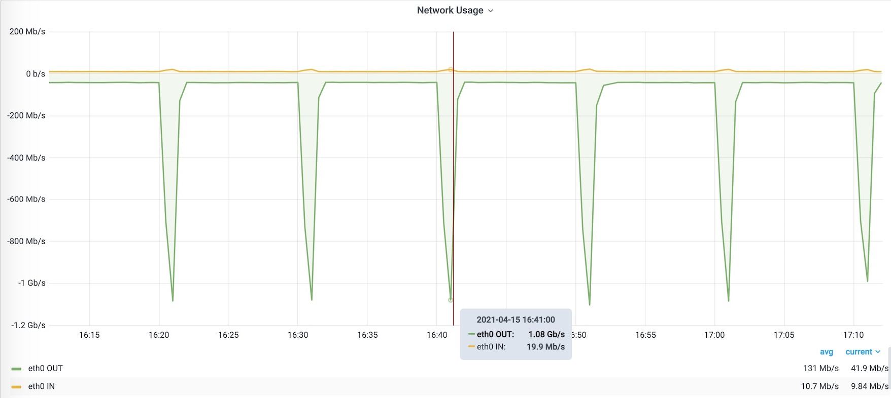
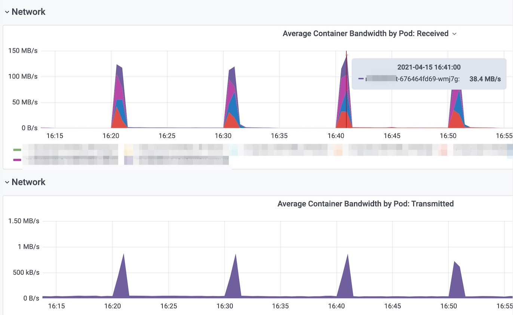
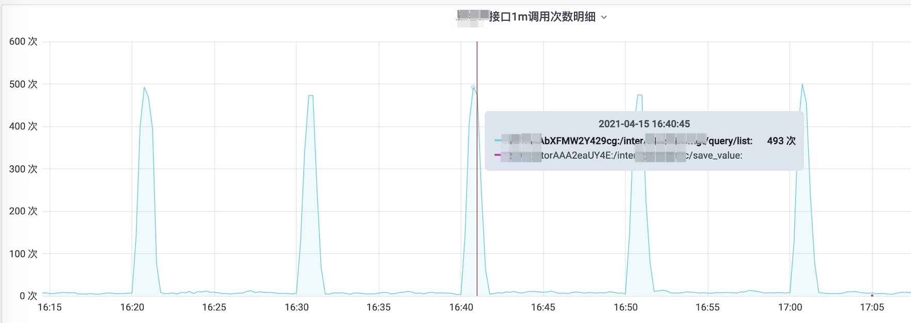

# 一次Redis缓存错误使用案例的排查

[TOC]


错误使用Redis缓存

## 问题描述

Redis网络告警:



## 排查步骤

排查定时调度， 10分钟一次。


排查发现, 有一个web应用 的网络流量与Redis监控匹配。




然后发现，某个客户端的调用次数匹配。




通过 `monitor` 命令在控制台监听Redis执行的命令, 然后汇总.

得到汇总结果之后发现, 大约1分钟内,查询某个key的命令执行了30多万次。


## 问题代码


代码:

```java
private List<BaseActivityVO> buildBaseActivityVOS(List<TBaseActivity> baseActivitys, int requestFrom){
    List<BaseActivityVO> baseActivityVOS = Lists.newArrayList();
    for(TBaseActivity tBaseActivity:baseActivitys){
        try {
            BaseActivityVO baseActivityVO = new BaseActivityVO();
            baseActivityVO.setUserId(Long.parseLong(tBaseActivity.getCode()));
            baseActivityVO.setModifyEnable(checkIsModify(tBaseActivity,requestFrom));
            baseActivityVO.setId(tBaseActivity.getId());
            baseActivityVO.setSource(buildSourceName(tBaseActivity.getSourceFrom()));
            baseActivityVO.setExchangeCode(buildExchangeCode(tBaseActivity.getExchangeId()));
            baseActivityVO.setExchangeId(tBaseActivity.getExchangeId());
            baseActivityVO.setType(buildTypeName(tBaseActivity.getBaseActivityTypeId()));
            baseActivityVO.setState(buildStateName(tBaseActivity.getState()));
            baseActivityVO.setCreatedAt(tBaseActivity.getGmtCreated());
            baseActivityVO.setUpdatedAt(tBaseActivity.getGmtModified());
            baseActivityVOS.add(baseActivityVO);
        } catch (Exception e) {
            log.warn("erro activityr code:{}",tBaseActivity.getCode(),e);
        }
    }
    return baseActivityVOS;
}
```

查看:

```java
private String buildExchangeCode(Long exchangeId){
    List<ExchangeDTO> allExchanges = cncExternalService.getAllExchanges();
    Optional<ExchangeDTO> optionalExchangeDTO = allExchanges.stream().filter(s->s.getId().intValue() == exchangeId.intValue()).findAny();
    if(optionalExchangeDTO.isPresent()){
        return optionalExchangeDTO.get().getCode();
    }else {
        log.error("获取交易所信息失败 exchangeId:{}",exchangeId);
        throw new ValidationException("不存在的交易所");
    }
}
```

获取的代码:

```java
@Override
public List<ExchangeDTO> getAllExchanges() {
    // 先从缓存取, 取不到就去远程取
    // 从远程取回的数据放入缓存缓存24小时, 如果没取回来则把空集合缓存5分钟
    return Optional.ofNullable(redisTemplate.opsForValue().get(EXTERNAL_EXCHANGE_KEY_PREFIX))
            .map(i -> JSON.parseArray(i, ExchangeDTO.class))
            .orElseGet(() -> {
                List<ExchangeDTO> exchangeDTOList = CncExternalUtil.<List<BaseResponseDTO.Exchange>>getDataJavaObjectFromBase(
                        baseAppKeyId, baseAppKeySecret, baseHost + BASE_GET_EXCHANGES_PATH, null, new TypeReference<List<BaseResponseDTO.Exchange>>() {
                        })
                        .orElse(emptyList())
                        .stream()
                        .map(i -> ExchangeDTO.builder()
                                .id(i.getId())
                                .code(i.getCode())
                                .name(i.getName())
                                .type(i.getType())
                                .feeShareRatio(i.getFeeShareRatio())
                                .domain(i.getDomain())
                                .build())
                        .collect(Collectors.toList());
                if (!CollectionUtils.isEmpty(exchangeDTOList)) {
                    String value = JSON.toJSONString(exchangeDTOList);
                    if (log.isDebugEnabled()) {
                        log.debug("cache data fo redis. key: {}, data:{}", EXTERNAL_EXCHANGE_KEY_PREFIX, value);
                    }
                    redisTemplate.opsForValue().set(EXTERNAL_EXCHANGE_KEY_PREFIX, value, 24, TimeUnit.HOURS);
                }
                return exchangeDTOList;
            });
}
```

批量查询，每天数据执行了一次Redis操作，而且是大数据量查询。

## 紧急修复

简单的实现方式:

```java
@Cacheable(value ="getAllExchangesCache",cacheManager = "localCacheManager")
public List<ExchangeDTO> getAllExchanges() {
    // .......
}
```


利用已有的本地缓存配置:

```java
@Bean("localCacheManager")
@Primary
public CacheManager localCacheManager() {
    GuavaCacheManager guavaCacheManager = new GuavaCacheManager();
    CacheBuilder<Object, Object> cacheBuilder = CacheBuilder.newBuilder()
            .maximumSize(100)
            .expireAfterWrite(120, TimeUnit.SECONDS) // 缓存最多缓存120秒
            .removalListener(notification -> {
                if(log.isDebugEnabled()){
                    log.debug("本地缓存被移除 cacheKey:{}", JSONObject.toJSONString(localCacheManager().getCacheNames()));
                }
            });
    guavaCacheManager.setCacheBuilder(cacheBuilder);
    return guavaCacheManager;
}
```

然后上线。 Redis 网络流量问题得到改善。


## 后续改进

可以考虑:

- 使用 LoadingCache。
- 使用 Caffeine

```java
```


## Redis-Key名称相关的设计

1. key一般使用全小写, 方便维护。
2. 使用英文冒号分隔, 这算是使用规约。
3. 特殊类型的数据结构在key中加上标识, 方便运维. 例如: `cnc:web:to_stop:zset`
4. 输出监控指标时, 使用 key_pattern 而不输出可变key, 例如: `cnc:web:user:{userId}`, 再把花括号变为下划线。
