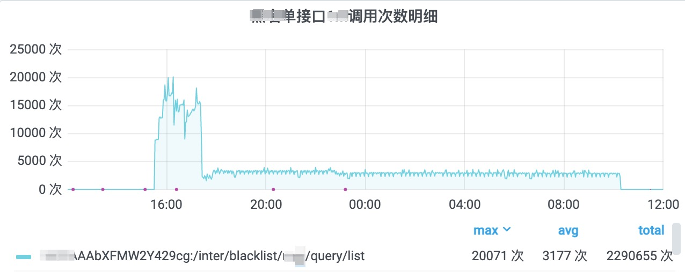
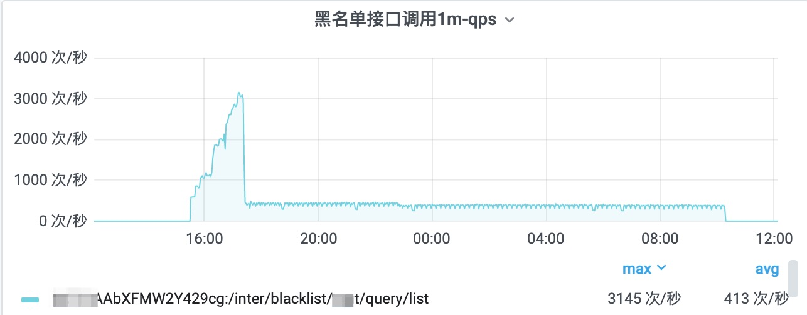
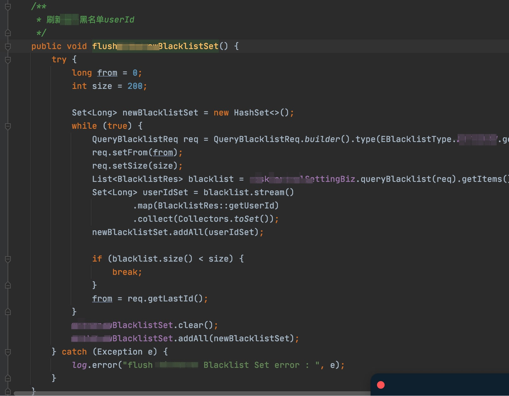

# 防御式编程案例一则


监控发现, 有一个接口的请求量迅速增大:



每秒qps达到3000；



同时, 服务节点的CPU使用率也迅速增加。

发现问题后, 立即排查数据库以及Redis中间件，发觉影响不是很大，

所以将服务节点扩容一倍，先应对这波请求高峰, 再慢慢排查问题。





```java

private List<WhitelistVO> buildWhitelistVOS(List<TCncWhitelist> cncWhitelists, int requestFrom){
    List<WhitelistVO> whitelistVOS = Lists.newArrayList();
    for(TCncWhitelist tCncWhitelist:cncWhitelists){
        try {
            WhitelistVO whitelistVO = new WhitelistVO();
            // :::::: 看这里; 恰好卡在分页的最后一条了?
            whitelistVO.setUserId(Long.parseLong(tCncWhitelist.getCode()));
            whitelistVO.setId(tCncWhitelist.getId());
            whitelistVO.setSource(buildSourceName(tCncWhitelist.getSourceFrom()));
            // 上次的redis-bug入口在这里
            whitelistVO.setSiteCode(buildSiteCode(tCncWhitelist.getSiteId()));
            whitelistVO.setSiteId(tCncWhitelist.getSiteId());
            whitelistVO.setType(buildTypeName(tCncWhitelist.getWhitelistTypeId()));
            whitelistVO.setState(buildStateName(tCncWhitelist.getState()));
            whitelistVO.setCreatedAt(tCncWhitelist.getGmtCreated());
            whitelistVO.setUpdatedAt(tCncWhitelist.getGmtModified());
            whitelistVOS.add(whitelistVO);
        } catch (Exception e) {
            log.warn("userId String to long error code:{}",tCncWhitelist.getCode(), e);
        }
    }
    return whitelistVOS;
}
```


## 相关链接

- [How to monitor Redis performance metrics](https://www.datadoghq.com/blog/how-to-monitor-redis-performance-metrics/)
- [Monitoring MySQL performance metrics](https://www.datadoghq.com/blog/monitoring-mysql-performance-metrics/)
