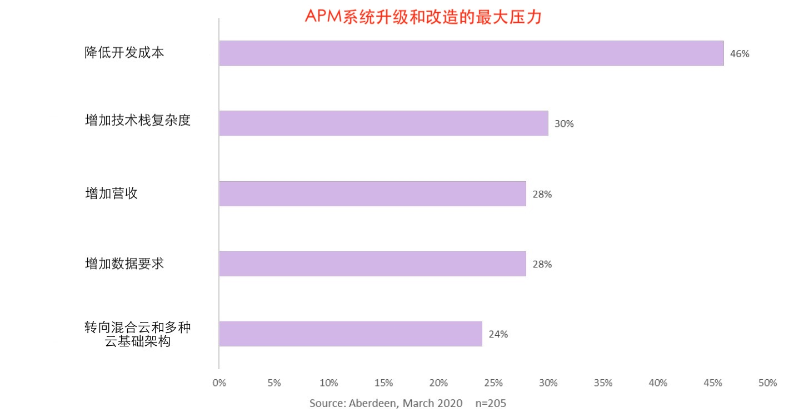
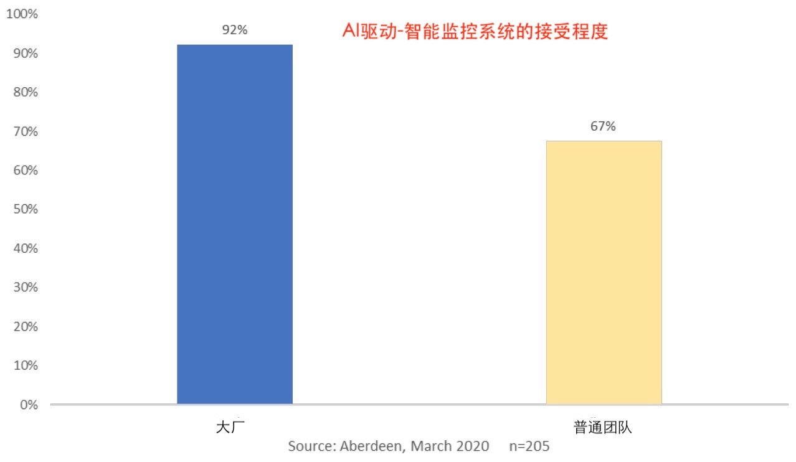
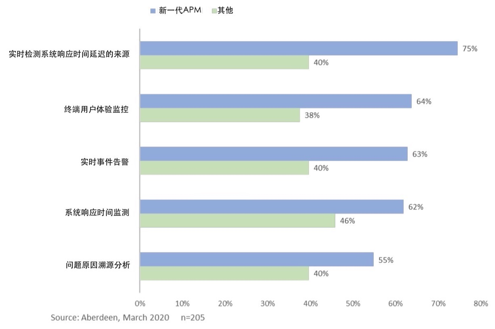

# FACE DEVOPS CHALLENGES HEAD-ON WITH A REDEFINED APPROACH TO APPLICATION MONITORING

# 应对DEVOPS面临的挑战：需要一种全新的监控方法

> April 2020, Jim Rapoza, Research Director

> In this report, Aberdeen analyzes the challenges modern application developers face, as well as the strategies and capabilities that leading businesses are following, such as AI-driven analysis, to optimize their applications. We’ll also delve into the steps that organizations can take to modernize Application Performance Monitoring (APM) and make it ready for the applications of today and the future.

> 作者: Jim Rapoza, 研发总监, 2020年4月;

> 在本文中，Aberdeen 分析了当代程序开发人员所面临的挑战，以及领先企业所采用的策略和能力， 例如AI驱动的数据分析，来优化其应用程序。 我们还将深入研究组织可以采取哪些步骤来实现应用程序性能监控 (APM) 的现代化，并使其为当今和未来的应用程序做好准备。

Application developers today face a constant and rapid pace of change.

How today’s developers create and deploy applications has transformed dramatically from just a few years ago. Rather than large, monolithic applications, today’s developers are building microservices based on containers, Kubernetes, serverless and ephemeral infrastructures, and often deployed on multiple clouds — both public and private.

However, many of the APM solutions that organizations are using to monitor and manage applications were not designed to meet these new development paradigms. For businesses with older solutions, understanding, optimizing, and improving their applications using disconnected and siloed APM tools with slow analytics that alert in minutes instead of seconds, rely heavily on clients, and can’t scale to handle thousands of diverse containers, is often a complex and nearly impossible task.

Aberdeen research has found that when leading organizations adopt modern APM tools that have been built from the ground up to support today’s applications, IT Ops and DevOps teams have deep and fast insight into their applications so that they can troubleshoot and prevent issues before they impact end users.

今天的应用系统开发人员面临着持续而快速的变化。

与几年前相比，今天的开发人员创建和部署应用程序的方式发生了巨大的变化。 今天的开发人员正在构建的微服务, 是基于容器、Kubernetes、无服务器和临时基础设施环境而构建的，而不再使用大型的单体应用程序架构，并且通常部署在多个云上 —— 包括公共云和私有云。

但是，很多企业和组织所用来监控和管理应用程序的 APM 解决方案, 并不是为这些新的开发形式而设计的。 对于使用较老的解决方案的企业，他们使用非连接式, 孤立的 APM 工具来理解、优化和改进他们的应用系统， 这些工具的告警周期在分钟级, 而不是秒级，并且严重依赖客户端，并且无法扩容来应对成千上万个不同的容器，对这些工具而言, 这基本上是一项复杂且几乎不可能完成的任务。

Aberdeen 研究发现，大厂(头部公司)在采用从零设计的方式来构建现代 APM 工具时, 为了支持当今的应用程序，IT Ops 和 DevOps 团队需要对应用程序具有深入而快速的洞察力，以便能够在影响终端用户之前, 就排查和处理掉相应的故障。

> Defining Modern APM:

> Designed to meet the needs of today’s applications and microservices, a modern APM provides powerful real-time streaming, full-fidelity data ingestion, open source instrumentation, and deep AIdriven data analytics

> **现代APM的定义**：

> 现代 APM 旨在满足当今应用程序和微服务的需求，提供强大的实时流、全保真数据摄取、开源基础设置和深度 AI 驱动的数据分析

## Modern Applications Need Modern Approaches to Monitoring

New technologies and trends are bringing significant changes to all application developers, and just as many organizations have finally started to adapt to the changes brought by DevOps, agile, and CI/CD — they now also face microservices, serverless applications, and Kubernetes that disrupt the way that applications are built and deployed.

While modern application architectures and frequent code pushes help accelerate organizational responsiveness and innovation, they are adding new complexities and challenges to monitoring. IT Ops and DevOps teams are limited by traditional APM tools, which have only become more difficult to use given the many new changes to application environments. In our research into application development, Aberdeen asked organizations to list the top drivers pushing them to upgrade and improve their application monitoring as a result of more modern infrastructure and application environments.

## 现代化的应用需要采用现代化的方法来监控

新技术和新趋势正在为所有应用程序开发人员带来重大变化，正如许多组织终于开始适应 DevOps、敏捷和 CI/CD 带来的变化一样 —— 他们现在也面临着微服务、无服务器应用程序和 Kubernetes 的颠覆, 构建和部署应用程序的方式改变了。

虽然现代应用程序架构和代码的频繁变更和提交, 有助于加快组织的响应能力和创新实力，但也给系统监控带来了新的复杂性和挑战。 IT Ops 和 DevOps 团队受到传统 APM 工具的限制，鉴于应用程序运行环境持续不断的变化，这些工具只会变得更加难以使用。 在我们对应用程序开发的研究中，Aberdeen 要求组织列出了, 由于更现代的基础架构和应用程序环境而促使他们升级和改进应用程序监控的主要驱动因素。

> Figure 1: Top Pressures to Improve Application Performance Monitoring

> 图1: 促使APM系统升级和改造的主要动力

Analyzing the data from Figure 1, we find that while many businesses are still driven by the need to reduce the costs associated with application development, another major pressure to improve how they monitor and optimize applications is the rapid pace of technological innovation, and the additional complexity that accompanies it.

Businesses understand the need to be aggressive in adopting technologies that are cloud-native, flexible, and that bring a competitive advantage. However, these businesses and DevOps teams realize that managing and successfully adopting emerging technologies with legacy monitoring tools is a recipe for failure.

The data from Figure 1 also highlights the challenge businesses face with their ability to harness the massive amounts of new data that are generated every day by users, systems, and devices. As always, executives need to ensure that they are getting the most out of their technology investments.

分析图1中列出的数据可以发现，尽管许多企业最主要的驱动力来自于需要降低应用程序开发相关的成本，但促使其改进应用监控和优化的另一个主要压力, 是技术创新的快速步伐，以及随之而来的复杂性。

企业知道, 需要积极采用云原生、灵活并能带来竞争优势的技术。 然而，这些企业和 DevOps 团队意识到，再用老旧的监控工具, 来管理新兴技术是找死的行为。

图1中的数据, 还强调了企业在面对每天由 用户、系统和设备生成的海量数据方面所面临的挑战。 与往常一样，高管们需要确保他们从技术投资中获得最大收益。

## How Leading Organizations Are Transforming Their APM Capabilities

While many organizations are striving to upgrade and improve their APM capabilities, we’ve found that those who are leaders are going beyond simply getting the latest version of what they already have. Businesses that Aberdeen has identified as leaders in application development — meaning they score in the top 30% in uptime, performance, cost savings, and customer satisfaction — are choosing new modern APM solutions that are designed for today’s microservices and cloud-native applications.

What kind of APM solution are leaders identifying and deploying? We’ve found that they are looking for APM with deep analytical capabilities that can handle the massive amount of data from applications, including all metrics, traces, logs, and every other valuable piece of information.

They are identifying APM that can give them analytics in seconds, as they understand keeping customers and end-users happy relies on troubleshooting issues before they become a real problem. And we’ve seen that organizations that are leaders in application development are deploying APM that takes advantage of artificial intelligence to more effectively analyze and optimize their applications, as seen in Figure 2 below.

Leaders also want APM solutions that are as based on open standards as the tools and systems that they are using to build and deploy microservices and modern cloud-native applications. By embracing open tools, leading businesses can avoid vendor lock-in and take advantage of high levels of integration and flexibility.

## 大厂如何迭代升级APM的功能特性

很多公司都在努力升级和改进他们的 APM 系统功能，但我们发现那些领军者不仅仅是简单地获取已有的最新版本。 被 Aberdeen 认定为系统开发领军者的企业 —— 这意味着它们在正常运行时间、性能、成本节约和客户满意度方面得分排在 30% —— 都选择了专为微服务和云原生应用而设计的新型现代 APM 解决方案。

什么样的 APM 解决方案是大厂认可和使用的？ 我们发现他们正在寻找具有深度分析能力的 APM，以处理来自应用程序的大量数据，包括所有指标、跟踪、日志和所有其他有价值的信息。

这些受到认可的APM可以在几秒钟内为团队提供分析报告，实力团队都有一个共识: 让客户和最终用户满意的诀窍，是在隐患成为真正的问题之前, 就对其进行故障排除。 我们已经看到，在信息系统开发领域处于领先地位的组织正在部署 APM，利用人工智能(artificial intelligence)来更有效地分析和优化他们的应用程序，如下图 2 所示。

领军者还希望 APM 解决方案基于开放标准, 与他们用于构建和部署微服务和现代云原生应用的工具和系统一致。 通过采用开放工具，领先的企业可以避免供应商锁定，并利用自身高超的系统集成水平和灵活性优势。

> Figure 2: How AI-driven Intelligent Monitoring is Adopted

> 图2: AI驱动的智能监控系统的接受程度

Looking at this data, we see that adoption of monitoring that utilizes AI to provide faster and better analysis and outcomes is nearly universal among leaders. By implementing AI as part of an overall upgrade to modern, cloud-native APM, leaders are achieving the highest levels of application performance and reliability, and keeping users and customers free from the frustrations of slow and unavailable applications.

通过查看这些数据，我们发现采用人工智能来提供更快、更好分析结果的监控, 在领军者中几乎是普遍的。 通过将 AI 作为现代云原生 APM 整体升级的一部分实施，领军者正在达成最高水平的应用系统性能和可靠性，让用户和客户免受应用程序缓慢和系统不可用的困扰。

## Modern, AI-enabled APM Boosts All Application Management

Leaders in application development are taking advantage of APM with powerful real-time streaming, full-fidelity data ingestion, open source instrumentation, and deep AI-driven data analytics. But what are the capabilities and advantages that even organizations that aren’t leaders are gaining when they adopt these solutions? To understand, Aberdeen analyzed our research data to identify businesses that had adopted cutting-edge, modern APM. We then compared these organizations to competitors who aren’t leveraging APM with streaming analytics and AI capabilities.

We discovered that application development organizations that adopt modern APM (as defined on page 2), outpace their peers in a number of key capabilities for understanding and managing today’s complex cloudnative applications and microservices.

## 支持AI的现代APM, 提升所有应用程序管理

应用程序开发的领军者正在利用 APM 的强大实时流计算功能、全保真数据摄取、开源基础设施, 以及AI 驱动的深度 数据分析特性。 但如果不是领军者的组织, 在采用这些解决方案时, 能获得哪些能力和优势呢？ 为了理解这一点，Aberdeen 分析了我们的研究数据，以确定采用现代最先进的 APM 的企业的结果。 然后，将这些组织与那些没有采用具有流分析和AI功能的 APM 的竞争对手进行对比。

我们发现，采用现代APM（在前面的小节所定义）的应用程序开发组织, 在理解和管理当今最复杂的云原生应用和微服务方面, 许多关键能力都超过了同行。

> Figure 3: Modern APM Leads to Better End-to-End Application Management

> 图3: 新一代APM可带来更好的端到端应用管理能力

With a modern APM powering their monitoring and troubleshooting capabilities, development organizations are reaping the benefits of realtime alerting, meaning that they are likely to have the capability to identify issues in seconds rather than the minutes or hours businesses with legacy APM experience. A modern APM also leads to better adoption of strong application performance monitoring across the board, and AI enables the ability to perform deep and accurate root-cause analysis for application issues.

It’s clear that adoption of a modern APM leads to better end-to-end capabilities for managing today’s complex application environments. But Aberdeen research shows that the benefits extend beyond capabilities and is helping organizations improve ROI, reliability, and customer experience.

We’ve found that among the top pressures pushing development organizations to improve their application infrastructure is the increasing complexity that new technologies such as Kubernetes, containers, and hybrid cloud are bringing. But IT Ops and DevOps teams are still driven by traditional demands of performance, data demand, and the bottom line. Application developers who are leaders in performance, data management, and ROI are adopting modern APM that provides streaming analytics and artificial intelligence enabled monitoring. But given the near universal adoption of modern APM among the leaders (as shown in Figure 2), it’s valid to ask if modern APM is a big part of what makes these businesses Best-in-Class.

When Aberdeen looked at the benefits that application development organizations gained by adopting modern APM, the answer to this question is yes. Across the board, businesses with modern APM are seeing significant gains over their competitors, as shown in Table 1.

借助现代 APM 为其监控和故障排除功能提供支持，开发组织获得了实时告警的好处，这意味着他们可能能够在几秒钟内识别问题，而不是传统 APM 监控的业务那样需要几分钟甚至几小时。 现代 APM 还可以更好地全面采用强大的应用程序性能监控，并且 AI 能够对应用程序问题执行深入而准确的根本原因分析。

很明显，采用现代 APM 可以为管理当今复杂的应用环境带来更好的端到端功能。 Aberdeen 的研究表明，这些优势不仅限于能力，而且正在帮助组织提高投资回报率(ROI)、可靠性(reliability)和用户体验(customer experience)。

我们发现，推动开发组织改进系统基础设施的最大压力之一是 Kubernetes、容器和混合云等新技术带来的日益增长的复杂性。 但 IT Ops 和 DevOps 团队仍然受到传统的性能、数据需求和底线需求的驱动。 在性能、数据管理和 ROI 方面处于领先地位的程序开发人员采用了现代 APM，以提供流式分析和支持人工智能的监控。但鉴于现代 APM 在领军者中几乎普遍采用（如图 2 所示），有必要调查一下现代 APM 是否是使这些企业成为一流企业的重要组成部分。

当 Aberdeen 研究应用开发组织通过采用现代 APM 获得的好处时，这个问题的答案是肯定的。 如 表1 所示，拥有现代 APM 的企业总体上比竞争对手取得了更明显的进步。

> Table 1: Meeting Complex Application Demands with a Modern APM Organizations with a modern APM are:
>
> 表1: 通过现代 APM 来满足复杂的应用程序需求, 对使用现代 APM 的组织的共享包括:

| 比例 | 说明 |
| --- | --- |
| 95% | more likely to speed the resolution of application issues |
| 45% | more likely to see high levels of application availability |
| 80% | more likely to have lowered the costs for application development |
| 2x | more likely to see lower defect rates |
| 3.7x | more likely to report higher levels of customer and end-user satisfaction with applications |

Compared to their peers that are still making use of traditional APM, organizations with modern APM that gives them vital insight and proactive analytics are more likely to have high application reliability, less application downtime, and fewer application defects. With AI tied to realtime analytics, modern APM users are also addressing issues much faster than their competitors, speeding resolution of application problems before they become an issue for end-users and customers.

Most importantly, by upgrading to an APM that is designed from the ground up to handle today’s application environments, they are building high-performing and user friendly applications that keep customers and users highly satisfied. And with more reliable applications that work well with modern development environments and solutions, these modern APM organizations are more likely to have lower overall costs for application development.

与仍在使用传统APM 的同行相比，拥有现代 APM 的组织, 可以为其提供重要的洞察力和主动分析能力, 更有可能具有较高的应用程序可靠性、更少的应用程序停机时间和更少的应用程序缺陷。 通过将人工智能与实时分析组合起来，现代 APM 用户也比竞争对手更快地发现和解决问题，在系统BUG影响最终用户和客户之前, 加快解决问题的速度。

最重要的是，通过从头开始设计的APM升级, 以应对当今应用程序环境， 他们正在构建高性能和用户友好的应用程序，让客户和用户高度满意。 有了更可靠的应用程序, 还有现代开发环境和解决方案的支持，这些使用现代 APM 的组织有更大的可能来降低应用程序开发的总体成本。

## Key Takeaways

Application developers have been in a constant state of change in recent years. They adopted DevOps and agile, they are shifting left in testing, and they are deploying containerized, Kubernetes-based, cloud-native applications instead of traditional monolithic apps.

This transformative change requires a new approach to APM. As we’ve seen, organizations that adopt modern, open standards based APM, with full-fidelity tracing and end-to-end, real-time analytics that leverages AI for increased insight into the rising amount of data, gain increased capabilities and see significant benefits.

To join these leaders, and bring their APM capabilities into the modern age, application developers, IT Ops and DevOps teams should:

## 关键要点

近年来，应用程序开发人员一直处于不断变化的状态。 他们采用了 DevOps 和敏捷，他们在测试中漂移，他们正在部署容器化、基于 Kubernetes 的云原生应用程序，而不是传统的单体应用程序。

这种变革性的变化需要一种新的 APM 监控方案。 正如我们所见，采用基于现代、开放标准的 APM、全保真跟踪和端到端实时分析的组织，面对不断增长的数据量, 利用 AI 来增加洞察力，获得增强的功能并收到明显的好处。

要加入这些领军者的行列，并将他们的 APM 能力带入现代的，应用程序开发人员、IT Ops 和 DevOps 团队, 可以这样做：

- **Know what is happening right now**.
When end-users experience an application problem before operations knows about it, negative results such as poor productivity for employees or dissatisfied customers speaking out on social media will occur. Real-time monitoring in seconds and incident alerting detect application issues as they occur and leads to swift resolution of problems.

- **Add deep, continuous and AI-driven monitoring and analytics**.
Today’s complex applications create a wealth of data that is both valuable and overwhelming. Leading businesses leverage APM that can pull data from all sources, such as traces and metrics, and can use strong AI to analyze this massive amount of data to gain better understanding and management.

- **Take immediate action**.
The sooner an application issue is fixed, the less potential it has to affect users (and decrease productivity and revenue). Modern APM systems with streaming analytics and AI capabilities can take quick steps to limit the effect of an application issue and provide the information needed to avoid future problems.

- **Be open and break down silos**.
Today’s applications are built with open standards and frameworks and are designed to easily integrate with any other application or service. The solutions that developers use to manage and monitor applications need the same kind of openness. Leading organizations leverage open standards based APM systems that consolidate monitoring into a single screen and give them the ability to replace their APM at any time, control and own their data, and not be locked in with a single APM vendor that uses a proprietary agent.

Modern applications based on cloud, containers, microservices, and serverless functions need modern application performance monitoring tools. Ephemeral infrastructure, complex service interdependencies, and much more frequent code pushes are quickly becoming the norm and legacy tools are limited in their ability to support these more dynamic and distributed environments.

- **了解今天发生了什么**。
当终端用户先遇到应用程序问题, 而运营人员还不知道时，就会出现负面结果，例如员工生产力低下, 或者客户在社交媒体上投诉不满。 几秒钟内的实时监控和事件警报可在应用程序问题发生时检测到, 帮助运营方迅速解决问题。

- **上马深度、持续和人工智能驱动的监控和分析**。
当今复杂的应用程序创建了大量有价值且压倒性的数据。 领先的企业利用 APM 可以从所有来源（例如跟踪和指标）中提取数据，并且可以使用强大的 AI 来分析这些海量数据以更好地理解和管理。

- **立即采取行动**。
应用程序问题越早解决，影响到用户的可能性就越小（影响到用户就会降低生产力和收入）。 具有流式分析和 AI 功能的现代 APM 系统可以采取快速措施来限制应用程序问题的影响范围，并提供未来可能发生问题所需的信息。

- **开放, 打破信息孤岛**。
今天的应用程序是使用开放标准和框架构建的，旨在轻松与任何其他应用程序或服务集成。 开发人员用来管理和监控应用程序的解决方案同样需要开放性。 领先的组织利用基于开放标准的 APM 系统，将监控整合到一个屏幕中，使他们能够随时更换 APM、控制和拥有自己的数据，而不会被专有agent的单一 APM 供应商锁定和掣肘。

基于云、容器、微服务和无服务器功能的现代应用程序，需要现代APM工具。 临时基础设施、复杂的服务依赖，以及频繁的代码推送正迅速成为常态，而遗留工具在支持这些更加动态和分布式环境的能力方面受到限制。

## About Aberdeen

Since 1988, Aberdeen has published research that helps businesses worldwide to improve their performance. Our analysts derive fact-based, vendor-neutral insights from a proprietary analytical framework, which identifies Best-in-Class organizations from primary research conducted with industry practitioners. The resulting research content is used by hundreds of thousands of business professionals to drive smarter decision-making and improve business strategies. Aberdeen is headquartered in Waltham, Massachusetts, USA.

This document is the result of primary research performed by Aberdeen and represents the best analysis available at the time of publication.

Unless otherwise noted, the entire contents of this publication are copyrighted by Aberdeen and may not be reproduced, distributed, archived, or transmitted in any form or by any means without prior written consent by Aberdeen.

## 关于阿伯丁(Aberdeen)

自 1988 年以来，Aberdeen 发表了帮助全球企业提高绩效的研究报告。 我们的分析师从专有分析框架中获得基于事实的、供应商中立的见解，该框架从与行业从业者进行的初步研究中识别出一流的组织。 由此产生的研究内容被成千上万的商业专业人士用来推动更明智的决策和改进商业战略。 Aberdeen总部位于美国马萨诸塞州沃尔瑟姆(Waltham, Massachusetts, USA)。

本文件是 Aberdeen 进行初步研究的结果，代表了该文件出版时可用的最佳分析。

除非另有说明，否则本出版物的全部内容均由 Aberdeen 拥有版权，未经 Aberdeen 事先书面同意，不得以任何形式或任何方式复制、分发、存档或传播。

## ABOUT OUR SPONSOR

These days we hear a lot about how cloud, containers, Kubernetes, and DevOps can help applications scale better, reduce time to market, and give developers the flexibility to choose the right tool for the job. We also hear that the shift from a monolithic to a microservices-based architecture brings new monitoring challenges around the scale of data, the ephemerality of the underlying infrastructure, and the constantly changing interactions between all these components.

Many organizations try to leverage traditional Application Performance Monitoring (APM) tools in order to meet ever-increasing user expectations. However, most traditional APM solutions were designed for a world in which a single monolithic application would run on a static set of on-premises hosts. In such a world, applications were slow to change, written in a single language, and operated by separate teams. That is not the world in which our applications live in today.

Modern applications need an APM tool that is designed for cloud-native, microservices-based architectures from the ground up. Such a solution would have to handle the enormous amount of data associated with a microservices architecture and ephemeral infrastructure. It would need to collect ALL available data and leverage AI-driven analysis to derive insights to enable DevOps and SRE teams to act quickly and effciently. Finally, as today’s developers now have a broad set of tools and languages to choose from, modern APM tools also need support for open and flexible standards that meet the needs of modern DevOps teams.

## 关于赞助商

这些天来，我们听到很多关于云、容器、Kubernetes 和 DevOps 如何帮助应用程序更好地扩展、缩短上市时间以及让开发人员能够灵活地选择合适的工具来完成工作的内容。我们还听说，从单体架构到基于微服务的架构的转变带来了围绕数据规模、底层基础设施的短暂性以及所有这些组件之间不断变化的交互的新监控挑战。

许多组织试图利用传统的应用程序性能监控工具 (APM) 来满足不断增长的用户预期。 但是，大多数传统的 APM 解决方案都是为单个单体应用程序在一组静态的本地主机上运行的环境而设计的。 在这样的环境中，应用程序变化比较缓慢，使用单一编程语言，并由不同的团队运营。 这不是我们今天的应用程序所处的世界。

现代应用程序需要一个 APM 工具，该工具专为云原生、基于微服务的架构而设计。 这样的解决方案必须处理与微服务架构和临时基础设施相关的大量数据。 它需要收集所有可用数据并利用人工智能驱动的分析来获得洞察力，以使 DevOps 和 SRE 团队能够快速有效地采取行动。 最后，由于当今的开发人员有大量工具和语言可供选择，现代 APM 工具还需要支持开放和灵活的标准，以满足现代 DevOps 团队的需求。

Splunk designed SignalFx Microservices APM™ with all of this in mind. SignalFx Microservices APM leverages our streaming analytics engine to ingest 100% of trace data, correlate service workloads to underlying cloud infrastructure, and provides AI-Driven Directed Troubleshooting to help DevOps teams detect and resolve issues in their applications before users are negatively impacted.

As founding members and active contributors to the CNCF OpenTelemetry project, Splunk is committed to open standards that eliminate vendor lock-in and give developers the most flexibility to ship high quality code quickly and effciently .

We find that customers who leverage our modern approach to APM are able to achieve things that were impossible with legacy APM tools. Many of them have been able to cut down troubleshooting issues from hours or even days to just a few minutes. By leveraging 100% of trace data they can understand the conditions that cause even the rarest of anomalies, and at a scale unmatched by other solutions. Finally, with our open standards approach to instrumentation they are able to eliminate the overhead of heavy, proprietary agents and maintain full control over their own data.

Today’s end users expect instant gratification and superb application experience. Only by taking a modern approach to APM can organizations elevate end user experience, bring applications to market faster, and future-proof their code.

Splunk 设计 SignalFx Microservices APM™ 时考虑到了所有这些情况。 SignalFx Microservices APM 利用我们的流分析引擎来摄取 100% 的跟踪数据，将服务工作负载与底层云基础设施相关联，并提供 AI 驱动的定向故障排除，以帮助 DevOps 团队在用户受到负面影响之前检测并解决其系统中的问题。

作为 CNCF OpenTelemetry 项目的创始成员和积极贡献者，Splunk 致力于消除供应商锁定的开放标准，并为开发人员提供最大的灵活性，以快速高效地发布高质量代码。

我们发现，利用现代 APM 监控的客户能够实现传统 APM 工具无法实现的目标。 他们中的许多人已经能够将故障排除问题从几小时甚至几天缩短到几分钟。 通过利用 100% 的跟踪数据，可以了解导致最罕见异常的场景，并且其规模是其他解决方案无法比拟的。最后，通过我们的开放标准检测方法，他们能够消除繁重的专有代理的开销，并保持对自己数据的完全控制。

今天的最终用户期望即时满足和卓越的应用体验。只有采用现代 APM 监控方法，组织才能提升最终用户体验，更快地将应用程序推向市场，并让自己的代码面向未来。

#  参考链接

- <https://www.splunk.com/pdfs/white-papers/face-devops-challenges-head-on-with-a-redefined-approach-to-application-monitoring.pdf>
