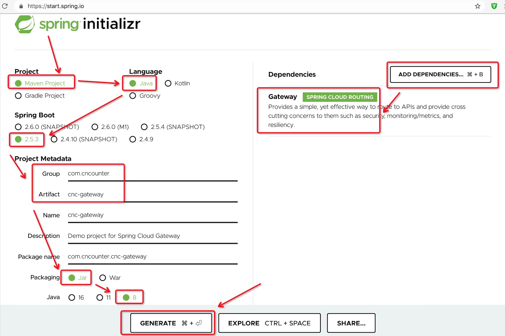
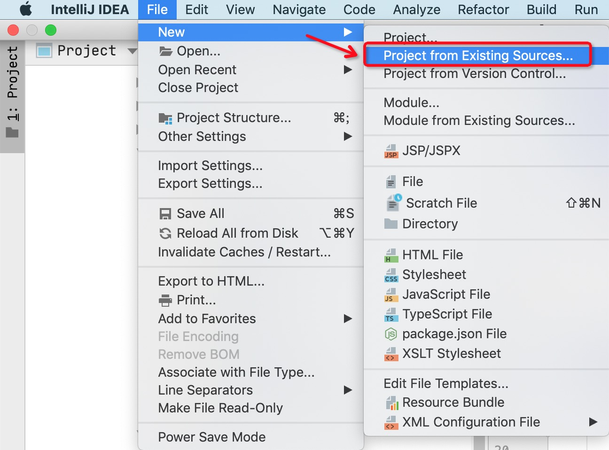

# Spring网关入门教程

网关一般有三个作用:

- 路由转发
- 权限校验
- 熔断限流

Spring网关, 全称叫做 Spring Cloud Gateway; 官方项目地址为: <https://spring.io/projects/spring-cloud-gateway>

官方教程的链接为: <https://spring.io/guides/gs/gateway/>

下面我们从简单到复杂, 一步步学习怎么搭建Spring网关, 其中会碰到哪些坑。

## 1. 生成网关基础项目

我们使用 Spring initializr 来初始化项目, 现在它的网址变成了:  <https://start.spring.io/>

打开之后, 填写相关的信息, 根据你的需要选择。

例如:

| 选项          |    值          |
| ------------ | -------------- |
| Project      | Maven Project  |
| Language     | Java           |
| Spring Boot  | 2.5.3 版本      |
| ==========   | ==========     |
| Project Metadata  |           |
| ==========   | ==========     |
| Group        | `com.cncounter`|
| Artifact     | `cnc-gateway`  |
| Name         | `cnc-gateway`(此项自动填充)  |
| Description  | Demo project for Spring Cloud Gateway  |
| Package name | `com.cncounter.cnc-gateway`(此项自动填充)  |
| Packaging    | Jar                        |
| Java         | 8 (Java版本: 8、11、16)     |

填写完成后, 点击页面右边的 "ADD DEPENDENCIES" 按钮, 添加需要的依赖。

在弹出框中输入 "gateway", 可以搜索到 "Gateway SPRING CLOUD ROUTING", 选中即可。

可以看到 spring-cloud-gateway 相应的介绍:

> Provides a simple, yet effective way to route to APIs and provide cross cutting concerns to them such as security, monitoring/metrics, and resiliency.

配置完成后, 我们可以执行的操作包括:

- 点击 ["GENERATE"](https://start.spring.io/#!type=maven-project&language=java&platformVersion=2.5.3.RELEASE&packaging=jar&jvmVersion=1.8&groupId=com.cncounter&artifactId=cnc-gateway&name=cnc-gateway&description=Demo%20project%20for%20Spring%20Cloud%20Gateway&packageName=com.cncounter.cnc-gateway&dependencies=cloud-gateway) 按钮, 生成项目ZIP, 并自动弹出下载框。
- 点击 ["EXPLORE"](https://start.spring.io/#!type=maven-project&language=java&platformVersion=2.5.3.RELEASE&packaging=jar&jvmVersion=1.8&groupId=com.cncounter&artifactId=cnc-gateway&name=cnc-gateway&description=Demo%20project%20for%20Spring%20Cloud%20Gateway&packageName=com.cncounter.cnc-gateway&dependencies=cloud-gateway) 按钮, 预览项目结构, 预览符合需求之后, 也可以点击 DOWNLOAD 按钮下载。
- 点击 ["SHARE...""](https://start.spring.io/#!type=maven-project&language=java&platformVersion=2.5.3.RELEASE&packaging=jar&jvmVersion=1.8&groupId=com.cncounter&artifactId=cnc-gateway&name=cnc-gateway&description=Demo%20project%20for%20Spring%20Cloud%20Gateway&packageName=com.cncounter.cnc-gateway&dependencies=cloud-gateway) 按钮, 把我们刚刚生成的配置信息作为链接分享给其他人。

我们点击 ["GENERATE"](https://start.spring.io/#!type=maven-project&language=java&platformVersion=2.5.3.RELEASE&packaging=jar&jvmVersion=1.8&groupId=com.cncounter&artifactId=cnc-gateway&name=cnc-gateway&description=Demo%20project%20for%20Spring%20Cloud%20Gateway&packageName=com.cncounter.cnc-gateway&dependencies=cloud-gateway) 按钮, 生成项目ZIP, 并保存报本地即可。

## 2. 导入并启动项目

2.1 解压项目

将我们刚才下载的文件解压。 因为选择的项目结构是Maven, 解压后是一个标准的Maven项目。

2.2 导入项目

我们使用的开发工具是 Idea, 需要先导入项目。

## 其他
