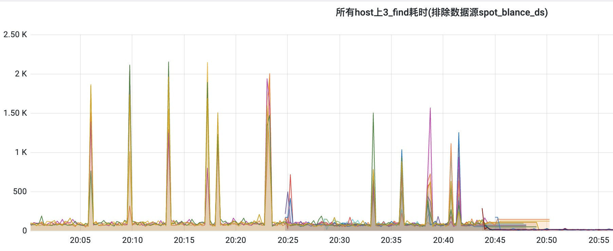

# 系统响应延迟调优案例一则

## 1. 背景

这是一个风控相关的案例, 本案例的标签为: `运营活动`、`邮箱相似度`。。

风控我们可以简单分为两部分:

- 业务风控
- 安全风控

其中, 业务风控根据企业开展的业务领域而展开, 例如:

- 账号注册：批量注册, 虚假信息注册
- 运营活动：羊毛、机器脚本、小号；
- 金融场景：欺诈、贷款。
- 合规运营: 法律法规, 反洗钱反恐融资(AML/CFT)。

安全风控则涵盖:

- 账号安全: 系统登录、修改信息；
- 资金安全: 资金盗用、钓鱼；
- 其他安全问题;

## 2. 问题现状

## 3. 问题分析

因为注册量持续走高, 导致数据集的规模越来越大;

而运算量跟数据量呈正比关系;

如果并发请求量超过预设的并发容量限制, 则会造成多个请求在互相争抢CPU资源， 导致各个请求的延迟出现几十倍的增长; 指标数据也很不好看。

甚至充当坏邻居，影响其他业务。

## 4. 解决方案

本地缓存 + 小批量数据集合并;

降低中间结果的存储时间窗口;

过滤长度差异较大的数据;

快速筛查过滤优化;

通过名单过滤掉临时邮箱;

通过数据分析, 过滤掉明显作弊的邮件信息;

## 5. 优化效果

## 6. 小结

后续处理: 在业务流程上考虑时间因素, 如果有低嫌疑, 则在X天之后领奖前让用户再确认一次。

问题的解决方案总是出现在问题领域之外, 最终解决问题的好办法还是得从其他维度进行处理。

通过分析数据，从其他维度进行处理。

相关链接:

- [如何使用Gmail创建一次性电子邮件地址](https://www.labnol.org/internet/disposable-email-address/28072/)
- Bing.com 搜索 `Temp Mail`
