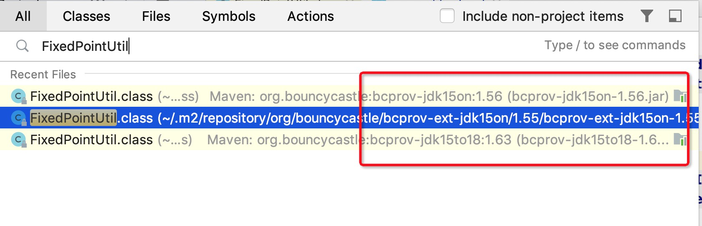

# 一次Java包冲突的问题排查案例

本文简要介绍一次类冲突问题的案例, 以及排查解决的过程。

## 背景

生产环境报错, 由于涉及到资金相关的业务, 所以通过人工干预的手段进行了紧急处置。

但这只是临时解决办法, 还是要尽快定位问题并处理。

## 问题排查

涉及到的多条业务线, 几十号人追查了3个小时, 排查了很多环节, 还没有找到原因。

后来我介入进去，利用秦老师课程上讲的知识, 2分钟就定位到了原因 ^_^

之后的事情相对就简单了, 业务让步, 相关系统回滚, 去除人工干预。


## 报错现场

Kibana:


Docker容器的本地日志:


```
# 错误日志1; 有1条
Exception in thread "pool-4-thread-1"
 java.lang.NoSuchMethodError: org.bouncycastle.math.ec.FixedPointUtil.precompute(Lorg/bouncycastle/math/ec/ECPoint;)Lorg/bouncycastle/math/ec/FixedPointPreCompInfo;
	at org.bitcoinj.core.ECKey.<clinit>(ECKey.java:142)
	at org.bitcoinj.core.Block.<clinit>(Block.java:942)
	at org.bitcoinj.core.NetworkParameters.createGenesis(NetworkParameters.java:118)
	at org.bitcoinj.core.NetworkParameters.<init>(NetworkParameters.java:114)
	at org.bitcoinj.params.AbstractBitcoinNetParams.<init>(AbstractBitcoinNetParams.java:57)
	at org.bitcoinj.params.MainNetParams.<init>(MainNetParams.java:36)
	at org.bitcoinj.params.MainNetParams.get(MainNetParams.java:142)
	at org.bitcoinj.core.NetworkParameters.fromID(NetworkParameters.java:186)
	......
	at java.util.concurrent.ThreadPoolExecutor.runWorker(ThreadPoolExecutor.java:1149)
	at java.util.concurrent.ThreadPoolExecutor$Worker.run(ThreadPoolExecutor.java:624)
	at java.lang.Thread.run(Thread.java:748)

# 错误日志2: 有很多条
Exception in thread "pool-4-thread-12"
 java.lang.NoClassDefFoundError: Could not initialize class org.bitcoinj.core.Block
	at org.bitcoinj.core.NetworkParameters.createGenesis(NetworkParameters.java:118)
	at org.bitcoinj.core.NetworkParameters.<init>(NetworkParameters.java:114)
	at org.bitcoinj.params.AbstractBitcoinNetParams.<init>(AbstractBitcoinNetParams.java:57)
	at org.bitcoinj.params.MainNetParams.<init>(MainNetParams.java:36)
	at org.bitcoinj.params.MainNetParams.get(MainNetParams.java:142)
	at org.bitcoinj.core.NetworkParameters.fromID(NetworkParameters.java:186)
	......
	at java.util.concurrent.ThreadPoolExecutor.runWorker(ThreadPoolExecutor.java:1149)
	at java.util.concurrent.ThreadPoolExecutor$Worker.run(ThreadPoolExecutor.java:624)
	at java.lang.Thread.run(Thread.java:748)
```


## 原因分析

类加载失败,

打断点跟踪,


## Maven依赖树

mvn dependency:tree


获取依赖树:

```
+- com.cnc:cnc-crypto:jar:1.30:compile
|  +- org.bouncycastle:bcprov-ext-jdk15on:jar:1.55:compile
|  \- javax.servlet:javax.servlet-api:jar:3.1.0:compile
+- com.cnc.wallet:address-validator:jar:0.1.148:compile
|  +- junit:junit:jar:4.12:compile
|  |  \- org.hamcrest:hamcrest-core:jar:1.3:compile
|  +- org.bitcoinj:bitcoinj-core:jar:0.15.9:compile
|  |  +- org.bouncycastle:bcprov-jdk15to18:jar:1.63:compile
|  |  +- com.google.protobuf:protobuf-java:jar:3.6.1:compile
|  |  \- net.jcip:jcip-annotations:jar:1.0:compile
|  +- org.bouncycastle:bcpkix-jdk15on:jar:1.56:compile
|  |  \- org.bouncycastle:bcprov-jdk15on:jar:1.56:compile
```


这里顺便提一下Maven的依赖优先级:


但是,





```java
// bcprov-ext-jdk15on-1.55.jar
// bcprov-jdk15on-1.56.jar
package org.bouncycastle.math.ec;
public class FixedPointUtil {
    public static FixedPointPreCompInfo precompute(ECPoint var0, int var1) {
```


```java
// bcprov-jdk15to18-1.63.jar
package org.bouncycastle.math.ec;
public class FixedPointUtil {
    // 可以看到这里方法签名变了, 只有1个参数; 而且没有重载
    public static FixedPointPreCompInfo precompute(final ECPoint var0) {
```


## 解决办法

通过 exclusions 排除依赖


```xml
            <dependency>
                <groupId>com.cnc</groupId>
                <artifactId>cnc-crypto</artifactId>
                <version>1.30</version>
                <exclusions>
                    <exclusion>
                        <groupId>org.bouncycastle</groupId>
                        <artifactId>bcprov-ext-jdk15on</artifactId>
                    </exclusion>
                </exclusions>
            </dependency>
```

测试, 验证影响.
