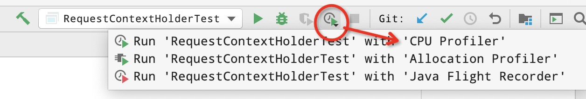
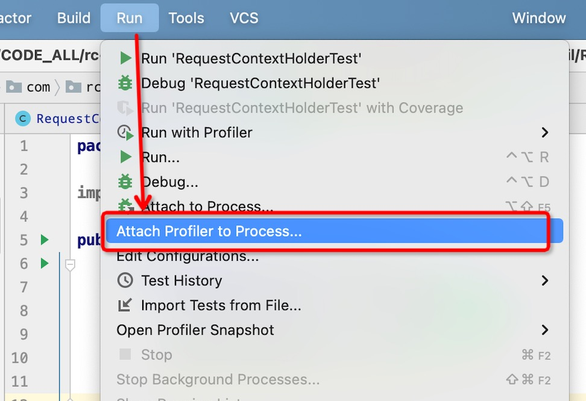
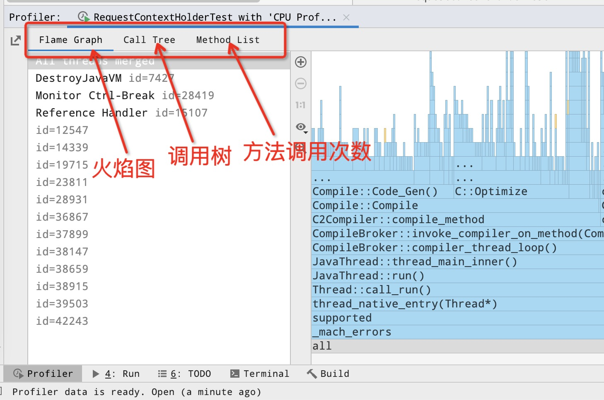

# async-profiler简介


async-profiler 是一款低开销的 Java 采样分析器(sampling profiler), 最大的亮点是避免了 `安全点偏差问题`:

> http://psy-lob-saw.blogspot.com/2016/02/why-most-sampling-java-profilers-are.html

其大致的实现原理, 是利用 HotSpot 专有的 API, 采集调用栈(stack traces)信息, 以及追踪内存分配信息。 兼容 OpenJDK、Oracle JDK 以及其他基于 HotSpot JVM 的 Java 运行时。


async-profiler 可以跟踪的事件类型包括:

- CPU周期
- 硬件/软件性能计数器: 比如CPU高速缓存未命中, 代码分支未命中, 页面错误, 线程上下文切换等等.
- Java堆内存中的对象分配
- 锁尝试, 包括管程锁(Java object monitor) 以及 ReentrantLock


由于优异的性能和完备的特征, 很多工具在内部都使用了 async-profiler, 比如我们熟悉的编辑器 IntelliJ Idea, 以及交互分析工具 Arthas。


## 演示程序

async-profiler 的作者 apangin 给出了很多demo程序, 可以访问以下网址获取:

> https://github.com/apangin/java-profiling-presentation

其中有一个 StringBuilderTest 程序, 程序代码大致如下:

```java
public class StringBuilderTest {

    public static void main(String[] args) {
        // 创建一个字符串构建器
        StringBuilder builder = new StringBuilder();
        builder.append(new char[100_0000]);
        do {
            builder.append(10086);
            builder.delete(0, 5);
        } while (Thread.currentThread().isAlive());
        // 实际上因为类似死循环, 没有退出条件, 代码执行不到此处;
        System.out.println(builder);
    }
}
```

代码很简单, 一直在 StringBuilder 末尾追加 5 个字符, 并删除 StringBuilder 开头的5哥字符; 这里真正的瓶颈是 `delete()`, 因为需要移动 100 万个字符。  

大多数采样分析器的结果都有问题。 基于安全点的分析器会将 `Thread.isAlive()` 显示为热点方法。 JFR 则根本不会报告任何有用的信息，因为它无法在 JVM 执行 `System.arraycopy()` 时遍历调用栈。

读者也可以试试自己常用的分析器, 来分析这个程序，看看是否可以找出占用 CPU 时间最多的热点代码。

> 如果手头上没有其他适合的测试程序, 可以使用这段代码来作为样本进行后续的学习。 


接下来我们先介绍一些背景知识。


## 采样分析器

sampling profiler, 采样分析器, 有时候也称为 "抽样分析器"。 

根据概率学知识, 通过采样/抽样, 只要样本达到一定规模, 我们就可以进行推导分析，认为这些样本大概率能够暴露应用所遇到的性能问题。
我们在进行性能优化或者系统故障排查时, 一般都是通过监控来分析代码行为和性能瓶颈。 
在排查或解决了大部分常见的系统瓶颈后, 如果需要进一步分析和优化, 可以使用 Profiling 技术, 在程序运行过程中, 动态采集各种信息, 并对收集到的样本数据进行自动化分析。 
大部分JVM Profiler都支持从多个维度进行分析，比如CPU、内存、线程、类加载、GC等等。
其中最最常用的是 CPU 采样分析(CPU Profiling), 可以用于确定代码的执行热点, 比如:

- 哪些方法消耗了最多的CPU执行时间
- 每个方法占用的比例是多少

通过 CPU Profiling 技术得到这些信息之后, 我们就可以针对热点代码进行专门的优化，从而解决很多性能领域的疑难问题，提升吞吐量和响应速度，同时也降低资源消耗。

除CPU采样分析器之外, 常见的还有分配分析器(Allocation Profiler), 可用来确定哪些代码执行路径分配了大量的对象，从而针对性优化。 内存的分配分析以及对象的内存占用也可以参考前面的章节。


## 其他分析器存在的问题 

很多分析器都不太完善, 或多或少存在一些问题, 例如:

- 安全点偏差问题: 采样分析器(Sampling profilers), 只在安全点状态进行采样, 很多时候会掩盖真实的问题点;
- 性能问题: 检测类型(Instrumenting)的分析器, 请求安全点对齐的代价高, 执行效率差, 严重影响系统性能, 一般不能用于生产环境;
- 设计缺陷: 无法检测本地方法, 导致繁忙线程和空闲线程的抽样都是相同的调用栈;
- 功能较少: 缺少一些必要的手段和功能, 无法处理复杂的问题。

虽然这么说，但是工具无对错, 业界的很多分析器都有其存在的价值, 帮助大家解决了很多问题, 关键还是看用的人。


## async-profiler的特征


async-profiler的执行原理和特征可以概括为:

- 异步获取调用栈: AsyncGetCallTrace
- 发送信号
- 只会采样存活线程
- 没有安全点偏差问题


某些版本的JDK下无法追踪Native代码。


### CPU分析模式(CPU profiling)


在CPU分析模式下，分析器采集以下这些类型的调用栈跟踪样本: 

- Java方法
- 本地调用(native call)
- JVM 代码
- 内核函数

一般的实现方法, 是接收由 perf_events 生成的调用栈, 并将这些信息与 AsyncGetCallTrace 生成的调用栈进行匹配，以便生成 Java 和 native代码的准确分析。 此外, 在某些极端情况下, 如果 AsyncGetCallTrace 失效, async-profiler 提供了一种可以恢复栈跟踪的降级方案。

如果直接通过 Java agent 方式使用 perf_events, 是将地址转换为 Java 方法的名称; 与此相比, 这种方案的优点在于:

- 兼容较老的 Java 版本, 不需要指定 `-XX:+PreserveFramePointer`, 因为这个参数在 JDK 8u60 及更高版本中才支持。
- 避免了 `-XX:+PreserveFramePointer` 造成的额外性能开销，某些情况下这种开销可能高达 10%。
- 不需要生成映射文件(map file)来将 Java 代码地址映射为方法名称。
- 兼容解释器模式下的栈帧(frame)。
- 不需要写入在用户空间脚本中进行后续处理的 perf.data 文件。

If you wish to resolve frames within libjvm, the debug symbols are required.


如果需要解析 libjvm 中的帧，则需要使用到调试符号表:

#### 调试符号表

The allocation profiler requires HotSpot debug symbols. Oracle JDK already has them embedded in libjvm.so, but in OpenJDK builds they are typically shipped in a separate package. For example, to install OpenJDK debug symbols on Debian / Ubuntu, run:

分配分析器等功能需要使用到 HotSpot 调试符号表(debug symbols)。 

> Oracle JDK 与 OpenJDK 的区别:
> Oracle JDK 已经将调试符号表嵌入到 libjvm.so 中;
> 但在 OpenJDK 的构建方式中，通常是在单独的包中提供。 

1. 要在 Debian/Ubuntu 系统上安装 OpenJDK 调试符号表。


OpenJDK 8 可以使用以下命令：

> `apt install openjdk-8-dbg`

OpenJDK 11可以使用以下命令：

> `apt install openjdk-11-dbg`


2. 在 CentOS, RHEL 以及 RPM-based 的 Linux 系统中, 可以通过 debuginfo-install 工具来安装:

> `debuginfo-install java-1.8.0-openjdk`


3. 在 Gentoo 系统中，可以在构建时对每个包设置 `FEATURES="nostrip"`, 让打包的 icedtea OpenJDK 保留调试符号表。


可以使用 gdb 工具来验证是否为 libjvm 库正确安装了调试符号表。 例如在 Linux 上执行：


> `gdb $JAVA_HOME/lib/server/libjvm.so -ex 'info address UseG1GC'`

This command's output will either contain Symbol "UseG1GC" is at 0xxxxx or No symbol "UseG1GC" in current context.

此命令的输出可能是:

- 正确安装的消息类似于: `Symbol "UseG1GC" is at 0xxxxx` 
- 没有找到的提示消息为: `No symbol "UseG1GC" in current context`


### 分配分析模式(Allocation profiling)

async-profiler 也支持分配分析模式, 可以通过数据采集, 确定分配了大量堆内存的代码位置。

async-profiler 没有使用侵入性的技术，比如字节码检测(bytecode instrumentation), 或者昂贵的 DTrace 探测器等技术。 因为这类技术会对系统性能产生很大影响。  也不会影响逃逸分析, 或者阻止分配擦除之类的 JIT 优化。 
而是只测量实际的堆内存分配。

async-profiler 具有 TLAB 驱动的采样功能。 依赖于 HotSpot 特定的回调钩子来接收两种通知:


- 当一个对象被分配到新创建的TLAB中 (火焰图中的水色帧, aqua frames);
- 当一个对象被分配到 TLAB 之外的慢速路径上时（棕色帧, brown frames）。


这意味着并不是每次对象分配都会统计, 而是只在每分配 `N` kB空间时计数， 其中 N 是 TLAB 的平均大小。 这使得堆内存采样非常轻量, 适用于生产环境。 另一方面，采集的数据可能不完整，尽管在实践使用时一般都能反映出最高的分配来源。


可以使用 `--alloc` 选项来调整采样间隔。 例如参数 `--alloc 500k` 将在平均分配 500 KB 的内存空间后进行一次采样。 但是，如果配置的参数小于一块 TLAB 空间大小, 则参数无效。

支持 TLAB 回调的最低版本为JDK 7u40。


### Java方法分析模式(Java method profiling)


可以通过 `-e ClassName.methodName` 选项, 指定需要检测的 Java 方法, 以获取调用栈中所有调用该方法的记录。

例如:  `-e java.util.Properties.getProperty` 将分析调用 `getProperty` 方法的所有位置。

此模式仅支持非本地(non-native)的 Java 方法。 要分析 native 方法，请改用硬件断点事件，例如 `-e Java_java_lang_Throwable_fillInStackTrace`


### 挂钟分析(Wall clock profiling)

可以通过  `-e wall` 选项, 让 async-profiler 在每个给定的时间段内, 对所有线程进行平均采样，而不管线程状态：Running(运行), Sleeping(睡眠) 还是 Blocked(阻塞)。 例如，这在分析应用程序启动时间(start-up time)时会很有帮助。

挂钟分析, 在每线程模式(`-t`)下最有用。

示例: `./profiler.sh -e wall -t -i 5ms -f result.html 8983`


### 以Java Agent方式内置启动async-profiler

If you need to profile some code as soon as the JVM starts up, instead of using the `profiler.sh` script, it is possible to attach async-profiler as an agent on the command line. For example:

如果不想用 `profiler.sh` 脚本的方式启动, 我们可以在Java程序的启动命令中设置 async-profiler 作为agent, 这样就可以在 JVM 启动后立即分析某些代码。 例如:

> $ `java -agentpath:/path/to/libasyncProfiler.so=start,event=cpu,file=profile.html ...`


Agent library is configured through the JVMTI argument interface. The format of the arguments string is described in the source code. The `profiler.sh` script actually converts command line arguments to that format.

For instance, `-e wall` is converted to `event=wall`, `-f profile.html` is converted to `file=profile.html`, and so on. However, some arguments are processed directly by `profiler.sh` script. E.g. `-d 5` results in 3 actions: attaching profiler agent with start command, sleeping for 5 seconds, and then attaching the agent again with stop command.

Agent库是通过 JVMTI 参数接口配置的。 参数字符串的格式也可以翻看源代码。

实际上 `profiler.sh` 脚本也是将命令行参数转换为这种格式的。

例如，`-e wall` 会转换为 `event=wall`，`-f profile.html` 会转换成 `file=profile.html`，等等。 
当然，有些参数是直接由 `profiler.sh` 脚本处理的。 
例如。 `-d 5` 导致 3 个动作:

- 使用 `start` 命令挂载 agent; 
- 休眠 5 秒;
- 然后再使用 `stop` 命令再次挂载 agent。


## 下载与安装

先打开官方项目页面, 网址为: 

> https://github.com/jvm-profiling-tools/async-profiler

页面中列出了支持的各种平台:

- Linux x64 (glibc): glibc基于GNU C Library所实现的C语言标准库, 主要是桌面和服务器系统使用;
- Linux x64 (musl): musl是一个轻量级的C标准库, 用于嵌入式系统和移动设备;
- Linux arm64: arm芯片的系统版本
- macOS x64/arm64: MacOS系统可以不区分芯片, 因为苹果自己做了兼容转换。

页面中还提供了一个各种 profile 格式的转换器:

- Converters between profile formats: (JFR to Flame Graph, JFR to FlameScope, collapsed stacks to Flame Graph)

最新的 async-profiler 下载链接请参考上面提供的官方页面地址, 部分参考下载脚本为:

```sh
# Linux x64平台
https://github.com/jvm-profiling-tools/async-profiler/releases/download/v2.8.1/async-profiler-2.8.1-linux-x64.tar.gz

# Mac
https://github.com/jvm-profiling-tools/async-profiler/releases/download/v2.8.1/async-profiler-2.8.1-macos.zip

```

下载完成之后, 解压即可使用。 

这款工具使用了 Java、C、C++、shell等多种语言进行开发; 按照常识, Java相关的工具, 需要配置好JDK相关的 `JAVA_HOME` 和 `PATH` 环境变量。

> 如果网络不好, 或者下载缓慢, 可以试试 gitee 提供的项目克隆功能; 也可以咨询其他小伙伴, 本文不方便提供支持。


## 基本使用介绍

使用之前, 先来看看帮助信息。

### 帮助信息

直接执行启动命令脚本 `profiler.sh`, 显示帮助信息:

```sql
./profiler.sh
Usage: ./profiler.sh [action] [options] <pid>
Actions:
  start             start profiling and return immediately
  resume            resume profiling without resetting collected data
  stop              stop profiling
  dump              dump collected data without stopping profiling session
  check             check if the specified profiling event is available
  status            print profiling status
  list              list profiling events supported by the target JVM
  collect           collect profile for the specified period of time
                    and then stop (default action)
Options:
  -e event          profiling event: cpu|alloc|lock|cache-misses etc.
  -d duration       run profiling for <duration> seconds
  -f filename       dump output to <filename>
  -i interval       sampling interval in nanoseconds
  -j jstackdepth    maximum Java stack depth
  -t                profile different threads separately
  -s                simple class names instead of FQN
  -g                print method signatures
  -a                annotate Java methods
  -l                prepend library names
  -o fmt            output format: flat|traces|collapsed|flamegraph|tree|jfr
  -I include        output only stack traces containing the specified pattern
  -X exclude        exclude stack traces with the specified pattern
  -v, --version     display version string

  --title string    FlameGraph title
  --minwidth pct    skip frames smaller than pct%
  --reverse         generate stack-reversed FlameGraph / Call tree

  --loop time       run profiler in a loop
  --alloc bytes     allocation profiling interval in bytes
  --lock duration   lock profiling threshold in nanoseconds
  --total           accumulate the total value (time, bytes, etc.)
  --all-user        only include user-mode events
  --sched           group threads by scheduling policy
  --cstack mode     how to traverse C stack: fp|dwarf|lbr|no
  --begin function  begin profiling when function is executed
  --end function    end profiling when function is executed
  --ttsp            time-to-safepoint profiling
  --jfrsync config  synchronize profiler with JFR recording
  --lib path        full path to libasyncProfiler.so in the container
  --fdtransfer      use fdtransfer to serve perf requests
                    from the non-privileged target

<pid> is a numeric process ID of the target JVM
      or 'jps' keyword to find running JVM automatically
      or the application's name as it would appear in the jps tool

Example: ./profiler.sh -d 30 -f profile.html 3456
         ./profiler.sh start -i 999000 jps
         ./profiler.sh stop -o flat jps
         ./profiler.sh -d 5 -e alloc MyAppName

```


下面我们对帮助信息进行基本的解读。


### 命令格式

从提示信息中可以看到, 命令的使用格式为:

```
./profiler.sh [action] [options] <pid>
```

先从简单的部分说起, `<pid>` 部分表示目标JVM:

- 精准定位的进程ID, 一般是数字格式; 我们可以使用 `ps` 或者 'jps -v' 等命令来查看本机运行的JVM进程, 根据相应的名称和参数确定具体的PID即可;
- 可以使用 'jps' 关键字, 自动查找运行中的JVM;
- 还可以指定应用名称, 和 jps 工具显示的一致即可;

一般来说我们直接指定进程ID会比较好, 准确定位; 但是在只运行单个Java进程的机器环境中, 也可以使用便捷的方式; 比如使用多个shell窗口同时操作多台机器时, 通过命令广播, 使用自动查找的方式会很方便。

命令格式中, 还支持 `[action]` 和 `[options]` 这两部分; 可以通过单复数语法看出, `[action]` 部分只支持0-1个动作, 而 `[options]` 部分支持 0-n 个选项;

帮助信息中也列出了简单的说明。


### 动作列表

支持的 action 动作列表为:

- `start`             开始分析, 自动在后台异步执行, 并立即返回; 需要与 `stop` 之类的动作配合使用;
- `stop`              停止分析, 并将分析结果打印到标准输出, 一般是控制台, 我们也可以将输出内容重定位到文件;
- `resume`            恢复分析, 并且不要丢弃之前采集的数据; 但是不会继承之前的配置选项, 每次都需要单独指定;
- `dump`              导出数据, 将采集到的数据转储, 但是继续分析过程而不停止;
- `check`             检查是否支持指定的事件, 请参考下文;
- `status`            打印当前的分析状态, 是否在运行, 以及运行了多长时间;
- `list`              列出目标JVM支持的分析事件列表; 一般来说都需要指定JVM ID;
- `collect`           采集指定的时间周期, 使用默认动作, 到时间之后自动停止。

这些动作对应的是用法格式中的 `[action]` 这部分。


### 参数选项

参数选项对应的就是用法格式中的 `[options]` 这部分。

支持的选项包括:

-  `-e event`          分析什么事件,可选值为: `cpu|alloc|lock|cache-misses` 等等; 可以通过 list 动作查询目标JVM支持哪些分析事件.
-  `-d duration`       持续多长时间, 单位是秒(second), 这是最常用的参数之一; 如果没有指定 start, resume, stop 或者 status 动作,  则到时间之后自动停止;
-  `-f filename`       将输出内容导出到指定文件; 支持进程PID `%p`, 当前时间戳 `%t`;
-  `-i interval`       指定采样间隔时间(interval), 默认值为10ms; 默认单位是纳秒(nanosecond, 10的负9次方); 可以附带单位, 例如 `10ms`, `1s`, `1us` 等;
-  `-j jstackdepth`    指定Java调用栈的最大深度(maximum Java stack depth); 允许的最大值为 2048;
-  `-t`                对不同的线程分别进行分析(profile different threads separately)
-  `-s`                使用类的短名(simple class name), 而不是完全限定名(FQN)
-  `-g`                打印方法签名(method signatures)
-  `-a`                标注Java方法(annotate Java methods); 加上 `_[j]` 后缀;
-  `-l`                预先添加库名称(prepend library names)
-  `-o fmt`            指定输出格式, 支持的格式为: `flat|traces|collapsed|flamegraph|tree|jfr`
-  `-I include`        过滤: 只输出包含(include)指定模式(pattern, 支持星号`*`)的调用栈信息; 可以指定多次
-  `-X exclude`        过滤: 排除(exclude)包含指定模式(pattern, 支持星号`*`)的所有调用栈信息; 可以指定多次
-  `-v, --version`     显示分析工具的库版本信息;  如果指定了 PID, 则获取指定进程加载的库版本信息. 

-  `--title string`    火焰图(FlameGraph)的标题
-  `--minwidth pct`    忽略(skip)小于 `pct%` 的帧(frames)
-  `--reverse`         生成上下反转(stack-reversed)的火焰图/调用栈树(Call tree)

-  `--loop time`       循环多次运行 profiler
-  `--alloc bytes`     分配分析模式下的间隔周期(interval), 默认单位: 字节(byte); 也可以附带单位, 例如 `100k`, `1m`, `1g` 等;
-  `--lock duration`   锁分析模式下的触发阈值(threshold), 默认单位是纳秒(nanosecond, 10的负9次方); 即JVM等待锁超过指定阈值的部分就会记录;
-  `--total`           累积(accumulate)计算总的值(time, bytes, 等等.)
-  `--all-user`        只包含用户模式的事件(user-mode events)
-  `--sched`           通过调度策略(scheduling policy)来分组线程
-  `--cstack mode`     如何遍历(traverse) C 的调用栈, 支持: `fp|dwarf|lbr|no`
-  `--begin function`  在特定函数被执行时自动开始采样分析
-  `--end function`    在特定函数被执行时自动结束采样分析
-  `--ttsp`            到达安全点的分析(time-to-safepoint profiling); 等价于 `--begin SafepointSynchronize::begin --end RuntimeService::record_safepoint_synchronized`
-  `--jfrsync config`  使用 JFR 记录方式进行同步分析
-  `--lib path`        指定容器中 `libasyncProfiler.so` 的全路径
-  `--fdtransfer`      在非特权用户(non-privileged target)的情况下, 使用 fdtransfer 来处理 perf requests

这些选项作为一个参考即可, 下面我们接着看示例用法。


### 容器环境中的注意事项

async-profiler 可以对 Docker 容器或者 LXC 容器中运行的 Java 进程进行分析:

- 既可以在容器内部进行分析
- 也可以在宿主机系统中分析

When profiling from the host, pid should be the Java process ID in the host namespace. Use ps aux | grep java or docker top <container> to find the process ID.

如果是在宿主机进行分析，对应的 pid 应该是主机命名空间中的 Java 进程ID。 可以使用下面的命令来查找进程ID:

- `ps aux | grep java`
- `docker top <container>`


需要使用宿主机的超级权限用户(privileged user, 一般是 root) 来启动 async-profiler, 分析器会自动切换到正确的 pid/mount 命名空间, 并更改用户凭据以匹配目标进程。 
当然, 还要确保目标容器可以通过与宿主机上相同的绝对路径能访问到 `libasyncProfiler.so` 库。

By default, Docker container restricts the access to perf_event_open syscall. So, in order to allow profiling inside a container, you'll need to modify seccomp profile or disable it altogether with --security-opt seccomp=unconfined option. In addition, --cap-add SYS_ADMIN may be required.

Alternatively, if changing Docker configuration is not possible, you may fall back to -e itimer profiling mode, see Troubleshooting.

默认情况下，Docker 容器限制了对 perf_event_open 系统调用的访问。 
如果要允许在容器内进行分析，我们需要修改 seccomp profile 配置文件, 或者使用 `--security-opt seccomp=unconfined` 选项完全禁用它。
此外，可能还需要 `--cap-add SYS_ADMIN`。

如果无法更改 Docker 配置的话，我们也可以降级到 `-e itimer` 分析模式，具体细节可以参考: [故障排除](https://github.com/jvm-profiling-tools/async-profiler/wiki/Troubleshooting)。


### 环境问题排查与报错处理(Troubleshooting)

> Failed to change credentials to match the target process: Operation not permitted

直接翻译为: `为匹配目标进程,切换用户失败: 操作不被允许`; 由于 HotSpot Dynamic Attach 机制的限制, 运行 async-profiler 的用户, 必须与目标 JVM 进程的所有者是同一个用户(并且是相同组)。 
如果 async-profiler 由其他系统用户启动, 则会尝试自动更改当前用户和组。 这对于 `root` 用户来说可能会成功，但对于其他用户则可能会失败，从而导致上述错误。


> Could not start attach mechanism: No such file or directory

直接翻译为: `不能开启挂载机制: 没有对应的文件或目录`; async-profiler 无法通过 UNIX domain socket 与目标 JVM 建立通信。

可能是这些原因:

- 1. 挂接的套接字(Attach socket) `/tmp/.java_pidNNN` 被删除。 可能是Linux系统的一些自动清理脚本定期将  `/tmp` 清空。 如果是这种情况, 可以设置清理程序, 不要清理 `.java_pid*` 之类的文件。

  检查方式: `run lsof -p PID | grep java_pid`

  如果结果输出了 socket 文件, 但该文件不存在, 那么这就定位问题了。

- 2. JVM启动时指定了 `-XX:+DisableAttachMechanism` 选项, 禁用了挂载机制, 这时候根据需要处理即可。

- 3. Java进程指定的 `/tmp` 目录与shell环境的 `/tmp` 目录不一致, 因为Java可能运行在容器或`chroot` 环境中。 `jattach` 会自动尝试解决该问题，但可能缺乏所需的权限。

  检查方式: `strace build/jattach PID properties`

- 4. JVM繁忙, 无法到达安全点。 例如，JVM 正在进行长时间运行的垃圾收集。

  检查方式: 运行 `kill -3 PID`。 健康的 JVM 进程会在自身对应的制台中打印线程转储和堆内存信息。


> `Failed to inject profiler into <pid>`

直接翻译为: `对xxx进程注入profiler失败`;  与目标 JVM 能正常建立连接, 但 JVM 无法加载 profiler 共享库。 请确保启动 JVM 进程的用户有权限通过相同的绝对路径访问 `libasyncProfiler.so` 库。 更多信息请参阅 [#78](https://github.com/jvm-profiling-tools/async-profiler/issues/78)。


> No access to perf events. Try `--all-user` option or `'sysctl kernel.perf_event_paranoid=1'`

或者:

> Perf events unavailable

直接翻译为: `不能访问 perf events, 或者 perf events 不可用`;  调用系统函数 `perf_event_open()` 失败; 按提示可以使用 `--all-user` 选项启动, 或者在启动之前执行 `'sysctl kernel.perf_event_paranoid=1'`;

一般来说, 原因包括：

- `/proc/sys/kernel/perf_event_paranoid` 的值被设置为受限模式 (`>=2`)。
- 容器中的安全计算模式(Secure Computing, seccomp)禁用了 `perf_event_open` API。
- 操作系统OS在没有虚拟化性能计数器的 hypervisor 管理程序下运行。
- 操作系统不支持 perf_event_open API，例如 WSL。

如果无法更改配置，我们可以回退/降级到 `-e itimer` 分析模式。 这种模式类似于 cpu 分析模式，但不需要 perf_events 的支持。 缺点则是没有内核调用栈跟踪。


> No AllocTracer symbols found. Are JDK debug symbols installed?

直接翻译为: `没有找到 AllocTracer 符号表, 是否正确安装了 JDK 调试符号表?`;  分配分析需要泳道 OpenJDK 调试符号。 有关信息请参阅 [安装调试符号](./README.md)。  如果成功安装调试符号后这个错误消息仍然存在, 则可能是在安装调试符号时升级了 JDK。 在这种情况下, 想要分析在安装之前就已经启动的任何 Java 进程, 都会一直显示此消息, 因为JVM进程已加载了缺少调试符号的旧版本 JDK。 重启受影响的 Java 进程, 应该可以解决这个问题。


> VMStructs unavailable. Unsupported JVM?

直接翻译为: `没有找到 AllocTracer 符号表, 是否正确安装了 JDK 调试符号表?`;  JVM 共享库没有导出 `gHotSpotVMStructs*` 符号表 - 很显然这不是 HotSpot JVM。 有时候，构建错误的 JDK 也可能导致相同的消息; 请参阅 [#218](https://github.com/jvm-profiling-tools/async-profiler/issues/218)。 在这种情况下，安装 JDK 调试符号有可能会解决问题。


> Could not parse symbols from `<libname.so>`

直接翻译为: `不能从 xxxxxx.so 库中解析符号`;  由于 `/proc/[pid]/maps` 中的内容损坏, Async-profiler 无法解析非 Java 函数的名称。 这是一个已知问题, 当使用 Linux 内核 5.x 运行 Ubuntu 时, 在容器中就会发生该问题。 这是操作系统的问题，请参阅: https://bugs.launchpad.net/ubuntu/+source/linux/+bug/1843018 。


> Could not open output file

直接翻译为: `不能打开输出文件`;  输出文件是由目标 JVM 进程直接写出的, 而不是由 profiler 脚本输出。  请确保 `-f` 选项中指定的路径是正确的并且可以被 JVM 访问。


### 一些限制和约束

- 1. 在大多数 Linux 系统上，`perf_events` 捕获的调用栈最大深度为 127 帧。 在最新的 Linux 内核上，可以通过 `sysctl kernel.perf_event_max_stack` 配置, 或写入 `/proc/sys/kernel/perf_event_max_stack` 文件来修改。

- 2. Profiler 为目标进程中的每个线程分配了 8kB 的 perf_event 缓冲区。 在非特权用户下运行时，需要确保 `/proc/sys/kernel/perf_event_mlock_kb` 的值足够大（至少 `8 * threads`）。 否则将打印消息 "perf_event mmap failed: Operation not permitted"，无法采集本地调用栈跟踪(native stack traces)。

- 3. 在没有其他代码运行的情况下, `perf_events` 的溢出信号, 无法绝对保证一定会传递给 Java 线程, 这意味着在某些极端情况下, 捕获的 Java 堆栈可能无法匹配本地调用栈(user+kernel)。

- 4. 我们看不到 Java 方法帧之前, 调用栈上的非 Java 帧。 假设 `start_thread` 调用了 `JavaMain`, 然后 Java 代码才开始运行，则看不到结果调用栈中的前两帧。 另一方面，可以看到 Java 代码调用的非 Java 帧(user + kernel)。

- 5. 如果目标JVM的 `-XX:MaxJavaStackTraceDepth` 为零或负数, 则不会采集 Java 调用栈。

- 6. profiling 的采样间隔周期如果设置的太小, 可能会导致 `clone()` 之类的繁重系统调用频繁中断, 从而永远无法完成; 请参阅 [https://github.com/jvm-profiling-tools/async-profiler/issues/97](https://github.com/jvm-profiling-tools/async-profiler/issues/97)。解决方法就是增加间隔周期。

- 7. 如果在 JVM 启动时未通过 `-agentpath` 加载agent代理, 强烈建议设置 `-XX:+UnlockDiagnosticVMOptions -XX:+DebugNonSafepoints` 启动参数。 如果没有这些标志，分析器仍然可以正常工作，但结果可能不太准确。 例如，假设没有 `-XX:+DebugNonSafepoints`，简单的内联方法很可能不会出现在分析结果中。 在运行过程中挂载 agent 代理时, `CompiledMethodLoad` JVMTI 事件会启用调试信息，但只会对挂载之后进行本地编译的方法生效。


## 使用示例

工具是死的, 人是活的, 具体怎么样才能灵活使用, 需要各位读者多多实践和探索。

### 用法示例

帮助信息中给出的用法示例为:

```
# 这是最常用的方式, 分析指定进程30秒, 火焰图结果输出到html文件
./profiler.sh -d 30 -f profile.html 3456

# 在后台开始分析, 指定采样间隔, 使用 jps 关键字自动定位进程;
./profiler.sh start -i 999000 jps

# 结束分析, 指定输出格式, 使用 jps 关键字自动定位进程;
./profiler.sh stop -o flat jps

# 持续时间5秒, 内存分配分析, 使用应用名称定位JVM进程;
./profiler.sh -d 5 -e alloc MyAppName
```

如果具有多个进程, 自动定位的方式可能会存在一些问题, 这时候使用具体的PID才能精准定位;


接下来, 我们介绍一些更具体的使用示例; 


### 查看分析器支持哪些事件


不同的硬件平台和操作系统环境下, 支持的事件有所不同.

我们可以通过 list 动作查看分析器支持哪些事件。

查看MacOSX系统支持哪些事件:

```sh
# Mac系统
# ./profiler.sh list 3456
./profiler.sh list


Basic events:
  cpu
  alloc
  lock
  wall
  itimer
Java method calls:
  ClassName.methodName
```

查看Linux系统支持哪些事件:

```sh
# Linux系统
# ./profiler.sh list
./profiler.sh list 3456

Basic events:
  cpu
  alloc
  lock
  wall
  itimer
Java method calls:
  ClassName.methodName
Perf events:
  page-faults
  context-switches
  cycles
  instructions
  cache-references
  cache-misses
  branch-instructions
  branch-misses
  bus-cycles
  L1-dcache-load-misses
  LLC-load-misses
  dTLB-load-misses
  rNNN
  pmu/event-descriptor/
  mem:breakpoint
  trace:tracepoint
  kprobe:func
  uprobe:path
```

大部分情况下, 如果JDK版本一致, list动作不指定 pid 也是可以的;

还可以通过 check 动作来判断是否支持指定事件;

如果某些环境下, 不支持默认事件(`cpu`)或者特定事件, 可以通过 `-e` 来切换其他事件。

有些事件需要特定库或者特定权限的支持, 碰到问题可以上网搜索。


### 指定事件

-e event - the profiling event: cpu, alloc, lock, cache-misses etc. Use list to see the complete list of available events.

In allocation profiling mode the top frame of every call trace is the class of the allocated object, and the counter is the heap pressure (the total size of allocated TLABs or objects outside TLAB).

In lock profiling mode the top frame is the class of lock/monitor, and the counter is number of nanoseconds it took to enter this lock/monitor.

Two special event types are supported on Linux: hardware breakpoints and kernel tracepoints:

-e mem:<func>[:rwx] sets read/write/exec breakpoint at function <func>. The format of mem event is the same as in perf-record. Execution breakpoints can be also specified by the function name, e.g. -e malloc will trace all calls of native malloc function.
-e trace:<id> sets a kernel tracepoint. It is possible to specify tracepoint symbolic name, e.g. -e syscalls:sys_enter_open will trace all open syscalls.


By default, C stack is shown in cpu, itimer, wall-clock and perf-events profiles. 

Java-level events like alloc and lock collect only Java stack.

### 格式

-o fmt - specifies what information to dump when profiling ends. fmt can be one of the following options:

traces[=N] - dump call traces (at most N samples);
flat[=N] - dump flat profile (top N hot methods);
can be combined with traces, e.g. traces=200,flat=200
jfr - dump events in Java Flight Recorder format readable by Java Mission Control. This does not require JDK commercial features to be enabled.
collapsed - dump collapsed call traces in the format used by FlameGraph script. This is a collection of call stacks, where each line is a semicolon separated list of frames followed by a counter.
flamegraph - produce Flame Graph in HTML format.
tree - produce Call Tree in HTML format.
--reverse option will generate backtrace view.


### 其他


## 示例: Idea中执行CPU采样分析

IntelliJ IDEA Ultimate 2018.3 及以上版本内置集成了 async-profiler 工具, 详细信息请查看 IntelliJ IDEA documentation:

> https://blog.jetbrains.com/idea/2018/09/intellij-idea-2018-3-eap-git-submodules-jvm-profiler-macos-and-linux-and-more/

虽然在开发环境执行性能分析看着有点Low, 但很多问题其实也能分析出来。 各个版本的使用大同小异, 大致流程都是一样的。

先进入配置界面:


可以配置采样周期, 然后保存并关闭, 接着以选项运行程序:


再次运行程序时, 可以从这里打开:




或者是挂载(Attach)到运行中的Java进程, 选择菜单:



然后选择进程即可。

程序持续运行, 我们可以在适当的时间点击停止采样分析。

查看分析结果:



这里提供了3种界面, Flame Chart(火焰图), Call Tree(树形调用链), Method List(方法调用数统计列表), 选择你喜欢的方式查看即可。

Idea还提供了一些配套的功能和菜单, 各位小伙伴可以多多探索。


## Docker之中的使用案例


Linux宿主机如果是物理机, 可以使用超级管理员权限执行:

```sh
# sudo su
sysctl kernel.perf_event_paranoid=1
sysctl kernel.kptr_restrict=0
```


假设我们的 docker 容器名称为 `test-docker-container-id`。

进入Docker:

```
# 拷贝文件到docker中
docker cp /home/data/async-profiler-2.8.1-linux-x64.tar.gz  test-docker-container-id:/data/app/
# 进入docker执行脚本
docker container exec -it test-docker-container-id /bin/bash

```

因为是压缩包, 所以我们在Docker之中执行一些解压之类的准备工作:

```
# 解压
cd /data/app
tar zxf async-profiler-2.8.1-linux-x64.tar.gz

# 进入解压后的目录
cd async-profiler-2.8.1-linux-x64

# 查看JVM进程的pid
jps -v
7 test-profiling.jar -Xmx6g -Xms5g
      -XX:+UnlockExperimentalVMOptions -XX:+UseZGC
      -XX:ParallelGCThreads=4 -XX:ConcGCThreads=4
      -XX:ZCollectionInterval=50 -Xlog:gc*=info:file=gc.log:time:filecount=0
651 Jps -Dapplication.home=/usr/local/openjdk-11 -Xms8m -Djdk.module.main=jdk.jcmd
```


可以看到, 我们的目标进程PID=7; 为什么是7呢? 这是因为使用了自定义的Docker入口脚本, 并且在其中执行了一些初始化操作。

然后Docker之中执行:

```
./profiler.sh -d 30 7
[WARN] Kernel symbols are unavailable due to restrictions. Try
  sysctl kernel.kptr_restrict=0
  sysctl kernel.perf_event_paranoid=1
[WARN] perf_event_open for TID 7 failed: Operation not permitted
...
[WARN] perf_event_open for TID 488 failed: Operation not permitted
[ERROR] No access to perf events. Try --fdtransfer or --all-user option or 'sysctl kernel.perf_event_paranoid=1'
```

看到报错了,  `No access to perf events`, 给了一些提示信息;

按照提示, 我们 exit 退回到宿主机, 在宿主机中以 root 权限执行命令:

```sh
sysctl kernel.perf_event_paranoid=1

```

然后再次进入Docker之中执行:

```
./profiler.sh -d 30 7
[ERROR] Perf events unavailable

./profiler.sh --all-user -d 30 7
[ERROR] Perf events unavailable

./profiler.sh --fdtransfer -d 30 7
[ERROR] Perf events unavailable
```

还是不行, 怎么办? 在官方仓库中搜索 `Perf events unavailable`, 找到一个解决方案; 使用 `-e` 选项, 切换监听的事件为 `itimer`:

```
./profiler.sh -e itimer -d 30 7
Profiling for 30 seconds
```

输出的内容太长, 不好分析, 我们将其重定向到一个文件中:


```
./profiler.sh -e itimer -d 30 7 > profiler_log.txt
Profiling for 30 seconds

Done
```

分析导出的结果, 这里是:

```sh
cat profiler_log.txt

--- Execution profile ---
Total samples       : 72809
GC_active           : 1 (0.00%)
unknown_Java        : 1280 (1.76%)
not_walkable_Java   : 174 (0.24%)

--- 287460000000 ns (39.48%), 28746 samples
  [ 0] ZMark::try_mark_object(ZMarkCache*, unsigned long, bool)
  [ 1] ZMark::work_without_timeout(ZMarkCache*, ZMarkStripe*, ZMarkThreadLocalStacks*)
  [ 2] ZMark::work(unsigned long)
  [ 3] ZTask::GangTask::work(unsigned int)
  [ 4] GangWorker::loop()
  [ 5] Thread::call_run()
  [ 6] thread_native_entry(Thread*)
  [ 7] start_thread
```

可以发现, 是ZGC的操作占用的CPU时间比较多; 

这里能看到 async-profiler 的优势了, 如果是普通的线程栈抽样工具, 很难排查到这些内部线程的调用栈。

殊途同归, 我们通过top命令再来确认一下, 结果如下所示:


```
top -H

 PID USER      PR  NI    VIRT    RES    SHR S  %CPU  %MEM     TIME+ COMMAND
   11 root      20   0   17.0t  18.2g  17.3g R  79.1 189.3 895:37.84 ZWorker#2
    9 root      20   0   17.0t  18.2g  17.3g R  78.7 189.3 895:41.33 ZWorker#0
   12 root      20   0   17.0t  18.2g  17.3g R  78.7 189.3 895:43.22 ZWorker#3
   10 root      20   0   17.0t  18.2g  17.3g R  78.4 189.3 895:39.57 ZWorker#1
  148 root      20   0   17.0t  18.2g  17.3g R  31.9 189.3 328:43.10 input-exec
```

发现确实是GC占用了大量CPU的问题。 

因为G1的吞吐量在高负载场景下比ZGC好一些, 我们换成G1垃圾收集器, 重新启动应用.

```
JAVA_OPTS_Z=-Xmx6g -Xms5g \
    -XX:+UnlockExperimentalVMOptions -XX:+UseZGC \
    -XX:ParallelGCThreads=4 -XX:ConcGCThreads=4 \
    -XX:ZCollectionInterval=50 -Xlog:gc*=info:file=gc.log:time:filecount=0
JAVA_OPTS=-Xmx6g -Xms6g -XX:+UseG1GC \
   -XX:ParallelGCThreads=8 -XX:ConcGCThreads=4 \
   -Xlog:gc*=info:file=gc.log:time:filecount=0

```

切换为G1之后, 继续观察和分析, 发现吞吐量上升了 1 倍左右。

我们这里的应用场景是Kafka消费端, 在进行了多次性能优化和迭代升级之后, 为了继续提升CPU使用率和系统吞吐量, 引入了RxJava框架。 
RxJava框架的一个特征是内存中分配的对象会持续存活多个GC周期, 这就是ZGC消耗了很多CPU的原因。

一个类似的案例, 是我们团队的性能专家发现: 在Kafka服务端使用ZGC也会造成吞吐量瓶颈问题, 切换成G1之后吞吐量得到大幅上升。
至于 Kafka 消息的生产端, 在大部分情况下使用ZGC能有效减少业务暂停时间, 避免响应延迟的尖刺问题, 这种情况下使用ZGC还是很有帮助的。

看来, 虽然 ZGC 在暂停时间方面优势很大，但是在高并发高负载高分配的压力环境下, 吞吐量并不如G1。
目前，业界的很多业务系统更关注响应延迟和GC暂停时间, 所以是否使用ZGC还需要根据具体情况具体分析。


持续运行, 持续监控。 优化之路永无止境, 关键还是看工程领域的核心: ROI.


## 相关链接

- [async-profiler GitHub项目首页](https://github.com/jvm-profiling-tools/async-profiler)
- [async-profiler WIKI](https://github.com/jvm-profiling-tools/async-profiler/wiki)
- [Async-profiler作者的分享视频](https://www.youtube.com/playlist?list=PLNCLTEx3B8h4Yo_WvKWdLvI9mj1XpTKBr)
- [Async-profiler作者的分享PPT: java-profiling.pdf)](https://github.com/apangin/java-profiling-presentation/blob/master/presentation/java-profiling.pdf)
- [安全点偏差问题: Why (Most) Sampling Java Profilers Are Fucking Terrible](http://psy-lob-saw.blogspot.com/2016/02/why-most-sampling-java-profilers-are.html)
- [火焰图(CPU Flame Graphs)](https://www.brendangregg.com/FlameGraphs/cpuflamegraphs.html)
- [如何读懂火焰图？](http://www.ruanyifeng.com/blog/2017/09/flame-graph.html)
- [A Guide to Java Profilers](https://www.baeldung.com/java-profilers)
- [JVM CPU Profiler技术原理及源码深度解析](https://tech.meituan.com/2019/10/10/jvm-cpu-profiler.html)
- [Arthas中使用profiler](https://github.com/alibaba/arthas/blob/master/site/docs/doc/profiler.md)
- [JVM中TLAB的技术细节](https://alidg.me/blog/2019/6/21/tlab-jvm)

