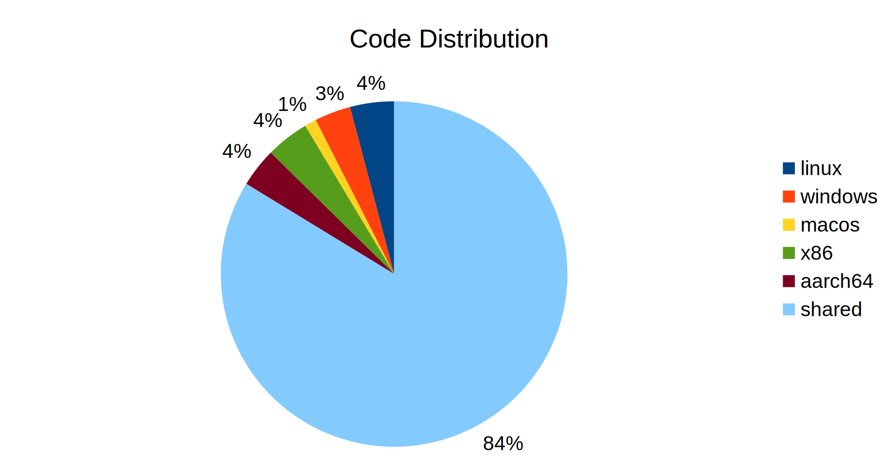
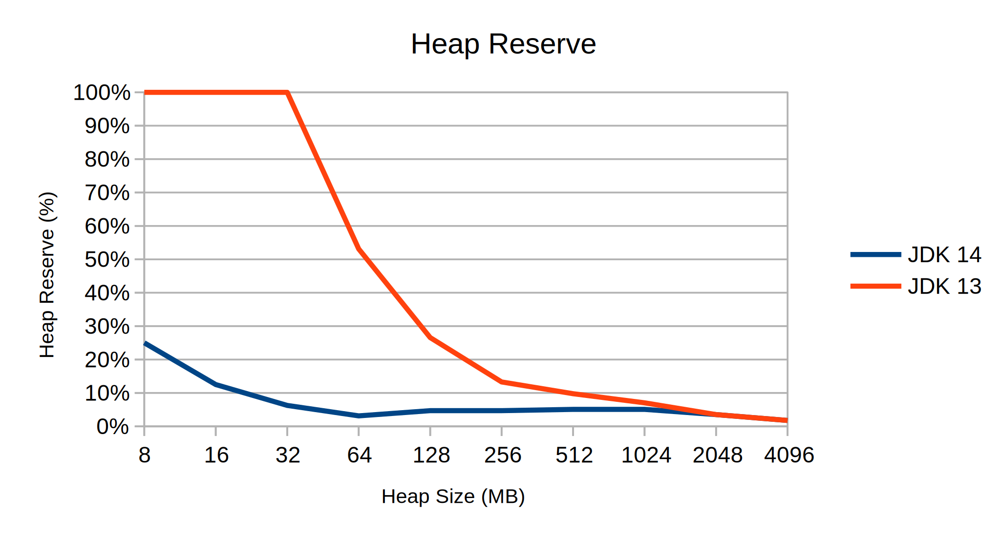
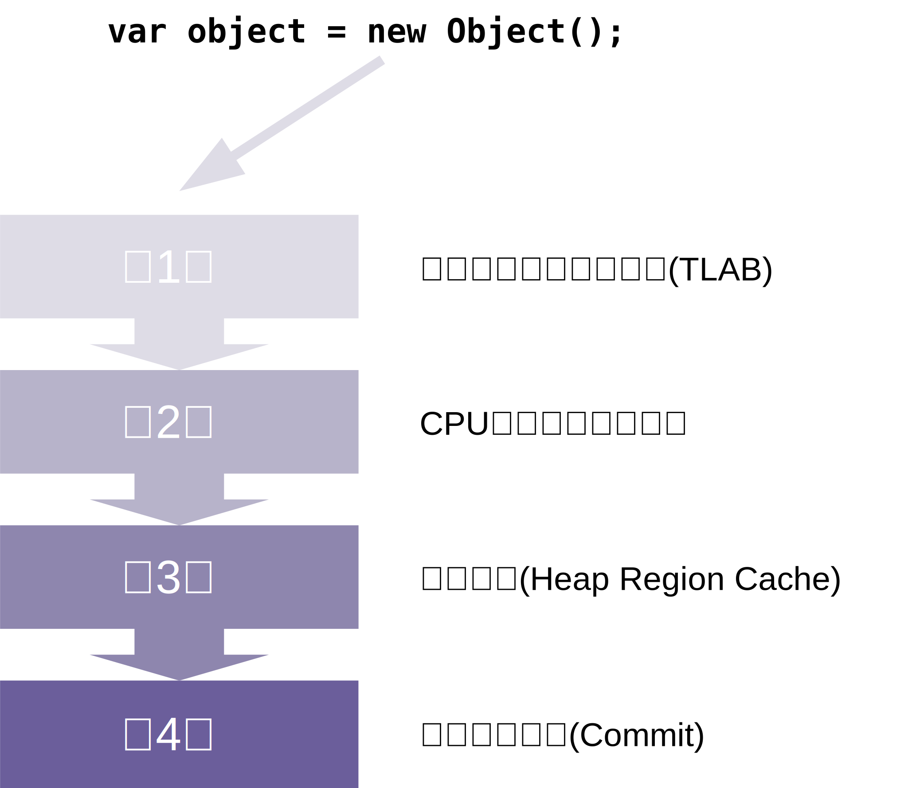

# perliden的博客

> 网址为: https://www.malloc.se

其中的文章内容如下:

# 1. Hello World!

发表日期: 2020年3月15日

原文链接: https://www.malloc.se/blog/hello-world

内容如下:

Just got this blog up and running, where I intend to primarily write about the development of OpenJDK. I hope to highlight new features and improvements, give some tuning tips, explain what’s going on inside the JVM, etc. Since I’m mostly working on garbage collection (ZGC in particular), that’s likely what most posts will be about.

Stay tuned!

中文意思为:

今天正式上线了这个博客网站, 我准备写一些关于 OpenJDK 开发的事情。 主要包括新功能和升级, 并提供一些调优技巧, 解释 JVM 内部发生了什么, 等等。
由于我主要做的是垃圾收集相关的工作(特别是 ZGC), 因此大多数文章都会讨论这些内容。

敬请关注！

# 2. ZGC | 在JDK 14中的新特性

发表日期: 2020年3月23日

原文链接: https://www.malloc.se/blog/zgc-jdk14

内容如下:


Like clockwork, [JDK 14](https://openjdk.java.net/projects/jdk/14) was released on March 17, six months after [JDK 13](https://openjdk.java.net/projects/jdk/13). From a [ZGC](https://wiki.openjdk.java.net/display/zgc/Main) point of view, this was a big release since we managed to complete several important milestones and improvements towards making it a fully production ready garbage collector. In total, [more than 80](https://bugs.openjdk.java.net/issues/?filter=34672&jql=labels %3D zgc AND status in (Resolved%2C Closed) AND fixVersion %3D 14 AND resolution !%3D Duplicate) enhancements and bug fixes were committed to ZGC itself. More if you also count “ZGC related” commits done in other parts of HotSpot.

In this post I’ll highlight some of the more important and interesting ZGC enhancements. If you’re using ZGC today, I highly recommend you to upgrade to JDK 14. In short, you’ll get better performance, lower latency, new features, and improved stability. If you’re on JDK 11 or later, upgrading to 14 should be straight forward.

For feedback and questions about ZGC, feel free to post to the [mailing list](https://mail.openjdk.java.net/mailman/listinfo/zgc-dev).


像闹钟一样, [JDK 14](https://openjdk.java.net/projects/jdk/14) 正式版于2020年3月23日准时发布, 距离 [JDK 13](https://openjdk.java.net/projects/) 的发布时间仅有6个月。
对于 [ZGC](https://wiki.openjdk.java.net/display/zgc/Main) 来说, 这是一个重大更新版本, 因为我们成功达成了多个重要的里程碑和改进, 使其成为完全可以投入使用的生产环境版本。
总共 [超过80项](https://bugs.openjdk.org/browse/JDK-8236110?filter=34672&jql=labels%20%3D%20zgc%20AND%20status%20in%20(Resolved%2C%20Closed)%20AND%20fixVersion%20%3D%2014%20AND%20resolution%20!%3D%20Duplicate)的增强和错误修复被提交到 ZGC 中。
如果统计在 HotSpot 的其他部分完成的 “ZGC相关” 的提交, 则数量更多。

在这篇文章中, 我将重点介绍一些重要和有趣的 ZGC 增强功能。 如果您使用 ZGC, 我强烈建议升级到 JDK 14版本。 总之, 您将获得更好的性能、更低的延迟、新功能、以及更好的稳定性。 如果您使用的是 JDK 11 或更高版本, 升级到 14 应该很简单。

有关 ZGC 的反馈和问题, 请随时发送给 [zgc-dev邮件列表](https://mail.openjdk.java.net/mailman/listinfo/zgc-dev)。


## 2.1 支持Windows 和 macOS 操作系统

[JEP 365](http://openjdk.java.net/jeps/365) and [JEP 364](http://openjdk.java.net/jeps/364) brought Windows and macOS support to ZGC. Support for these platforms has perhaps been the most common feature request we received. All commonly used platforms are now supported, and the complete list looks like this.


[JEP 365](http://openjdk.java.net/jeps/365) 和 [JEP 364](http://openjdk.java.net/jeps/364) 为 ZGC 带来了 Windows 和 macOS 支持。 对这些平台的支持可能是我们收到的最常见的功能请求。 JDK11支持的所有平台列表如下所示。

- **Linux/x86_64** (since JDK 11)
- **Linux/aarch64** (since JDK 13)
- **Windows** (since JDK 14)
- **macOS** (since JDK 14)

For the record, at one point ZGC also had [Solaris/SPARC](https://github.com/openjdk/zgc/commit/5cf01ce95b3ade3710c578b473edfe0404128e9e) support. It was never upstreamed to mainline because we saw early signs of [JEP 362: Deprecate the Solaris and SPARC Ports](http://openjdk.java.net/jeps/362) on the horizon.

Windows users should note that ZGC requires **Windows version 1803** (i.e. Windows 10 or Windows Server 2019) or later. The reason is that earlier versions of Windows lack the memory management API used by ZGC to do heap multi-mapping.

Is adding support for a new OS hard? Does it require a lot of work? Nah, not really. The part of ZGC that has OS-specific code is the part that does memory multi-mapping, i.e. mapping the same physical memory into more than one location in the process address space. So, it all comes down to what memory management API the OS offers, and how easy it is to work with. macOS is by far the most flexible in this regard, with its wonderful `mach_vm_remap()` system call (nope, Linux’s `mremap()` is not as wonderful). The macOS-specific code weighs in at about [300 lines of code](https://github.com/openjdk/jdk/tree/74f0ef505094761c0eb16a7f3fe09b62d335369d/src/hotspot/os/bsd/gc/z). Windows needed slightly more work, mainly because its memory management API (especially the part dealing with address space reservations using `MEM_{RESERVE,REPLACE,COALESCE}_PLACEHOLDERS`) is not quite as flexible as the POSIX and Mach APIs. Still, it’s not that bad and the Windows-specific code weighs in at just under [1000 lines of code](https://github.com/openjdk/jdk/tree/74f0ef505094761c0eb16a7f3fe09b62d335369d/src/hotspot/os/windows/gc/z). As of this writing, 84% of the ZGC code is platform independent, shared by all operating systems and CPU architectures.


作为记录, ZGC 曾经支持过 [Solaris/SPARC](https://github.com/openjdk/zgc/commit/5cf01ce95b3ade3710c578b473edfe0404128e9e) 架构。  但从未被上传到主线, 因为我们看到了 [JEP 362: Deprecate the Solaris and SPARC Ports](http://openjdk.java.net/jeps/362) 的早期迹象。

Windows 用户请注意, ZGC 需要 **Windows 1803 版本**(即 Windows 10 或 Windows Server 2019)以及更高版本。 原因是 Windows 的早期版本缺少了 ZGC 用来对堆内存做多重映射的内存管理 API。

增加支持新的操作系统很难吗？ 需要做很多工作吗？ 不, 并不是很难。 ZGC 中针对具体 OS 的代码, 是执行内存多重映射的部分, 即将相同的物理内存映射到进程地址空间中的多个位置。
因此, 这一切都归结为操作系统提供的内存管理 API, 以及使用它的难易程度。 
macOS 在这方面是迄今为止最灵活的, 它具有出色的 `mach_vm_remap()` 系统调用(相对应的, Linux 中的 `mremap()` 则没有那么出色)。 macOS 的特定代码量只有为 [300行](https://github.com/openjdk/jdk/tree/74f0ef505094761c0eb16a7f3fe09b62d335369d/src/hotspot/os/bsd/gc/z)。 
Windows 则需要做更多的工作, 主要是因为它的内存管理 API 不如 POSIX 和 Mach API 灵活(尤其是使用 `MEM_{RESERVE,REPLACE,COALESCE}_PLACEHOLDERS` 处理地址空间保留的部分)。尽管如此, 它并没有那么糟糕, 特定于 Windows 的代码量不到 [1000行](https://github.com/openjdk/jdk/tree/74f0ef505094761c0eb16a7f3fe09b62d335369d/src/hotspot/os/windows/gc/z)。 在撰写本文时, 84% 的 ZGC 代码与平台无关, 由所有操作系统和 CPU 架构共享。




## Parallel heap pre-touching

When using `-XX:+AlwaysPreTouch` you’re telling the GC to touch the heap (up to `-Xms` or `-XX:InitialHeapSize`) at startup. This will ensure that memory pages backing the heap are 1) actually allocated and 2) faulted in. By doing this at startup you avoid taking this cost later when the application is running and starts touching memory. Pre-touching the heap can be a sensible choice for some applications, but as always, it’s a trade-off since the startup time will be prolonged.

Prior to JDK 14, ZGC only used a single thread to do heap pre-touching. This meant that pre-touching could take a long time if the heap was huge. Now, ZGC uses multiple threads to do this work, which shortens the startup/pre-touch time substantially. On large machines with terabytes of memory, this reduction can translate into startup times on the order of **seconds instead of minutes**.

## 2.2 并行执行堆内存预分配(heap pre-touching)

当指定JVM启动参数 `-XX:+AlwaysPreTouch` 时, 是告诉 GC 在JVM启动时要预分配堆内存(一直获取到 `-Xms` 或 `-XX:InitialHeapSize` )。 
这将确保堆内存相关的页面:

- 1) 可以实际得到分配
- 2) 不够的话就立即失败。

通过在启动时执行此操作, 可以避免应用程序在之后的运行过程中才分配物理内存并造成性能抖动。 
对于某些应用程序来说, 预先获取堆内存可能是一个明智的选择, 但与往常一样, 这也是一种权衡, 因为启动时间会延长。

在 JDK 14 之前, ZGC 只使用单个线程来做堆预触。  如果堆内存很大, 预触可能需要很长时间。 
现在, ZGC 使用多线程来完成这项工作, 大大缩短了启动/预触时间。 
在具有 TB 级内存的大型机器上, 这种方式可以将启动时间缩短到 **秒级,而不是分钟级** 。

测试示例:

> `java -XX:+AlwaysPreTouch -version`

## Tiny heaps

ZGC has always been awesome at scaling up to very large heaps, but not so awesome at scaling down to tiny heaps. Prior to JDK 14, using heaps smaller than 128M was not always a great experience. The main reason was that ZGC’s heap reserve became too large in proportion to the available heap, which sometimes resulted in an early `OutOfMemoryError`.

The heap reserve is a portion of the heap that is set aside to cope with “emergency situations”, like when ZGC needs to compact the heap when it’s already full. The size of the heap reserve is calculated as follows.

## 2.3 支持极小的堆内存

ZGC 在大型堆内存扩展方面一直表现的很棒, 但在超小型的堆内存方面并不那么出色。 
在 JDK 14 之前, 使用小于 128M 的堆内存, 并不具备很好的体验。 主要原因是ZGC保留的堆内存, 与可用堆的比例太大, 有时会导致过早的 `OutOfMemoryError`。

保留堆储备(heap reserve)是为应对 “紧急情况” 而预留的一部分堆, 例如当 ZGC 需要在堆内存用满之后整理堆内存时。 堆保留的大小计算公式如下。

```
heap_reserve = (number_of_gc_worker_threads * 2M) + 32M
```

In short, the reserve is sized so that there’s enough room for each GC worker to allocate a private *small* ZPage (2M), and for all GC workers to share a single global *medium* ZPage (32M).

As we can see, the reserve can become proportionally large when the heap is small, leaving little room for the application. To address this, we did not change the principles for how large the heap reserve has to be. Instead we adjusted the inputs to this calculation in the following ways.

1. We made the size of *medium* ZPages dynamic. It used to always be 32M, but it’s now determined at runtime and scaled with the heap size so that a single *medium* ZPage never occupies more than 3% of the heap. For really small heaps, this means *medium* ZPages will effectively be disabled, and objects that would normally be allocated in a *medium* ZPage will now instead be allocated in a *large* ZPage (*large* ZPages don’t need to be covered by the heap reserve since they are never relocated).
2. We scaled the number of GC worker threads we use so that the total number of *small* ZPages needed in the heap reserve will not occupy more than 2% of the heap (but we need room for at least one *small* ZPage, since we always have at least one GC worker thread).

With these adjustments, ZGC scales down to **8M** (and up to **16T**) heaps without problems. The heap reserve is now at most 5% of the heap, but at least one *small* ZPage (2M). To better illustrate the improvement, let’s compare JDK 14 with JDK 13, and see what percentage of the heap is set aside for the reserve.

简而言之, 保留的大小是为了让每个 GC工作线程有足够的空间来分配一个私有的 *small* ZPage (2M), 并让所有 GC worker 共享一个全局的 *medium* ZPage (32M)。

正如我们所见, 当堆较小时, 预留空间会按比例变大, 从而为应用程序留下的可用空间很小。 为了解决这个问题, 我们没有改变堆储备必须有多大的原则。相反, 我们通过以下方式调整了该计算公式的输入。

- 1. 我们使 *medium* ZPages 变成动态化的大小。 它过去总是 32M, 但现在它在运行时确定, 并随堆大小扩缩, 因此单个 *medium* ZPage 永远不会占用超过 3% 的堆。 对于非常小的堆, 这意味着 *medium* ZPages 将被有效地禁用, 并且正常情况下在 *medium* ZPage 中分配的对象, 改为在 *large* ZPage 中分配(*large* ZPages 不需要预留堆内存, 因为它们永远不会被重新定位)。
- 2. 我们调整了使用的 GC 工作线程的数量, 以便堆储备中所需的 *small* ZPage 总数不会超过堆的 2%(但至少有一个 GC 工作线程, 最少需要一个 *small* ZPage 的空间)。

通过这些调整, ZGC 可以毫无问题地缩减到 **8M** 堆内存(最大则支持 **16T**)。 保留内存现在最多为堆的 5%, 但最小为一个 *small* ZPage (2M)。
为了更好地说明改进, 让我们将 JDK 14 与 JDK 13 进行比较, 看看有多少个百分比的堆被当做保留空间。



## JFR leak profiler

The JFR leak profiler is a handy tool, but it has until now been disabled when using ZGC. The leak profiler implements its own heap walking logic to find the path from a root to a given object in the object graph. Knowledge about such paths can be very useful when trying to track down memory leaks.

There were two reasons why the leak profiler was incompatible with ZGC.

1. The leak profiler didn’t comply with the rules for accessing object pointers on the heap. When using ZGC, an object pointer that has been loaded from the heap must pass through a load barrier before it can be dereferenced.
2. The leak profiler allocated a native data structure (a mark bitmap), which was proportional to the size of the address space reserved for the heap. Since ZGC is relatively address space hungry, this didn’t scale very well.

Both issues were addressed and the JFR leak profiler now works nicely with ZGC.

## 2.4 支持 JFR 泄漏分析器

JFR 泄漏分析器(JFR leak profiler)是一款方便的工具, 但之前在使用 ZGC 时它一直被禁用。 泄漏分析器实现了自己的堆遍历逻辑, 以在对象图中查找从GC根到给定对象的路径。 在尝试追踪内存泄漏时, 有关此类路径的信息可能非常有用。

泄漏分析器与 ZGC 不兼容的原因有两个。

1. 泄漏分析器不符合访问堆上对象指针的规则。 使用 ZGC 时, 从堆中加载的对象指针, 必须通过读屏障(load barrier)之后才能解除引用。
2. 泄漏分析器分配了一个 Native 数据结构(标记位图, mark bitmap), 它与堆内存的保留地址空间的大小成正比。 由于 ZGC 的地址空间相对较大, 因此扩缩性不好。

这两个问题都在JDK14中得到了解决, JFR 泄漏分析器现在可以很好地与 ZGC 配合使用。

## C2 load barrier overhaul

The ZGC load barriers generated by the C2 Just-In-Time compiler have often been the root cause of bugs in ZGC. The way they were implemented sometimes caused bad interactions with some of C2’s optimization passes, resulting in sub-optimal and even broken code.

In JDK 14 we completely overhauled how C2 generates ZGC load barriers. Now, we’re basically staying out of C2’s sight until very late in the compiler pipeline. I won’t go into all the details here, but this basically means we avoid all interactions with optimization passes and we gain a lot more control over the code generation. For example, we can now easily guarantee that a safepoint-poll instruction can’t be scheduled in-between a load instruction and its associated load barrier, something that was previously hard to control and was the source of many bugs.

This overhaul significantly improved ZGC stability. In fact, it was so successful that this change was immediately backported to JDK 13.0.2 (at the time, the release of JDK 14 was still months away).

## 2.5 C2生成的读屏障修正

ZGC中, 即时编译器C2生成的读屏障, 通常是 ZGC 中产生 bug 的根源。 
ZGC的实现方式, 有时会与 C2 的一些优化通道产生不良交互, 从而导致优化不完全, 甚至是有问题的代码。

在 JDK 14 中, 我们彻彻底底过了一遍 C2 生成 ZGC 负载屏障的代码。 现在, 在整个编译和优化过程中, 在编译流水线的最后阶段之前, C2不会受ZGC的干扰。
在这里我不会详细介绍所有细节, 但可以说, ZGC避免了与编译器优化过程的所有交互, 并且还获得了对代码生成的更多控制。
例如, 我们现在可以轻松地保证, 在 load 指令和对应的读屏障(load barrier)之间, 不会安排安全点轮询指令(safepoint-poll instruction), 这在之前是很难控制的, 并且是许多错误的根源。

这次大修, 显著提高了 ZGC 的稳定性。 事实上, 它非常成功, 以至于这个升级立即被移植到了之前的 JDK 13.0.2 版本中(此时距离 JDK 14 的发布还有几个月的时间)。


## Safepoint-aware array allocations

## 2.6 数组分配操作能感知到安全点

When the JVM executes a Safepoint (aka Stop-The-World) operation it first brings all Java threads to a stop in a controlled manner (Java threads are stopped at “safe points”, where their execution state is known). Once all threads are stopped, it proceeds to execute the actual Safepoint operation (which can be a GC operation, or something else). Since all Java threads remain stopped until the Safepoint operation completes, keeping that operation short is essential for good application response times.

当 JVM 执行安全点操作时(也称为 Stop-The-World), 首先以一种受控的方式, 暂停所有 Java 线程。
也就是说, Java线程在“安全点”位置停顿, 所以它们的执行状态是已知的, 比如方法栈和各种状态。 
确保所有Java线程都进入停顿状态, JVM将继续执行实际的 Safepoint 操作(比如 GC或其他行为)。
因为在 Safepoint 操作完成之前, 所有 Java 线程都保持停顿状态, 啥也干不了,  所以让安全点操作保持精简, 对响应时间敏感的系统而言尤为重要。

Time-To-Safepoint (TTSP) is the time from when the JVM orders all Java threads to stop until they have stopped. All threads will typically not come to a stop immediately or at the same time. A thread might be in the middle of some sensitive operation that needs to complete before it can reach a safepoint. A long TTSP can be just as bad as a long Safepoint operation, since it will prolong the time some of the threads are stopped. Again, this will have a negative impact on application response times.

安全点等待时间 (TTSP, Time-To-Safepoint) 是指: 从JVM 命令所有 Java 线程暂停, 到它们全部暂停完成的时间。
很多线程不会立即暂停, 通常也不可能同一时刻全部暂停。 某些线程可能正在执行敏感操作, 需要先完成这些操作才能到达安全点状态。
较长的 TTSP, 和长时间的 Safepoint 操作一样糟糕,  因为两者都会延长某些线程停顿的时间。 也就对系统响应时间产生负面影响。


Ok, that was a quick introdution to Safepoint and Time-To-Safepoint. Now, when the application asks the JVM to allocate an object, the JVM will not only allocate the object on the heap somewhere, it will also make sure the object’s fields are zero initialized. During zero initialization, the JVM is in a sensitive state where it has a half-baked object on the heap. The Java thread allocating this object is not allowed to stop at a safepoint until zero initialization has completed. If it were to stop at a safepoint, a GC cycle could potentially start and the GC would quickly stumble over an object with random data in it, resulting in a JVM crash.

这里对 Safepoint 和 Time-To-Safepoint 进行了简短的介绍。
那么, 当应用程序要求 JVM 为对象分配内存空间时, JVM 不仅会在堆上的某个地方分配对象, 还会确保对象的字段都初始化为零值(zero initialization)。 
在初始化零值期间, JVM 处于敏感状态, 因为堆内存里面有一个半生不熟的对象。
在初始化零值完成之前, 不允许执行内存分配的 Java线程进入安全点状态。 
假若允许它没完成之前就进入安全点状态, 如果执行的是 GC 周期, 那么 GC 可能会因为对象字段中的一些随机数值出错, 从而导致 JVM 崩溃。

So, Safepoint operations are effectively blocked/delayed during object allocation and initialization, which directly impacts TTSP negatively. This is not an problem when allocating normal/small objects. However, is it a problem when allocating large arrays (remember, the largest Java array can be 16GB in size), where the time it takes to zero initialize all array elements can be substantial, like several hundred milliseconds (or more if you’re unlucky).

因此, 安全点操作在对象分配和初始化期间被有效地阻止/延迟, 这直接对 TTSP 产生负面影响。
在分配普通对象/小对象时不是什么问题。 但是, 分配大数组(也就是大对象)时很可能会出现问题。
请记住, 一个Java数组理论上最大可以占用 16GB的空间, 如果情况恶劣的话, 将整个数组的元素全部初始化为零值所花费的时间, 可能需要几百毫秒。

To avoid this type of latency issue, we’ve implemented safepoint-aware array allocations in ZGC. This means that Java threads *can* come to a safepoint during zero initialization, without the risks mentioned above, and without impacting TTSP. Under the hood, ZGC will track these half-baked objects using a special root-set, internally called “invisible roots”. Array objects pointed to by invisible roots are treated differently in two ways.

1. They are invisible to the Java application. Not discoverable through JVMTI, etc.
2. During marking, array elements containing object references are not examined/followed, since they are known to not point to any other object that needs to be kept alive.

为了避免此类延迟问题, 我们在 ZGC 中实现了能感知到安全点的数组分配。
这意味着 `允许` Java 线程在初始化零值期间到达安全点, 而不会出现半生不熟的风险, 也不会影响 TTSP。
其内部的原理是, ZGC 将使用一个特殊的GC根集, 来跟踪这些半生不熟的对象,  内部称为“不可见根(invisible roots)”。
不可见根所指向的数组对象有两种不同的处理方式。

1. 它们对 Java 应用程序来说是不可见的。 也无法通过 JVMTI 等方式来发现。
2. 在标记期间, 包含对象引用的数组元素, 不会被遍历/检查/追踪,  因为它们不指向任何一个需要保持存活的对象。

In summary, with ZGC you can now allocate arrays of any size, without worrying about TTSP-related latency issues. ZGC is at this time the only garbage collector in HotSpot to offer this feature.

总之, 使用JDK14以上版本的ZGC时, 我们可以分配任意大小的数组, 而无需担心 TTSP 相关的延迟问题。  在HotSpot JVM中, ZGC 目前是唯一提供这个功能的垃圾收集器。


## Constrained environments

ZGC is relatively address space hungry. It uses address space to immunize itself against external heap fragmentation and thereby avoid running into situations where it has to compact the heap to find a hole big enough for an allocation. This is one of the reasons why ZGC handles large allocations so well. Reserving large parts of the process address space is essentially free of charge. There’s no physical memory backing that space, it’s just a reservation. Of course, the kernel needs a tiny bit of memory to keep track of the reservation, but we can safely ignore that in this context.

ZGC used to reserve a lot of address space (many terabytes), even when the heap was small. This was not only superfluous, it was also problematic in environments where the address space available to the JVM had been constrained. For example, when running in a small/constrained container or when the address space had been limited using `ulimit -v`.

Starting with JDK 14, ZGC will detect that it’s running in a constrained environment and automatically adjust the amount of address space it uses to stay well within the limits. As a result, using ZGC in address space constrained environments is now a smoother experience.


## 2.7 支持受限环境

ZGC 需要很大范围的地址空间。 
通过地址空间的方式, 使ZGC免受操作系统内存碎片的影响, 从而避免遇到必须整理堆内存才能找到足够大的空闲内存块来分配的情况。 
这就是 ZGC 能够很好地处理大量分配的原因之一。 
保留大量进程地址空间基本上没什么代价。 这只是一个预留空间(reservation), 并不需要真实的物理内存来支持该空间。 
当然, 内核需要一小部分内存来跟踪预留情况, 一般来说我们可以放心地忽略它。

之前的JDK版本中, 即使配置的堆内存很小, ZGC也会保留大量地址空间(TB级)。 这不仅是多余的, 而且在 JVM 可用地址空间受限的环境中也会存在问题。 
例如, 在小型/受限容器中, 或者使用 `ulimit -v` 限制地址空间来启动JVM。

从 JDK 14 开始, ZGC 将自动检测是否在受限环境中运行, 并自动调整它使用的地址空间量以保持在限制范围内。 因此, 在地址空间受限的环境中使用 ZGC 现在会有一种更流畅的体验。


## Discontiguous address space

Prior to JDK 14, HotSpot required the Java heap to be placed in a contiguous address space. This had both pros and cons. Some fairly common operations, like figuring out if a pointer is pointing into the heap became an easy and efficient operation. You just need to compare the pointer with the start and the end address of the heap. On the other hand, sometimes the GC wants to place the heap in a specific address range (like when using compressed or colored oops). This could become problematic if, say, some part in the middle of the desired range was already occupied. For example, because of [address space layout randomization](https://en.wikipedia.org/wiki/Address_space_layout_randomization), or because a custom Java launcher might have mapped memory in that range.

In JDK 14 we modified HotSpot to support Java heaps with a discontiguous address space. ZGC takes advantage of this by splitting the Java heap into two or more address spaces, should address space conflicts arise.


## 2.8 支持不连续的地址空间

在 JDK 14 之前, HotSpot 要求将 Java 堆放置在连续的地址空间中。 
这有利也有弊。 一些常见的操作, 比如确定某个指针是否指向堆, 变得简单而高效。 只需要将指针地址, 与堆的起始地址和结束地址进行比较即可。 
另一方面, 有时 GC 想要将堆放在特定的地址范围内(例如使用压缩指针, 或者着色oops), 如果所需范围中间的某个部分已经被占用, 这可能会出现问题。 
例如, 由于[地址空间布局随机化(address space layout randomization)](https://en.wikipedia.org/wiki/Address_space_layout_randomization), 或者因为自定义 Java 启动器已在该范围内映射内存等情况。

在 JDK 14 中, 我们修改了 HotSpot 以支持具有不连续地址空间的 Java 堆。 如果出现地址空间冲突,  ZGC通过将 Java 堆分成两个或更多个地址空间来利用这一点。

## On the horizon


I’ll end this post with a quick glimpse into the future. Work on [JDK 15](https://openjdk.java.net/projects/jdk/15) has been going on for a few months already (the [JDK 14](https://openjdk.java.net/projects/jdk/14) feature-set was frozen already back in December when that release entered *Rampdown Phase One* and forked from mainline) and we have some exciting things in the pipeline.

- [JEP 377: ZGC: A Scalable Low-Latency Garbage Collector (Production)](https://openjdk.java.net/jeps/377), which will remove ZGC’s experimental status.
- [JEP 376: ZGC: Concurrent Thread-Stack Processing](https://openjdk.java.net/jeps/376), which will be a major step towards *sub-millisecond max pause times*.
- [JDK-8233300: Safepoint-aware array copy](https://bugs.openjdk.java.net/browse/JDK-8233300), which will solve a similar problem as “Safepoint-aware array allocations” above, but when copying large arrays.

*I should stress that, as of this writing, these JEPs and enhancements have not yet been targeted to a release. We hope they make it into JDK 15, but we don’t know that yet.*

More about these and other enhancements in a future post.

## 2.9 展望未来


本节的最后, 将对未来的特性做个简短介绍。 
[JDK 15](https://openjdk.java.net/projects/jdk/15) 的开发工作已经进行了几个月;

[JDK 14](https://openjdk.java.net/projects/jdk/14) 的功能列表, 早在2019年12月就已冻结; 当时JDK15版本进入 `Rampdown Phase One` 阶段, 并从主线分叉, 我们正在准备一些令人兴奋的东西。


- [JEP 377: ZGC:可扩展的低延迟垃圾收集器(生产)](https://openjdk.java.net/jeps/377), 这将取消 ZGC 的实验状态。
- [JEP 376: ZGC:并发线程栈处理](https://openjdk.java.net/jeps/376), 这将是朝着 *亚毫秒最大暂停时间* 迈出的重要一步。
- [JDK-8233300: Safepoint-aware array copy](https://bugs.openjdk.java.net/browse/JDK-8233300), 这将解决类似上面提到的“Safepoint-aware array allocations” 问题, 当然这个特性是针对复制大数组的。


> 需要特别说明, 在撰写本文时, 这些 JEP 和增强功能尚未发布。 我们希望他们能进入 JDK 15, 但并不能百分百保证。

后续的文章将会详细介绍他们以及其他的增强功能。


# 3.  ZGC 中使用 `-XX:SoftMaxHeapSize` 参数


发表日期: 2020年7月2日

原文链接: https://www.malloc.se/blog/zgc-softmaxheapsize


JDK 13 引入了一个新的 JVM 选项:  `-XX:SoftMaxHeapSize=<size>`。 
迄今为止(2020年7月2日), ZGC 是HotSpot 中唯一支持此选项的垃圾收集器; 当然 G1 也准备支持, 开发工作正在进行中。 
由于此选项相对较新,并且可能还不被大多数人所了解,因此我想写篇文章来介绍一下什么时候可以使用它, 以及如何使用它。

## 3.1 SoftMaxHeapSize在哪些场景下适用?

As the name implies, this new option sets a soft limit on how large the Java heap can grow. When set, the GC will strive to not grow the heap beyond the soft max heap size. But, the GC is still allowed to grow the heap beyond the specified size if it really needs to, like when the only other alternatives left is to stall an allocation or throw an `OutOfMemoryError`.

顾名思义,这个新的JVM启动参数, 对 Java 堆内存的最大值设置了软限制。 
设置该参数后,GC 将努力使堆的使用量不超过这个软参数。 
但是,如果确实需要,仍然允许 GC 将堆增长到超过指定的大小,就像当唯一剩下的其他选择是停止分配或抛出 OutOfMemoryError 时。


There are different use cases where setting a soft max heap size can be useful. For example:

- When you want to keep the heap footprint down, while maintaining the capability to handle a temporary increase in heap space requirement.
- Or when you want to play it safe, to increase confidence that you will not run into an allocation stall or have an OutOfMemoryError because of an unforeseen increase in allocation rate or live-set size.

Let’s make up an example, to illustrate the first use case listed above. Pretend that your workload under normal conditions needs 2G of heap to run well. But once in a while you see workload spikes (maybe you’re providing a service that attracts a lot more users a certain day of the week/month, or something similar). With this increase in workload your application now needs, say, 5G to run well. To deal with this situation you would normally set the max heap size (`-Xmx`) to 5G to cover for the occasional workload spikes. However, that also means you will be wasting 3G of memory 98% (or something) of the time when it’s not needed, since those unused 3G will still be tied up in the Java heap. This is where a soft max heap size can come in handy, which together with ZGC’s ability to uncommit unused memory allows you to have your cake and eat it too. Set the max heap size to the max amount of heap your application will ever need (`-Xmx5G` in this case), and set the soft max heap size to what your application needs under normal conditions (`-XX:SoftMaxHeapSize=2G` in this case). You’re now covered to handle those workload spikes nicely, without always wasting 3G. Once the workload spike has passed and the need for memory drops down to normal again, ZGC will shrink the heap and continue to do it’s best to honor the `-XX:SoftMaxHeapSize` setting. When those extra 3G of heap have been sitting unused for a while, ZGC will uncommit that memory, returning it to the operating system for other processes (or the disk cache, or something else) to use.

在不同的用例中,设置最大堆内存的软开关可能很有用。 例如:

- 当您希望减少堆占用空间,同时保持处理临时增加的堆空间需求的能力时。
- 或者当你想安全地玩时,为了增加你不会遇到分配停顿或由于分配率或活动集大小的意外增加而出现 OutOfMemoryError 的信心。

让我们举个例子来说明上面列出的第一个用例。 假设您的工作负载在正常情况下需要 2G 的堆才能正常运行。 但是偶尔您会看到工作量激增(也许您提供的服务在一周/一个月的某一天或类似的某天吸引了更多用户)。 随着工作负载的增加,您的应用程序现在需要 5G 才能正常运行。 要处理这种情况,您通常会将最大堆大小 (`-Xmx`) 设置为 5G 以应对偶尔出现的工作负载高峰。 然而,这也意味着您将在 98%(或更多)不需要的时候浪费 3G 内存,因为那些未使用的 3G 内存仍将占用 Java 堆。 这就是软最大堆大小可以派上用场的地方,它与 ZGC 反向申请未使用内存的能力一起让您可以吃蛋糕和吃蛋糕。 将最大堆大小设置为您的应用程序将永远需要的最大堆大小(在本例中为 `-Xmx5G`),并将软最大堆大小设置为您的应用程序在正常情况下需要的大小(`-XX:SoftMaxHeapSize=2G` 在这种情况下)。 您现在可以很好地处理这些工作负载高峰,而不会总是浪费 3G。 一旦工作负载高峰过去并且对内存的需求再次下降到正常水平,ZGC 将缩小堆并继续尽最大努力遵守 `-XX:SoftMaxHeapSize` 设置。 当那些额外的 3G 堆有一段时间未使用时,ZGC 将反向申请该内存,将其返回给操作系统以供其他进程(或磁盘缓存或其他)使用。


## 3.2 系统运行过程中动态修改 SoftMaxHeapSize

`SoftMaxHeapSize` 是可管理的JMX选项, 在JVM运行过程中支持动态修改, 也就是说不用重启JVM就可以修改配置。 
我们可以使用管理API `HotSpotDiagnosticMXBean`, 或者通过 `jcmd` 等工具修改可管理的配置项:

> `jcmd <pid> VM.set_flag SoftMaxHeapSize <size>`


最大堆内存软指标(SoftMaxHeapSize) 的值, 不能超过最大堆内存; 如果没有在JVM启动参数中指定这个软指标的值, 则默认等于最大堆内存.


## 3.3 内存返还的积极性

可以通过 `-XX:ZUncommitDelay=<seconds>` 参数, 来控制ZGC返还未使用内存的积极程度(Uncommit aggressiveness), 默认值为 300秒(5分钟)。 
换句话说,默认情况下,必须至少有 5 分钟没被使用的内存,才有机会返还给操作系统。 
请注意,提交(committing)和返还(uncommitting)内存都是相对昂贵的操作。 
过于激进(太短)的返还时间, 只会导致刚刚返还的内存很快再次提交,这会浪费 CPU 周期,最终可能还会影响应用程序的整体性能。


## 3.4 其他信息 (TL;DR, Too Long, Didn’t Read)

例如, 我们指定了JVM启动参数 `-XX:SoftMaxHeapSize=2G -Xmx5G`, 则是告诉ZGC, 保持最大堆内存使用量在 2G, 但如果来不及回收或者有可能内存溢出, 也允许堆内存增长到5G。
如果在多个应用共存的机器上, 想要让JVM的内存使用量降低, 这个配置就很有用, 同时也具备了应对流量突然增加或者内存增长的能力。

更多关于ZGC的信息, 请关注 [OpenJDK的Wiki](https://wiki.openjdk.java.net/display/zgc/Main), 或者作者的博客: https://malloc.se


# 4. ZGC | 在JDK 15中的新特性


发表日期: 2020年9月22日

> 原文链接: https://www.malloc.se/blog/zgc-jdk15


In this post I will highlight some of the more interesting changes that went into ZGC in JDK 15. As always, if you’re looking for additional information on ZGC, please see the OpenJDK Wiki, the GC section on Inside Java, or this blog.

本文中, 我会重点介绍ZGC在 JDK15 版本中的变化。 

友情提醒, 如果想查看ZGC的更多信息, 请参考:

- [OpenJDK Wiki](https://wiki.openjdk.org/display/zgc)
- [Inside Java中GC标签](https://inside.java/tag/gc)
- [malloc.se网站](https://malloc.se/)


## 4.1 Production ready!

In JDK 15, ZGC became production ready. In other words, it is now a product (non-experimental) feature in the JDK and you are encouraged to use it in production. This change came in through JEP 377 and was the culmination of several years of hard work by many people.

This was of course a major milestone for the ZGC project, that we’ve all been eager to reach. But rest assured that removing the experimental status was not something we took lightly. No user would ever trust a GC that now and then corrupts the heap or crashes the JVM. Of course, users also expect a production ready GC to perform well and offer features relevant for today’s needs.

Since its initial introduction in JDK 11, ZGC has in the following releases received a number of new features, a steady stream of performance and stability improvements, and support for all commonly used platforms. It has also gone through a lot of testing.

In summary, ZGC is now a stable, high performance, low-latency GC, that is ready to take on your production workloads.


## 4.1 ZGC正式成为稳定版产品

在 JDK 15 中,ZGC 正式成为产品级稳定版(production ready)。 
换句话说,ZGC成为了 JDK 中的一个产品功能, 而不再是实验性能的功能,官方鼓励用户在生产中使用它。 

这一变化通过 [JEP 377](http://openjdk.java.net/jeps/377) 实现,是很多人多年来共同努力的结晶。

当然, 这也是 ZGC 项目的一个重要里程碑,我们一直都渴望达到这个目标。 
请放心,取消实验状态并不是我们随便下决定的事情。 
没有用户会信任一款时不时导致JVM 崩溃的垃圾收集器。 
当然,用户肯定希望产品级的 GC 性能良好的同时, 还提供与当今业务需求相关的特性。

自从在 JDK 11 中首次引入以来,ZGC 在后续版本中实现了许多新特性、增强了性能, 提升了稳定性, 并支持所有主流平台。  这期间经历了很多轮严谨的测试。

总之,ZGC 现在是一款稳定的、高性能的低延迟GC,可以随时承担我们在生产环境的工作负载。


## 4.2 New features and enhancements


## 4.2 JDK15版本中ZGC的新特性与升级

### 4.2.1 Improved allocation concurrency

Allocating a Java object is typically very fast. Exactly how a new object gets allocated depends on which GC you are using. In ZGC, the allocation path goes through a number of tiers. The vast majority of allocations are satisfied by the first tier, which is very fast. Only very few allocations need to go all the way down to the last tier, which is much slower.


An allocation will end up in the last tier only when all of the previous tiers were unable to satisfy the allocation. This is the last resort, where ZGC will ask the operating system to commit more memory to expand the heap. If this also fails, or we’ve reached max heap size (-Xmx), then an OutOfMemoryError will be thrown.

Prior to JDK 15, ZGC held a global lock while committing (and uncommitting) memory. That of course meant that only a single thread could expand (or shrink) the heap at any given time. Committing and uncommitting memory are also relatively expensive operations, that can take some time to complete. As a result, this global lock sometimes became a point of contention.

In JDK 15, this part of the allocation path was re-worked so that this lock is no longer held while committing and uncommitting memory. As a result, the average cost of doing an allocation in the last tier was reduced, and this tier’s ability to handle concurrent allocations was significantly improved.


### 4.2.1 改进了内存分配的并发效率

一般给 Java 对象分配内存都非常快。 
新对象具体的分配方式取决于我们使用的垃圾收集器(虽然叫做GC, 但实际上GC包括了内存分配程序)。 
在 ZGC 的实现中,分配的过程透过了多个不同的层。 绝大多数分配相关的操作都能由第1层搞定,速度非常快。 只有极个别的分配, 需要一直向下走到最后一层,这时候就会慢得多。



只有当前面所有的层都无法满足分配时,才会走到最后一层。 
这是最后的保底手段,ZGC 将要求操作系统调拨(commit)更多的内存以扩展堆。 
如果这一步也失败了,或者已达到最大堆内存限制(`-Xmx`),那么将抛出 `OutOfMemoryError`。

在 JDK 15 之前的版本中, ZGC 在调拨(committing)和取消调拨(uncommitting)内存时, 会持有一个全局锁。 
当然这也就意味着在任何给定时刻, 只有一个线程可以扩展(或缩减)堆内存。 
调拨和取消内存调拨, 是相对昂贵的操作, 可能需要一段时间才能完成。 
所以这个全局锁有时就会成为争抢点。

在 JDK 15 中, 重新设计了这些分配路径, 以便在调拨和取消内存调拨时不再需要这个全局锁。 
这样实现的好处, 是降低了最后一层分配内存的平均成本, 而且显著提高了这一层处理分配的并发能力。


### 4.2.2 Incremental uncommit

ZGC’s uncommit capability was initially introduced in JDK 13. This mechanism allows ZGC to uncommit unused memory to shrink the heap, and return that unused memory to the operating system for other processes to use. For memory to become eligible for uncommit it must have been unused for some amount of time (by default 300 seconds, controlled by -XX:ZUncommitDelay=<seconds>). If more memory is needed at some point later, then ZGC will commit new memory to grow the heap again.

Uncommitting memory is a relatively expensive operation and the time it takes for this operation to complete tends to scale with the size of the memory you’re operating on. Prior to JDK 15, it didn’t matter if ZGC found 2MB or 2TB of memory eligible for uncommit, it would still just issue a single uncommit operation to the operating system. This turned out to be potentially problematic since uncommitting large amounts of memory (like hundreds of gigabytes or terabytes) can take quite some time. During this time the memory pressure could change dramatically, but there was no way for ZGC to abort or revise the uncommit operation mid-flight. If the memory pressure increased, ZGC would first have to wait for any in-flight uncommit operation to complete and then immediately commit some of that memory again.

The uncommit mechanism was re-worked in JDK 15 to uncommit memory incrementally. Instead of a single uncommit operation, ZGC will now issue many smaller uncommit operations to the operating system. This allows a change in memory pressure to be promptly detected and the uncommit process to be aborted or revised mid-flight.


### 4.2.2 增量式内存撤销(Incremental uncommit)

ZGC 的 uncommit 能力是在 JDK 13 中开始引入的。
这种机制允许 ZGC 将不使用的内存反向申请, 以缩减堆内存，并返还给操作系统, 以供其他进程使用。 
一段内存要满足反向申请条件，必须有一段时间未使用(默认时间是 300 秒，由参数 `-XX:ZUncommitDelay=<seconds>` 控制)。 
如果后续又需要更多内存，则 ZGC 将调拨新内存以再次增加堆内存。

反向申请内存是一项相对昂贵的操作，完成此操作所需的时间, 往往与正在操作的内存大小成正比。 
在 JDK 15 之前，ZGC 并不在乎满足反向申请条件得是 2MB 还是 2TB 的内存，它只会向操作系统发出一个反向申请操作。 
实践证明这里有一个潜在的问题，因为反向申请大量内存(如几百GB, 或几TB), 可能需要耗费相当长的时间。 
在此期间，内存压力可能会发生巨大变化，但 ZGC 无法中止或修改反向申请操作。 
如果内存压力增加，ZGC 必须先等正在执行的反向申请操作完成，然后才能再次申请内存。

在 JDK 15 中, 重新设计了反向申请机制，以增量方式反向申请内存。 
现在, ZGC 将向操作系统发出许多个规模较小的反向申请操作。 
这允许ZGC及时检测到内存压力的变化，并且可以中止或修改尚未正式提给操作系统的那些反向申请。


### 4.2.3 Improved NUMA awareness

ZGC has always been NUMA aware on Linux, in the sense that when a Java thread allocates an object, that object will end up in memory that is local to the CPU that Java thread is executing on. On a NUMA machine, accessing memory that is local to the CPU results in lower memory latencies, which in turn results in better overall performance. However, ZGC’s NUMA awareness only came into its full potential when using large pages (-XX:+UseLargePages). This was addressed in JDK 15, and ZGC’s NUMA-awareness now always comes into its full glory, regardless of whether large pages are used or not.


### 4.2.3 增强 NUMA 支持


ZGC 在 Linux 平台上一直是支持 NUMA 识别的，在某种意义上，当 Java 线程分配对象时，相应的对象, 最终会分配到执行 Java 线程的 CPU 相对应的本地内存中。 
在 NUMA 结构的机器上，访问 CPU 本地的内存可以降低内存延迟，从而提高整体性能。 
然而，ZGC 的 NUMA 识别只有在开启大页面(`-XX:+UseLargePages`)时, 才能发挥其全部潜力。 

JDK 15 版本解决了这个问题，无论是否使用大页面，ZGC 的 NUMA-awareness 都能充分发挥作用。


### 4.2.4 JFR events

The following JFR events were added or are no longer marked experimental.

ZAllocationStall: Generated if a Java threads is subject to an allocation stall.
ZPageAllocation: Generated each time a new ZPage (heap region) is allocated.
ZRelocationSet & ZRelocationSetGroup: Generated each GC cycle and describe what parts of the heap was compacted/reclaimed.
ZUncommit: Generated each time ZGC uncommits some unused part of the Java heap, i.e. returns that unused memory to the operating system.
ZUnmap: Generated each time ZGC unmaps memory. ZGC will asynchronously unmap memory when a set of scattered pages needs to be remapped as a larger contiguous page.


### 4.2.4 JFR事件

正式支持下列 [JFR](https://en.wikipedia.org/wiki/JDK_Flight_Recorder) 事件:

- `ZAllocationStall`: 如果 Java 线程遇到内存分配缓慢，则生成此事件。
- `ZPageAllocation`: 每次分配一个新的 ZPage 页面(堆区)时, 生成此事件。
- `ZRelocationSet` 和 `ZRelocationSetGroup`: 每个 GC 周期都生成此事件, 并描述堆内存的哪些部分被压缩/回收。
- `ZUncommit`: 每次 ZGC 取消提交一些不使用的部分时, 都生成此事件，也就是将不使用的内存返回给操作系统时。
- `ZUnmap`: 每次 ZGC 取消映射内存(unmaps memory)时生成此事件。 当一组分散的页面需要重新映射为更大的连续页面时，ZGC 将异步取消映射内存。


### 4.2.5 Java heap on NVRAM

Advancements in the area of NVRAM have in the last few years made such memory considerably faster and a lot cheaper. In some environments and for some types of applications, placing the entire Java heap on NVRAM (instead of RAM) can actually be an attractive option, where you trade some performance for cheaper memory. In fact, all GCs in HotSpot (except ZGC) have had support for this since JDK 10, with the -XX:AllocateHeapAt option. However, as of JDK 15, this is now also supported by ZGC.

### 4.2.5 支持 NVRAM 上的 Java 堆

在过去的几年里，技术领域的进步使 NVRAM 这种内存的速度大大提高，而且价格便宜很多。 
在某些环境和应用系统中，将整个 Java 堆放在 NVRAM上(而不是常规 RAM 中), 变成一个非常具有吸引力的选择， 我们可以牺牲一些性能, 以换取更便宜的内存。 
事实上，自 JDK 10 以来，除 ZGC 外, HotSpot 中的所有 GC 都支持此功能，并支持 `-XX:AllocateHeapAt` 选项。 
现在，从 JDK 15 开始，ZGC 也支持了。


### 4.2.6 Compressed class pointers

In HotSpot, all Java objects have a header comprised of two fields, a mark word and a class pointer. On 64-bit CPUs, both of these fields are normally 64 bits wide, where the class pointer is a plain pointer to memory that describes the object’s class (type information, vtable, etc). The Compressed Class Pointers feature (-XX:+UseCompressedClassPointers) helps reduce overall heap usage by reducing the size of all object headers. It does this by compressing the class pointer field to 32 bits (instead of 64 bits). Instead of being a plain pointer, the compressed class pointer is an offset into the Compressed Class Space, which has a known base address. To retrieve the real class pointer the JVM simply adds the (possibly bit-shifted) compressed class pointer to the base address of the Compressed Class Space.

The implementation of the Compressed Class Pointers feature has historically been tied to the Compressed Oops feature, which meant that you could not enable Compressed Class Pointers without also enabling Compressed Oops. This was just an artificial dependency, as there are no technical reasons why you can’t enable one but not the other. Since ZGC doesn’t support Compressed Oops today, it meant that ZGC was also blocked from using of Compressed Class Pointers, for no good reason. In JDK 15, the artificial dependency between Compressed Class Pointers and Compressed Oops was broken, and as a result ZGC now works nicely with Compressed Class Pointers.

### 4.2.6 类指针压缩(Compressed class pointers)

在 HotSpot 中，所有 Java 对象都有一个对象头, 由两个字段组成: 包含一个标记字(mark word), 一个类指针(class pointer)。 
在 64 位 CPU 上，这两个字段通常都是 64 位，其中, 类指针是指向描述对象所属类的普通内存指针。 
类指针压缩功能 (`-XX:+UseCompressedClassPointers`) 可以减小所有对象标头的大小, 来降低堆内存的占用空间。 
这个压缩功能, 是将类指针字段的长度压缩为 32 位(原本是 64 位)。 

压缩后的类指针(compressed class pointer), 和普通指针不同了, 是压缩类空间(CCS, Compressed Class Space)的偏移量，具有已知的基地址(base address)。 
为了获取实际的类指针，JVM 只需要将压缩类指针的值, 与压缩类空间的基地址值相加即可。

类指针压缩功能(Compressed Class Pointers)的实现, 历来与 Compressed Oops 功能相关联， 也就是说我们无法在禁用 Compressed Oops 的情况下, 启用类指针压缩功能。
当然, 这只是一种人为的依赖，因为没有技术上的限制说, 我们不能启用一个, 而禁用另一个。 
由于 ZGC 在低版本中还不支持 Compressed Oops，这意味着 ZGC 也就被禁止使用 Compressed Class Pointers。 
在 JDK 15 中，压缩类指针和压缩 Oops 之间的人为依赖被打破了，因此 ZGC 现在可以很好地与压缩类指针一起工作。


### 4.2.7 Class data sharing

The Class Data Sharing (CDS) feature in HotSpot helps reduce the startup time and memory footprint between multiple instances of the JVM. This feature only worked when the Compressed Oops feature was enabled (-XX:+UseCompressedOops). In JDK 15, Class Data Sharing was enhanced to also work when the Compressed Oops feature is disabled. As a result, Class Data Sharing now works nicely together with ZGC (where the Compressed Oops feature is disabled).


### 4.2.7 类数据共享

HotSpot 中, 多个 JVM 实例之间的类数据共享功能 (CDS, Class Data Sharing) , 有助于减少启动耗时和内存占用。 
此特性仅在开启压缩 Oops 功能(`-XX:+UseCompressedOops`)时有效。 
在 JDK 15 中，类数据共享得到增强， 即使禁用 Oops 压缩功能, 也能正常工作。 
因此，类数据共享现在可以与 ZGC(禁用 Oops 压缩功能)一起协同工作。


