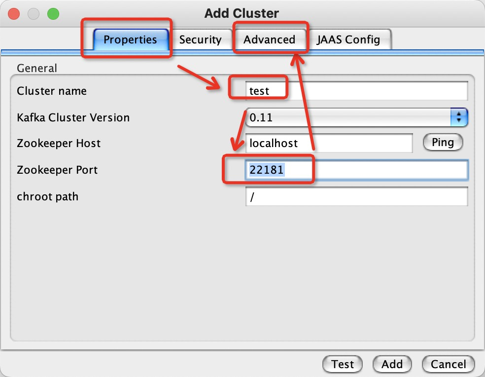
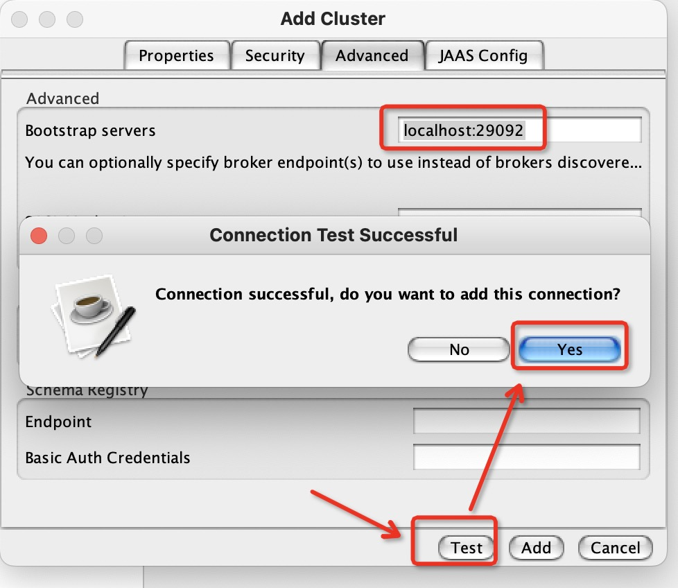
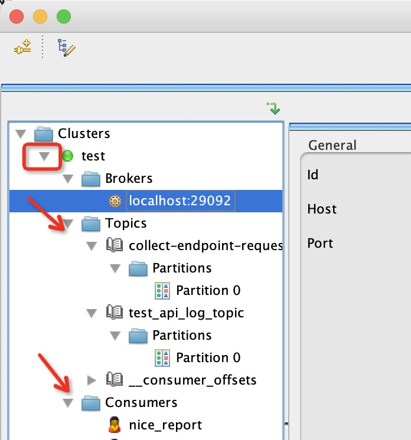

# 开发环境搭建: 用Docker来配置和启动Kafka

> 网上的很多Docker镜像和教程都比较坑, 我们团队折腾了好久, 都没法在开发环境连接Docker内部的Kafka并发送或者接收消息。 所以才有了这篇文章。

## 1. Overview

Docker is one of the most popular container engines used in the software industry to create, package and deploy applications.

In this tutorial, we'll learn how to do an [Apache Kafka](https://kafka.apache.org/) setup using Docker.


## 1. 概述

Docker 是当今软件行业最流行的一种容器引擎, 可用于创建、打包和部署应用程序。

本文主要介绍如果通过Docker来运行 [Apache Kafka](https://kafka.apache.org/), 并通过示例提供一些常用配置。


## 2. Single Node Setup

A single node Kafka broker setup would meet most of the local development needs, so let's start by learning this simple setup.


## 2. 启动单个节点的Kafka

单个 Kafka broker 节点, 已经可以满足大部分开发环境的需要。 
所以先解决有无问题, 我们在Docker容器中启动一个简单的Kafka。


### 2.1. docker-compose.yml Configuration

To start an Apache Kafka server, we'd first need to start a [Zookeeper](https://www.baeldung.com/java-zookeeper#overview) server.

We can configure this dependency in a [docker-compose.yml](https://www.baeldung.com/docker-compose) file, which will ensure that the Zookeeper server always starts before the Kafka server and stops after it.

Let's create a simple `docker-compose.yml` file with two services, namely `zookeeper` and `kafka`:


### 2.1. `docker-compose.yml`文件配置

要启动 Apache Kafka 服务节点, 需要先启动一台 [Zookeeper](https://www.baeldung.com/java-zookeeper#overview) 服务.

我们可以通过  [docker-compose.yml](https://www.baeldung.com/docker-compose) 配置文件, 来解决这种依赖问题, 确保 Zookeeper 服务总是在 Kafka 之前启动, 并在Kafka关闭后才关闭。

Let's create a simple `docker-compose.yml` file with two services, namely `zookeeper` and `kafka`:

> `docker-compose.yml` 文件示例如下:

```yml
version: '2'
services:
  zookeeper:
    image: confluentinc/cp-zookeeper:latest
    environment:
      ZOOKEEPER_CLIENT_PORT: 2181
      ZOOKEEPER_TICK_TIME: 2000
    ports:
      - 22181:2181
  
  kafka:
    image: confluentinc/cp-kafka:latest
    depends_on:
      - zookeeper
    ports:
      - 29092:29092
    environment:
      KAFKA_BROKER_ID: 1
      KAFKA_ZOOKEEPER_CONNECT: zookeeper:2181
      KAFKA_ADVERTISED_LISTENERS: PLAINTEXT://kafka:9092,PLAINTEXT_HOST://localhost:29092
      KAFKA_LISTENER_SECURITY_PROTOCOL_MAP: PLAINTEXT:PLAINTEXT,PLAINTEXT_HOST:PLAINTEXT
      KAFKA_INTER_BROKER_LISTENER_NAME: PLAINTEXT
      KAFKA_OFFSETS_TOPIC_REPLICATION_FACTOR: 1

```

其中包含了 2个服务(services), 名字分别是 `zookeeper` 和 `kafka`。


In this setup, our Zookeeper server is listening on `port=2181` for the kafka service, which is defined within the same container setup. However, for any client running on the host, it'll be exposed on port `22181`.

Similarly, the kafka service is exposed to the host applications through port `29092`, but it is actually advertised on port `9092` within the container environment configured by the `KAFKA_ADVERTISED_LISTENERS` property.

可以看到， 配置文件中的 Zookeeper 服务, 监听的端口是  `port=2181`, 但是对外暴露的端口是 22181;


### 2.2. Start Kafka Server

Let's start the Kafka server by spinning up the containers using the [docker-compose](https://docs.docker.com/compose/reference/) command:

### 2.2. 启动 Kafka 服务端

通过 [docker-compose](https://docs.docker.com/compose/reference/) 命令, 启动前面配置的容器化 Kafka 服务端:


```sh
$ docker-compose up -d
Creating network "kafka_default" with the default driver
Creating kafka_zookeeper_1 ... done
Creating kafka_kafka_1     ... done
```

Now let's use the [nc](https://www.baeldung.com/linux/netcat-command#scanning-for-open-ports-using-netcat) command to verify that both the servers are listening on the respective ports:

接着, 使用万能网络工具 [nc](https://www.baeldung.com/linux/netcat-command#scanning-for-open-ports-using-netcat)  来测试一下相应的端口是否成功监听:

```sh
$ nc -z localhost 22181
Connection to localhost port 22181 [tcp/*] succeeded!
$ nc -z localhost 29092
Connection to localhost port 29092 [tcp/*] succeeded!
```

如果本地环境没有安装 nc, 也可以使用 netstat 或者 telnet 的工具来测试.


Additionally, we can also check the verbose logs while the containers are starting up and verify that the Kafka server is up:

另外，我们可以通过docker日志来查看 Kafka 的启动信息:


```sh
$ docker-compose logs kafka | grep -i started
kafka_1      | [2021-04-10 22:57:40,413] DEBUG [ReplicaStateMachine controllerId=1] Started replica state machine with initial state -> HashMap() (kafka.controller.ZkReplicaStateMachine)
kafka_1      | [2021-04-10 22:57:40,418] DEBUG [PartitionStateMachine controllerId=1] Started partition state machine with initial state -> HashMap() (kafka.controller.ZkPartitionStateMachine)
kafka_1      | [2021-04-10 22:57:40,447] INFO [SocketServer brokerId=1] Started data-plane acceptor and processor(s) for endpoint : ListenerName(PLAINTEXT) (kafka.network.SocketServer)
kafka_1      | [2021-04-10 22:57:40,448] INFO [SocketServer brokerId=1] Started socket server acceptors and processors (kafka.network.SocketServer)
kafka_1      | [2021-04-10 22:57:40,458] INFO [KafkaServer id=1] started (kafka.server.KafkaServer)

```

With that, our Kafka setup is ready for use.

如果没有报错, 有类似 `started` 的日志信息, 则表示 Kafka 配置并启动成功了。


### 2.3. 使用图形客户端 Kafka Tool 来连接

Finally, let's use the [Kafka Tool GUI utility](https://kafkatool.com/download.html) to establish a connection with our newly created Kafka server, and later, we'll visualize this setup:

[Kafka Tool](https://kafkatool.com/download.html) ,  是一款图形界面的 Kafka 客户端, 可以用来连接我们创建的 Kafka 服务; 

> 这款工具个人使用是免费的, 现在改名叫做 Offset Explorer。

下载、安装、并启动。

首次启动, 会提示我们需要创建链接。 
点击OK之后,  自动弹出创建连接界面。 
默认标签页是 【Properties】, 连接名字可以随便取, 根据我们的配置信息, 输入Zookeeper的信息, 注意端口号是 `22181`。



因为我们的Kafka端口号不是默认的9092, 所以还需要进入 【Advanced】进行配置 :


We must note that we need to use the `Bootstrap servers propert`y to connect to the Kafka server listening at port `29092` for the host machine.

Finally, we should be able to visualize the connection on the left sidebar:

主要配置的信息是 Bootstrap servers:  `localhost:29092`, 



输入信息后，可以点击 【Test】 按钮，测试是否能成功连接上。

提示是否添加连接, 我们选择 【Yes】。 

接下来，可以点击左侧菜单的三角形按钮， 展开，并且会自动连接。




As such, the entries for Topics and Consumers are empty because it's a new setup. Once the topics are created, we should be able to visualize data across partitions. Moreover, if there are active consumers connected to our Kafka server, we can view their details too.


可以在这个界面中展开对应的菜单，查看所有的 Broker 服务端、 Topic 主题, 以及对应的 Partition 分片、 还有 Consumer 消费者。

绿色的点表示已经连接上Kafka服务端。  如果刚刚启动服务器, Topic和 Consumer 可能是空的, 属于正常现象。

当然, 作为一个图形界面客户端，功能是很完备的。 包括生产者和消费者的能力都是具备的。 如果Partition里面有数据, 可以很容易进行查看。


## 3. Kafka Cluster Setup

For more stable environments, we'll need a resilient setup. Let's extend our `docker-compose.yml` file to create a multi-node Kafka cluster setup.

## 3. 配置 Kafka 集群服务

如果要求更稳定一些的服务, 则需要配置 Kafka 集群服务。

基于前面的 `docker-compose.yml` 配置文件, 稍微改动一下, 就可以创建由多个服务节点组成的 Kafka 集群。


### 3.1. docker-compose.yml Configuration

A cluster setup for Apache Kafka needs to have redundancy for both Zookeeper servers and the Kafka servers.

So, let's add configuration for one more node each for Zookeeper and Kafka services:


```yml

version: '2'
services:
  zookeeper-1:
    image: confluentinc/cp-zookeeper:latest
    environment:
      ZOOKEEPER_CLIENT_PORT: 2181
      ZOOKEEPER_TICK_TIME: 2000
    ports:
      - 22181:2181

  zookeeper-2:
    image: confluentinc/cp-zookeeper:latest
    environment:
      ZOOKEEPER_CLIENT_PORT: 2181
      ZOOKEEPER_TICK_TIME: 2000
    ports:
      - 32181:2181
  
  kafka-1:
    image: confluentinc/cp-kafka:latest
    depends_on:
      - zookeeper-1
      - zookeeper-2

    ports:
      - 29092:29092
    environment:
      KAFKA_BROKER_ID: 1
      KAFKA_ZOOKEEPER_CONNECT: zookeeper-1:2181,zookeeper-2:2181
      KAFKA_ADVERTISED_LISTENERS: PLAINTEXT://kafka-1:9092,PLAINTEXT_HOST://localhost:29092
      KAFKA_LISTENER_SECURITY_PROTOCOL_MAP: PLAINTEXT:PLAINTEXT,PLAINTEXT_HOST:PLAINTEXT
      KAFKA_INTER_BROKER_LISTENER_NAME: PLAINTEXT
      KAFKA_OFFSETS_TOPIC_REPLICATION_FACTOR: 1
  kafka-2:
    image: confluentinc/cp-kafka:latest
    depends_on:
      - zookeeper-1
      - zookeeper-2
    ports:
      - 39092:39092
    environment:
      KAFKA_BROKER_ID: 2
      KAFKA_ZOOKEEPER_CONNECT: zookeeper-1:2181,zookeeper-2:2181
      KAFKA_ADVERTISED_LISTENERS: PLAINTEXT://kafka-2:9092,PLAINTEXT_HOST://localhost:39092
      KAFKA_LISTENER_SECURITY_PROTOCOL_MAP: PLAINTEXT:PLAINTEXT,PLAINTEXT_HOST:PLAINTEXT
      KAFKA_INTER_BROKER_LISTENER_NAME: PLAINTEXT
      KAFKA_OFFSETS_TOPIC_REPLICATION_FACTOR: 1

```

We must ensure that the service names and `KAFKA_BROKER_ID` are unique across the services.

Moreover, each service must expose a unique port to the host machine. Although `zookeeper-1` and `zookeeper-2` are listening on port `2181`, they're exposing it to the host via ports `22181` and `32181`, respectively. The same logic applies for the `kafka-1` and `kafka-2` services, where they'll be listening on ports `29092` and `39092`, respectively.

### 3.2. Start the Kafka Cluster

Let's spin up the cluster by using the `docker-compose` command:

```sh
$ docker-compose up -d
Creating network "kafka_default" with the default driver
Creating kafka_zookeeper-1_1 ... done
Creating kafka_zookeeper-2_1 ... done
Creating kafka_kafka-2_1     ... done
Creating kafka_kafka-1_1     ... done
```

Once the cluster is up, let's use the Kafka Tool to connect to the cluster by specifying comma-separated values for the Kafka servers and respective ports:


Finally, let's take a look at the multiple broker nodes available in the cluster:


## 4. Conclusion

In this article, we used the Docker technology to create single node and multi-node setups of Apache Kafka.

We also used the Kafka Tool to connect and visualize the configured broker server details.


# 相关链接


- [Guide to Setting Up Apache Kafka Using Docker](https://www.baeldung.com/ops/kafka-docker-setup)
- [Connect to Apache Kafka Running in Docker](https://www.baeldung.com/kafka-docker-connection)
- [Intro to Apache Kafka with Spring](https://www.baeldung.com/spring-kafka)
- [Kafka Connect Example with MQTT and MongoDB](https://www.baeldung.com/kafka-connect-mqtt-mongodb)
- [Kafka Streams vs. Kafka Consumer](https://www.baeldung.com/java-kafka-streams-vs-kafka-consumer)
- [docker-compose.yaml 简介](https://www.baeldung.com/ops/docker-compose)
- [Getting Started with Java and Zookeeper](https://www.baeldung.com/java-zookeeper#overview)
- [Apache Kafka 官网](https://kafka.apache.org/)
- [Docker 官网](https://www.docker.com/)
