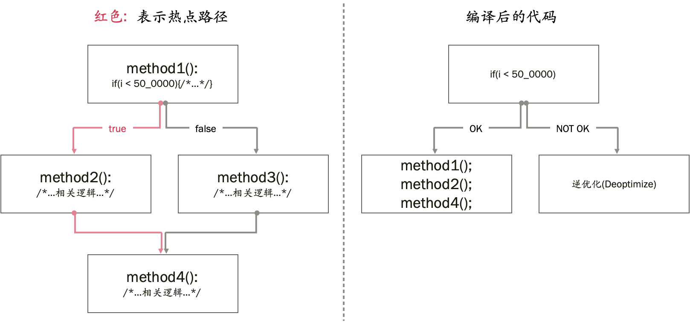
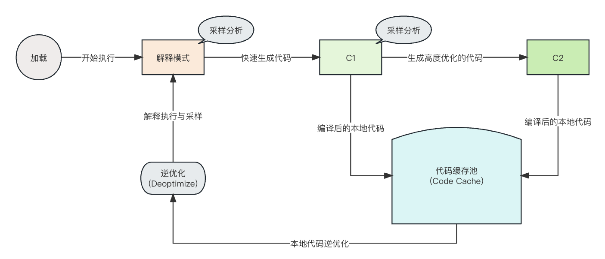

# 深入JVM - JIT分层编译技术与日志详解

> 原文更新日期: 2022年11月09日

## 1. 背景简介

JVM在运行时执行字节码(`bytecode`)有两种模式:

- 第一种是解释执行模式(interprets), 理论上执行速度较慢, 特别是大规模的循环和计算任务; 
- 另一种是编译运行模式(JIT, just-in-time compilation, 即时编译), 可以大幅度提升性能, 平均有几十倍上百倍的提升比例。

`java -version` 命令, 输出内容中的 `mixed mode`, 就是这个意思。

看看JDK11的示例:

```sh
% java -version
java version "11.0.6" 2020-01-14 LTS
Java(TM) SE Runtime Environment 18.9 (build 11.0.6+8-LTS)
Java HotSpot(TM) 64-Bit Server VM 18.9 (build 11.0.6+8-LTS, mixed mode)
```

输出内容中的 `mixed mode` 表示混合模式, 也就是混合使用 编译模式和解释模式。


再看看JDK8的示例:

```sh
$ java -version

openjdk version "1.8.0_191"
OpenJDK Runtime Environment (build 1.8.0_191-b12)
OpenJDK 64-Bit Server VM (build 25.191-b12, mixed mode)
```

查看解释执行和编译执行的相关启动参数:

```sh
java -X
    ...省略部分内容...
    -Xint             仅解释模式执行
    -Xmixed           混合模式执行（默认值）
    -Xcomp            在首次调用时强制编译方法

    -Xms<大小>        设置初始 Java 堆大小
    -Xmx<大小>        设置最大 Java 堆大小
    -Xdiag            显示附加诊断消息
    -Xinternalversion
                      显示比 -version 选项更详细的 JVM版本信息
    -XshowSettings:all
                      显示所有设置并继续
    -XshowSettings:vm
                      显示所有与 vm 相关的设置并继续
    -XshowSettings:system
                      （仅 Linux）显示主机系统或容器配置并继续
    -Xss<大小>        设置 Java 线程堆栈大小
    -Xverify          设置字节码验证器的模式

```


在一般并发量的CRUD程序中, 两种方式在宏观上可能看不出明显的性能差异, 因为时间主要消耗在CPU之外的其他地方, 比如网络和IO交互之类的等待操作。

JIT编译器可以大幅提升程序性能, 分为两款; 

- 一款称之为 `客户端编译器(Client Complier)`, 设计目标是为了让Java程序快速启动; 主要使用场景是 AWT/Swing 之类的图形界面客户端;
- 另一款称为 `服务端编译器(Server Complier)`, 设计目标是为了在整体上有更好的性能表现; 顾名思义, 主要使用场景就是长时间持续运行的服务端系统。

在老一点的 Java 版本中, 我们可以通过启动参数, 明确指定 Hotspot JVM 使用哪一款即时编译器;

为了兼容更复杂的使用场景, 达成更好的性能表现, 从 Java 7 版本开始, 引入了分层编译技术(tiered compilation)。

本文先介绍这两款JIT编译器; 再详细介绍分层编译技术(Tiered Compilation)和其中的5种编译级别; 最后通过具体示例, 分析编译日志, 深入了解JIT编译的运行原理。


## 2. JIT 编译器

JIT 编译器, 也就是即时编译器(JIT compiler), 作用是将执行频率较高的字节码(`bytecode`)编译为本地机器码(`native code`)。 

频繁执行的代码被称为 `热点代码(hotspots)`, 这就是 `Hotspot JVM` 这个名字的由来。

通过即时编译技术, Java 程序的执行性能大幅提升, 和纯编译类型的语言相差不多。

当然, 在实际的软件开发实践中, 代码质量也是对性能影响很大的一个因素。 

> 使用高级语言开发的复杂系统, 比起用低级语言开发, 在同样的 “开发成本” 下, 高级语言系统的综合质量要优越很多。

Hotspot JVM 提供了 2 种类型的JIT编译器:

- 客户端版本的编译器: C1
- 服务端版本的编译器: C2


### 2.1. 客户端版本的编译器: C1

客户端版本的编译器(client compiler), 技术领域称之为 `C1`(编译器1), 是JVM内置的一款即时编译器, 其中一个设计目标是为了让 Java应用启动更快完成.  所以会将字节码尽可能地优化, 并快速编译为机器代码.

最初, C1主要的应用场景是生命周期较短的客户端应用程序, 对这类应用而言, 启动时间是一个很重要的非功能性需求。 

在 Java8 之前的版本中, 可以指定 `-client` 启动参数来设置 C1 编译器, 但在Java8以及更高的Java版本中, 这个参数就没有任何作用了, 保留下来只是为了不报错, 以兼容之前的启动脚本。

> 验证命令: `java -client -version`


### 2.2. 服务端版本的编译器: C2

服务端版本的编译器(server compiler), 技术领域称之为 `C2`(编译器2), 是一款性能更好的, JVM内置的即时编译器(JIT compiler), 适用于生命周期更长的应用程序, 主要的使用场景就是服务端应用。
C2会监测和分析编译后的代码执行情况, 通过这些分析数据, 就可以生成和替换为更优化的机器代码。

在Java8之前的版本中, 需要指定 `-server` 启动参数来设置 C2 编译器, 但在 Java8 以及更高的Java版本中, 这个参数就没有任何作用了, 保留下来也是为了不报错。


> 验证命令: `java -server -version`

输出内容和前面的client模式没有


### 2.3. Graal JIT 编译器

Java 10及之后的版本, 开始支持 Graal JIT 编译器, 这是一款可以平替 C2 的编译器。 

其特征是既支持即时编译模式(just-in-time compilation mode), 也支持预先编译模式(ahead-of-time compilation mode)。

预先编译模式就是在程序启动之前, 将Java字节码全部编译为本地代码。


## 3. 分层编译技术(Tiered Compilation)

相比C1编译器, 对同一个方法进行编译时, C2编译器需要消耗更多CPU和内存资源, 但可以生成高度优化,性能卓越的本地代码。

从Java 7 版本开始, JVM引入了分层编译技术, 目标是综合利用 C1 和 C2, 实现快速启动和长期高效运行之间的平衡。


### 3.1. 汇聚两种编译器的优点

分层编译的整个过程如下图所示:


第一阶段: 

应用启动之后, JVM先是解释执行所有的字节码, 并采集方法调用相关的各种信息。
接下来, JIT 编译器对采集到的数据进行分析, 找出热点代码。

第二阶段:

启动C1, 将频繁执行的方法, 快速编译为本地机器码。

第三阶段:

收集到足够的信息以后, C2介入; 
C2会消耗一定的CPU时间来进行编译, 采用更激进的方式, 将代码重新编译为高度优化的本地机器码, 以提高性能。

总体来看, **C1 快速提高代码执行效率, C2基于热点代码进行分析, 让编译后的本地代码性能再次提升**。


### 3.2. 精准优化(Accurate Profiling)

分层编译的另一个好处, 是可以更准确地分析代码。

在没有分层编译的Java版本中, JVM只能在解释期间采集需要的优化信息。

有了分层编译后, JVM还在 C1 编译后的代码执行过程中采集信息。 由于编译后的代码具备了更好的性能, 也就可以容忍JVM执行更多的数据分析采样。


### 3.3. 代码缓存池(Code Cache)

Code cache 是JVM中的一块内存区域, 用来存储JIT编译后生成的所有本地机器码。 
使用分层编译技术, 代码缓存需要的内存使用量, 增长到了原来的4倍左右。

Java 9 以及之后的版本, 将 JVM 的代码缓存池分成三块区域:

- 非Java方法使用的代码缓存区(non-method): 存储 JVM 内部的本地代码; 默认大小是 5 MB 左右, 可通过启动参数 `-XX:NonNMethodCodeHeapSize` 指定。
- 带信息收集的代码缓存区(profiled-code):  存放 C1 编译后的本地代码; 一般来说这部分代码的存活周期并不长, 默认大小是 122 MB 左右, 可通过启动参数  `-XX:ProfiledCodeHeapSize` 指定。
- 不带信息收集的代码缓存区(non-profiled):  存放 C2 编译和优化后的本地代码; 一般来说这部分代码的存活周期较长, 默认大小也是 122 MB 左右, 可通过启动参数  `-XX:NonProfiledCodeHeapSize` 指定。

将代码缓存池拆分为多块, 整体性能提升了不少, 因为编译后相关的代码贴得更近(code locality), 并减少了内存碎片问题(memory fragmentation)。

- 代码贴近的相关信息可参考: [Code Locality and the Ability To Navigate](https://mvysny.github.io/code-locality-and-ability-to-navigate/)


### 3.4. 逆优化(Deoptimization)

虽然 C2 编译后是高度优化的本地代码, 一般会长时间留存, 但有时候也会发生逆优化操作。 
结果就是对应的代码回退到 JVM 解释模式。

逆优化发生的原因是编译器的乐观预期被打破, 例如, 如果收集到的分析信息, 与方法的实际行为不匹配时:




在这个场景中, 一旦热点路径发生改变, JVM 就会逆优化之前编译过的, 内联优化的代码。


## 4. 编译级别(Compilation Levels)

JVM 内置了解释器, 以及2款JIT编译器, 共有5种可能的编译级别;

C1 可以在3种编译级别上操作, 这3种级别间的区别在于采样分析工作是否完成。


### 4.1. Level 0 - 解释后的代码

JVM启动之后, 解释执行所有的Java代码。 在这个初始阶段, 性能一般比不上编译语言。

但是, JIT编译器在预热阶段后启动, 并在运行时编译热代码。

JIT编译器通过分析 **级别0(Level 0)** 时期收集的采样信息来执行优化。


### 4.2. Level 1 - C1简单编译的代码

在 Level 1 这个级别, JVM使用C1编译器编译代码, 但不会进行任何分析数据采样。 JVM将级别1用于简单的方法。

很多方法没有什么复杂性, 即便是使用C2再编译一次也不会提升什么性能, 比如 Getter, Setter 之类的方法。

因此, JVM得出的结论是, 采集分析信息也无法优化性能, 所以采集了也没什么用, 干脆不植入采集逻辑。


### 4.3. Level 2 - 受限后C1编译的代码

在 Level 2 级别, JVM使用C1编译器编译代码, 并进行简单的采样分析。 

当C2的待编译队列满了(受限), JVM就会使用这个级别。目标是尽快编译代码以提高性能。

稍后, JVM在 Level 3 级别重新编译代码, 附带完整的采样分析。

最后, 如果C2队列不再繁忙, JVM将在 Level 4 级别重新编译。


### 4.4. Level 3 - C1完全编译的代码

在 Level 3 级别, JVM使用 C1 编译出具有完整采样分析的代码。

级别3是 `默认编译路径`` 的一部分。 

因此, 除了简单的方法, 或者编译器队列排满了, JVM在其他所有情况下都使用这个级别来编译。

JIT编译中最常见的场景, 是直接从解释后的代码(Level 0级） 跳到 Level 3 级别。


### 4.5. Level 4 - C2编译的代码

在 Level 4 这个级别, JVM使用C2来执行代码编译, 以获得最强的长期性能。

级别4也是 `默认编译路径` 的一部分。 除简单方法外, JVM用这个级别来编译其他的所有方法。

第4级代码被假定是完全优化后的代码, JVM将停止收集分析信息。

但是, 也有可能会取消优化并将其回退至 Level 0 级别。


## 5. 编译器参数设置

Java 8 版本之后, 默认启用了分层编译。 除非有说得过去的特殊理由, 否则不要禁用分层编译。


### 5.1. 禁用分层编译

通过设置 `–XX:-TieredCompilation`, 来禁用分级编译。
用减号(`-TieredCompilation`)禁用这个标志时, JVM就不会在编译级别之间转换。
所以还需要选择使用的JIT编译器: C1, 还是C2。

如果没有明确指定, JVM将根据CPU特征来决定默认的JIT编译器。
对于多核处理器或64位虚拟机, JVM将选择C2。

如果要禁用C2, 只使用C1, 不增加分析的性能损耗, 可以传入启动参数 `-XX:TieredStopAtLevel=1`。

要完全禁用JIT编译器, 使用解释器来运行所有内容, 可以指定启动参数 `-Xint`。 当然, 禁用JIT编译器会对性能产生一些负面影响。

> 某些情况下, 比如程序代码中使用了复杂的泛型组合, 由于JIT优化可能会擦除泛型信息, 这时候可以尝试禁用分层编译或者JIT编译。

> 对于并发量很小的简单CRUD程序而言, 因为CPU计算量在整个处理链路上的时间占比很小, 解释执行和编译执行的区别并不明显。


### 5.2. 设置各个层级编译的触发阈值(Threshold)

编译阈值(compile threshold), 是指在代码被编译之前, 方法调用需要到达的次数。 

在分层编译的情况下, 可以为 `2~4` 的编译级别设置这些阈值。

例如, 我们可以将 Tier4 的阈值降低到1万: `-XX:Tier4CompileThreshold=10000`。

`java -version` 是一个探测JVM参数很好用的手段。

例如, 我们可以带上  `-XX:+PrintFlagsFinal` 标志来运行 `java -version`, 检查某个Java版本上的默认阈值, 


Java 8 版本的参数示例如下:

```sh
java -XX:+PrintFlagsFinal -version | grep Threshold

 intx BackEdgeThreshold                         = 100000    {pd product}
 intx BiasedLockingBulkRebiasThreshold          = 20        {product}
 intx BiasedLockingBulkRevokeThreshold          = 40        {product}
uintx CMSPrecleanThreshold                      = 1000      {product}
uintx CMSScheduleRemarkEdenSizeThreshold        = 2097152   {product}
uintx CMSWorkQueueDrainThreshold                = 10        {product}
uintx CMS_SweepTimerThresholdMillis             = 10        {product}
 intx CompileThreshold= 10000     {pd product}
 intx G1ConcRefinementThresholdStep             = 0         {product}
uintx G1SATBBufferEnqueueingThresholdPercent    = 60        {product}
uintx IncreaseFirstTierCompileThresholdAt       = 50        {product}
uintx InitialTenuringThreshold                  = 7         {product}
uintx LargePageHeapSizeThreshold                = 134217728 {product}
uintx MaxTenuringThreshold                      = 15        {product}
 intx MinInliningThreshold                      = 250       {product}
uintx PretenureSizeThreshold                    = 0         {product}
uintx ShenandoahAllocationThreshold             = 0         {product rw}
uintx ShenandoahFreeThreshold                   = 10        {product rw}
uintx ShenandoahFullGCThreshold                 = 3         {product rw}
uintx ShenandoahGarbageThreshold                = 60        {product rw}
uintx StringDeduplicationAgeThreshold           = 3         {product}
uintx ThresholdTolerance                        = 10        {product}
 intx Tier2BackEdgeThreshold                    = 0         {product}
 intx Tier2CompileThreshold                     = 0         {product}
 intx Tier3BackEdgeThreshold                    = 60000     {product}
 intx Tier3CompileThreshold                     = 2000      {product}
 intx Tier3InvocationThreshold                  = 200       {product}
 intx Tier3MinInvocationThreshold               = 100       {product}
 intx Tier4BackEdgeThreshold                    = 40000     {product}
 intx Tier4CompileThreshold                     = 15000     {product}
 intx Tier4InvocationThreshold                  = 5000      {product}
 intx Tier4MinInvocationThreshold               = 600       {product}

openjdk version "1.8.0_191"
OpenJDK Runtime Environment (build 1.8.0_191-b12)
OpenJDK 64-Bit Server VM (build 25.191-b12, mixed mode)
```

Java 11 版本的参数示例如下:

```sh
java -XX:+PrintFlagsFinal -version | grep Threshold

 intx BiasedLockingBulkRebiasThreshold         = 20              {product} {default}
 intx BiasedLockingBulkRevokeThreshold         = 40              {product} {default}
uintx CMSPrecleanThreshold                     = 1000            {product} {default}
size_t CMSScheduleRemarkEdenSizeThreshold      = 2097152         {product} {default}
uintx CMSWorkQueueDrainThreshold               = 10              {product} {default}
uintx CMS_SweepTimerThresholdMillis            = 10              {product} {default}
 intx CompileThreshold                         = 10000        {pd product} {default}
double CompileThresholdScaling                 = 1.000000        {product} {default}
size_t G1ConcRefinementThresholdStep           = 2               {product} {default}
uintx G1SATBBufferEnqueueingThresholdPercent   = 60              {product} {default}
uintx IncreaseFirstTierCompileThresholdAt      = 50              {product} {default}
uintx InitialTenuringThreshold                 = 7               {product} {default}
size_t LargePageHeapSizeThreshold              = 134217728       {product} {default}
uintx MaxTenuringThreshold                     = 15              {product} {default}
 intx MinInliningThreshold                     = 250             {product} {default}
size_t PretenureSizeThreshold                  = 0               {product} {default}
uintx StringDeduplicationAgeThreshold          = 3               {product} {default}
uintx ThresholdTolerance                       = 10              {product} {default}
 intx Tier2BackEdgeThreshold                   = 0               {product} {default}
 intx Tier2CompileThreshold                    = 0               {product} {default}
 intx Tier3AOTBackEdgeThreshold                = 120000          {product} {default}
 intx Tier3AOTCompileThreshold                 = 15000           {product} {default}
 intx Tier3AOTInvocationThreshold              = 10000           {product} {default}
 intx Tier3AOTMinInvocationThreshold           = 1000            {product} {default}
 intx Tier3BackEdgeThreshold                   = 60000           {product} {default}
 intx Tier3CompileThreshold                    = 2000            {product} {default}
 intx Tier3InvocationThreshold                 = 200             {product} {default}
 intx Tier3MinInvocationThreshold              = 100             {product} {default}
 intx Tier4BackEdgeThreshold                   = 40000           {product} {default}
 intx Tier4CompileThreshold                    = 15000           {product} {default}
 intx Tier4InvocationThreshold                 = 5000            {product} {default}
 intx Tier4MinInvocationThreshold              = 600             {product} {default}

java version "11.0.6" 2020-01-14 LTS
Java(TM) SE Runtime Environment 18.9 (build 11.0.6+8-LTS)
Java HotSpot(TM) 64-Bit Server VM 18.9 (build 11.0.6+8-LTS, mixed mode)
```

主要关注以下几个 `CompileThreshold` 标志:

```sh
java -XX:+PrintFlagsFinal -version | grep CompileThreshold
intx CompileThreshold = 10000
intx Tier2CompileThreshold = 0
intx Tier3CompileThreshold = 2000
intx Tier4CompileThreshold = 15000
```

需要注意, 如果启用了分层编译, 那么通用的编译阈值参数 `CompileThreshold = 10000` 不再生效。


## 6. 方法编译


方法编译(method compilation)的生命周期如下图所示:



总体来说, 一个方法最初由 JVM 解释执行。 直到调用次数达到 `Tier3CompileThreshold` 指定的阈值。  
达到阈值后, JVM就会使用C1编译器来编译该方法, 同时继续采集分析信息。
当方法调用次数达到 `Tier4CompileThreshold` 时, JVM使用C2编译器来编译该方法。

当然, JVM有可能会取消 C2编译器对代码的优化。 那么这个过程就可能会来回反复。


### 6.1. 编译日志格式

默认情况下, JVM 是禁止输出 JIT编译日志 的。 想要启用, 需要设置启动参数 `-XX:+PrintCompilation`。

编译日志的格式包括这些部分:

- 时间戳(Timestamp) – 编译时距离JVM启动时间的毫秒值。 很多JVM日志的时间都是这个相对时间。
- 编译ID(Compile ID) – 每个被编译的方法对应的自增ID。 
- 属性状态(Attributes) – 编译任务对应的状态有5种可能的取值:
  * `%` – 栈上替换(On-stack replacement)
  * `s` – 该方法是 synchronized 方法
  * `!` – 方法中包含异常捕获块(exception handler)
  * `b` – 阻塞模式(blocking mode)
  * `n` – 本地方法标志(native method), 实际上编译的是包装方法
- 编译级别: 取值为 `0` 到 `4`
- 方法名称(Method name)
- 字节码大小(Bytecode size)
- 逆优化指示标志, 有2种可能的取值:
  * 置为不可进入(made not entrant) – 比如发生标准的 C1 逆优化, 或者编译器的乐观推断错误。
  * 置为僵死模式(made zombie) – 不再使用, 随时可清理, 垃圾收集器在释放 code cache 空间时的一种清理机制。

某一行编译日志样例如下:

```java
# 这里为了排版进行了折行
2258 1324 %     4
       com.cncounter.demo.compile.TieredCompilation::main @ 2
        (58 bytes)  made not entrant

```

从左到右简单解读:

- `2258` 就是距离JVM启动的时间戳毫秒数;
- `1324` 就是某一个方法对应的编译ID, 有多条编译记录的情况下, 可以用这个id来定位。
- `%` 表示栈上替换;
- `4` 表示编译级别是第4级别(取值0-4)
- `com.cncounter.demo.compile.TieredCompilation::main` 表示方法
- `@ 2` 这个不是必须的, 分析编译日志可以看到其他的数字, 总是和 `%` 栈上替换一起出现, 可能和栈内存槽位有关。
- `(58 bytes)` 表示该方法对应的字节码为 58字节。
- `made not entrant` 如果有这串字符, 就是逆优化指示标志。


JDK11执行的某一次编译日志样例可以参考文件: [compile-log-sample.txt](./compile-log-sample.txt) 


### 6.2. 演示代码

下面通过一个具体的示例, 来展示方法编译的生命周期。

首先创建一个简单的 `Formatter` 接口:


```java
package com.cncounter.demo.compile;

public interface Formatter {
    <T> String format(T object) throws Exception;
}
```

然后创建一个 JSON 格式的简单实现类 `JsonFormatter`:


```java
package com.cncounter.demo.compile;
import com.fasterxml.jackson.core.JsonProcessingException;
import com.fasterxml.jackson.databind.json.JsonMapper;

public class JsonFormatter implements Formatter {

    private static final JsonMapper mapper = new JsonMapper();
    @Override
    public <T> String format(T object) throws JsonProcessingException {
        return mapper.writeValueAsString(object);
    }
}
```

代码中对应的依赖可以到 <https://mvnrepository.com> 网站搜索: 

- [com.fasterxml.jackson.core](https://mvnrepository.com/artifact/com.fasterxml.jackson.core/jackson-databind)
- [com.fasterxml.jackson.dataformat](https://mvnrepository.com/artifact/com.fasterxml.jackson.dataformat/jackson-dataformat-xml)


> 严格来说, 格式化和序列化是有区别的: 格式化=将对象转换为字符串; 序列化=将对象转换为字节序列。

再创建一个 XML 格式化的实现类 `XmlFormatter`:


```java
package com.cncounter.demo.compile;

import com.fasterxml.jackson.core.JsonProcessingException;
import com.fasterxml.jackson.dataformat.xml.XmlMapper;

public class XmlFormatter implements Formatter {

    private static final XmlMapper mapper = new XmlMapper();

    @Override
    public <T> String format(T object) throws JsonProcessingException {
        return mapper.writeValueAsString(object);
    }

}
```


以及一个简单的类 `Article`:

```java
package com.cncounter.demo.compile;

public class Article {

    private String name;
    private String author;

    public Article(String name, String author) {
        this.name = name;
        this.author = author;
    }

    public String getName() {
        return name;
    }

    public String getAuthor() {
        return author;
    }

}
```

将这几个类准备好之后, 编写一个包含 `main` 方法的类, 来调用这两个格式化程序.

```java
package com.cncounter.demo.compile;

public class TieredCompilation {

    public static void main(String[] args) throws Exception {
        for (int i = 0; i < 1_000_000; i++) {
            Formatter formatter;
            if (i < 500_000) {
                formatter = new JsonFormatter();
            } else {
                formatter = new XmlFormatter();
            }
            formatter.format(new Article("Tiered Compilation in JVM", "CNC"));
        }
    }

}
```

`for`循环中有 `if` 语句来判断循环次数, 先调用的是 `JsonFormatter` 实现, 一定次数之后, 调用的是 `XmlFormatter` 实现。

代码编写完成后, 执行程序时, 需要指定 JVM 启动参数 `-XX:+PrintCompilation`, 注意启动参数的加号(`+`)用来开启这个开关, 如果是减号(`-`)则表示关闭。

执行程序之后, 可以看到对应的编译日志。


JDK11执行的某一次编译日志样例可以参考文件: [compile-log-sample.txt](./compile-log-sample.txt) 


### 6.3. 解读编译日志

> 提示: 多次执行同一个程序, 对应的编译日志可能都不一样, 需要具体情况具体分析。

输出的编译日志内容较多, 使用 JDK11 某一次执行的日志样例可以参考文件: [compile-log-sample.txt](./compile-log-sample.txt) 

使用管道 ` | grep cncounter`, 过滤出感兴趣的部分:

```java
cat compile-log-sample.txt| grep cncounter

1023  788       1       com.cncounter.demo.compile.Article::getName (5 bytes)
1025  789       1       com.cncounter.demo.compile.Article::getAuthor (5 bytes)

1032  800       3       com.cncounter.demo.compile.JsonFormatter::<init> (5 bytes)
1032  801       3       com.cncounter.demo.compile.Article::<init> (15 bytes)
1041  820       3       com.cncounter.demo.compile.JsonFormatter::format (8 bytes)

1122  903       4       com.cncounter.demo.compile.JsonFormatter::<init> (5 bytes)
1123  800       3       com.cncounter.demo.compile.JsonFormatter::<init> (5 bytes)   made not entrant
1123  904       4       com.cncounter.demo.compile.Article::<init> (15 bytes)
1124  801       3       com.cncounter.demo.compile.Article::<init> (15 bytes)   made not entrant

1132  932 %     3       com.cncounter.demo.compile.TieredCompilation::main @ 2 (58 bytes)
1133  933       3       com.cncounter.demo.compile.TieredCompilation::main (58 bytes)

1146  905       4       com.cncounter.demo.compile.JsonFormatter::format (8 bytes)
1281  820       3       com.cncounter.demo.compile.JsonFormatter::format (8 bytes)   made not entrant
1281  934 %     4       com.cncounter.demo.compile.TieredCompilation::main @ 2 (58 bytes)
1285  932 %     3       com.cncounter.demo.compile.TieredCompilation::main @ 2 (58 bytes)   made not entrant

1346  934 %     4       com.cncounter.demo.compile.TieredCompilation::main @ 2 (58 bytes)   made not entrant
1350  933       3       com.cncounter.demo.compile.TieredCompilation::main (58 bytes)   made not entrant
1361  905       4       com.cncounter.demo.compile.JsonFormatter::format (8 bytes)   made not entrant

1543 1228       2       com.cncounter.demo.compile.XmlFormatter::<init> (5 bytes)
1546 1235       2       com.cncounter.demo.compile.XmlFormatter::format (8 bytes)

1561 1298 %     3       com.cncounter.demo.compile.TieredCompilation::main @ 2 (58 bytes)
1577 1310       3       com.cncounter.demo.compile.TieredCompilation::main (58 bytes)
1935 1324 %     4       com.cncounter.demo.compile.TieredCompilation::main @ 2 (58 bytes)
1939 1298 %     3       com.cncounter.demo.compile.TieredCompilation::main @ 2 (58 bytes)   made not entrant

2258 1324 %     4       com.cncounter.demo.compile.TieredCompilation::main @ 2 (58 bytes)   made not entrant
```

#### 6.3.1. 时间戳

第一列表示时间戳; 表示距离JVM启动时间点的毫秒数, 可以看到编译日志输出的时间戳是有序的。


下面对其他部分进行简单的解读;

#### 6.3.2. 级别1

最前面的2行编译日志对应 `Article` 类的 `getName` 和 `getAuthor` 方法:

```java
1023  788       1       com.cncounter.demo.compile.Article::getName (5 bytes)
1025  789       1       com.cncounter.demo.compile.Article::getAuthor (5 bytes)
```

这两个get方法的实现很简单, 没什么优化空间。 

回顾前面的知识点: 

> Level 1 这个级别, 表示 C1 简单编译的代码, JVM将级别1用于简单的方法。

#### 6.3.3. 级别3

接下来的编译日志是级别3, 级别1到级别3对应的都是 C1编译器。


```java
1032  800       3       com.cncounter.demo.compile.JsonFormatter::<init> (5 bytes)
1032  801       3       com.cncounter.demo.compile.Article::<init> (15 bytes)
1041  820       3       com.cncounter.demo.compile.JsonFormatter::format (8 bytes)
```

`<init>` 方法, 实际上就是编译器将 `构造方法` 和 `实例初始化块` 整合后生成的一个方法, 在创建对象时自动调用。 

`JsonFormatter` 类的 `format` 方法也进入了级别3。


#### 6.3.4. 级别4

接下来的编译日志是级别4, 级别4对应的是 C2编译器。


```java
1122  903       4       com.cncounter.demo.compile.JsonFormatter::<init> (5 bytes)
1123  800       3       com.cncounter.demo.compile.JsonFormatter::<init> (5 bytes)   made not entrant
1123  904       4       com.cncounter.demo.compile.Article::<init> (15 bytes)
1124  801       3       com.cncounter.demo.compile.Article::<init> (15 bytes)   made not entrant
```

对应的方法是 `<init>`, 这个编译日志有点意思。

仔细看这部分日志, 可以发现, 每条级别4的编译日志之后, 都对应着一条低级别的不可进入标志(`made not entrant`); 

原因很好理解, 升级了嘛, 老的就过时了(obsolete)。


#### 6.3.5. 栈上替换

接下来的编译日志还是级别3。

```java
1132  932 %     3       com.cncounter.demo.compile.TieredCompilation::main @ 2 (58 bytes)
1133  933       3       com.cncounter.demo.compile.TieredCompilation::main (58 bytes)
```

这里的百分号(`%`)表示发生了栈上替换;  

被编译的 main 方法, 正有某个线程在执行该方法, 所以发生了栈上替换。 


#### 6.3.6. 级别4和栈上替换

接下来的编译日志是级别4。

```java
1146  905       4       com.cncounter.demo.compile.JsonFormatter::format (8 bytes)
1281  820       3       com.cncounter.demo.compile.JsonFormatter::format (8 bytes)   made not entrant
1281  934 %     4       com.cncounter.demo.compile.TieredCompilation::main @ 2 (58 bytes)
1285  932 %     3       com.cncounter.demo.compile.TieredCompilation::main @ 2 (58 bytes)   made not entrant
```

`JsonFormatter::format` 方法的编译升到了级别4, 前面介绍过。

栈上替换的 `TieredCompilation::main` 方法也升级到了级别4, 并将级别3的部分标记为不可进入。


#### 6.3.7. 逆优化

接下来发生了一些预料之外的事情。

```java
1346  934 %     4       com.cncounter.demo.compile.TieredCompilation::main @ 2 (58 bytes)   made not entrant
1350  933       3       com.cncounter.demo.compile.TieredCompilation::main (58 bytes)   made not entrant
1361  905       4       com.cncounter.demo.compile.JsonFormatter::format (8 bytes)   made not entrant
```

`TieredCompilation::main` 方法被JVM执行了逆优化;

回顾 `main` 方法的Java代码, 我们看到, 在执行了50万次循环之后, if 条件的结果改变了。

可能C2做了一些剪枝之类的激进优化, 乐观推断对应的前提条件不再有效, 于是JVM将优化过的代码回退到解释模式。 


#### 6.3.8. 级别2

接下来是 `XmlFormatter` 类的方法编译。

```java
1543 1228       2       com.cncounter.demo.compile.XmlFormatter::<init> (5 bytes)
1546 1235       2       com.cncounter.demo.compile.XmlFormatter::format (8 bytes)
```

回顾一下, 级别2 - C1编译的受限代码; 

> 在 Level 2 级别, JVM使用C1编译器编译代码, 并进行简单的采样分析。 

可能是编译队列满了, 或者是被刚才的回退伤了心。 JVM 使用C1对 `XmlFormatter::format` 方法进行 Level2 的快速编译。

本次执行, 直到程序退出, 也没有对该类的方法继续优化。


#### 6.3.9. 再次优化

又执行一段时间过后, main 方法再次升级了。

```java
1561 1298 %     3       com.cncounter.demo.compile.TieredCompilation::main @ 2 (58 bytes)
1577 1310       3       com.cncounter.demo.compile.TieredCompilation::main (58 bytes)
1935 1324 %     4       com.cncounter.demo.compile.TieredCompilation::main @ 2 (58 bytes)
1939 1298 %     3       com.cncounter.demo.compile.TieredCompilation::main @ 2 (58 bytes)   made not entrant
```

这里先是发生了级别3的栈上替换, 以及级别3的编译。

然后又发生了级别4的栈上替换, 以及低级别栈上替换的过时标记。


#### 6.3.9. 方法退出

最后, `main` 方法执行结束, 对应的方法栈也就不在了。

```java
2258 1324 %     4       com.cncounter.demo.compile.TieredCompilation::main @ 2 (58 bytes)   made not entrant
```

所以栈上替换的 Level 4 优化方法, 也被标记为不可进入。


## 7. 小结

本文简要介绍了 JVM 中的分层编译技术。 

包括两种类型的JIT编译器, 以及分层编译技术如何组合使用他们, 以达成最佳效果。

还详细介绍了5种不同的编译级别, 以及相关的JVM调优参数。

最后是一个具体的案例, 通过打印和分析编译日志, 深入学习了Java方法编译和优化的整个生命周期。

相关的示例代码, 也可以参考: <https://github.com/eugenp/tutorials/tree/master/core-java-modules/core-java-lang-4>


## 参考文档

- <https://www.baeldung.com/jvm-tiered-compilation>
- <https://docs.azul.com/prime/analyzing-tuning-warmup>
- <https://opensource.com/article/22/8/interpret-compile-java>
- <https://www.oracle.com/technical-resources/articles/java/architect-evans-pt1.html>
- <https://blog.joda.org/2011/08/printcompilation-jvm-flag.html>
- <https://gist.github.com/chrisvest/2932907>
