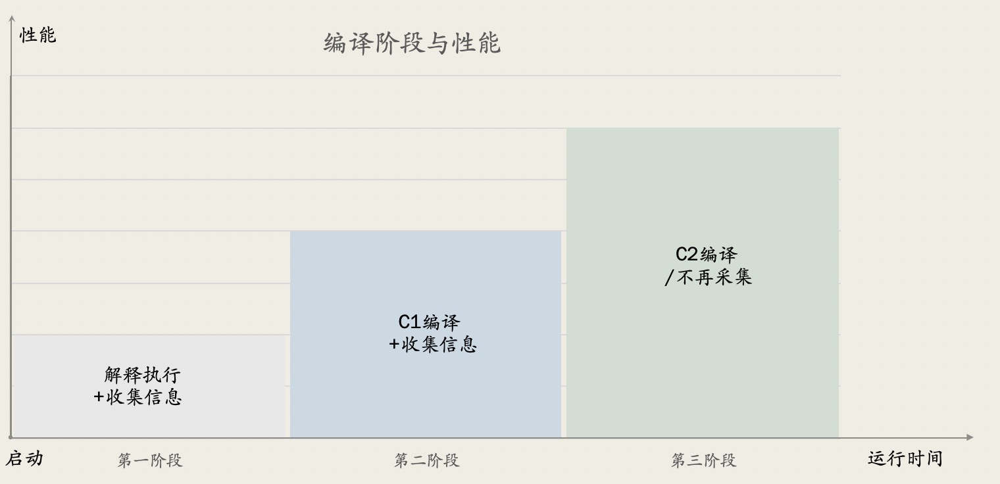

# 深入JVM: 案例详解JIT分层编译技术

> 最后更新日期: 2022年11月09日

## 1. 背景简介

JVM在运行时有两种执行方式:

- 一种是解释执行(interprets), 理论上执行速度较慢, 特别是大规模的循环和计算任务时; 
- 另一种是编译运行(JIT, just-in-time compilation, 即时编译), 可以大幅度提升性能, 比如几十倍上百倍的提升比例。

但是在常规并发量的CRUD程序中, 两者在宏观上可能看不出明显区别, 因为时间主要消耗在其他地方, 比如网络IO交互之类的步骤上。

JIT编译器能大幅提升程序性能, 也分为两款; 

- 一款被称为 客户端编译器(Client Complier), 设计目标是为了让Java程序具有较快的启动速度; 主要使用场景是 AWT/Swing 之类的图形界面客户端;
- 另一款称为 服务端编译器(Server Complier), 设计目标是为了在整体上有更好的性能表现; 顾名思义, 主要使用场景是需要长时间运行的服务端系统。

在老一点的 Java 版本中, 我们需要手动指定 Hotspot JVM 使用哪一款即时编译器;

为了兼容更复杂的使用场景, 达成更好的性能表现, 从 Java 7 版本开始, JVM 引入了分层编译技术(tiered compilation)。

本文简要介绍这两款不同的JIT编译器; 并详细介绍分层编译技术(Tiered Compilation)和其中的5种编译级别; 最后再通过具体示例, 分析编译日志, 来深入学习JIT编译的运行原理。


## 2. JIT 编译器

即时编译器(JIT compiler)的作用, 是将执行频率较高的字节码(bytecode)编译为本地机器码(native code)。 

频繁执行的代码被称为 热点代码(hotspots), 这也是 Hotspot JVM 这个名字的由来。

通过即时编译技术, Java 程序的执行性能大幅提升, 和纯编译类型的语言差不多。

当然, 在实际的软件开发实践中, 代码质量也是一个影响很大的因素。 

> 使用高级语言开发的复杂系统, 比起用低级语言开发, 在同样的“开发成本”下, 高级语言系统的综合质量要优越很多。

Hotspot JVM 提供了 2 种类型的JIT编译器:


### 2.1. 客户端版本的编译器: C1

客户端版本的编译器(client compiler), 称为 C1, 是JVM内置的一款即时编译器, 其中的一个目的是为了让 Java应用启动更快完成.  所以会尽可能快地将代码优化并编译为机器代码.

最初, C1主要的应用场景是生命周期较短的客户端应用程序, 对这类应用而言, 启动时间是一个很重要的非功能性需求。 

在Java8之前的版本中, 需要指定 `-client` 启动参数来设置 C1 编译器, 但在Java8以及更高的Java版本中, 这个参数就没有任何作用了, 保留下来只是为了不报错。

> 验证命令: `java -client -version`


### 2.2. 服务端版本的编译器: C2

服务端版本的编译器(server compiler), 称为 C2, 是一款性能更好的, JVM内置的即时编译器(JIT compiler), 适用于生命周期更长的应用程序, 主要的使用场景就是服务端应用。
C2会监测和分析编译后的代码执行情况, 通过这些分析数据, 就可以生成和替换为更优化的机器代码。

在Java8之前的版本中, 需要指定 `-server` 启动参数来设置 C2 编译器, 但在Java8以及更高的Java版本中, 这个参数就没有任何作用了, 保留下来也是为了不报错。


> 验证命令: `java -server -version`


### 2.3. Graal JIT 编译器

Java 10及之后的版本, 开始支持 Graal JIT 编译器, 这是一款可以平替 C2 的编译器。 

其特征是既支持即时编译模式(just-in-time compilation mode), 也支持预先编译模式(ahead-of-time compilation mode)。

预先编译模式就是在程序启动之前, 将Java字节码全部编译为本地代码。


## 3. 分层编译技术(Tiered Compilation)

对同一个方法进行编译, 相比起C1来说, C2编译器需要更多的CPU和内存, 但可以生成高度优化,性能卓越的本地代码。

从Java 7 版本开始, JVM引入了分层编译技术, 目标是综合利用 C1 和 C2, 实现快速启动和长时间高性能运行之间的平衡。

混合模式示例:

```sh
$ java -client -version

openjdk version "1.8.0_191"
OpenJDK Runtime Environment (build 1.8.0_191-b12)
OpenJDK 64-Bit Server VM (build 25.191-b12, mixed mode)
```

`java -version` 命令, 输出内容中的 `mixed mode`, 就是这个意思。


### 3.1. 汇集两者的优点

混合编译的整个过程如下图所示:




第一阶段: 

应用启动之后, JVM先是解释执行所有的字节码, 并采集方法调用相关的各种信息。
接下来, JIT 编译器对采集到的数据进行分析, 找出热点代码。

第二阶段:

启动C1, 将频繁执行的方法, 快速编译为本地机器码。

第三阶段:

收集到足够的信息以后, C2介入; C2会消耗一定的编译时间, 采用更激进的方式, 将代码重新编译为高度优化的本地机器码, 以提高性能。

总体来看，C1 快速提高代码执行效率, C2基于热点代码分析数据, 让编译后的本地代码性能再次提升。


### 3.2. 精准优化(Accurate Profiling)

分层编译的另一个好处, 是可以更准确地分析代码。

在没有分层编译的Java版本中，JVM只能在解释期间收集优化需要的信息。

启用分层编译后，JVM还收集了 C1 编译后的代码执行信息。 由于编译后的代码具备了更好的性能, 也就可以容忍JVM收集更多的分析数据采样。


### 3.3. 代码缓存池(Code Cache)

Code cache 是JVM中的一块内存区域, 用来存储所有JIT编译后生成的本地机器码。 
使用分层编译技术, 需要的代码缓存使用量, 增长到了原来的4倍左右。

Java 9 以及之后的版本, 将 JVM 的代码缓存分成三块区域:

- 非Java方法使用的代码缓存区(non-method): 存储 JVM 内部的本地代码; 默认值是 5 MB 左右, 可通过启动参数 `-XX:NonNMethodCodeHeapSize` 指定。
- 带信息收集的代码缓存区(profiled-code):  存放 C1 编译后的本地代码; 一般来说这部分代码的存活周期并不长, 默认值是 122 MB 左右, 可通过启动参数  `-XX:ProfiledCodeHeapSize` 指定。
- 不带信息收集的代码缓存区(non-profiled):  存放 C2 编译和优化后的本地代码; 一般来说这部分代码的存活周期较长, 默认值也是 122 MB 左右, 可通过启动参数  `-XX:NonProfiledCodeHeapSize` 指定。

将代码缓存池拆分为多个模块, 整体性能提升了不少, 因为贴近了编译后相关的代码, 并减少了内存碎片问题。


### 3.4. 逆优化(Deoptimization)

虽然 C2 编译后是高度优化的本地代码, 一般会长时间留存, 但有时候也可能会发生逆优化操作。 结果就是对应的代码回退到 JVM 解释模式。

逆优化发生的原因是编译器的乐观预期被打破, 例如, 如果收集到的分析信息, 与方法的实际行为不匹配时:

Even though C2 compiled code is highly optimized and long-lived, it can be deoptimized. As a result, the JVM would temporarily roll back to interpretation.

Deoptimization happens when the compiler’s optimistic assumptions are proven wrong — for example, when profile information does not match method behavior:


In our example, once the hot path changes, the JVM deoptimizes the compiled and inlined code.

在这个例子中, 一旦热点路径发生改变, JVM 就会逆优化编译后的内连代码。


## 4. 编译级别(Compilation Levels)

JVM 内置了解释器, 以及2款JIT编译器, 共有5种可能的编译级别;

C1 可以在3种编译级别上操作, 互相之间的区别在于采样分析工作是否完成。


### 4.1 0级 - 解释后的代码

JVM启动之后，解释执行所有的Java代码。 在这个初始阶段, 性能一般比不上编译语言。

但是, JIT编译器在预热阶段之后启动，并在运行时编译热代码。

JIT编译器使用 级别0 期间收集的分析信息来执行优化。


### 4.2 级别1 - C1简单编译的代码

在这个级别，JVM使用C1编译器编译代码，但不会采集任何分析信息。 JVM将级别1用于简单的方法。

由于很多方法没有什么复杂性，即时使用C2再编译一次也不会提升什么性能。

因此，JVM得出的结论是，采集分析信息也无法优化性能, 所以对应的分析信息也没有什么用处。


## 7. 小结

本文简要介绍了 JVM 中的分层编译技术。 

包括两种类型的JIT编译器, 以及分层编译技术如何组合使用他们, 以达成最佳实践。

还详细介绍了5种不同的编译级别, 以及相关的JVM调优参数。

最后是一个具体的案例, 通过分析编译日志, 深入学习了Java方法编译和优化的整个生命周期。

相关的示例代码, 请参考: <https://github.com/eugenp/tutorials/tree/master/core-java-modules/core-java-lang-4>


## 参考文档

- <https://www.baeldung.com/jvm-tiered-compilation>
