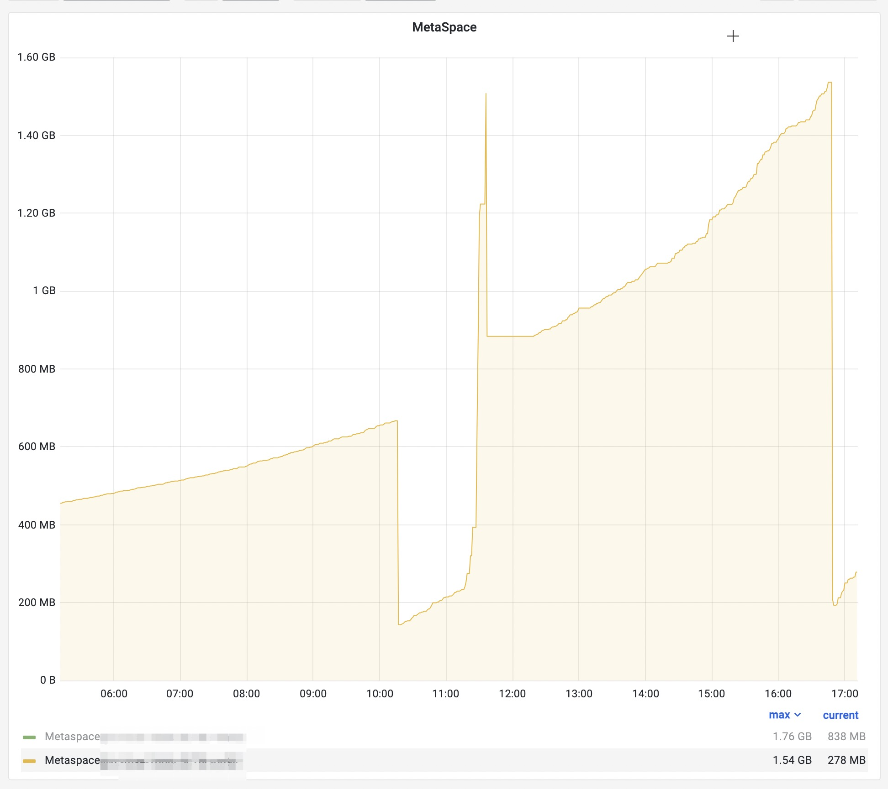
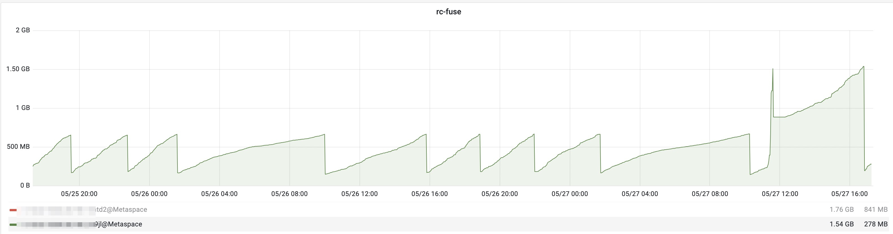

# JVM配置参数MaxMetaspaceSize案例


## 1. 参数说明

我们可以通过启动参数 `-XX:MaxMetaspaceSize` 来限制Meta区的大小：

```
-XX:MaxMetaspaceSize=2g
```


## 2. 问题描述

有一个应用, 配置的部分JVM参数如下:

```sh
JAVA_OPTS="-Xmx5g -Xms5g -XX:+UseG1GC"
```

在系统负载较高时, 发现堆外内存暴涨, 因为OOM导致K8s pod 被杀, 应用自动重启。


```sh
【正在报警:1级报警】pod OOM
规则标题: pod OOM
报警名称: KubePodOOMKilled-XX
报警分组: namespace_apne-prd
报警概要: Pod prd  OOMKilled.
报警描述: Pod prd  OOMKilled.
触发时间: 2024-05-27 11:44:00
报警时间: 2024-05-27 11:46:20
```

观察指标监控:



先调整系统负载, 持续关注;

到下午 16:48 再次报警:


```sh
【正在报警:1级报警】内存告警
规则标题: 内存告警
报警名称: KubePodMemWillFill-XX
报警分组: namespace_apne-prd
触发时间: 2024-05-27 16:48:00
报警时间: 2024-05-27 16:48:20
```

这次pod没重启, 因为Meta区使用量又自动降下去了





## 3. 原因分析

因为Meta区使用量会自动下降, 说明并不存在严重的内存泄露, 而是GC策略对于Meta区的回收不及时导致的。


## 4. 解决方法


Java8默认不限制Meta空间, 我们一般不设置该选项。

既然出了问题, 那么久需要限制Meta区的最大空间了, 加上参数 `-XX:MaxMetaspaceSize=1G`:


```sh
JAVA_OPTS='-Xmx5g -Xms5g -XX:+UseG1GC -XX:MaxMetaspaceSize=1G'

```

## 5. `java -version` 选项检测JVM参数是否拼写正确

我们可以在开发环境使用 `java`  命令的 `-version` 选项来检测JVM参数是否拼写正确:

```sh
% java -Xmx5g -Xms5g -XX:+UseG1GC -XX:MaxMetaspaceSize=1G -version

java version "11.0.6" 2020-01-14 LTS
Java(TM) SE Runtime Environment 18.9 (build 11.0.6+8-LTS)
Java HotSpot(TM) 64-Bit Server VM 18.9 (build 11.0.6+8-LTS, mixed mode)

```

如果把某个参数名称写错了, 或者是指配置错误, 那么 `-version` 方式可以在开发机器提前检测到错误。

```sh
# 错误示例1
% java -XX:MaxMetaspaceSizeXXX=1G -version

Unrecognized VM option 'MaxMetaspaceSizeXXX=1G'
Did you mean 'MaxMetaspaceSize=<value>'? Error: Could not create the Java Virtual Machine.
Error: A fatal exception has occurred. Program will exit.

# 错误示例2
% java -XX:MaxMetaspaceSize=1gg -version
Improperly specified VM option 'MaxMetaspaceSize=1gg'
Error: Could not create the Java Virtual Machine.
Error: A fatal exception has occurred. Program will exit.

# 正确示例
% java -XX:MaxMetaspaceSize=1g -version
java version "11.0.6" 2020-01-14 LTS
Java(TM) SE Runtime Environment 18.9 (build 11.0.6+8-LTS)
Java HotSpot(TM) 64-Bit Server VM 18.9 (build 11.0.6+8-LTS, mixed mode)
```


## 6. 简单总结

在K8s环境, 因为pod的内存资源受限制, 所以我们可以默认加上 `MaxMetaspaceSize` 配置。 促使GC提前进行资源回收。


